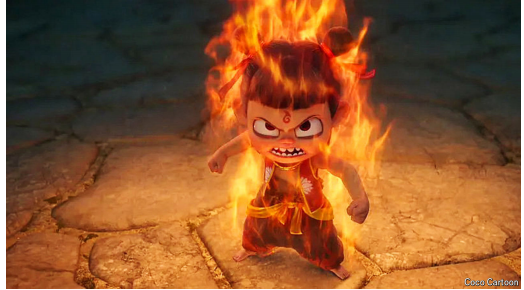

# A new film is breaking box-office records in China

“Ne Zha 2” shows how the mood inside the country is changing

原文:

**F**ILM-MAKERS IN China have long tried to find the secret sauce

for movies that wow audiences while pleasing the Communist

Party. The epics that evolved became known as *zhuxuanlu*, or

“main melody” films, because they are in tune with the party line.

But the heavy doses of patriotism that they usually involve have

fallen out of favour. Instead, one Beijing studio has struck gold

with a cartoon reimagining the tale of a “demon child” from a 16th

century novel.

中国的电影制作人长期以来一直试图找到让观众惊叹的电影秘方，同时取悦共产党。这些演变而来的史诗被称为“主旋律”电影，因为它们与党的路线合拍。但是他们通常包含的大量爱国主义已经失宠了。相反，北京的一家工作室凭借一部改编自16世纪小说的“恶魔小孩”故事的漫画赚了大钱。

学习：

wow：令人赞叹；吸引…的注意；引起轰动；（通过表演或展示）给人留下深刻印象；使喝彩；使叫绝

>
>
>**这里的 "struck gold" 意思是** **“获得巨大成功，发大财”**，通常用于描述某人在某个领域取得了意外的巨大成功，类似于“淘到金子”或“找到财富”。在这里，**"one Beijing studio has struck gold with a cartoon"** 意思是 **“一家北京的制片厂凭借一部动画片大获成功”**，即 **这部动画片取得了巨大的商业或文化成功。**
>
>------
>
>**类似的用法示例如下：**
>
>- **"After years of struggling, the startup finally struck gold with its new app."**
>   经过多年的挣扎，这家初创公司终于凭借其新应用取得了巨大成功。
>- **"That author struck gold with his latest novel—it became a bestseller overnight."**
>   那位作家凭借最新的小说取得了巨大成功——它一夜之间成了畅销书。
>
>------
>
>**在此上下文中的意思：**
>
>**"Instead, one Beijing studio has struck gold with a cartoon reimagining the tale of a ‘demon child’ from a 16th-century novel."**
> 意思是：
> **相反，一家北京的制片厂凭借一部改编自16世纪小说的“妖童”动画片大获成功。**
> 这里强调的是 **这部动画片既迎合了市场，又取得了巨大的票房或文化影响力，成为了一种新的成功模式。**

原文：

The film, “Ne Zha 2”, is a sequel, in which the eponymous child

battles monsters and immortals on a quest to save his friend and

protect his family’s fortress. Launched over the Chinese New Year

holiday, it has taken more than $2bn and become the most

successful animated feature ever made anywhere. It has overtaken

“Spider-Man: No Way Home” as the seventh-highest-grossing film

ever. And it has done so by tapping deep into China’s cultural roots.

这部名为《哪吒2》的电影是续集，在这部电影中，同名的孩子为了拯救他的朋友和保护他家的城堡，与怪物和神仙进行了战斗。该片在中国春节期间上映，票房已超过20亿美元，成为有史以来最成功的动画电影。它已经取代《蜘蛛侠：英雄无归》成为有史以来票房第七高的电影。这是通过深入挖掘中国的文化根源实现的。

学习：

sequel：美 [ˈsiːkwəl] 续集；续篇；

eponymous：美 [əˈpɑnəməs] （角色）与作品标题同名的；以…的名字命名的

immortals: 神仙

on a quest：为了

fortress： 要塞；堡垒；防御工事；

原文：

By the mid-2010s, film-makers were nailing the main melody of

the patriotic blockbuster. Before “Ne Zha 2”, the two most popular

films were “The Battle at Lake Changjin” from 2021 and “Wolf

Warrior 2” from 2017. Both were action flicks involving the defeat

of dastardly foreigners. Such films topped China’s charts from

2017 to 2023 (except 2019), according to data from Maoyan, a

movie-ticketing service. The state invested in their rise. A law

passed in 2016 to support the film industry listed “promoting core

socialist values” as one key theme. But their popularity peaked in

2020, when they accounted for more than half of box-office

receipts of the 20 highest-grossing films. This year, that share fell

below 2%. Triumphant narratives of national strength seem

detached from reality, with Chinese viewers now struggling in a

depressed economy

到2010年代中期，电影制作人已经确定了这部爱国大片的主旋律。在《哪吒2》之前，最受欢迎的两部电影是2021年的《长津湖之战》和2017年的《战狼2》。这两部电影都是关于打败卑鄙的外国人的动作片。根据电影票务服务公司猫眼的数据，从2017年到2023年(除了2019年)，此类电影在中国的排行榜上名列前茅。国家投资了他们的崛起。2016年通过的一项支持电影产业的法律将“弘扬社会主义核心价值观”列为一个重要主题。但它们的受欢迎程度在2020年达到顶峰，当时它们占了20部票房最高电影的一半以上。今年，这一比例降至2%以下。对国家实力的胜利叙述似乎与现实脱节，中国观众现在正挣扎在低迷的经济中

学习：

blockbuster：热门大片；非常成功的作品

flicks：电影

dastardly：美 [ˈdæstərdli] 邪恶的；残忍的；卑鄙的

triumphant：美 [traɪˈʌmfənt] 胜利的；大获全胜的；欢欣鼓舞的；凯旋的

原文：

Enter the demon child. “Ne Zha 2” has perhaps caught on because

it is not forcing anything on anyone. Chinese people know the

character from folklore. The film is packed with humour delivered

by endearing characters, and it resonates because of its messages of

self-determination, the unconditional love of family and the pursuit

of justice. The technical sophistication has amazed viewers and

pitched domestic animation studios as serious competitors to their

Hollywood counterparts.

关于魔童。《哪吒2》之所以流行，或许是因为它没有向任何人强加任何东西。中国人从民间传说中知道这个人物。这部电影充满了由可爱的角色传达的幽默，它引起了共鸣，因为它传达了自决、对家庭无条件的爱和对正义的追求的信息。先进的技术让观众惊叹不已，也让国内动画工作室成为好莱坞同行的有力竞争对手。

学习：

caught on ：变得流行

folklore：美 [ˈfoʊklɔːr] 民俗；民间传说；民俗学；民间传统；民间故事；

endearing：令人喜爱的；讨人喜欢的；可爱的；

原文：

At a cinema in the eastern city of Hangzhou Ms Zheng, a 20-year

old student, is watching the film with her friends. She says she

found the hero epics too heavy—“They force-feed patriotism”—

and has already seen “Ne Zha 2” three times. Like many young

people disillusioned by the current paucity of job opportunities, Ms

Zheng says she finds hope in the rebellious and righteous Ne Zha.

“Nowadays we are overwhelmed by social pressure, but he tells

you that you can define the type of person you want to be.”

在东部城市杭州的一家电影院，20岁的学生郑(音译)正和朋友们一起看这部电影。她说她觉得英雄史诗太沉重了——“他们强行灌输爱国主义”——她已经看了三遍《哪吒2》。像许多对目前缺乏就业机会失望的年轻人一样，郑女士说，她在叛逆和正直的哪吒身上找到了希望。“如今我们被社会压力压得喘不过气来，但他告诉你，你可以定义自己想成为什么样的人。”

学习：

disillusioned：美 [ˌdɪsɪˈluːʒnd] 幻想破灭的；醒悟的；大失所望的

paucity：缺乏；贫乏；匮乏；短缺

righteous：美 [ˈraɪtʃəs] 正直的；公正的；正义的

原文：

To boost consumption during the holiday, local governments gave

out cinema vouchers to attract more moviegoers. Once it was clear

the film could break records, more people rallied to see it. School

stook students, and firms stopped production so employees could

attend. One cinema in Sichuan province said that it would hold off

screening the recently released “Captain America: Brave New

World” in order to boost “Ne Zha 2” sales. “Our Chinese animation

deserves to be seen by the world,” it said.

为了刺激节日期间的消费，当地政府发放了影院券来吸引更多的电影观众。一旦明确这部电影可能打破记录，更多的人聚集起来观看。学校让学生停课，公司停止生产，以便员工可以参加。四川省一家电影院表示，为了提高《哪吒2》的销量，将推迟上映最近上映的《美国队长:美丽新世界》。“我们的中国动画应该被世界看到，”它说。

学习：

moviegoer：常看电影的人

原文：

The world has not yet been won over, though. So far, less than 2%

of ticket sales have come from abroad. That could be the next

melody Chinese film-makers learn to play.■

然而，这个世界还没有被赢得。迄今为止，不到2%的门票收入来自国外。这可能是中国电影制作人学会演奏的下一种旋律。■

## 后记

2025年3月7日21点55分于上海。