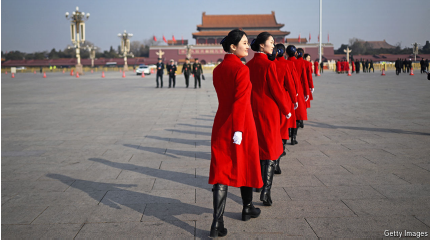
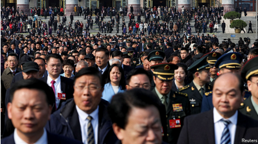
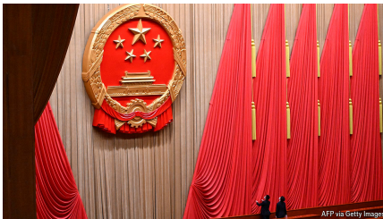
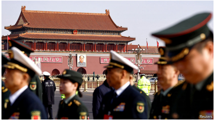
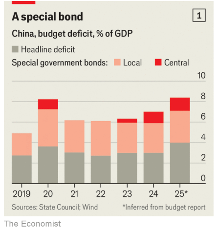
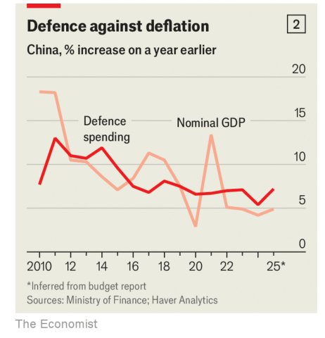

# China’s leaders reveal their plan to cope with 2025

*Beating trade wars and deflation and boosting science are priorities*

原文：

**I**T IS NOT often that the world’s two superpowers hold state-of

the-nation addresses back-to-back. But thanks to a quirk of

scheduling and the magic of time zones, it happened this week. Li

Qiang, China’s prime minister, gave his annual report to the

country’s rubber-stamp parliament, the National People’s Congress,

in Beijing on March 5th. A few minutes later, President Donald

Trump· began a fiery speech to a joint session of Congress in

Washington. The contrast was instructive.

世界上两个超级大国背靠背发表国情咨文并不常见。但是由于时间安排的巧合和时区的魔力，这一切在本周发生了。3月5日，中国总理李强在北京向中国的橡皮图章议会——全国人民代表大会——做年度报告。几分钟后，唐纳德·特朗普总统开始在华盛顿的国会联席会议上发表激烈的讲话。这种对比很有启发性。

学习：
state-of-the-nation：国情咨文

quirk：巧合

rubber-stamp parliament

>
>
>**这里的 "rubber-stamp parliament" 意思是** **“橡皮图章式议会”**，通常指**一个没有实质性权力、仅仅按照政府或执政党意愿形式上批准决策的立法机构**。在这里，**"China’s rubber-stamp parliament, the National People’s Congress"** 意思是 **“中国的橡皮图章式议会——全国人民代表大会”**，即**主要是象征性地批准政府的决定，而不是进行独立的立法审议或政策制定。**
>
>------
>
>**类似的用法示例如下：**
>
>- **"The new law was quickly passed by the rubber-stamp parliament with no debate."**
>   这项新法律被橡皮图章式议会迅速通过，没有任何辩论。
>- **"Critics argue that the assembly is nothing more than a rubber-stamp parliament, approving whatever the president proposes."**
>   批评人士认为该议会不过是个橡皮图章，凡是总统提议的都照单全收。
>
>------
>
>**在此上下文中的意思：**
>
>**"Li Qiang, China’s prime minister, gave his annual report to the country’s rubber-stamp parliament, the National People’s Congress, in Beijing on March 5th."**
> 意思是：
> **“3月5日，中国总理李强向全国人民代表大会这一‘橡皮图章式’议会作了年度报告。”**

原文：

Mr Trump’s speech, bombastic and bilious, was heckled by a

congressman who had to be removed from the chamber for

“disruption of proper decorum”. The president’s words were

punctuated by chants of “USA, USA, USA!” and “Fight, fight,

fight!” and “Na na na na, hey hey, goodbye!”

特朗普夸夸其谈、脾气暴躁的演讲遭到了一名国会议员的诘问，这名议员不得不被赶出会议厅，理由是“破坏了应有的礼仪”。总统的讲话不时被“美国，美国，美国！”还有“打，打，打！”还有“娜娜娜娜，嘿嘿，再见！”

学习：

bombastic： 美 [bɒm'bæstɪk] 夸大的；辞藻华丽空洞的；浮夸的

bilious：美 [ˈbɪljəs] 脾气暴躁的；令人作呕的；

heckled：激烈质问；诘问；（heckle的过去式）

decorum:礼貌；得体；端庄 美 [dɪˈkɔːrəm]

punctuated:不时打断；（punctuate的过去式和过去分词）

原文：

Mr Li’s speech had none of that. His audience—3,000 delegates

assembled in the Great Hall of the People overlooking Tiananmen

Square (pictured)—tried to look attentive. Tea was sipped, proper

decorum preserved. Much of what Mr Li said was formulaic and

predictable. As always, he heaped dutiful praise on his boss, Xi

Jinping. But amid the platitudes and boilerplate, the fiscal numbers

he provided were revealing about his government’s mindset at a

difficult time. China’s economy faces a lingering property slump,

chronic deflation and an intensifying trade war. The government’s

response has too much of what Mr Trump sorely lacks: caution.

学习：

 platitudes：陈词滥调；老生常谈；（platitude的复数）

boilerplate：美 [ˈbɔɪlərˌpleɪt] 标准文本；套话；陈词滥调；

原文：

In his report, China’s prime minister announced the same official

economic growth target as last year: about 5%. He also provided a

catalogue of ten “major tasks” for the year ahead that echoed the

list in 2024. Industrial modernisation, technological self-reliance

and expanding domestic demand all featured prominently. But

stimulating domestic spending was elevated from the third priority

last year to the top task for 2025. Indeed, Mr Li mentioned

consumption 32 times, a record. The previous peak (adjusted for

the length of the speech) was 26 times in 2009, as China tried to

revive spending in the aftermath of the global financial crisis.

在他的报告中，中国总理宣布了与去年相同的官方经济增长目标:大约5%。他还提供了未来一年的十项“主要任务”目录，与2024年的清单相呼应。工业现代化、技术自力更生和扩大内需都是突出的特征。但是刺激国内消费从去年的第三优先提升到2025年的首要任务。的确，李先生提到消费32次，创纪录。之前的峰值(根据演讲长度调整后)是2009年的26倍，当时中国试图在全球金融危机后重振支出。

原文：

Now, as then, the government is keen to restore consumer

confidence, which has never recovered from the covid lockdowns.

It also wants to steady the property market, which is struggling to

find a bottom. Homeowners are no longer sure that their flats will

hold their value. And homebuyers who have paid in advance are no

longer confident their property will be built. These fears have

contributed to a lack of demand and months of declining prices.

现在，和那时一样，政府热衷于恢复消费者信心，这种信心从未从冠状病毒肺炎的封锁中恢复过来。它还希望稳定正在苦苦寻找底部的房地产市场。房主不再确信他们的公寓会保值。已经提前付款的购房者不再相信他们的房产会被建造。这些担忧导致了需求不足和连续几个月的价格下跌。

原文：

America’s trade war will not help. Mr Trump hit China with a fresh

10% tariff on the day before Mr Li’s speech, following a similar

duty a month earlier. Combined with older levies, they mean

Chinese goods now face an average American tariff of about 34%,

reckons Larry Hu of Macquarie, an Australian bank. China’s

government swiftly retaliated by imposing tariffs on a narrower

range of American goods, from chicken to soyabeans. It also added

more American firms to a blacklist that could curb their dealings

with Chinese firms. “If war is what the US wants, be it a tariff war,

a trade war or any other type of war, we’re ready to fight till the

end,” said the Ministry of Foreign Affairs.

美国的贸易战无济于事。在李克强发表讲话的前一天，特朗普对中国开征了10%的新关税，此前一个月，也开征了类似的关税。澳大利亚麦格理银行的Larry Hu认为，再加上以前的税收，这意味着中国商品现在面临美国平均34%的关税。中国政府迅速采取报复措施，对从鸡肉到大豆等范围更窄的美国商品征收关税。它还将更多的美国公司加入黑名单，这可能会限制他们与中国公司的交易。“如果战争是美国想要的，无论是关税战、贸易战还是任何其他类型的战争，我们都准备战斗到底，”外交部表示。

原文：

To offset tariffs and deflation, China’s economy needs a more

forceful stimulus. “It is better to act early than late,” as Mr Li put it.

Most economists have been expecting an extra fiscal push this year

of about 2% of GDP or more. That would be enough to stop

deflation worsening, though probably not much more.

为了抵消关税和通货紧缩，中国经济需要更强有力的刺激。正如李先生所说，“早行动比晚行动好”。大多数经济学家一直预计今年会有额外的财政刺激，占GDP的2%或更多。这足以阻止通缩恶化，尽管可能不会太多。

原文：

The fiscal package Mr Li actually announced had several parts. The

target for this year’s headline budget deficit will rise from 3% of

GDP last year to 4% this year. The headline figure covers only a

fraction of China’s sprawling public finances, leaving out

government-managed funds and financing vehicles sponsored by

local governments, among other things.

李强实际上宣布的财政方案有几个部分。今年总体预算赤字的目标将从去年占GDP的3%上升到今年的4%。总体数字仅涵盖中国庞大公共财政的一小部分，还不包括政府管理的基金和地方政府发起的融资平台等。

原文：

But the headline number sends an important signal. By tradition,

China has tried to keep the official deficit at 3% of GDP or below,

in keeping with old-fashioned international norms. A 4% deficit

shows that it is willing to abandon fiscal piety for the sake of

rescuing the economy. That was a good first step.

但是标题数字发出了一个重要的信号。按照传统，中国一直试图将官方赤字保持在GDP的3%或以下，以符合老式的国际规范。4%的赤字表明，为了拯救经济，它愿意放弃财政虔诚。这是很好的第一步。

学习：

piety：美 [ˈpaɪəti] 虔诚；虔敬；虔诚信念；虔诚观点

原文：

As well as a bigger headline deficit, the central government will

also loosen the financial reins on local governments. It will

increase the quota of “special bonds” they can sell from 3.9trn yuan

($540bn) last year to 4.4trn this year. These securities were once

reserved for infrastructure projects that can earn some revenue. But

local governments can now use the money to buy unsold flats and

idle land from property developers. The larger quota was close to

expectations: a satisfactory second step.

除了更大的总体赤字，中央政府还将放松对地方政府的财政控制。这将把他们可以出售的“特别债券”的配额从去年的3.9万亿元人民币(5400亿美元)增加到今年的4.4万亿元人民币。这些证券曾被保留给可以赚取一些收入的基础设施项目。但地方政府现在可以用这笔钱从房地产开发商手中购买未售出的公寓和闲置土地。更大的配额接近预期:令人满意的第二步。

原文：

But on the third step, the speech fell somewhat short. The central

government will itself sell another batch of “special” bonds worth

1.8trn yuan, including 500bn yuan to help recapitalise China’s

banks. That is more than it sold last year. But the figure is about

700bn yuan below expectations. All told, economists expect

China’s broad fiscal deficit to increase by a little less than 2% of

GDP (see chart 1).

但是到了第三步，演讲就有些不足了。中央政府将自行出售另一批价值1.8万亿元人民币的“特别”债券，其中5000亿元人民币用于帮助中国的银行进行资本重组。这超过了它去年的销量。但这个数字比预期低了约7000亿元。总的来说，经济学家预计中国广义财政赤字的增幅将略低于GDP的2%(见图表1)。

原文：

The style of China’s stimulus was also mildly disappointing. In the

past the government has lavished money on bridges to nowhere and

other white elephants. Whereas America fights downturns by

printing money, China pours concrete. In his speech Mr Li

promised to give greater priority to “improving the people’s well

being” and “boosting consumption”. The central government will,

for example, devote 300bn yuan to its “trade-in” scheme which

encourages households to replace old appliances and cars with

newer ones.

中国的刺激方式也有点令人失望。在过去，政府在无处可去的桥梁和其他无用的东西上浪费了大量资金。当美国通过印钞票来对抗衰退时，中国却在浇筑混凝土。李强在讲话中承诺，将更加重视“改善民生”和“刺激消费”。例如，中央政府将投入3000亿元用于“以旧换新”计划，鼓励家庭用新家电和汽车替换旧家电和汽车。

学习：

white elephant：昂贵却无用的东西；华而不实的东西；

devote：投入（时间、精力于某事物）；

原文：

China has also given civil servants a pay rise. And it will up

medical-insurance subsidies for rural folk and city dwellers who

are not covered by work-based schemes. Annual subsidies would

rise to 700 yuan per person, an increase of 4.5%, according to the

budget. The same groups will receive an increase in their basic

pensions of 20 yuan a month, similar to last year. That is a large

rise in percentage terms (almost 40% over two years) but tiny in

absolute amounts. Nonetheless, of the extra fiscal stimulus

provided this year, only about a quarter is related to consumption,

calculates Robin Xing of Morgan Stanley

中国也给公务员加薪。此外，它还将提高未被工作计划覆盖的农村居民和城市居民的医疗保险补贴。根据预算，年度补贴将提高到每人700元，增幅为4.5%。与去年类似，这些群体的基本养老金每月将增加20元。从百分比来看，这是一个很大的增长(两年内几乎增长了40%)，但从绝对数量来看，这是一个很小的增长。然而，摩根士丹利的Robin Xing估计，在今年提供的额外财政刺激中，只有大约四分之一与消费有关

原文：

Boosting consumption is not the only priority. A new “guidance

fund” will also mobilise 1trn yuan in venture capital for new

technologies. The budget for national defence will rise by 7.2%,

before adjusting for inflation. In the past, China’s economy has

kept pace with increased military spending, through a mix of real

growth and inflation (see chart 2). As a result, the official military

budget has remained fairly steady as a percentage of GDP,

fluctuating around 1.3%. But now that China has slower growth

and deflation, the equation has changed. Last year, for example,

GDP grew by only 4.2% in nominal terms, before adjusting for

changing prices.

刺激消费并不是唯一的重点。一个新的“引导基金”也将为新技术筹集1万亿元风险资本。在扣除通货膨胀因素之前，国防预算将增长7.2%。在过去，中国经济通过实际增长和通货膨胀的混合，与军费开支的增长保持同步(见图表2)。因此，官方军事预算占GDP的比例一直相当稳定，在1.3%左右波动。但现在中国经济增长放缓，通货紧缩，等式已经改变。例如，去年，在调整价格变化之前，名义GDP仅增长了4.2%。

学习：
mobilise：动员；调动；使流通          

原文：

Will the same thing happen this year? The government does not

give a growth forecast for nominal GDP. But the fiscal arithmetic

in Mr Li’s speech implies he expects it to grow by about 4.9%.

Since that is slower than the target for real, inflation-adjusted

growth, the government must believe that economy-wide prices

could fall again this year. Not even the government, then, expects

their stimulus efforts to succeed in decisively defeating deflation.

今年会发生同样的事情吗？政府没有给出名义GDP的增长预测。但李强讲话中的财政算术暗示，他预计中国经济将增长约4.9%。由于这低于实际通胀调整后的增长目标，政府必须相信整体经济价格今年可能会再次下跌。甚至连政府都不指望他们的刺激措施能成功地决定性地战胜通货紧缩。

原文：

In his very different speech in Washington, America’s president

said he was looking forward to relentless success. “Our country is

on the verge of a comeback the likes of which the world has never

witnessed,” he said. More prudent leaders like to underpromise in

the hope of overdelivering. But in the fight against deflation, that

may be the wrong approach. Gloom can be self-fulfilling. In trying

to restore confidence and revive animal spirits, then, a dash of

bravado probably helps. The back-to-back speeches offered a stark

contrast. Both would have been better if each had more closely

resembled the other. ■

在华盛顿的一次截然不同的演讲中，美国总统说他期待着不懈的成功。“我们的国家正处于复兴的边缘，这是世界从未见过的，”他说。更谨慎的领导人喜欢减少承诺，寄希望于超额兑现。但是在对抗通货紧缩的斗争中，这可能是错误的方法。忧郁可能会自我实现。那么，在试图恢复信心和重振动物精神时，一点虚张声势可能会有所帮助。背靠背的演讲形成了鲜明的对比。如果两者都更加相似，那会更好。■

学习：

a dash of：少许；些许；少量          

bravado：虚张声势；逞能；逞强；冒险；冒失          

## 后记

2025年3月9日18点56分于上海。

