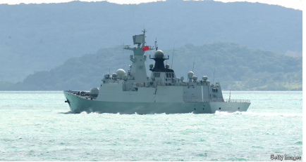

# Chinese warships circumnavigate another island: Australia

circumnavigate： 美 [ˌsərkəmˈnævəɡeɪt] 环绕航行（地球或其他天体）；绕行；环游

*An ominous new display of long-range naval power*

ominous：美 [ˈɑːmɪnəs] 不祥的；预兆性的；凶兆的；不吉利的；有威胁性的；险恶的

naval：美 [ˈneɪvl] 海军的；舰队的；军舰的；与海战相关的

原文：

**H**AVING BUILT the world’s largest navy, China is keen to show it

off. But officials from Australia and New Zealand have been

startled in recent days by the way it has been flaunting itself in

Oceania. On February 21st a commercial pilot flying over the

Tasman Sea received a surprise warning from a Chinese navy task-

force in international waters that it was engaging in live-fire drills.

Airlines scrambled to divert planes. Since then, the two Chinese

warships and one supply vessel have staged an unprecedented

circumnavigation of Australia, fuelling political debate about a

power that once seemed distant.

中国建造了世界上最大的海军，并热衷于炫耀它。但是最近几天，澳大利亚和新西兰的官员对它在大洋洲炫耀自己的方式感到震惊。2月21日，一架飞越塔斯曼海的商用飞机收到了来自中国海军特遣部队在国际水域进行实弹演习的意外警告。航空公司争先恐后地让飞机改道。自那以来，两艘中国军舰和一艘补给船上演了一场史无前例的澳大利亚环球航行，引发了关于一个一度似乎遥远的大国的政治辩论。

学习：

startled：美 [ˈstɑːrtld] 受惊吓的；吃惊的

flaunting：炫耀；夸耀；飘扬；（flaunt的现在分词形式）

Oceania：大洋洲

task-force：特遣部队

live-fire：实弹射击

drills：操练，训练；（drill的第三人称单数）

scrambled ：争先恐后

divert：转移；使改道；使转向；使绕道；

原文：

The task force includes a 10,000-tonne cruiser of a type that China

hailed—with justification—as a “leap forward” in its naval

modernisation when it joined service in 2020 (the year the

Pentagon said China’s navy had surpassed its own in size). The

ships may have been joined by a nuclear-powered submarine: in the

past 15 years, China has been churning these out at the rate of

nearly one a year, the Pentagon reports. China is not accused of

behaving illegally, but one Australian intelligence chief, Andrew

Shearer, said some of its activities “seem designed to be

provocative”.

特遣队包括一艘10000吨级的巡洋舰，当它在2020年服役时(五角大楼称中国海军在这一年已经超过了自己的规模)，中国有理由称赞这是其海军现代化的“飞跃”。五角大楼报告称，在过去的15年里，中国已经以每年一艘的速度大量生产了这种潜艇。中国没有被指控非法行为，但澳大利亚情报局长安德鲁·希勒表示，中国的一些活动“似乎旨在挑衅”。

学习：

 it joined service：服役

provocative: 美 [prəˈvɑːkətɪv] 挑衅的；挑拨的；煽动性的；引诱性的；激起争端的；挑战性的

原文：

This is the farthest south China has ever sent its navy for training.

The firing drills seemed designed to highlight its ability to project

force far from home. And they appeared to show indifference to the

impact. Australia and New Zealand have complained that they did

not get sufficient warning about the live firing

这是中国有史以来派出海军到南方训练最远的一次。射击训练似乎是为了突出其远离本土投射力量的能力。他们似乎对这种影响漠不关心。澳大利亚和新西兰抱怨说，他们没有得到关于实弹射击的充分警告

原文：

Planning for the exercises may have predated Donald Trump’s

election as America’s president in November 2024. But the timing

of them, as America turns its back on European allies, has added to

anxieties in Australia and New Zealand about their own security in

the second Trump term. China may want to show that not only can

it sustain its ships for long periods at sea, but also, in a conflict,

interfere with the sea lanes that Australia relies on, says Jennifer

Parker, a former naval officer now at the Australian National

University

演习的计划可能早于唐纳德·特朗普在2024年11月当选美国总统。但在美国背弃欧洲盟友之际，他们的时机加剧了澳大利亚和新西兰对特朗普第二任期自身安全的担忧。前海军军官、现就职于澳大利亚国立大学的詹妮弗·帕克说，中国可能想表明，它不仅能让自己的船只在海上长时间航行，而且在冲突中，还能干扰澳大利亚依赖的海上航道

原文：

In Australia the Chinese navy’s activities are causing rows ahead of

federal elections, due within weeks. The centre-left Labor

government, led by Anthony Albanese, says it has “stabilised”

relations with China, which in the past couple of years has lifted

restrictions imposed in 2020 on Australian exports worth more than

A\$20bn ($13bn) annually. China hawks in the opposition centre

right Liberal Party complain that Labor has gone too soft on China

in order to restore that trade

在澳大利亚，中国海军的活动在几周后的联邦选举前引起了争议。安东尼·艾博年(Anthony Albanese)领导的中左翼工党政府表示，它已经“稳定”了与中国的关系。过去几年，中国取消了2020年对澳大利亚出口的限制，澳大利亚每年的出口价值超过200亿澳元(合130亿美元)。反对党中右翼自由党的中国鹰派抱怨说，工党为了恢复贸易对中国太软弱了

学习：

rows：吵闹；（row的复数）

原文：

During Australia’s spell in the doghouse—for daring to call for an

inquiry into the origins of covid-19—it found other buyers for its

coal, barley and the like, enabling it to achieve a record trade

surplus in 2022. But its concerns about China’s military behaviour

kept growing. Australian officials acknowledge that their own

armed forces operate in international waters and airspace close to

China. But China’s response is sometimes dangerous. Last month a

Chinese fighter jet released flares close to an Australian P-8A

surveillance plane over the South China Sea.

在澳大利亚被打入冷宫期间——因为敢于呼吁调查新冠肺炎的起源——澳大利亚为其煤炭、大麦等找到了其他买家，使其在2022年实现了创纪录的贸易顺差。但它对中国军事行为的担忧持续增长。澳大利亚官员承认，他们自己的武装部队在靠近中国的国际水域和空域活动。但是中国的反应有时是危险的。上个月，一架中国战斗机在南海上空靠近一架澳大利亚P-8A侦察机时释放了照明弹。

学习：

spell：（干某事或在某处工作的）一段时间；短暂时期

in the doghouse：惹麻烦；受冷落；被嫌弃；失宠；被责备          

barley：大麦；大麦作物 美 [ˈbɑːrli]

原文：

Both Australia and New Zealand have another worry, that China

may be strengthening its ability to deploy its forces in the region by

cosying up to South Pacific microstates. In February the Cook

Islands agreed to form a “comprehensive strategic partnership”

with China and announced plans for Chinese investment, including

port-building

澳大利亚和新西兰都有另一个担心，中国可能通过讨好南太平洋小国来加强其在该地区部署军队的能力。今年2月，库克群岛同意与中国建立“全面战略伙伴关系”,并宣布了中国投资计划，包括港口建设

学习：

cosying up ：亲密接触

原文：

New Zealand’s foreign minister, Winston Peters, said his country

was “blindsided”. It has close ties with the Cook Islands, including

an arrangement to co-ordinate their security and foreign policies.

Mihai Sora of the Lowy Institute, a think-tank in Sydney, says

China has reason to be drawn to the Cook Islands (population:

16,800). It could, he says, become a good spot to refuel and

resupply task forces—like the one sailing around Australia. ■

新西兰外交部长温斯顿·彼特斯表示，新西兰“措手不及”。它与库克群岛有着密切的联系，包括一项协调两国安全和外交政策的协议。悉尼智库洛伊研究所的米哈伊·黑脸田鸡表示，中国有理由被库克群岛(人口16800)所吸引。他说，它可以成为给特遣部队补给燃料和补给的好地方——就像环绕澳大利亚航行的那艘一样。■

## 后记

2025年3月10日18点12分于上海。

