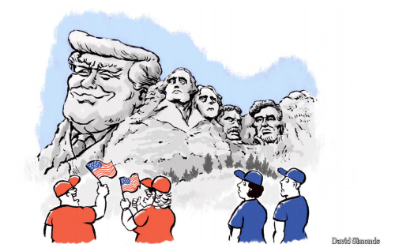

# Donald Trump’s Washington reaches a new partisan peak

*His address to Congress showed that Republicans will follow their leader anywhere, and that Democrats don’t have one*

原文：

**“T**HE NEXT president of the United States will only be the

president of a party,” Thomas Jefferson predicted as George

Washington, with his singular stature, ceded the office. In the

modern era, that cramped vision of the presidency has never been

more starkly on display than it was on March 4th, when Donald

Trump addressed a joint session of Congress for the first time in his

second term. At least within the chamber that evening, he was the

president of worshipful Republicans, and the scowling, leaderless

Democrats seemed relevant only as his foil, or chew toy.

“下一任美国总统只会是一个政党的总统，”托马斯·杰斐逊在乔治·华盛顿因其非凡的地位而卸任时预言道。在当今时代，总统职位的狭窄景象从未像3月4日这样明显，当时唐纳德·特朗普(Donald Trump)在其第二个任期内首次在国会联席会议上发表讲话。至少在那天晚上的会议厅里，他是受人崇拜的共和党人的总统，而愁眉苦脸、群龙无首的民主党人似乎只是他的陪衬或咀嚼玩具。

学习：

ceded：放弃；（cede的过去式）          

cramped
>
>
>**这里的 "cramped" 意思是** **“受限的、狭隘的”**，通常指某种观点、空间或思想受到限制，没有足够的自由度或扩展性。在这里，**"that cramped vision of the presidency"** 意思是 **“对总统职位的一种狭隘看法”**，即**总统只属于某一个党派，而不是整个国家的领导人。**
>
>------
>
>**类似的用法示例如下：**
>
>- **"His cramped office barely had enough space for a desk and chair."**
>   他的办公室非常狭小，几乎只能容下一张桌子和一把椅子。
>- **"The debate was stifled by his cramped way of thinking."**
>   这场辩论因他狭隘的思维方式而受限。
>
>------
>
>**在此上下文中的意思：**
>
>**"That cramped vision of the presidency has never been more starkly on display than it was on March 4th."**
> 意思是：
> **“3月4日，这种对总统职位狭隘的看法被展现得淋漓尽致。”**
> 这里强调的是 **总统的形象变得局限，他只是党派的领袖，而不是全民的总统。**

joint session：联合会议          

chamber：会议厅，议会；（议会的）议院

worshipful：美 [ˈwərʃəpfəl] 崇敬的；尊敬的（英国用于某些市长和工匠团体的称号中）；敬重的；值得尊崇的

scowling：对…沉下脸；皱眉表示；（scowl的现在分词）          

leaderless：群龙无首，无人领导的

foil：陪衬；陪衬物；陪衬者

chew toy

>
>
>**这里的 "chew toy" 意思是** **“咬咬玩具”**，通常指**狗等宠物用来咀嚼和玩耍的玩具**，引申义指**某人被当作消遣、取笑或攻击的对象，毫无还手之力**。在这里，**"the scowling, leaderless Democrats seemed relevant only as his foil, or chew toy"** 意思是 **“那些怒目而视、群龙无首的民主党人似乎只存在于他的演讲中，要么作为陪衬，要么被当作攻击目标。”**
>
>------
>
>**类似的用法示例如下：**
>
>- **"The rookie politician became a chew toy for seasoned debaters during the televised debate."**
>   这位新手政客在电视辩论中成了老练辩手的“咬咬玩具”（被他们随意嘲讽和攻击）。
>- **"The underdog team was treated like a chew toy by the reigning champions."**
>   这支弱旅被卫冕冠军当作“咬咬玩具”一样戏弄（毫无还手之力）。
>
>------
>
>**在此上下文中的意思：**
>
>**"The scowling, leaderless Democrats seemed relevant only as his foil, or chew toy."**
> 意思是：
> **“那些怒目而视、缺乏领导的民主党人，似乎唯一的存在意义就是作为特朗普的陪衬，或者供他攻击和嘲弄的对象。”**
> 这里的 **"chew toy"** 形象地表现出特朗普如何利用民主党人来加强自己的话语权，而他们却无力反击。

原文：

Mr Trump’s own vision for America under him was as grandiose

and imperious as ever. “We are going to forge the freest, most

advanced, most dynamic and most dominant civilisation ever to

exist on the face of this earth,” he pledged in closing, having

earned at least one superlative by delivering the longest presidential

speech to Congress, at about 100 minutes, in recorded history. Yet

as he extolled his imposition of tariffs on allies and adversaries

alike, declared victory over “wokeness” and “unelected

bureaucrats” and renewed pledges to obtain Greenland and the

Panama Canal, he held out little hope that political unity would

blossom within his civilisation. For their part, Democrats showed

no interest in it. They stayed seated or stood with backs turned as

Mr Trump made his way into the chamber, shaking Republican

hands and air-kissing Republican cheeks.

特朗普对自己治下的美国的愿景一如既往地宏伟和专横。“我们将打造地球上有史以来最自由、最先进、最具活力和最具统治地位的文明，”他在闭幕词中承诺道。他向国会发表了有史以来最长的总统演讲，时长约100分钟，至少赢得了一次最高级的演讲。然而，当他赞扬自己对盟友和对手征收关税，宣布战胜“觉醒（少数族裔，同性恋等的倡议）”和“未经选举的官僚”，并再次承诺获得格陵兰岛和巴拿马运河时，政治团结在他的文明中开花结果没有什么希望。对民主党人来说，他们对此毫无兴趣。当特朗普走进会议厅，与共和党人握手，亲吻共和党人的脸颊时，他们要么坐着，要么背对着背站着。

学习：

grandiose：美 [ˈɡrændioʊs] 宏伟的；夸大的；华而不实的；不切实际的

imperious： 美 [ˌɪmˈpɪriəs] 傲慢的；蛮横的；不容置疑的；盛气凌人的；

superlative：美 [suːˈpɜːrlətɪv] 最高级的

extolled：赞颂；（extol的过去式和过去分词）

air-kissing：飞吻

原文:

Anticipating this stony reception, Mr Trump came prepared to beat

Democrats over the head with their own silence. “Once again, I

look at the Democrats in front of me, and I realise there is

absolutely nothing I can say to make them happy or to make them

stand or smile or applaud,” he said. As Republicans leapt to their

feet to clap or chant “USA” and “Trump”, Democrats presented

themselves less as a coherent opposition than a confused,

petulantly partisan one. Some waved little signs saying “False” or

“Save Medicaid”. Some walked out, wearing shirts that read

“Resist” on the back because they just couldn’t, unfortunately. One

was ejected for trying to shout the president down. Few clapped,

and then wanly, even when Mr Trump announced that Pakistan had

turned over the terrorist behind an attack that killed 13 American

soldiers during the withdrawal from Afghanistan in 2021.

**预料到会遭到这样的冷遇，特朗普已经准备好利用民主党人的沉默来猛烈攻击他们。**
 **“我再一次看向面前的民主党人，我意识到无论我说什么，都无法让他们开心，无法让他们站起来、微笑或鼓掌。”** 他说道。

**当共和党人纷纷起立鼓掌，高呼“USA”和“Trump”时，民主党人表现得不像一个有凝聚力的反对党，反而更像是一群困惑而又带着赌气情绪的党派人士。**

**一些人挥舞着写有“False”（虚假）或“Save Medicaid”（拯救医疗补助计划）字样的小标语牌，一些人干脆愤怒地离席，背上的衣服写着“Resist”（抵抗），因为他们实在无法忍受这一切。**

**一名民主党人试图大声打断总统的演讲，最终被强行带离现场。即便在特朗普宣布巴基斯坦已经交出了一名恐怖分子——此人曾在 2021 年美军撤离阿富汗时制造了一起袭击，导致 13 名美军士兵死亡时，民主党人也几乎没有鼓掌，少数人勉强鼓掌，但显得毫无生气。**

学习：

stony：坚硬如石的；冷漠的；无情的；铁石心肠的

beat xxx over the head

>
>
>**这里的 "beat (someone) over the head" 意思是** **“不停地批评、指责或攻击某人”**，通常指某人反复用某个论点或事实来羞辱或压制对方。在这里，**"Mr Trump came prepared to beat Democrats over the head with their own silence."** 意思是 **“特朗普已经做好准备，利用民主党人的沉默来不断攻击他们。”**
>
>------
>
>**类似的用法示例如下：**
>
>- **"The manager kept beating his employees over the head about missing the deadline."**
>   经理不停地指责员工错过了截止日期。
>- **"She doesn’t need you to beat her over the head with her mistakes—she already feels bad enough."**
>   她已经很难过了，你不需要再不停地拿她的错误来批评她。

confused：混乱的

petulantly：美 ['petjuləntli] 任性地；脾气坏地；暴躁的；难以取悦的

Medicaid：医疗补助制度（美国政府向贫困者提供的医疗保险）

wanly：苍白地; 衰弱地; 暗淡地

turn over： （向有权获得某物的人）移交；移交（职位、责任）；交托；交出

原文：

In fairness to Democrats, Mr Trump was baiting them into partisan

displays by extravagantly bragging about his election and his

achievements already back on the job. He said “it has been stated

by many” that his first month in office was the most successful in

American history. “You know who number two is?” he asked.

“George Washington.” He called his Democratic predecessor, Joe

Biden, “the worst president in American history”. He asserted that

Elon Musk and his Department of Government Efficiency had

found “hundreds of billions of dollars of fraud”, an amount in

excess even of Mr Musk’s own poorly substantiated claims.

**公平地说，特朗普确实在故意激怒民主党人，引导他们做出党派化的反应，他用夸张的言辞吹嘘自己的当选和重新上任以来的成就。**

**他表示，“许多人都认为”他重新上任的第一个月是美国历史上最成功的一个月。**

**“你们知道第二是谁吗？” 他问道，“乔治·华盛顿。”**

**他称他的民主党前任乔·拜登是“美国历史上最糟糕的总统”。**

**他声称，埃隆·马斯克和他的政府效率部门（Department of Government Efficiency）已经发现了“数千亿美元的欺诈行为”，这一金额甚至超过了马斯克本人此前那些证据不足的说法。**

学习：

>**这里的 "claims" 意思是** **“主张、断言、声称”**，通常指某人提出的未经证实或存在争议的说法。在这里，**"Mr Musk’s own poorly substantiated claims"** 意思是 **“马斯克自己那些证据不足的说法”**，指马斯克所宣称的发现“数千亿美元的欺诈行为”缺乏足够的证据支持。
>
>------
>
>**类似的用法示例如下：**
>
>- **"The company made bold claims about its new product’s capabilities, but customers found them exaggerated."**
>   这家公司对其新产品的能力做出了大胆的宣传，但顾客发现这些说法被夸大了。
>- **"He claims to have climbed Mount Everest, but no one has seen any proof."**
>   他声称自己攀登过珠穆朗玛峰，但没有人见过任何证据。

原文：

Intensifying Republican support by goading Democrats is a

familiar tactic for Mr Trump, and it remains a risky one. Despite

his assertions to the contrary, his approval rating is only slightly

higher than that of the most unpopular president early in his term

since 1953—the 45th one, Donald Trump. Republican leaders have

taken to urging their lawmakers to skip town halls, saying the

worried constituents who keep turning up are paid activists.

**通过激怒民主党人来强化共和党支持是特朗普熟悉的策略，但这仍然是一种具有风险的做法。**

**尽管他声称情况并非如此，但他的支持率仅比1953年以来上任初期最不受欢迎的总统略高一点——而这个总统正是第45任总统，唐纳德·特朗普。**

**共和党领导人已经开始敦促本党议员避开市政厅会议（town halls），声称那些不断出现在会议上的担忧选民其实是被收买的激进分子。**

学习：

goad: 刺激

activist：激进分子

原文：

Mr Trump’s many boasts during his speech about executive orders

backlit his dearth so far of legislative achievements. As during the

campaign, Mr Trump repeatedly warned of threats posed by people

he said entered America illegally under Mr Biden. While

Democrats had said they needed new legislation to secure the

border, Mr Trump said, “it turned out that all we really needed was

a new president”. It was one of his best lines, but later he

acknowledged he needed such legislation himself, calling on

Congress to supply money for border security. “Americans expect

Congress to send me this funding without delay,” he said.

Democrats in the chamber had not forgotten he ordered

Republicans to block such help when Mr Biden wanted it

特朗普在演讲中多次吹嘘行政命令，这突显出他迄今缺乏立法成就。和竞选期间一样，特朗普反复警告那些他认为在拜登执政期间非法进入美国的人所构成的威胁。尽管民主党人曾表示，他们需要新的立法来确保边境安全，但特朗普表示，“事实证明，我们真正需要的是一位新总统”。这是他最好的台词之一，但后来他承认他自己也需要这样的立法，呼吁国会为边境安全提供资金。“美国人期待国会毫不拖延地给我拨款，”他说。众议院中的民主党人没有忘记，当拜登先生需要这种帮助时，他命令共和党人阻止这种帮助

学习：

backlit

>
>
>**这里的 "backlit" 意思是** **“映衬出”或“突显”**，通常指某件事物在背景的衬托下变得更加明显或突出。在这里，**"Mr Trump’s many boasts during his speech about executive orders backlit his dearth so far of legislative achievements"** 的意思是 **“特朗普在演讲中大肆吹嘘自己签署的行政命令，但这反而凸显了他至今在立法方面的乏善可陈。”**
>
>------
>
>**类似的用法示例如下：**
>
>- **"The bright moonlight backlit the silhouette of the mountain."**
>   皎洁的月光映衬出山脉的轮廓。
>- **"Her elegant dress backlit her confident demeanor on stage."**
>   她优雅的裙子映衬出她在舞台上自信的风采。
>
>------
>
>**在此上下文中的意思：**
>
>**特朗普在演讲中不断吹嘘自己通过行政命令的成就，**
> **但这反而突显出他至今在立法方面缺乏真正的成果。**

line：台词

## **It’s the economy, as usual**

原文：

When spending on pandemic relief is excluded, Mr Trump still

added more to the national debt in his first term than Mr Biden did.

But he told Congress he would balance the budget while delivering

“tax cuts for everybody”, raising expectations Republicans would

struggle to meet even with more than a paper-thin House majority

and without a united opposition. Polling suggests most Americans

are already anxious about his economic stewardship. Having

promised as a candidate to lower inflation on his first day in office,

he has talked less about high prices lately. Before Congress, he

complained he had inherited “an inflation nightmare”, but he

cannot hope to avoid responsibility for long, particularly if his

gamble on tariffs does not, as he promised, succeed in “protecting

the soul” of America and making it “rich again”. Despite the

display of Republican unity, some party leaders are antsy about

tariffs’ consequences for prices. “There’ll be a little disturbance,”

Mr Trump acknowledged, a rare admission tariffs could have any

downside. “But we’re OK with that. It won’t be much.”

在剔除疫情救济支出后，特朗普在其第一任期内增加的国家债务仍然超过了拜登。然而，他在国会表示，他将在“为所有人减税”的同时实现预算平衡，这使得共和党人将面临艰难挑战，即便他们在众议院的优势比纸还薄，并且缺乏一个团结的反对党。民调显示，大多数美国人已经对他的经济管理感到焦虑。

作为候选人时，他曾承诺在上任第一天就降低通货膨胀，但最近他对物价上涨的讨论减少了。在国会演讲时，他抱怨自己“继承了一个通胀噩梦”，但他不可能长期逃避责任，尤其是如果他对关税的赌注不像他承诺的那样成功地“保护美国的灵魂”并让其“重新富裕起来”。尽管共和党人在表面上展现了团结，但党内一些领导人对关税对物价的影响感到焦虑。“会有一点波动，”特朗普承认，这是他罕见地承认关税可能带来不利影响。“但我们对此没问题，这不会有太大影响。”

学习：

paper-thin: 薄如纸的；极薄的；非常脆弱的；微不足道的

stewardship:美 [ˈstuːərdʃɪp] 管事人之职位及职责；管理；管理工作

antsy: 美 [ˈæntsi] 焦躁不安的；坐立不安的；

原文：

Delivering the Democratic response, Elissa Slotkin, a new senator

from Michigan and former CIA officer, executed a thankless task

effectively, particularly given the Democrats’ muddle. She spoke of

proudly serving Democratic and Republican presidents and of

bipartisan American support for a healthy middle class and strong

national security. While Mr Trump was cutting programmes to

finance “an unprecedented giveaway to his billionaire friends”, she

said, “grocery and home prices are going up, not down, and he

hasn’t laid out a credible plan to deal with either of those.” It’s a

message that might work if prices stay high, and if Democrats ever

come up with a credible plan themselves. ■

在发表民主党回应时，来自密歇根州的新任参议员、前中央情报局（CIA）官员艾丽莎·斯洛特金（Elissa Slotkin）在民主党内部混乱的情况下，仍然高效地完成了一项吃力不讨好的任务。她谈到自己曾自豪地为民主党和共和党总统服务，并强调美国两党共同支持健康的中产阶级和强大的国家安全。

她表示：“当特朗普削减社会项目，以资助‘前所未有的对亿万富翁朋友的馈赠’时，食品杂货和住房价格正在上涨，而不是下降，而他却没有拿出一个可信的计划来应对这两个问题。” 如果物价持续居高不下，这一信息或许能够奏效——前提是民主党自己能拿出一个可信的计划。■

学习：

thankless task：费力不讨好的任务          

muddle：（局面）一团糟

## 后记

2025年3月14日22点05分于上海。