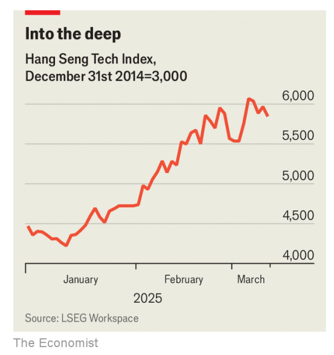

# China’s AI boom is reaching astonishing proportions

*What might derail it?*

原文：

**J**UST HOURS after the launch on March 6th of Manus, a Chinese

artificial-intelligence (AI) bot, a flood of visitors caused its

registration site to crash. Butterfly Effect, the company behind the

bot, claims its technology outperforms that of OpenAI, maker of

ChatGPT. It is now granting previews by invitation only as it

struggles to handle the traffic. Touts are said to be selling

registration codes.

中国人工智能(AI)机器人Manus于3月6日发布仅数小时后，大量访客导致其注册网站崩溃。该机器人背后的公司Butterfly Effect声称其技术优于ChatGPT的制造商OpenAI。它现在只能通过邀请来批准预览，因为它很难处理流量。据说有兜售注册码的。

学习：

tout：票贩子；兜售者

原文：

Manus is but the latest example of the mania that has swept over

China since January, when DeepSeek, the country’s hottest AI

startup, shook the world with a whizzy model that cost a fraction of

similarly powerful Western ones to train. The effect on Chinese

markets has been staggering. Stocks are experiencing their best

start to the year on record, leaving American ones in the dust·. The

Hang Seng Tech Index, which tracks the biggest Chinese tech

companies listed in Hong Kong, is up by more than 40% since mid

January (see chart).

Manus只是自1月份以来席卷中国的狂热的最新例子，当时中国最热门的人工智能初创公司DeepSeek以一个令人惊叹的模型震惊了世界，其训练成本只是类似强大的西方模型的一小部分。这对中国市场的影响是惊人的。股市正经历有记录以来最好的开局，将美国股市远远甩在身后。追踪在香港上市的最大的中国科技公司的恒生科技指数自一月中旬以来上涨了40%以上(见图表)。

学习：

whizzy：新奇的；高效的；时髦的；先进的

staggering：令人震惊的；难以置信的

原文：

Many in China are betting that cheaper AI will help innovators

develop new applications for the technology. Purveyors of cloud

computing are ramping up investment in data centres, triggering a

surge of capital spending through the supply chain. Will the boom

last?

许多中国人押注更便宜的人工智能将帮助创新者开发该技术的新应用。云计算供应商正在加大对数据中心的投资，引发供应链资本支出激增。繁荣会持续吗？

学习：

perveyor：美 [pərˈveɪə(r)]    供应商

原文：

In recent weeks hundreds of large Chinese enterprises, from

carmakers and state-owned energy companies to banks and food

and-beverage pedlars, have said they plan to use DeepSeek’s

technology. Some of the country’s tech giants, such as Tencent, are

also embedding it into their products, despite having models of

their own. City governments are now integrating DeepSeek’s

models into mobile applications that residents use for basic

services, while government departments, hospitals and universities

across the country are discussing how to employ it for “party

building”, as activities that strengthen the Communist Party are

known.

学习：

pedlar：美 [ˈpɛdlər]  流动小贩；叫卖者；街头商人；巡回售货者；兜售者

party building：党建

原文：

Local equity analysts now joke that they must find a DeepSeek

angle if they want their reports to get attention. Some investors

have gone so far as to speculate that the company could single-

handedly revive the property market in Hangzhou, where it is

based.

当地股票分析师现在开玩笑说，如果他们想让自己的报告引起关注，就必须找到一个DeepSeek的角度。一些投资者甚至猜测，该公司可以凭借一己之力重振其总部所在地杭州的房地产市场。

学习：

single-handedly：单枪匹马；一个人；单独地          

原文：

Chinese venture capitalists are equally exuberant. One based in

Beijing enthuses that plugging in DeepSeek’s technology at her

portfolio of robotics companies has led to big reductions in cost

and improvements in performance. Amid the excitement, countless

AI startups have emerged across China. Some venture investors are

throwing money at them even though they spy a bubble. “It’s

overwhelming but we have no other choice,” says an investor based

in Hangzhou. “The economy is not good and there’s not many

opportunities elsewhere. So we have to go into AI as fast as

possible.” The strategy, he says, is to invest in an “A” round, the

earliest financing series, and exit during an “A+” round, which

might occur only a few months later. On March 6th China’s central

government said that it would set up a venture-capital fund armed

with 1trn yuan ($140bn) for tech-focused investments.

中国的风险投资家同样热情高涨。一位驻北京的员工兴奋地表示，将DeepSeek的技术引入她的机器人公司投资组合，已经大幅降低了成本，提高了性能。在兴奋之中，中国各地涌现了无数人工智能初创公司。一些风险投资者向他们砸钱，尽管他们发现了泡沫。“这是压倒性的，但我们别无选择，”一位驻杭州的投资者表示。“经济不景气，其他地方也没有多少机会。所以我们必须尽快进入人工智能领域。”他说，策略是投资“A”轮，即最早的融资系列，并在“A+”轮退出，这可能只发生在几个月后。3月6日，中国中央政府表示将设立一个风险投资基金，配备1万亿元人民币(1400亿美元)用于科技投资。

学习：

enthuse：热烈地赞美；兴奋地谈论

原文：

China’s largest tech firms, including Alibaba, Baidu, Huawei and

Tencent, are embracing the hype, and will be hoping to cash in on

the boom through their cloud-computing divisions in particular.

Last month Alibaba proclaimed that its main objective was to

achieve human-like artificial general intelligence. On March 6th it

released a new reasoning model that it says is as good as

DeepSeek’s.

包括阿里巴巴、百度、华为和腾讯在内的中国最大的科技公司正在接受这种热情，并希望通过他们的云计算部门从这股热潮中获利。上月，阿里巴巴宣布其主要目标是实现类人通用人工智能。3月6日，它发布了一个新的推理模型，据说和DeepSeek的一样好。

原文：

The company has promised to spend around $53bn over the next

three years to build data centres to meet demand for AI cloud

services, more than it spent over the past ten years. It holds the

leading position in the cloud market in China, with a share of 36%,

and may be betting that growth there will make up for sluggishness

in its core e-commerce business. Baidu has already experienced a

leap in its cloud revenue, helping it offset declines in other

divisions. Soaring demand for AI might also help improve profit

margins in China’s cloud-computing industry, which have tended to

be lower than in the West owing to stiff competition.

该公司承诺在未来三年内投资约530亿美元建设数据中心，以满足对人工智能云服务的需求，超过了过去十年的支出。它在中国的云市场占据领先地位，份额为36%，可能是押注中国的增长将弥补其核心电子商务业务的低迷。百度已经经历了云收入的飞跃，帮助其抵消了其他部门的下滑。对人工智能需求的飙升也可能有助于提高中国云计算产业的利润率，由于激烈的竞争，中国云计算产业的利润率往往低于西方。

学习：

stiff：烈性的；高昂的

 stiff competition：激烈的竞争

原文：

Demand for servers tailored for AI has rocketed since the end of

the Chinese lunar new year in early February, according to Liu

Yiran of HSBC, a bank, roughly coinciding with DeepSeek’s surge

to prominence. Suppliers have begun offering “all-in-one” servers

that come pre-equipped with AI software. Many are sold directly to

companies, including state-owned enterprises, that may prefer to

have servers on their own premises to improve security. Sangfor

Technologies, which was started by a group of former Huawei

employees, has been one of the biggest beneficiaries of the trend:

its share price is up by about 140% so far this year. Ms Liu and her

team estimate that the market for all-in-one servers will grow by

more than 70% a year, on average, until 2028.

汇丰银行(HSBC)的刘表示，自2月初中国农历新年结束以来，为人工智能定制的服务器需求飙升，这大致与DeepSeek的崛起相吻合。供应商已经开始提供预装人工智能软件的“一体化”服务器。许多服务器被直接出售给公司，包括国有企业，这些公司可能更喜欢在自己的场所安装服务器以提高安全性。由一群前华为员工创办的Sangfor Technologies是这一趋势的最大受益者之一:其股价今年迄今已上涨约140%。刘女士和她的团队估计，在2028年之前，一体化服务器市场平均每年将增长70%以上。

原文：

China’s AI boom is encouraging capital investment across the

country’s hardware supply chain. Server-makers may spend more

than 1.4trn yuan over the next two years as they expand production

capacity, according to analysts at Jefferies, an investment bank.

GDS, one of the largest, has scaled up its capital-expenditure plans.

VNet, a competitor, recently said it would double its capacity this

year

中国的人工智能热潮正在鼓励整个国家硬件供应链的资本投资。投资银行Jefferies的分析师称，服务器制造商在未来两年可能会花费超过1.4万亿元来扩大产能。最大的制造商之一GDS已经扩大了资本支出计划。其竞争对手VNet最近表示，今年其容量将增加一倍

学习：

expand production capacity：扩大产能

原文：

Some analysts, though, are beginning to urge caution. Kai Wang of

Morningstar, an American financial-services firm, argues that

DeepSeek will not change the fundamentals of most of the

companies that have cashed in on the recent stockmarket rally in

China. Another recent rally faded when strong government support

for the economy failed to materialise; the same could happen this

year, says Mr Wang, if companies have difficulty monetising AI.

不过，一些分析师开始呼吁谨慎。美国金融服务公司晨星公司的王凯认为，DeepSeek不会改变大多数在最近中国股市反弹中获利的公司的基本面。最近的另一轮反弹因政府对经济的强力支持未能兑现而消退；王表示，如果企业难以将人工智能商业化，今年也可能出现同样的情况。

原文：

Access to advanced semiconductors could be another party-pooper.

For now, the supply is sufficient. Companies are still able to buy

H20 chips from Nvidia, America’s AI-chip champion. Although

these are less powerful than Nvidia’s best chips, which America has

barred China from buying, they seem to do the trick. Local chip

designers, such as Cambricon, Enflame and Huawei, are trying to

catch up, and have already started supplying some Chinese AI

firms.

无法获得先进的半导体可能是另一个不要的因素。目前，供应充足。公司仍然可以从美国人工智能芯片冠军英伟达购买H20芯片。虽然这些芯片没有Nvidia最好的芯片强大，美国已经禁止中国购买，但它们似乎解决了问题。当地的芯片设计者，如Cambricon、Enflame和华为，正在努力赶上，并已经开始为一些中国人工智能公司供货。

学习：

party-pooper：扫兴的人；煞风景的人；不合群的人；破坏气氛的人；令人扫兴的人

do the trick：奏效；起作用；达到目的；解决问题；产生预期效果；获得成功

原文：

Yet a lack of semiconductors could still cause China’s AI frenzy to

fizzle. Some analysts worry that as new applications emerge,

fuelling demand for ever more computing power, constraints on the

supply of chips will start to bite. China’s star foundry, the state

owned SMIC, has serious capacity constraints, and is unable to

produce the most advanced semiconductors. What is more, even

the best locally designed chips from Huawei still lag far behind

Nvidia’s on performance. Greg Allen of CSIS, a Washington-based

think-tank, wrote recently that it will take several more years of

improvements to Huawei’s AI chips and accompanying software

for DeepSeek to adopt them as a viable alternative.

然而，半导体的缺乏仍可能导致中国的人工智能狂热落空。一些分析师担心，随着新应用的出现，对更高计算能力的需求将会增加，芯片供应的限制将会开始产生影响。中国的明星代工厂——国有的SMIC——产能严重受限，无法生产最先进的半导体。此外，即使是华为最好的本土设计芯片，在性能上也远远落后于英伟达。华盛顿智库CSIS的Greg Allen最近写道，华为的人工智能芯片和配套软件还需要几年的改进，DeepSeek才能将其作为可行的替代方案。

学习：

fizzle：失败；发出微弱的嘶嘶声；逐渐消失；

foundry：代工厂

原文：

The Trump administration is said to be considering harsher

restrictions on China, including limiting its access to H20s. China’s

rally is premised on a belief that the cost of training and running AI

models will continue to plunge. By curtailing access to chips,

America’s president could well push those costs back up, bringing

China’s AI euphoria to an abrupt end. ■

据说特朗普政府正在考虑对中国实施更严厉的限制，包括限制其获得h20。中国股市上涨的前提是，人们相信训练和运行人工智能模型的成本将继续下降。通过限制获取芯片，美国总统很可能会推高这些成本，让中国的人工智能热潮戛然而止。■

学习：

rally：（股市）上涨，反弹

## 后记

2025年3月15日19点03分于上海。

