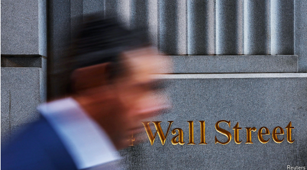
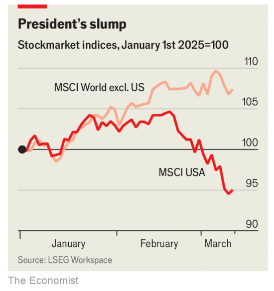

# How Trump provoked a stockmarket sell-off

sell-off：抛售

*Will the president win back investors? Does he even want to?*

原文：

**A**S THEY SAW the line go down, American investors may have

felt an unfamiliar sensation: anxiety. The S&P 500 fell by another

4% in the week to March 12th, leaving the world’s most watched

stockmarket down by 9% since its recent peak. The NASDAQ,

dominated by tech firms, has fallen by 12%. It is not quite the bold

new era of American growth promised by Donald Trump in his

election campaign.

当美国投资者看到股市下跌时，他们可能会有一种陌生的感觉:焦虑。截至3月12日的一周内，标准普尔500指数股市又下跌了4%,使得世界上最受关注的股票市场从最近的高峰下跌了9%。由科技公司主导的纳斯达克下跌了12%。这不完全是唐纳德·特朗普(Donald Trump)在竞选中承诺的美国增长的大胆新时代。

原文：

The president’s unpredictable trade policies got things going. On

March 12th, in the latest twist in Mr Trump’s trade saga, America

levied tariffs of 25% on imports of aluminium and steel. After

years of growth, the health of the American economy is a source of

concern, too, with worries provoked by a drip of discouraging data.

Statistics released the same day showed that consumer prices rose

more slowly in February than analysts had expected. But the relief

for shoppers also hints that America’s economy is shifting into a

lower gear. Such news is beginning to undermine the idea of

American exceptionalism: after all, investors have seen much better

returns in China and Europe this year.

总统不可预测的贸易政策推动了事情的发展。3月12日，美国对进口铝和钢征收25%的关税，这是特朗普贸易传奇的最新转折。经过多年的增长，美国经济的健康状况也令人担忧，令人沮丧的数据引发了人们的担忧。同一天发布的统计数据显示，2月份消费者价格上涨速度低于分析师预期。但是购物者的宽慰也暗示了美国经济正在减速。这样的消息开始削弱美国例外论的观点:毕竟，投资者今年在中国和欧洲看到了好得多的回报。

学习：

saga：传奇故事；长篇故事（讲述许多年间发生的事情的）；一连串的事件（或经历）

原文：

During Mr Trump’s first term, investors came to believe that his

administration’s focus on tax cuts and deregulation would

ultimately overwhelm his unpredictable, protectionist tendencies.

They also saw that he was sensitive to market moves, and keen to

avoid falls. This combination was referred to as the “Trump put”:

temporary sell-offs, often driven by the trade conflict with China,

were quickly reversed as the president did whatever it took to

change the market mood. Investors who sold tended to regret their

decision.

在特朗普的第一个任期内，投资者开始相信，他的政府对减税和放松监管的关注最终会压倒他不可预测的保护主义倾向。他们还发现，他对市场波动非常敏感，并热衷于避免下跌。这种组合被称为“特朗普看跌期权”(Trump put):随着总统尽一切努力改变市场情绪，通常由与中国的贸易冲突驱动的临时抛售迅速逆转。卖出的投资者往往会后悔自己的决定。

原文：

The current dynamic appears to be different. Mr Trump’s new

administration is more hard-nosed. On March 6th the president said

that he was not looking at the stockmarket, but was concentrating

on the long term. The same day, Scott Bessent, his treasury

secretary, offered a similar view: “Wall Street’s done great. Wall

Street can continue doing well. But this administration is about

Main Street.” Then, on March 9th, the president avoided questions

about whether America faced a recession, and warned of a “period

of transition”. Many market participants had believed that Mr

Trump would use the threat of tariffs merely as a negotiating tactic.

They are gradually being convinced that he really means it this

time round.

目前的动态似乎有所不同。特朗普的新政府更加务实。3月6日，总统说他没有关注股票市场，而是着眼于长远。同一天，他的财政部长斯科特·贝森特提出了类似的观点:“华尔街做得很好。华尔街可以继续做得很好。但本届政府是关于主街的。”然后，在3月9日，总统回避了美国是否面临衰退的问题，并警告“过渡期”。许多市场参与者曾认为，特朗普只会把关税威胁作为一种谈判策略。他们逐渐相信这一次他是认真的。

学习：

hard-nosed：实际的；精明的；冷静的

原文：

And just look at the lovely alternatives. So far this year, as

American stocks have swooned, Europe’s Stoxx 600 index has

risen by 12% in dollar terms, and Germany’s DAX by 19%. A

combination of factors, including a falling dollar and a boom in

European defence stocks—driven by expectations of higher

defence spending, to cope with America’s newfound disregard for

the continent—have put Europe in the limelight. Even China’s

moribund market has gone on a tear, inspired by hype about the

progress of the country’s artificial-intelligence firms. The Hang

Seng, which includes many Chinese firms listed in Hong Kong, is

up by 17%. For investors worried about their portfolios being

dominated by a handful of American tech giants, overseas markets

are increasingly enticing.

看看其他好的股市选择。今年到目前为止，随着美国股市暴跌，欧洲斯托克600指数以美元计算上涨了12%，德国DAX指数上涨了19%。一系列因素，包括美元下跌和欧洲国防股票上涨——由更高的国防支出预期推动，以应对美国新发现的对欧洲大陆的忽视——使欧洲成为人们关注的焦点。即使是中国一直不涨的市场也在大肆宣传该国人工智能公司的进步的鼓舞下继续前进。包括许多在香港上市的中国公司的恒生指数上涨了17%。对于担心自己的投资组合被少数美国科技巨头主导的投资者来说，海外市场越来越有吸引力。

学习：

swoon：昏厥；昏倒；晕厥

limelight：美 [ˈlaɪmlaɪt] 公众注意的中心；舞台上的聚光灯；石灰光灯

moribund：濒临死亡的；垂死的；停滞不前的；

on a tear：在奔跑中

原文:

The sell-off has hit highly valued tech stocks hardest of all.

Broadcom and Nvidia, two world-leading semiconductor

manufacturers, are down by around 15% in the year to date. But the

stand-out loser is Tesla, an electric-car firm owned by Elon Musk, a

close ally of Mr Trump, which has fallen by 39% this year. On

March 10th alone its value dropped by 15%. European sales of the

firm’s vehicles have dropped as the continent’s consumers express

their political opinions by buying other cars.

抛售对高估值科技股的打击最大。今年迄今为止，两家世界领先的半导体制造商博通和英伟达的股价下跌了约15%。但最大的输家是特斯拉，这是一家由特朗普的亲密盟友埃隆·马斯克拥有的电动汽车公司，其股价今年下跌了39%。仅在3月10日，其价值就下跌了15%。该公司汽车在欧洲的销量下降，因为欧洲大陆的消费者通过购买其他汽车来表达他们的政治观点。

原文：

America’s wobble is not confined to the stockmarket. The dollar

has dropped by more than 5% against a basket of other currencies

since its peak in January. Credit spreads on risky bonds, a measure

of the protection that investors demand for holding them, have risen, too. 

On February 18th junk bonds issued by less creditworthy

firms offered yields just 2.6 percentage points above Treasury

bonds. By March 11th that margin had risen to 3.2 percentage

points, near its highest in six months.

美国的不稳定不仅限于股票市场。自1月份达到峰值以来，美元兑一篮子其他货币已下跌逾5%。高风险债券的信贷息差(衡量投资者持有高风险债券所需保护的指标)也有所上升。2月18日，信用较差的公司发行的垃圾债券的收益率仅比国债高2.6个百分点。到3月11日，这一差额已经上升到3.2个百分点，接近六个月来的最高点。

学习：

wobble：美 [ˈwɑːbl] 晃动；不稳定；

creditworthy：信誉良好的；有信用的；值得信赖的；有借贷资格的

原文：

If Mr Trump wants to turn things around, which does not yet

appear to be the case, it may take something big given the building

economic gloom. On March 10th Goldman Sachs cut its forecast

for American growth in 2025 by 0.7 percentage points, to 1.7%.

Most analysts still predict some growth, but a few expect a

recession. Peter Berezin of BCA Research is one of them. He notes

that, on top of Mr Trump’s turbulence, household savings built up

during the covid-19 pandemic have been depleted, and past rises in

interest rates continue to feed through to mortgages.

如果特朗普先生想要扭转局面——目前看来似乎还不是这样——鉴于经济前景日益暗淡，可能需要一些重大的举措。3月10日，高盛将其对2025年美国经济增长的预测下调了0.7个百分点，至1.7%。大多数分析师仍然预测会有一些增长，但少数人预计会出现衰退。BCA研究的彼得·贝雷津（Peter Berezin）就是其中之一。他指出，除了特朗普带来的动荡之外，新冠疫情期间积累的家庭储蓄已经耗尽，而过去的加息仍在逐步影响到抵押贷款。

学习：

>在这段文字中，“feed through”的意思是指“逐渐影响”或“传导到”。它描述了过去加息的影响逐渐传递到抵押贷款（mortgages）等领域，表明这些影响不是立即显现的，而是随着时间逐步体现出来。

原文：

A month ago the federal-funds futures market suggested that

investors believed there was a 70% chance the Federal Reserve’s

policy rate would remain at or above 4% by the year’s end. Now it

implies a chance of 12%, with a growing number of investors

expecting more aggressive monetary easing. Although inflation

remains above the central bank’s target, Jerome Powell, the Fed’s

chairman and a long-time target of Mr Trump’s ire, may have to cut

rates faster than he had planned.

一个月前，联邦基金期货市场显示，投资者认为到年底联邦储备的政策利率保持在4%或以上的可能性有70%。现在这一概率降至12%，越来越多的投资者预期会有更激进的货币宽松政策。尽管通货膨胀率仍高于中央银行的目标，但美联储主席杰罗姆·鲍威尔——长期以来一直是特朗普怒火针对的对象——可能不得不比他计划的更快降息。

学习：

ire：美 [ˈaɪ(ə)r] 愤怒；激怒；愤慨

>
>
>在这段文字中，“ire”的意思是“愤怒”或“怒火”。它指的是特朗普长期以来对联邦储备委员会主席杰罗姆·鲍威尔（Jerome Powell）的不满或强烈批评情绪。

原文：

The S&P’s remarkable rise in recent years—it has more than

doubled in value since March 2020—means it remains vulnerable.

The index’s price-to-earnings ratio, based on expectations of the

constituent firms’ earnings over the next year, has dropped from 25

times to 21 times in less than a month. Even so, by historical

standards, stocks are expensive. Expectations for the American

market, established over many years of strong performance, have

become far easier to disappoint. So far, at least, the S&P’s fall

represents a wobble rather than a nightmare. How will things look

after another round of tariffs? ■

S&P近年来的显著上涨——自2020年3月以来，其价值已翻了一倍多——意味着它仍很脆弱。在不到一个月的时间里，基于成份股公司未来一年收益预期的该指数市盈率已从25倍降至21倍。即便如此，按照历史标准，股票还是很贵的。对美国市场的期望，是经过多年的强劲表现建立起来的，现在变得更容易失望。至少到目前为止，S&P的坠落代表的是一种抖动，而不是一场噩梦。新一轮关税之后，情况会如何？■

## 后记

2025年3月15日19点36分于上海。