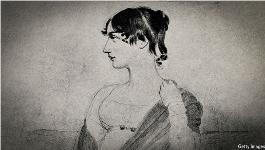

# Jane Austen’s forgotten inspirations

*A new book investigates the authors whom Austen revere*

revere：美 [rɪˈvɪr] （对人或物）钦敬；崇敬；

**Jane Austen’s Bookshelf.** By Rebecca Romney. *Marysue Rucci Books; 464 pages; $29.99. Ithaka Press; £25*

原文：

**L**EGIONS OF “Janeites” will spend 2025—the 250th anniversary

of Jane Austen’s birth—truffle-hunting for undiscovered morsels in

the life and work of English literature’s most famous woman

author. Amid all the “Austenmania”, including balls, festivals,

podcasts, television series and new books, what are the odds of

finding something new?

大批“简主义者”将在2025年——简·奥斯汀诞辰250周年——寻找这位英国文学史上最著名的女作家生活和工作中未被发现的蛛丝马迹。在所有的“奥斯特狂热”中，包括舞会、节日、播客、电视连续剧和新书，发现新事物的几率有多大？

学习：

truffle：英 [ˈtrʌf(ə)l] 松露（一种珍贵的食用地下真菌）；松露巧克力

truffle-hunting：寻找

morsel：一小口（食物）；一小块；一小片；少量；小部分；细小的碎片；一点点

原文：

An American rare-book dealer, Rebecca Romney, has managed it,

by searching where Austen’s secrets lie hidden in plain sight: her

letters and books. “Jane Austen’s Bookshelf” surveys the female

writers she admired and whose novels laid the groundwork for

everything from gothic thrillers to today’s romantasy boom.

美国珍稀书籍交易商丽贝卡·罗姆尼（Rebecca Romney）做到了这一点，她通过探索奥斯汀（Austen）的秘密藏于显而易见之处——她的信件和书籍——来实现。“简·奥斯汀的书架”（Jane Austen’s Bookshelf）审视了奥斯汀所欣赏的女性作家，这些作家的作品为从哥特式惊悚小说到如今的浪漫奇幻热潮奠定了基础。

学习：

rare-book

>
>
>在这段文字中，“rare-book”指的是“珍稀书籍”。它通常指那些存世量少、具有历史或文化价值、往往是古董或限量版的书籍。因此，“rare-book dealer”可以理解为“珍稀书籍交易商”或“古籍商”，即专门从事买卖这类珍贵书籍的人。

groundwork：基础工作；基本准备；准备工作；基础

gothic：中世纪的；阴森的；恐怖的；哥特小说的

thrillers：惊险小说（thriller的复数形式）；恐怖片

romantasy：美 [ˈrɑːmænsi] 浪漫奇幻；浪漫幻想（结合浪漫小说和奇幻元素的文学体裁）

原文：

Ms Romney is known for her bibliographic sleuthing on “Pawn

Stars”, an American TV show that features experts appraising 

objects brought to a pawnshop in Las Vegas. Embarrassed by her

own ignorance and shocked at the erasure of these writers from the

canon, she set out to use the tools of her trade to answer a question:

did Austen’s predecessors disappear from the canon because their

books were simply “trash”?

罗姆尼女士因其在美国电视节目《典当之星》中的书目追踪而闻名，该节目由专家对带到拉斯维加斯当铺的物品进行估价。她对自己的无知感到尴尬，并对这些作家被从正典中抹去感到震惊，她开始使用她行业的工具来回答一个问题:奥斯汀的前任从正典中消失是因为他们的书只是“垃圾”吗？

学习：
bibliographic：书目的；著书目录的；

sleuthing：美 [ˈslu:θɪŋ]（非警方人员所做的）调查；侦察

pawn：（国际象棋中）卒；兵；棋卒；典当物；抵押品

pawnshop：当铺；典当行

apprasing：评价；（appraise的现在分词）

erasure：抹掉；擦除；消除；擦掉

canon：作品集；精品集；经典；真经；正经；

原文：

No. Take Frances Burney, in whose novel “Cecilia” (1782) the

phrase “pride and prejudice” first appears. Burney’s debut,

“Evelina”, was a literary sensation, reprinted four times in its first

year. Her third, “Camilla”, is cited tongue-in-cheek by Austen in

“Northanger Abbey” as “only some work in which the greatest

powers of the mind are displayed”.

不。以弗朗西斯·伯尼为例，在她的小说《塞西莉亚》(1782)中,“傲慢与偏见”一词首次出现。伯尼的处女作《埃维莉娜》轰动文坛，第一年重印了四次。她的第三本书《卡米拉》被奥斯汀在《诺桑觉寺》中半开玩笑地引用为“只有一些作品展示了心灵最伟大的力量”。

学习：

sensation：轰动；激动；觉察；强烈感受；引起轰动的人（或事）          

tongue-in-cheek：半开玩笑的；不认真的；挖苦的；讽刺的；戏谑的；

abbey：美 [ˈæbi] 修道院；大修道院；废修道院（现用作教堂或其他用途）；修道院教堂

原文：

Or consider Ann Radcliffe, the mother of the gothic horror novel,

whose “The Mysteries of Udolpho” also obsesses characters in

Austen’s “Northanger Abbey”. Radcliffe’s novel helped create a

new genre that represented one-third of the British fiction market in

the 1790s. Austen’s bookshelf also included Charlotte Smith, a poet

admired by William Wordsworth, whose first novel, “Emmeline”,

Austen read at 16 and praised in her own youthful stories. And her

favourite was probably Maria Edgeworth, author of “Belinda”, a

society novel, to whom Austen had a copy of her own “Emma” sent

in homage.

或者想想安·拉德克利夫，她是哥特恐怖小说的开创者，其作品《乌多尔福的秘密》也让奥斯汀《诺桑觉寺》中的角色着迷。拉德克利夫的小说帮助创造了一个新体裁，在1790年代占英国小说市场的三分之一。奥斯汀的书架上还有夏洛特·史密斯（Charlotte Smith），一位深受威廉·华兹华斯（William Wordsworth）赞赏的诗人。奥斯汀在16岁时读了史密斯的第一部小说《艾梅琳》（Emmeline），并在自己年轻时的故事中对其表示赞美。而她最喜欢的可能是玛丽亚·埃奇沃思（Maria Edgeworth），《贝琳达》（Belinda）的作者，这是一部社交小说。奥斯汀曾将自己《爱玛》（Emma）的一本副本送给埃奇沃思，以示敬意。

学习：

obsess

>
>
>在这段文字中，“obsess”的意思是“使着迷”或“让……沉迷”。在这里，它指的是安·拉德克利夫（Ann Radcliffe）的《乌多尔福的秘密》（The Mysteries of Udolpho）如何深深吸引了奥斯汀《诺桑觉寺》（Northanger Abbey）中的角色，使他们对这本书产生浓厚的兴趣或迷恋

in homage：以示敬意 英 [ˈhɒmɪdʒ]

原文：

If they were so popular in their own time, how did these authors

slip “from the spotlight…to the shadows”? Like most Austen fans,

Ms Romney was not familiar with most of Austen’s foremothers.

She concludes that the authors and books Austen revered, and in

some cases consciously emulated, were shunned by male literary

critics, falling prey to what scholars call “the Great Forgetting”.

如果她们在当时如此受欢迎，这些作者是如何“从聚光灯下……滑入阴影”的呢？像大多数奥斯汀的粉丝一样，罗姆尼女士（Ms Romney）对奥斯汀的大多数前辈女性作家并不熟悉。她得出结论，奥斯汀所崇敬、甚至在某些情况下有意识模仿的作者和书籍，遭到了男性文学评论家的排斥，成为学者们所谓的“大遗忘”（the Great Forgetting）的牺牲品。

学习：

foremothers

>
>
>在这段文字中，“foremothers”指的是“前辈女性”或“先驱女性”，具体到上下文里，它是指在简·奥斯汀（Jane Austen）之前或同时代的女性作家们，这些作家对奥斯汀的创作产生了影响。词语“foremothers”是“forefathers”（前辈、先驱）的女性形式，强调这些作者的性别及其在文学史中的地位。

emulated：努力赶上；模仿；（emulate的过去式和过去分词）          

shunned：避开；避免；回避；（shun的过去分词）          

原文：

The Regency era saw both the rise of the modern novel and a

backlash against female authors, derided as “scribblers”. Critics’

disdain coincided with the first time in history when more women

published novels than men. Each female writer’s fate was slightly

different: Radcliffe, for example, was doomed by the creepy genre

she popularised. (One male critic spoke for many of his peers when

he derided women writers’ “images of the grosser sort” and

dismissed the genre as “a species of…literary prostitution”.)

摄政时代见证了现代小说的兴起，同时也出现了对女性作者的强烈反对，她们被贬称为“涂鸦者”（scribblers）。评论家的轻蔑恰逢历史上首次女性出版的小说数量超过男性的时期。每位女性作家的命运略有不同：例如，拉德克利夫（Radcliffe）因她所推广的诡异体裁而注定被遗忘。（一位男性评论家代表了许多同行的观点，他嘲笑女性作家的“粗俗意象”，并将这一体裁贬为“一种……文学卖淫”。）

学习：

regency：摄政时期；摄政职位；摄政

>
>
>摄政时代（Regency Era）通常指英国历史上的一个特定时期，大约从1811年至1820年。这段时间以乔治三世的儿子——威尔士亲王乔治（后来的乔治四世）担任摄政王（Prince Regent）而得名。由于乔治三世因精神疾病无法履行国王职责，摄政王代为治理国家。尽管严格来说摄政期是1811年至1820年，但广义上，“摄政时代”常被用来描述从18世纪末到19世纪初（约1790年代至1830年代初）的文化、社会和艺术风格，尤其是在简·奥斯汀等作家作品的背景下。
>
>以下是摄政时代的一些关键背景知识：
>
>1. **历史背景**
>
>- **政治与战争**：摄政时代正值拿破仑战争（Napoleonic Wars，1803-1815），英国与法国长期交战。这导致军事开支激增，同时也刺激了民族主义情绪。
>- **工业革命**：这一时期是工业革命的早期阶段，城市化加速，工厂兴起，社会结构发生变化，传统农业社会逐渐向工业社会转型。
>- **摄政王的统治**：乔治四世以奢华生活和放荡作风闻名，他支持艺术和建筑（如布莱顿的皇家亭），但也因挥霍无度和不负责任而饱受批评。
>
>2. **社会与文化**
>
>- **阶级分化**：摄政时代是贵族阶层依然主导社会的时期，但新兴的中产阶级开始崛起。社交活动如舞会、茶会和乡村庄园生活是上流社会的重要特征，这在奥斯汀的小说中常有体现。
>- **女性地位**：女性在法律和社会上地位较低，通常依赖婚姻获得经济保障。尽管如此，摄政时代也见证了女性在文学领域的活跃，许多女性作家通过写作谋生或表达自我。
>- **时尚与礼仪**：这一时期以优雅的服饰和繁复的社交礼仪著称，男士流行高领衬衫和紧身马裤，女士则穿高腰线的“帝国风格”裙装。
>
>3. **文学与艺术**
>
>- **现代小说的兴起**：摄政时代是小说作为一种文学体裁蓬勃发展的时期。简·奥斯汀、安·拉德克利夫（Ann Radcliffe）、玛丽亚·埃奇沃思（Maria Edgeworth）等作家活跃于此时，她们的小说涵盖了浪漫、哥特和社会题材。
>- **浪漫主义萌芽**：与摄政时代重叠的是浪漫主义运动的兴起，华兹华斯（Wordsworth）和柯勒律治（Coleridge）等诗人强调情感、自然和个人表达，这与奥斯汀关注日常生活的现实主义风格形成对比。
>- **性别与文学批评**：如前文所述，尽管女性作家数量增加，但她们常被男性评论家贬低。这种性别偏见导致许多女性作者的作品在后世被忽视，即所谓的“大遗忘”（Great Forgetting）。
>
>4. **摄政时代的遗产**
>
>摄政时代因其独特的文化魅力和矛盾性而闻名。它既是奢华与优雅的象征，也是社会动荡与变革的前奏。简·奥斯汀的小说（如《傲慢与偏见》《爱玛》）不仅是这一时期的文学代表，也为后人提供了窥视当时社会风貌的窗口。
>
>如果你对摄政时代的某个方面（如文学、经济或具体事件）有更具体的问题，可以告诉我，我会进一步深入解答！

scribbler：涂鸦者；乱写的人；拙劣的作家；写字潦草的人；胡写乱画的人

disdain：轻蔑；藐视；不屑；鄙视

creepy：令人毛骨悚然的；让人感到不安的；引起恐惧的

derided：嘲笑；嘲弄；愚弄；（deride的过去式）

grosser：更粗俗的；更恶心的；更严重的；更粗鲁的；（gross的比较级）

prostitution：卖淫；为娼；

原文：

Ms Romney is not the only scholar to describe Austen’s “sister

authors”, most of whose books are now available online in the

public domain. But the chronicle of her quest to find and explain

the importance of their texts is written with a light, wry touch.

“Jane Austen’s Bookshelf” is thus a spirited and scholarly rebuke to

centuries of literary bias.

罗姆尼女士并不是唯一一位描述奥斯汀“姐妹作者”的学者，这些作者的大多数书籍如今已在公共领域在线上可获取。但她追寻并解释这些文本重要性的历程记录，以一种轻松、诙谐的笔触写成。因此，《简·奥斯汀的书架》是一部充满活力且具有学术性的作品，对几个世纪以来的文学偏见提出了有力的驳斥。

学习：

wry：美 [raɪ] 讽刺的；揶揄的；挖苦的；扭曲的；诙谐的

rebuke： 美 [rɪˈbjuːk] 指责；责备；斥责，训斥

>
>
>在这段文字中，“spirited”的意思是“充满活力”或“生气勃勃”。它描述了《简·奥斯汀的书架》（Jane Austen’s Bookshelf）这本书的风格，表明它不仅具有学术性，还带有一种生动、有趣的特质，与“light”（轻松）和“wry”（诙谐）的描述相呼应。

原文：

Perhaps the most fascinating lineage she traces is from these 18th

century “romances” (defined as any work with fantastical

elements), to Austen’s genteel “courtship novels”, to the dragon

packed love stories flying off shelves today. Such romances give

women starring roles and agency, whether in love, marriage or on

epic quests. In the case of Austen’s predecessors, too, there is a

“happily ever after”: if you have ever wished Jane Austen had

written more books, a bookshelf full of her favourite writers is just

waiting to be read. ■

她追溯的最引人入胜的传承或许是从这些18世纪的“浪漫作品”（定义为任何带有奇幻元素的作品），到奥斯汀优雅的“求爱小说”，再到如今书架上飞速售出的充满龙的爱情故事。这类浪漫作品赋予女性主角地位和主动权，无论是在爱情、婚姻还是史诗般的冒险中。对于奥斯汀的前辈们来说也是如此，存在一种“从此幸福快乐”的结局：如果你曾希望简·奥斯汀能写更多书，那么一个装满她最喜爱作家的书架正等待你去阅读。■

学习：

genteel：文雅的；有教养的；上流社会的；

starring roles:主角

epic quests：史诗般的冒险

courtship：求爱；求偶；追求（异性的）恩爱；求婚期

>
>
>在这段文字中，“dragon-packed”的意思是“充满龙的”或“塞满龙的”，这里用来形容当今畅销的爱情故事中带有奇幻元素，特别是龙这种常见的神话生物。它是一个形象的表达，强调这些故事的奇幻和冒险性质。

agency：

>在这段文字中，“agency”的意思是“主动权”或“自主性”。它指的是女性在故事中不仅仅是被动的角色，而是能够主动做出选择、掌控自己命运的能力。这种主动权可以体现在爱情、婚姻或史诗般的冒险等场景中，强调女性在叙事中的主体地位。
>
>结合上下文，“Such romances give women starring roles and agency”这句话的意思是，这类浪漫作品不仅让女性担任主角，还赋予她们自主行动的能力。

## 后记

2025年3月17日16点47分于上海。