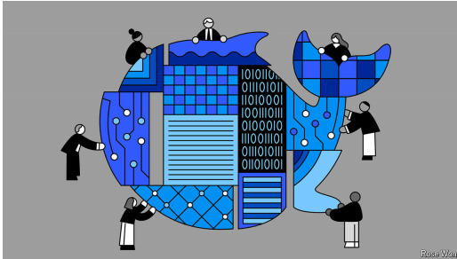

# Western companies are experimenting with DeepSeek

*But concerns over security, censorship and dependence on China remain*

原文：

**T**WO MONTHS on from its release, DeepSeek’s R1, which

wowed experts and caused American tech stocks to crash in

January, is still unbeaten. The Chinese firm’s artificial-intelligence

(AI) model remains the best open-source offering released by any

lab, anywhere in the world. Back home it has spread like wildfire·.

It is catching on in the rest of the world as well.

发布两个月后，DeepSeek的R1仍然没有被击败，它让专家们惊叹不已，并导致美国科技股在1月份暴跌。这家中国公司的人工智能(AI)模型仍然是世界上任何地方任何实验室发布的最佳开源产品。在国内，它已经像野火一样蔓延开来。它也正在世界其他地方流行起来。

学习：

wow：惊叹，震惊

原文：

The value offered by DeepSeek’s open-source models is hard to

ignore. They can be used by coders without asking permission or

paying a fee, and can be downloaded and run on a company’s own

hardware if it wishes to do so for performance or privacy reasons.

That puts DeepSeek in a different category to more technically

impressive but closed labs like OpenAI.

DeepSeek的开源模型提供的价值不容忽视。程序员可以使用它们，无需请求许可或支付费用，如果公司出于性能或隐私原因希望这样做，可以下载并在公司自己的硬件上运行。这使得DeepSeek与OpenAI等技术上更令人印象深刻但封闭的实验室处于不同的类别。

原文：

Some companies in the West have already begun to adopt

DeepSeek’s models, which are now supported by cloud providers

including Amazon and Microsoft. Gloo, a messaging platform for

churches founded by Pat Gelsinger, who until December was the

chief executive of Intel, has used the model as the basis for its

chatbot. Latenode, an automation platform, began offering R1

shortly after the model was launched, noting that its support for

non-English languages was appealing to content marketers looking

to translate material. Meta, DeepSeek’s main open-source rival, has

assigned researchers to pull apart R1 and apply the lessons to its

own family of Llama models.

西方的一些公司已经开始采用DeepSeek的模型，现在这些模型得到了包括亚马逊和微软在内的云提供商的支持。Gloo是由帕特·基尔辛格创建的一个教堂通讯平台，他在去年12月之前一直是英特尔的首席执行官，该平台已经将这种模式作为其聊天机器人的基础。自动化平台Latenode在该模式推出后不久就开始提供R1，并指出其对非英语语言的支持对寻求翻译材料的内容营销人员很有吸引力。DeepSeek的主要开源竞争对手Meta已经指派研究人员拆开R1，并将经验应用到自己的骆驼模型家族中。

学习：

adopt：采用

原文：

Perhaps surprisingly, European banks have emerged as a hotbed of

experimentation. Strict confidentiality rules limit how much the

financial sector can rely on cloud-based AI services. That makes

open-source models hosted internally an attractive alternative.

Natwest and HSBC, two British lenders, are both experimenting

with building their services on top of R1, as is Spain’s BBVA,

according to the *Information*, a news site.

也许令人惊讶的是，欧洲银行已经成为实验的温床。严格的保密规则限制了金融部门对基于云的人工智能服务的依赖程度。这使得内部托管的开源模型成为一个有吸引力的选择。根据新闻网站Information的报道，英国的两家银行Natwest和HSBC都在尝试在R1建立他们的服务，西班牙的BBVA也是如此。

学习：

hotbed：滋生地；培养场所；（坏事、暴力等的）温床；（疾病、犯罪等的）孕育地          

confidentiality ：保密

原文：

Many Western businesses, though, remain cautious. Security is

often the concern, and one that may preoccupy Americans more

than Europeans. One American boss says he would only run

DeepSeek’s models on an “air-gapped” computer with no

connection to his firm’s systems—even though it would have taken

a breakthrough in computer science for DeepSeek to have

smuggled malicious capabilities into the model itself.

然而，许多西方企业仍保持谨慎。安全通常是人们关心的问题，美国人可能比欧洲人更关心这个问题。一位美国老板说，他只会在一台与公司系统没有连接的“气隙”计算机上运行DeepSeek的模型——尽管DeepSeek将恶意功能植入模型本身需要计算机科学的突破。

学习：

smuggled：走私；偷带；（smuggle的过去式和过去分词）

原文:

Moreover, the White House is considering banning DeepSeek’s

chatbot app on government devices, on national-security grounds,

and could decide to go further, including possibly preventing

American cloud providers from offering DeepSeek’s models at all.

That would have a chilling effect on adoption.

此外，白宫正在考虑以国家安全为由在政府设备上禁止DeepSeek的聊天机器人应用，并可能决定更进一步，包括可能阻止美国云提供商提供DeepSeek的模型。这将对收养产生寒蝉效应。

学习：

>
>
>**这里的 "chilling effect" 意思是** **“寒蝉效应”**，指某种行动或政策导致人们因恐惧或担忧而不敢采取某些行为。在此上下文中，**"That would have a chilling effect on adoption."** 意思是 **“这将对其（DeepSeek模型）的采用产生寒蝉效应。”** 也就是说，如果美国政府采取更严格的限制措施，例如禁止云服务商提供 DeepSeek 的模型，可能会**严重阻碍该模型的推广和应用**，因为用户和企业可能会因政策风险而不敢使用它。
>
>------
>
>**类似的用法示例如下：**
>
>- **"The strict new regulations on social media had a chilling effect on free speech."**
>   严格的新社交媒体法规对言论自由产生了寒蝉效应。
>- **"The lawsuit had a chilling effect on investigative journalism, as reporters feared legal repercussions."**
>   这场诉讼对调查性新闻报道产生了寒蝉效应，因为记者们害怕法律后果。
>
>------
>
>**在此上下文中的意思：**
>
>**"That would have a chilling effect on adoption."**
> 意思是：
> **“这将对（DeepSeek 模型的）采用造成抑制效应，使得用户和企业因政策不确定性而减少使用。”**

原文：

Europeans, by comparison, may find themselves with little choice.

None of the old continent’s homegrown AI champions are of the

calibre of DeepSeek. Donald Trump’s trade war and his overtures

towards Vladimir Putin mean that some European companies and

policymakers may want to lower their reliance on American tech

相比之下，欧洲人可能发现自己别无选择。旧大陆本土的人工智能冠军没有一个具有DeepSeek的水准。唐纳德·特朗普的贸易战和他对弗拉基米尔·普京的友好姿态意味着，一些欧洲公司和政策制定者可能希望降低对美国科技的依赖

学习：

calibre：英 [ˈkalɪbə] 质量；（尤指人的）能力

overture：美 [ˈoʊvərtʃər]  初步接触；和解的提议；友好姿态；开端

原文：

In late February DeepSeek made it even easier for others to harness

its technology by making the code it used to create its models

available free of charge. Previously DeepSeek had only shared

details of the process it used to train its systems, which was far

more efficient than the approaches taken by Western firms. But

now companies have access to the exact code used by the Chinese

pioneer to develop its models. Thousands have downloaded it in

the past week alone.

2月下旬，DeepSeek通过免费提供其用于创建模型的代码，使得其他人更容易利用其技术。此前，DeepSeek只分享了其用于训练系统的流程细节，这比西方公司采用的方法要高效得多。但现在，企业可以获得这家中国先驱用来开发其模型的确切代码。仅在过去一周就有数千人下载了它。

原文：

Using DeepSeek’s methodology may be a good option for

companies looking to benefit from its breakthroughs while

avoiding the Chinese censorship that is embedded in its models—a

final hurdle to adoption. Ask DeepSeek’s chatbot about Tiananmen

Square, for example, and it will want to “talk about something

else”. Others have taken a more direct approach to tackling that

problem. Perplexity, an American AI search engine, has taken R1

and retrained it to ensure it produces “unbiased, accurate, and

factual information”. It has dubbed its creation, with patriotic

fervour, “R1 1776”. ■

学习:

dub：给…起绰号；把…戏称为；授予称号；

## 后记

2025年3月20日18点01分于上海。

