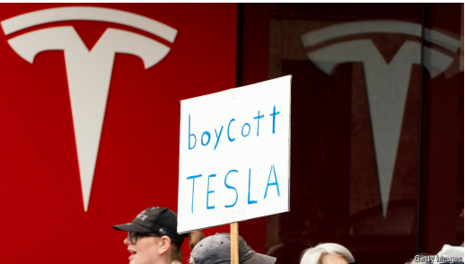
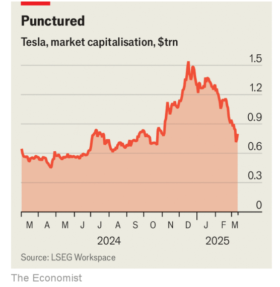

# Elon Musk’s antics are not the only problem for Tesla

*The carmaker’s sales are sinking for other reasons too*

antics：美 [ˈæn(t)ɪks] 滑稽动作；古怪行为；愚蠢的举止

原文：

**F**RIENDS HELP each other out. Tesla’s boss, Elon Musk, may

well have been grateful when Donald Trump said he would buy one

of its electric vehicles (EVs) on March 11th. Yet that was the least

the president could do for his bureaucracy-basher-in-chief. The day

before, Mr Trump had helped bring on a fall of over 15% in Tesla’s

share price, amid a wider sell-off sparked by his trade policies and

his warning that America’s economy faced a “period of transition”.

The subsequent Trumpian endorsement will not be enough to apply

the brakes to Tesla’s declining sales and slumping share price.

朋友们互相帮助。3月11日，当唐纳德·特朗普说他将购买特斯拉的一辆电动汽车时，特斯拉的老板埃隆·马斯克可能会很感激。然而这是总统为他的官僚主义抨击者所能做的最起码的事情。此前一天，特朗普帮助导致特斯拉股价下跌超过15%，当时他的贸易政策和他对美国经济面临“转型期”的警告引发了更广泛的抛售。特朗普随后的支持不足以遏制特斯拉不断下滑的销量和暴跌的股价。

学习：

endorsement：支持

>
>
>**这里的 "basher" 意思是** **“猛烈批评者”**，通常指严厉抨击某个事物或群体的人。
>
>**"bureaucracy-basher-in-chief" 的意思是** **“首席官僚制度批评者”**，这里用 "in-chief"（首席、总负责人）表示该人是最具代表性、最激烈的批评者。在此语境下，它指的是 **埃隆·马斯克 (Elon Musk)**，因为他经常批评政府监管、官僚作风和繁琐的行政程序。
>
>------
>
>**类似的用法示例如下：**
>
>- **"He is a well-known celebrity basher, constantly mocking Hollywood stars."**
>   他是出了名的名人批评者，经常嘲讽好莱坞明星。
>- **"As a bureaucracy-basher, she has spent years advocating for deregulation and smaller government."**
>   作为一个官僚制度批评者，她多年来一直在倡导放松监管和精简政府机构。
>
>------
>
>**在此上下文中的意思：**
>
>**"The president could do for his bureaucracy-basher-in-chief."**
> 意思是：
> **“总统至少可以为这位‘首席官僚制度批评者’（指马斯克）做点什么。”**
>
>文章的意思是：特朗普在公开表示要购买特斯拉汽车的前一天，因其贸易政策和对经济的警告导致特斯拉股价大跌，因此他此举有点像是在“补偿”马斯克，但这并不足以阻止特斯拉销量下滑和股价下跌。

原文：

Mr Musk’s backing for Mr Trump’s second presidential run once

looked like a clever business move. His reward was to run the

Department of Government Efficiency (DOGE), boosting what

Barclays, a bank, calls the “Elon premium”. Investors clearly

thought that his political sway would do Tesla good. Its market

value hit a record $1.5trn in December (see chart).

马斯克支持特朗普第二次竞选总统一度看起来像是一个聪明的商业举动。他的回报是管理政府效率部(DOGE)，提升了巴克莱银行所谓的“埃隆溢价”。投资者显然认为他的政治影响力会给特斯拉带来好处。去年12月，其市值达到创纪录的1.5万亿美元(见图表)。

学习：
 business move:商业举动

>
>
>**这里的 "premium" 意思是** **“额外价值”或“溢价”**，通常指人们愿意为某种商品、品牌或资产支付超过其基本价值的部分，反映出人们对其信心或特殊认可。
>
>**类似的用法示例如下：**
>
>- **"Luxury brands can charge a premium because of their reputation."**
>   奢侈品牌可以收取溢价，因为它们有良好的声誉。
>- **"Investors pay a premium for companies with strong leadership and clear growth prospects."**
>   投资者愿意为具有强大领导力和明确增长前景的公司支付额外溢价。
>
>------
>
>**"Elon premium" 的意思是** **“埃隆·马斯克溢价”**，指因为马斯克本人的影响力、声誉和政治关系，特斯拉等相关企业的股价或市值所获得的额外市场估值。换句话说，就是市场因为相信马斯克的个人能力、影响力和与政治高层的关系而赋予公司超出实际业绩的估值。
>
>------
>
>**在此上下文中的意思：**
> **"boosting what Barclays, a bank, calls the ‘Elon premium’"**
> 意思是：
> **“提升了巴克莱银行所称的‘埃隆·马斯克溢价’。”**
>
>即因为马斯克掌管了政府效率部门（DOGE），进一步增强了他对政策和市场的影响力，投资者相信这种政治影响力会对特斯拉有利，所以特斯拉的市值因此被推高，达到了1.5万亿美元的纪录。

sway：影响；控制

原文：

Since then his closeness to Mr Trump and support for far-right

causes have prompted a backlash. Protests against Mr Musk’s role

at the heart of the administration and DOGE’s mass firings of civil

servants have gathered steam in America. Picketing of Tesla

showrooms has turned ugly, with windows smashed and vehicles

vandalised; a Tesla charging station was attacked by arsonists.

Outside America, Mr Musk’s actions have also provoked protests

against the carmaker. So closely are the man and brand intertwined

that embarrassed owners are resorting to anti-Musk bumper-

stickers to distance themselves from him.

自那以后，他与特朗普的密切关系以及对极右翼立场的支持引发了反弹。在美国，针对马斯克在政府中的核心角色以及 DOGE 大规模裁撤公务员的抗议活动愈演愈烈。特斯拉展厅前的抗议活动变得暴力，有窗户被砸碎、车辆遭到破坏；还有特斯拉充电站遭纵火袭击。在美国以外，马斯克的行为也引发了对特斯拉的抗议。马斯克本人和品牌之间的联系如此紧密，以至于一些尴尬的特斯拉车主不得不贴上反马斯克的汽车保险杠贴纸，以与他划清界限。

学习：

>
>
>**这里的 "gather steam" 意思是** **“逐渐升温”或“越来越有势头”**，通常用来形容一个事件、运动或趋势逐渐获得动力、支持或影响力。
>
>**类似的用法示例如下：**
>
>- **"The campaign is starting to gather steam ahead of the election."**
>   竞选活动在大选前开始逐渐升温。
>- **"Protests against the new policy gathered steam across the country."**
>   反对新政策的抗议活动在全国范围内愈发高涨。

mass firings ：大规模解雇

picketing：

>**这里的 "picketing" 意思是** **“示威抗议”或“在某处举牌抗议”**，通常指抗议者在建筑物或店铺前排成队伍，举着标语牌抗议某个行为或公司。
>
>**类似的用法示例如下：**
>
>- **"The workers began picketing outside the factory demanding better pay."**
>   工人们开始在工厂外抗议，要求提高工资。
>- **"Picketing outside company offices disrupted business operations."**
>   在公司办公楼前的抗议影响了正常运营。

smash：粉碎

vandalize：故意破坏；肆意破坏；破坏公物；毁坏财产

arsonist：美 [ˈɑrsənɪst]  纵火犯；纵火犯人

bumper：保险杠；丰收；大满杯；满杯祝酒

stickers：贴纸；坚持不懈的人；（sticker的复数）

>
>
>**这里的 "bumper-stickers" 意思是** **“汽车保险杠贴纸”**，通常是贴在汽车后保险杠上的小标语或图片，表达车主的观点、态度或幽默感。
>
>**类似的用法示例如下：**
>
>- **"He had a bumper-sticker that read 'Save the Earth' on his car."**
>   他的车上有一张写着“拯救地球”的保险杠贴纸。
>- **"Some Tesla owners are now using anti-Musk bumper-stickers."**
>   一些特斯拉车主现在在车上贴上反马斯克的保险杠贴纸。

原文：

But Mr Musk’s politics only partially explains Tesla’s troubles.

Sales were falling before he took a chainsaw to America’s public

sector. Last year Tesla dropped a long-standing aim to be making

20m cars annually by 2030 and reported its first decline in annual

sales for many years—a fall of 1%, to 1.79m cars.

但是马斯克先生的政治观点只能部分解释特斯拉的麻烦。在他拿着电锯去美国公共部门之前，销售额一直在下降。去年，特斯拉放弃了到2030年年产2000万辆汽车的长期目标，并报告了多年来的首次年销量下降——下降1%，至179万辆。

原文：

Sales have continued to fall in recent months compared with a year

before, at a time when the EV market overall is still growing.

Barclays estimates that first-quarter sales in Europe could be down

by around 30%. In Germany, where Mr Musk caused an uproar by

supporting a far-right party in recent elections, sales fell by 76% in

February, year on year.

与一年前相比，最近几个月的销量持续下降，而此时电动汽车市场整体仍在增长。巴克莱估计欧洲第一季度销售额可能下降30%左右。在德国，马斯克先生因在最近的选举中支持一个极右翼政党而引起轩然大波，今年2月销售额同比下降了76%。

学习：

uproar：美 [ˈʌprɔːr] 喧嚣；骚动；吵闹；轰动；混乱

原文：

Yet Barclays reckons that first-quarter sales in America, where

antipathy to Mr Musk seems highest, will be flat. Sales in China

also fell by nearly 14% in January and February, but a political

backlash is an unlikely explanation; Mr Musk is generally regarded

as pro-China. In Britain, where his political meddling should be a

factor, Tesla sales actually increased by almost 21% in February.

然而巴克莱银行认为，在对马斯克先生反感最深的美国，第一季度的销售额将会持平。一月和二月在中国的销售额也下降了近14%,但是政治上的反弹是不太可能的解释；马斯克通常被认为是亲中国的。在英国，他的政治干预应该是一个因素，特斯拉的销量实际上在二月份增长了近21%。

学习：

antipathy：美 [ænˈtɪpəθi] 反感；厌恶；憎恶；敌意；不喜欢 **注意发音**

meddling：干涉；摸弄；（meddle的现在分词形式）

political meddling：政治干预

原文：

This suggests that a reaction from consumers who dislike Mr

Musk’s antics are only one reason for falling sales. An updated

Model Y, Tesla’s best-selling vehicle, has just gone on sale. In

preparation Tesla ran down inventory of the old model, crimping

supply. Customers doubtless held off purchases until the new car

was available.

这表明，不喜欢马斯克古怪行为的消费者的反应只是销量下降的一个原因。特斯拉最畅销的车型升级版的Model Y刚刚上市。为了做好准备，特斯拉减少了旧车型的库存，减少了供应。消费者无疑会推迟购买，直到新车上市。

学习：

held off purchases：推迟购买

>
>
>**这里的 "antics" 意思是** **“古怪滑稽的举动”或“出格的行为”**，通常指某人引人注目、夸张、令人不快或不被普遍认可的怪异行为或言行。
>
>**类似的用法示例如下：**
>
>- **"The comedian’s antics on stage made the whole audience laugh."**
>   喜剧演员在舞台上的滑稽举动让全场观众大笑。
>- **"His constant social media antics are starting to damage his reputation."**
>   他在社交媒体上的各种出格行为开始损害他的名声。
>
>------
>
>**在此上下文中，"Mr Musk’s antics" 指的是马斯克的一系列引发争议或令部分消费者反感的怪异言行举动**，这些行为只是导致特斯拉销量下滑的原因之一。

原文：

The bigger problem, though, is that Tesla has become what

Philippe Houchois of Jefferies, an investment bank, calls a

“reluctant carmaker”. It relies for the bulk of its sales on two

models, the 3 and the Y, whereas global giants such as Toyota have

many more to satisfy all parts of the market. In October Mr Musk

decided against launching a cheaper “Model 2”, instead switching

focus to robotaxis and humanoid robots. Meanwhile the

competition from established carmakers and Chinese newcomers is

heating up.

然而，更大的问题是特斯拉已经成为投资银行Jefferies的Philippe Houchois所说的“不情愿的汽车制造商”。它的大部分销售依赖于两种车型，Model 3和Y，而像丰田这样的全球巨头有更多的车型来满足各个层次的市场。10月，马斯克决定不推出更便宜的“Model 2”，而是将重点转向robotaxis和人形机器人。与此同时，来自老牌汽车制造商和中国新来者的竞争正在升温。

学习：

established；传统的，老牌的

established carmakers：老牌汽车制造商

原文：

Tesla’s valuation has long lost any connection with fundamentals,

and is more a bet on Mr Musk’s ability to revolutionise any

business he turns his hand to. He now claims that robotaxis and

robots will make Tesla the “most valuable company in the world by

far”.

特斯拉的估值早已失去了与基本面的任何联系，更多的是押注于马斯克有能力彻底改变他所涉足的任何业务。他现在声称，robotaxis和机器人将使特斯拉成为“迄今为止世界上最有价值的公司”。

原文：

That hints at another explanation for Tesla’s plunging share price:

Mr Musk spreading himself ever thinner. In an interview with Fox

News on March 10th he noted the “great difficulty” he faced

running Tesla and his other firms while working for the

government. As Mr Trump inspected his potential new purchase

outside the White House, he chastised protesters for “harming a

great American company”. Yet much of the blame for that lies with

his buddy, Mr Musk. ■

这暗示了对特斯拉股价暴跌的另一种解释:马斯克把自己摊得越来越薄。在3月10日接受福克斯新闻频道采访时，他提到了在为政府工作期间，他在管理特斯拉和他的其他公司时所面临的“巨大困难”。当特朗普在白宫外视察他可能的新采购时，他谴责抗议者“伤害了一家伟大的美国公司”。然而，大部分责任都在他的好友马斯克先生身上。■

学习：

chastise：美 [ˈtʃæsˌtaɪz]  责骂；严厉批评；

## 后记

2025年3月20日19点02分于上海。

