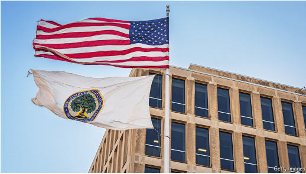

# The education department is halved overnight

*What does that mean for education in America*

halved：减半

原文：

**R**EPUBLICAN PRESIDENTIAL candidates have often promised

to abolish the Department of Education. In 1983 Ronald Reagan

said that it should be scrapped. Mitt Romney promised to make this

happen in 2012. A decade later Betsy DeVos, former secretary of

education under Mr Trump, said her department should not exist.

And Mr Trump has said he hopes that Linda McMahon, his

education secretary, will “put herself out of a job”. She is halfway

there: on March 11th the administration announced it will fire more

than 1,300 employees, cutting the workforce in half.

共和党总统候选人经常承诺废除教育部。1983年，罗纳德·里根说它应该被废弃。米特罗姆尼承诺在2012年实现这一目标。十年后，特朗普手下的前教育部长贝琪·德沃斯表示，她的部门不应该存在。特朗普曾表示，他希望自己的教育部长琳达·麦克马洪(Linda McMahon)“丢掉工作”。她已经成功了一半:3月11日，政府宣布将解雇1300多名员工，裁员一半。

学习：

scrapped：废弃；（scrap的过去式）

原文：

The Department of Education was created in 1979 by Jimmy

Carter. Mr Trump says abolishing it will send education back to the

states, but they already control most of what primary and secondary

schools do: the education department only funds about 10% of their

budgets. What, then, is it for? It plays a role in protecting the most

vulnerable students, says John King, a former education secretary

under Barack Obama, providing extra funding for poor and

disabled pupils. It manages financial aid for over 12m college

students. And it collects data, which allows states to compare

themselves to each other.

教育部是吉米·卡特于1979年创建的。特朗普表示，废除它将把教育送回各州，但他们已经控制了中小学的大部分工作:教育部只为他们的预算提供约10%的资金。那么，这是为了什么？巴拉克·奥巴马手下的前教育部长约翰·金说，它在保护最弱势学生方面发挥了作用，为贫困和残疾学生提供额外的资金。它管理着超过1200万大学生的经济资助。它收集数据，这使得各州可以相互比较。

原文：

The department also oversees civil-rights enforcement in schools, a

task Mr Trump seems keen to keep. In February the Office of Civil

Rights within the department announced investigations at five

universities for “widespread antisemitic harassment” on campus.

该部门还监督学校的民权执法，这似乎是特朗普热衷于保留的一项任务。2月，教育部下属的民权办公室宣布对五所大学进行调查，调查内容是校园内“广泛的反犹骚扰”。

学习：

antisemitic：反犹太的      

原文：

So far the cuts fall short of the full smackdown Mr Trump

promised. That may reflect political calculation: according to an

*Economist*/YouGov poll, only 17% of Americans want the

department eliminated. But this may not be the end state. Congress

could move the administration of student loans to the Treasury and

support for special education to the health department, possibly

cutting both in the process. He would then have accomplished what

Reagan did not, and add another bullet point to his list of promises

kept. ■

到目前为止，这些削减远未达到特朗普承诺的全面打击。这可能反映了政治考量：根据《经济学人》和 YouGov 的一项民调，只有 17% 的美国人希望彻底废除该部门。但这可能并非最终的目标。国会可能将学生贷款的管理移交给财政部，将特殊教育支持移交给卫生部，可能在此过程中削减这两项支出。这样他就能实现里根未能做到的目标，并为他的承诺清单增加一个新的亮点。

学习：

fall short of：达不到；不符合；未能实现预期目标；不足；缺乏          

smackdown

>
>
>**这里的 "smackdown" 意思是** **“彻底打击、彻底消除”**，通常指以强硬的方式或通过有力的措施彻底击败或消除某个问题、目标或挑战。在这段话中，"full smackdown" 表示特朗普承诺的彻底削减或消除某个部门。
>
>------
>
>**类似的用法示例如下：**
>
>- **"The team delivered a smackdown on their rivals, winning the match by a landslide."**
>   这支队伍彻底击败了对手，以压倒性的优势赢得了比赛。
>- **"He promised a smackdown of corruption in the government, vowing to dismantle the corrupt systems."**
>   他承诺彻底打击政府中的腐败，誓言拆除腐败系统。

political calculation：政治考量

## 后记

2025年3月21日23点24分于上海。

