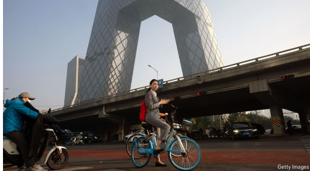

# Ageism is rampant in Chinese companies

*Never mind the middle-aged; millennials beware*

ageism：美 [ˈeɪdʒˌɪzəm] 年龄歧视；基于年龄的偏见或不平等对待

原文：

**O**N MARCH 5TH China’s prime minister, Li Qiang, in his annual

speech at the National People’s Congress (NPC), China’s rubber-

stamp parliament, promised to end “discrimination in the

workplace”. He gave no specifics but Communist Party leaders,

always alert to discontent in the workforce, have in recent years

allowed more laws to protect workers. Since 2005 local

governments have removed bans on hiring those with HIV or

hepatitis B. The first sex-discrimination lawsuit was filed in 2012,

and since 2023 companies found guilty of discrimination against

women can be fined up to 50,000 yuan ($6,900). In 2020 the first

transgender person won a discrimination case against an e

commerce firm in Beijing.

3月5日，中国总理李强在全国人民代表大会(NPC，中国的橡皮图章议会)的年度讲话中承诺要结束“工作场所的歧视”。他没有给出具体细节，但共产党领导人总是对工人的不满保持警惕，近年来允许更多法律保护工人。自2005年以来，地方政府已经取消了雇用艾滋病毒携带者或乙肝患者的禁令。第一起性别歧视诉讼是在2012年提起的，自2023年以来，被发现歧视女性的公司最高可被罚款5万元人民币(6900美元)。2020年，第一个跨性别者赢得了针对北京一家电子商务公司的歧视案。

学习：

hepatitis：美 [ˌhepəˈtaɪtɪs] 肝炎；肝脏炎症

原文：

Yet Chinese labour law still says nothing about ageism. Many firms

continue to stipulate in job ads that those over 35 need not apply. It

is known as the “curse of 35”. One delegate at this year’s NPC,

Zheng Gongcheng, argued that age limits were “wasting talent” and

should be illegal. He received a wave of support on social media.“

To be 35 is to be in your prime!” said one commenter on Weibo, a

microblog.

然而，中国劳动法仍然对年龄歧视只字未提。许多公司继续在招聘广告中规定35岁以上的人不必申请。它被称为“35的诅咒”。今年NPC的一名代表郑功成（音译）认为，年龄限制是“浪费人才”，应该是非法的。他在社交媒体上获得了一波支持。“35岁就是壮年！”微博上的一位评论者说。

学习：

stipulate：规定；明确要求；约定

原文：

Many workers, especially women, complain of the difficulty of

finding a job in their thirties. Ms Zhang is 35 and lives in the

central city of Hefei. She says she was laid off from her job in

advertising last year after a decade in the business and that it has

been very hard to find a new one, largely because of her age, which

one interviewer referred to as “awkward”. Companies seem to

doubt her ability to learn new things, she adds. “If you’re a woman

and you’re over 35 years old, you’re married, maybe you have a

kid or two…basically there are no opportunities for you,” says

Amanda Ge, who runs a recruitment agency in Shanghai.

许多工人，尤其是女性，抱怨在他们三十多岁的时候很难找到工作。张女士今年35岁，住在合肥市中心。她表示，在广告业工作了10年后，她去年被解雇了，很难找到新的工作，主要是因为她的年龄，一位采访者称她的年龄“很尴尬”。她补充道，公司似乎怀疑她学习新事物的能力。在上海经营一家招聘机构的阿曼达·葛(Amanda Ge)表示:“如果你是一名女性，年龄超过35岁，已婚，或许有一两个孩子……基本上就没有机会了。”。

学习：

recruitment agency：招聘机构

原文：

The problem began in the 1990s when local governments started

imposing age limits on recruits in an attempt to rejuvenate an

ageing bureaucracy. Companies followed suit. In 2007, a researcher

at Sichuan University examined 300,000 job openings and found

that in the city of Chengdu 70% of jobs, and in Shanghai 80%,

demanded applicants be under the age of 35. A survey conducted in

2023 by Zhaopin, a recruitment agency, found that 85% of

respondents said companies were using 35 as a cut-off.

这个问题始于20世纪90年代，当时地方政府开始对新进人员进行年龄限制，试图重振日渐老化的官僚体系。各公司纷纷效仿。2007年，四川大学的一名研究人员调查了30万个职位空缺，发现成都70%的职位要求应聘者年龄在35岁以下，上海80%的职位要求应聘者年龄在35岁以下。招聘机构智联招聘在2023年进行的一项调查发现，85%的受访者表示，公司将35岁作为截止年龄。

原文：

Younger workers can usually be paid less, and many employers

believe that older workers cannot cope with the country’s tough

“996” work culture, working from 9am to 9pm six days a week.

The “curse of 35” hangs heaviest over technology firms, which are

known for long hours.

年轻员工的工资通常较低，许多雇主认为年长员工无法适应该国严峻的“996”工作文化，即一周六天从早上9点工作到晚上9点。“35岁的诅咒”对以长时间工作著称的科技公司影响最大。

原文：

This makes China’s labour market less efficient, argue Tianlei

Huang and Yiwen Zhang of the Peterson Institute for International

Economics, an American think-tank. Firms are arbitrarily excluding

potentially valuable employees, even as China’s working-age

population shrinks and the party raises retirement ages in response.

“Unless the government takes concrete actions to address the

widespread age-based discrimination at work, raising retirement

ages will only have limited impact on keeping older workers in the

labour force,” the authors write.

美国智库彼得森国际经济研究所的黄和认为，这降低了中国劳动力市场的效率。尽管中国的劳动年龄人口在减少，党也相应地提高了退休年龄，但企业还是武断地将潜在的有价值的员工排除在外。“除非政府采取具体措施解决工作中普遍存在的基于年龄的歧视，否则提高退休年龄对留住劳动力中的老年工人只会产生有限的影响，”作者写道。

原文：

Mr Zheng’s suggestion to make ageism illegal has so far got

nowhere. But the mood may be shifting. Editorials in official media

have started to criticise ageism. Last year an official at China’s

state-run labour union suggested firms should even be subsidised to

employ middle-aged workers. In recent months some provincial

governments have raised the age limit on applicants for the civil

service by five years. Future rage may be at the “curse of 40”. ■

郑先生提出的将年龄歧视定为非法的建议至今没有任何进展。但是这种情绪可能正在转变。官方媒体的社论已经开始批评年龄歧视。去年，中国国营工会的一名官员建议，企业甚至应该得到补贴来雇佣中年工人。最近几个月，一些省级政府已经将公务员申请人的年龄限制提高了5岁。未来的愤怒可能是在“40岁的诅咒”。■

## 后记

2025年3月26日22点35分于上海。