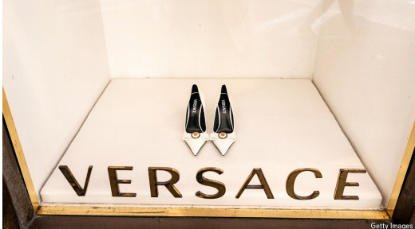

# The luxury industry is poised for a deal wave

*A proposed tie-up between Prada and Versace is just the start*

tie-up：合并

>
>
>在句子 **"The luxury industry is poised for a deal wave"** 中，**"poised"** 的意思是 **“蓄势待发；准备就绪”**，暗示奢侈品行业正处于即将发生大规模并购交易（*deal wave*）的关键时刻，具备充分的条件或趋势。  
>
>### 具体解析：
>1. **词义核心**：  
>   • **Poised**（形容词）原意是“平衡的、镇定的”，但在商业或趋势语境中，常表示 **“处于准备状态，随时可能行动”**（*ready to act*）。  
>   • 近义词：positioned（定位）、primed（准备就绪）、on the verge of（濒临）。  
>
>2. **上下文含义**：  
>   • 前文提到奢侈品行业通过收购供应商（*snapping up suppliers*）、品牌整合（*consolidation*）等方式扩张。  
>   • **"Poised for a deal wave"** 指行业已积累足够的动能（资金、市场条件、竞争压力等），**即将迎来一波并购潮**。  
>
>3. **商业用语中的典型场景**：  
>   • 描述市场、行业或公司处于重大行动（如并购、上市、转型）的前夜。  
>   • 例句：  
>     ◦ "The tech sector is poised for a wave of IPOs."（科技行业即将迎来一波IPO潮。）  
>     ◦ "Investors are poised to capitalize on the market downturn."（投资者已准备好利用市场低迷获利。）  
>
>### 与其他词的区别：
>• **Poised** 强调“蓄势待发的静态”，而 **"about to"** 更强调时间紧迫性。  
>• **"Ready"** 仅表示准备完成，而 **"poised"** 隐含客观条件成熟+主观行动意图。  
>
>在本文中，**"poised"** 精准传递了奢侈品行业**并购趋势的必然性与临近性**，暗示读者需关注后续动态。

原文：

**A** SHOPPING SPREE looks set to begin in the world of luxury.

Prada, one big-name Italian brand, is said to be in talks to buy

another, Versace. On March 13th Donatella Versace stepped down

as chief designer of the firm founded by her brother. Giorgio

Armani, the 90-year-old founder of his eponymous label, has said

he isn’t ruling out a merger as he plans for retirement. Last month

the family that owns Ferragamo, one more Italian brand, had to

reassure staff that it is not up for sale after its chief executive

abruptly left.

奢侈品世界似乎将掀起一场购物狂潮。意大利知名品牌普拉达据说正在谈判收购另一家品牌范思哲。3月13日，多娜泰拉·范思哲辞去了她哥哥创立的公司的首席设计师一职。乔治·阿玛尼，他的同名品牌90岁的创始人，说他不排除合并，因为他计划退休。上个月，又一个意大利品牌菲拉格慕(Ferragamo)的所有者家族不得不向员工保证，在其首席执行官突然离职后，该品牌不会出售。

学习：

spree：狂欢；放纵；挥霍

big-name：大牌；名人；大名鼎鼎          

eponymous：（角色）与作品标题同名的；以…的名字命名的

原文：

More tie-ups would extend a decades-long trend of consolidation.

Three luxury giants—LVMH and Kering of France and Richemont

of Switzerland—accounted for 31% of global personal-luxury

goods sales in 2023, up from 19% in 2014, according to BCG, a

consultancy. Acquisitions helped fuel that growth. Since 2000 BCG

counts at least 33 deals by the three groups. Many independent

brands are now concluding that they cannot survive alone in an

increasingly difficult market. A new wave of deals seems likely.

更多的联合将延续数十年的整合趋势。根据咨询公司BCG的数据，2023年，三大奢侈品巨头——法国的LVMH和Kering以及瑞士的Richemont占全球个人奢侈品销售额的31%,比2014年的19%有所上升。收购推动了这一增长。自2000年以来，波士顿咨询集团统计了这三家公司的至少33笔交易。许多独立品牌现在得出结论，他们无法在日益艰难的市场中独自生存。似乎有可能出现新一波交易。

学习：

tie-up：并购

>**tie-up** 在此处的意思是 **“合作；联盟；并购”**（尤指企业间的合并或战略合作），通常指公司之间通过股权收购、合资或合作协议形成的紧密关联。  
>
>具体解析：
>
>1. **上下文含义**：  
>     • 原文提到奢侈品行业长期整合（*consolidation*）的趋势，三大巨头（LVMH、Kering、Richemont）通过收购（*acquisitions*）扩大市场份额。  
>     • "More tie-ups" 指 **更多企业间的合并或合作**，可能是收购、合资或战略联盟，以应对独立品牌（*independent brands*）在激烈市场竞争中的生存压力。  
>
>2. **商业用法**：  
>     • **狭义**：企业并购（M&A）或控股收购。  
>     • **广义**：任何形式的商业合作（如联名、分销协议等），但此处更倾向 **并购**。  
>
>3. **同义词**：  
>     merger（合并）、acquisition（收购）、partnership（合伙）、alliance（联盟）。  
>
>例句参考：
>
>• "The tie-up between the two tech firms created a market leader."  
>  （这两家科技公司的合并造就了市场领导者。）  
>• "Small brands seek tie-ups with giants to secure resources."  
>  （小品牌寻求与大集团合作以获取资源。）  

原文：

The luxury business is in the midst of a painful downturn.

Weakening economic growth from America to China has led

shoppers to spend less on designer frocks, bags and heels. Luxury

sales fell by 2% in 2024, according to estimates from Bain, another

consultancy. Credit-card data collected by Citi, a bank, suggests

spending on top luxury brands in America was down by 5%, year

on year, last month.

奢侈品行业正处于痛苦的低迷期。从美国到中国，疲软的经济增长导致购物者在名牌连衣裙、包包和高跟鞋上的花费减少。根据另一家咨询公司贝恩的估计，2024年奢侈品销售额下降了2%。花旗银行收集的信用卡数据显示，上个月美国顶级奢侈品牌的消费同比下降了5%。

学习：

frocks：连衣裙；（frock的复数）

原文：

So-called aspirational brands that cater to customers who are rich

but not extraordinarily so, such as Burberry and Versace, are

struggling most. Independent labels have also been hit harder than

the big luxury groups. “This crisis moment will be an excuse for a

consolidation,” reckons Federica Levato of Bain.

所谓的有抱负的品牌，如博柏利和范思哲，迎合了富有但并不特别富有的顾客，是最挣扎的。独立品牌受到的冲击也比大型奢侈品集团更大。贝恩公司的Federica Levato认为，“这一危机时刻将成为整合的借口”。

原文：

Departing founders are fuelling deal speculation as well. Along

with Armani, Dolce & Gabbana is also in the midst of succession

planning. Small but trendy brands, including The Row, founded by

the Olsen twins, are being floated as possible acquisition targets,

too

离职的创始人也助长了交易猜测。除了阿玛尼，杜嘉班纳也在制定接班人计划。小而时尚的品牌，包括奥尔森双胞胎创立的Row，也成为了潜在的收购目标

学习：

trendy：时尚的；时髦的；流行的

float

>在商业和金融语境中，**"float"** 在此处的意思是 **“将…列入考虑；提出（建议或可能性）”**，尤其指将某公司或品牌作为潜在的收购目标（*acquisition target*）进行讨论或试探市场意向。  
>
>### 具体解析：
>1. **上下文含义**：  
>     • 原文提到时尚行业创始人的离任（如Armani、Dolce & Gabbana的接班计划）引发了并购猜测。  
>     • "Small but trendy brands... are being floated as possible acquisition targets" 指 **这些品牌被市场或业内人士列为潜在的收购对象**，可能是媒体猜测、投行推荐，或卖方主动释放信号试探买家兴趣。  
>
>2. **商业/金融用法**：  
>     • **Float an idea/target**：非正式提出某个想法或选项供讨论（类似中文“放风”“放消息”）。  
>     • 在并购中，常通过媒体或中介“放消息”来吸引潜在买家或评估市场反应。  
>
>3. **其他常见释义**（需结合语境排除）：  
>     • 上市（*go public*）：如 "The company floated on the stock market."（该公司上市。）  
>     • 浮动（字面意义）：如货币汇率浮动（*currency float*）。  
>
>### 例句参考：
>• "Rumors are floating that the brand might be sold to LVMH."  
>  （有传言称该品牌可能被LVMH收购。）  
>• "The investment bank floated several startups as potential targets for the tech giant."  
>  （投行提出了几家初创公司作为该科技巨头的潜在收购目标。）  
>
>在本文中，"floated" 更强调 **市场或行业内部的试探性讨论**，而非正式交易流程。

原文：

Scale creates big advantages in the luxury business, notes Guia

Ricci of BCG. It brings bargaining power when it comes to

advertising and property. It also attracts talent: up-and-coming

executives and starry designers join luxury conglomerates knowing

that it will provide them an opportunity to work at multiple brands.

波士顿咨询公司的阿桂·里奇指出，规模在奢侈品行业创造了巨大的优势。当涉及到广告和财产时，它带来了讨价还价的能力。它还吸引人才:崭露头角的高管和明星设计师加入奢侈品集团，因为他们知道这将为他们提供在多个品牌工作的机会。

学习：

bargaining power：议价能力；谈判力；谈判能力          

up-and-coming：有前途的；积极进取的；崭露头角的；前景看好的          

原文：

Competition authorities might also abandon their recent hostility to

deals. Last year America’s Federal Trade Commission blocked the

acquisition of Capri, which currently owns Versace, by Tapestry,

which owns Coach and Kate Spade. But the Trump administration

has signalled it will be more open to mergers. Europe, too, may be

willing to allow deals that further strengthen one of the few

industries it dominates globally.

竞争主管部门也可能放弃他们最近对交易的敌意。去年，美国美国联邦贸易委员会公司阻止了Tapestry公司收购目前拥有范思哲的Capri公司，Tapestry公司拥有蔻驰和凯特·斯派德。但特朗普政府已经表示，它将对合并更加开放。欧洲也可能愿意允许进一步加强其在全球占主导地位的少数行业之一的交易。

原文：

The luxury business will also continue consolidating in other ways.

In recent years brands have been snapping up their suppliers. In

2023 LVMH bought Grupo Verdeveleno, a Spanish tannery. Chanel

has paired up with Brunello Cucinelli and Prada with Ermenegildo

Zegna Group to buy stakes in Italian wool producers.

奢侈品业务也将继续以其他方式进行整合。近年来，品牌一直在抢购他们的供应商。2023年，LVMH收购了西班牙制革厂Grupo Verdeveleno。Chanelhas与Brunello Cucinelli合作，普拉达与Ermenegildo Zegna集团合作，购买意大利羊毛生产商的股份。

学习：

tannery：制革厂；皮革厂；鞣皮厂

>**"Snap up"** 在这里的意思是 **“迅速收购；抢购”**，强调快速果断地买下某公司或资产（通常是为了抢占机会或防止竞争对手得手）。  
>
>### 具体解析：
>1. **上下文含义**：  
>   • 原文提到奢侈品行业通过收购供应商（如皮革厂、羊毛生产商）进行垂直整合（*consolidating*）。  
>   • "Brands have been snapping up their suppliers" 指 **奢侈品牌迅速收购上游供应商**（如LVMH买下西班牙皮革厂），以控制供应链、确保原材料质量或降低成本。  
>
>2. **核心语义**：  
>   • **Snap up** = 迅速抓住机会买下（隐含“稀缺性”或“竞争激烈”）。  
>   • 近义词：acquire quickly（快速收购）、grab（抢购）、seize（抢占）。  
>
>3. **商业场景中的典型用法**：  
>   • 收购竞争对手或关键资产（如技术、供应链）。  
>   • 消费者抢购限量商品（如 "Shoppers snapped up the new iPhone."）。  
>
>### 例句参考：
>• "Luxury groups are snapping up niche perfumers to expand their portfolios."  
>  （奢侈品集团正快速收购小众香水品牌以扩充产品线。）  
>• "The tech giant snapped up the AI startup before its IPO."  
>  （这家科技巨头抢在该AI初创公司上市前将其收购。）  
>
>在本文中，"snap up" 突出了奢侈品行业 **对供应链企业的快速布局**，反映其战略主动性。

原文：

Such deals give luxury firms greater control over their supply

chains at a time when these are under heightened scrutiny. Italian

authorities have recently been investigating labour exploitation in

the country’s fashion industry. One popular Instagrammer, Tanner

Leatherstein, has made his name by cutting up luxury bags to show

how poorly some of them are made. In a survey conducted by

*Vogue*, a fashion magazine, in January, the most common

explanation shoppers gave for cutting spending on luxury goods

was that they no longer seemed worth the price. That will surely

make the industry’s cashmere-clad bosses wince. ■

在供应链受到严格审查之际，这类交易让奢侈品公司对供应链有了更大的控制权。意大利当局最近一直在调查该国时装业的劳工剥削问题。坦纳·莱瑟斯坦(Tanner Leatherstein)是一位受欢迎的Instagrammer，他因切割奢侈品包包以展示其中一些包包的制作质量而出名。时尚杂志《Vogue》在一月份进行的一项调查中，购物者对削减奢侈品支出给出的最常见的解释是，它们似乎不再值得这个价格。这肯定会让这个行业的老板们畏缩不前。■

学习：

cashmere：美 [ˈkæʒmɪr] 羊绒；山羊绒；羊绒制品

wince：美 [wɪns] 畏缩；（不由自主地）退缩；畏惧

>
>
>**"Wince"** 在这里的意思是 **（因尴尬、羞愧或轻微疼痛而）皱眉；退缩；感到不自在**，形象地描述了奢侈品行业高管们面对消费者质疑时的**窘迫或不安反应**。  
>
>### 具体解析：
>1. **词义核心**：  
>   • **Wince** 通常指因突然的疼痛、不适或心理上的尴尬而**下意识地短暂皱眉或身体退缩**（比如打针时的反应）。  
>   • 在本文中，是一种**隐喻用法**，并非真的身体疼痛，而是心理上的“刺痛感”。  
>
>2. **上下文含义**：  
>   • 前文提到消费者开始认为奢侈品**不值高价**（*no longer seemed worth the price*），并揭露行业问题（剥削劳工、质量差）。  
>   • **"Make the bosses wince"** 指这些负面消息让奢侈品牌的高管们感到**难堪、压力或危机感**，仿佛被“戳中痛处”。  
>
>3. **修辞效果**：  
>   • 用**生理反应（wince）**比喻心理不适，生动刻画了高管们面对市场批评时的**被动与尴尬**。  
>   • 与 **"cashmere-clad"（养尊处优）** 形成反差，暗示他们习惯了舒适圈，如今却被现实“刺痛”。  
>
>### 例句参考：
>• "The CEO winced when the reporter questioned the company's ethical practices."  
>  （当记者质疑公司的道德问题时，CEO露出了尴尬的表情。）  
>• "Bad reviews of the new product made the marketing team wince."  
>  （新产品的差评让营销团队感到难堪。）  
>
>在本文中，**"wince"** 强化了奢侈品行业高管与消费者之间的**矛盾**，暗示他们必须正视问题，否则将面临更大的市场危机。

Cashmere-clad

>**"Cashmere-clad"** 是一个复合形容词，字面意思是 **“穿着羊绒的”**，但在此处具有更深的隐喻含义，用来**象征奢侈品行业高管的奢华生活方式和精英形象**。  
>
>### 具体解析：
>1. **字面意思**：  
>   • **Cashmere**（羊绒）是一种昂贵、柔软的高端面料，常用于制作奢侈服装。  
>   • **Clad**（动词clothe的过去分词）意为“穿着……的”。  
>   • 组合后直译为“穿着羊绒的”，但实际是**借代手法**，指代奢侈品行业的高管或精英阶层。  
>
>2. **上下文含义**：  
>   • 前文提到消费者开始质疑奢侈品的性价比（*no longer seemed worth the price*），并揭露行业问题（如供应链剥削、质量不佳）。  
>   • **"Cashmere-clad bosses"** 暗指那些**身处高位、享受高利润却可能忽视消费者诉求的奢侈品公司高管**，带有轻微讽刺意味——他们穿着昂贵的羊绒，却对市场变化感到“刺痛”（*wince*）。  
>
>3. **修辞效果**：  
>   • 通过**物质象征（羊绒）**突出行业高管的财富与特权。  
>   • 与消费者削减开支的行为形成对比，暗示高管们可能脱离实际。  
>
>### 类似表达：
>• **"Silk-suited executives"**（穿着丝绸西装的高管）——同样用服饰象征阶层。  
>• **"Ivory-tower leaders"**（象牙塔中的领导者）——强调脱离现实。  
>
>### 例句参考：
>• "The cashmere-clad elite seemed oblivious to the economic struggles of ordinary consumers."  
>  （这些身着羊绒的精英似乎对普通消费者的经济困境视而不见。）  
>
>在本文中，**"cashmere-clad bosses wince"** 生动地描绘了奢侈品高管因消费者觉醒而感到不安的画面，强化了文章的批判视角。

## 后记

2025年3月28日23点05分于上海。