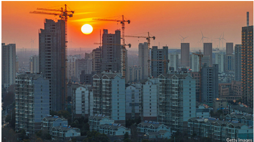

# Estate agents in China are trying everything to sell flats

*You can place your deposit in bushels of wheat or strings of garlic*

estate agents：房地产经纪人

bushels：美 [ˈbʊʃlz] 大量；（bushel的复数）

garlic：蒜；大蒜；蒜头

deposit：美 [dɪˈpɑːzɪt] 存款

>
>
>这第二句话 **"You can place your deposit in bushels of wheat or strings of garlic"**（“你可以用几蒲式耳小麦或几串大蒜来付定金”）是一种**夸张的讽刺手法**，目的是暗指中国房产中介为了卖房已经“无所不用其极”，甚至到了接受**非现金支付**或**以物易物**的荒诞地步。  
>
>具体解析：
>
>1. **背景关联**：  
>   • 标题提到中国房产中介“用尽一切手段卖房”（*trying everything*），而这句话通过虚构的极端例子（用农产品抵定金）来强化这一主题。  
>   • 中国部分三四线城市确实出现过“大蒜换房”“小麦换房”等营销活动（如2022年河南房企的促销），但这里用**更夸张的表述**（*bushels/strings*）突出荒诞性。  
>
>2. **修辞意图**：  
>   • **讽刺中介的 desperation（ desperation）**：暗示市场低迷时，中介甚至接受毫无流动性的物品作为定金，凸显销售困境。  
>   • **暗示买方市场**：买房者议价权可能高到能用非现金方式交易，反衬房产滞销。  
>
>3. **文化隐喻**：  
>   • **大蒜/小麦**是中国农村常见的农产品，选择这些物品进一步隐喻：  
>     ◦ 开发商/中介在向**农民或低收入群体**推销（即使他们并非传统购房主力）。  
>     ◦ 房地产去库存压力已从城市蔓延到农村。  
>
>类似案例：
>
>• 2022年河南建业地产曾推出“大蒜换房”（5元/斤抵首付），江苏有“西瓜换房”，但均被叫停。  
>• 这类活动本质是**变相降价**（通过农产品折现补贴房款），但文章用更极端的说法增强戏剧效果。  
>
>翻译建议：  
>
>若需保留反讽语气，可译为：  
>“定金甚至能用几斗麦子或几串大蒜支付”（中文语境中“斗”“串”更符合传统计量单位）。  
>
>这句话的核心是**用荒诞的支付方式，讽刺房产中介的“ desperation”和市场冷清**，而非描述真实交易规则。

原文：

**O**N THE LIST of professions that are currently flourishing in

China, estate agents do not come high up. Houses were once easy

to sell, the surest investment available. But as a result of a four-year

slump in the market, millions of homes now sit unsold. Some

already paid-for properties are not even getting built. New home

starts fell by almost 30% in the first two months of this year,

compared with a year earlier. As of February, average new home

prices had fallen for 21 months in a row.

在目前中国蓬勃发展的职业名单上，房地产经纪人并不靠前。房子曾经很容易出售，是最可靠的投资。但由于市场持续四年的低迷，现在有数百万套房屋未售出。一些已经付款的房产甚至还没有开始建设。与一年前相比，今年头两个月新屋开工下降了近30%。截至2月份，平均新房价格已经连续21个月下跌。

学习：

surest

>
>
>在原文中，**"sure"** 和 **"surest"** 的含义与中文的 **“稳妥的；最可靠的”** 对应，强调房地产曾经被视为**风险极低、收益稳定的投资选择**。以下是具体解析：
>
>---
>
>1. **词义与语境分析**
>
>• **"sure"**（形容词）：  
>  • 基本义：确定的、有把握的（*certain*）。  
>  • **在投资语境中**：引申为 **“稳妥的、低风险的”**（*reliable, low-risk*）。  
>  • 例句原句：  
>    > *Houses were once easy to sell, the surest investment available.*  
>    （房子曾经很容易卖掉，是（当时）最稳妥的投资选择。）  
>
>• **"surest"**（最高级）：  
>  • 强调在众多投资选项中，房地产的**可靠性最高**，类似中文“最稳赚不赔的”。
>
>---
>
>2. **为什么用"surest"形容房地产？**
>
>• **历史背景**：  
>  中国过去几十年城市化进程中，房价长期上涨，购房几乎被视为**“稳赚不赔”**的资产保值手段（类似“买房抗通胀”的普遍认知）。  
>• **对比现状**：  
>  后文提到市场连续低迷（*four-year slump*）、房价下跌（*fallen for 21 months*），与曾经的“surest”形成强烈反差，突出市场转折。
>
>---
>
>3. **与其他近义词的区别**
>
>• **Safe**：侧重“安全性”（如规避风险），但未必强调收益。  
>• **Guaranteed**：暗示“绝对保证”（但投资通常无绝对保障），语气过强。  
>• **Sure** 在此处更贴切，因为它包含：  
>  • 主观信心（人们*相信*房产可靠）  
>  • 客观趋势（过去事实支持这一认知）  
>
>---
>
>4. **翻译建议**
>
>• 直译：*the surest investment* → **“最稳妥的投资”**  
>• 意译（根据中文习惯）：  
>  • “最稳赚不赔的投资”  
>  • “过去公认最保险的投资标的”  
>
>---
>
>总结
>
>这里的 **"surest"** 并非字面“最确定的”，而是结合投资语境，传递 **“最可靠、风险最低”** 的隐含意义，同时与后文的市场衰败形成对比，强化文章对房地产行业转折的论述。

原文：

Around a tenth of estate agents in the biggest Chinese cities have

closed since 2021, according to industry estimates. The decline has

been even sharper in small towns. Yanjiao, just outside Beijing, has

seen hundreds shut, says one survivor. Another says his income has

fallen by half in three years. So perhaps some of the wilder antics

of those still trying to shift flats are understandable.

据行业估计，自2021年以来，中国最大城市约有十分之一的房地产中介已经关闭。小城镇的下降幅度更大。一名幸存者表示，就在北京郊外的燕郊，已经有数百家房产中介关闭。另一个人说他的收入在三年内下降了一半。因此，那些仍然试图换房子的人的一些疯狂举动或许是可以理解的。

学习：

antics：滑稽动作；古怪行为；愚蠢的举止

原文：

In recent months 31 men in the southern city of Huizhou bought

flats at the request of their girlfriends, perhaps thinking that they

had found “the one”. They then discovered that their girlfriends

were estate agents trying to sell those apartments and were not

interested in marriage. Authorities launched an investigation,

telling local media that 15 women, all at the same firm, were

behind the scheme and had used a dating app to find their targets.

The incident is probably “just the tip of the iceberg”, warned a

newspaper run by China’s housing ministry on March 24th.

最近几个月，南方城市惠州的31名男子应其女友的要求购买了房子，或许他们认为自己找到了“另一半”。他们随后发现，他们的女朋友是试图出售这些公寓的房地产经纪人，对婚姻不感兴趣。当局展开了调查，告诉当地媒体，同一家公司的15名女性是该计划的幕后黑手，她们使用一款约会应用程序来寻找目标。3月24日，中国住房部主办的一家报纸警告说，这一事件可能只是“冰山一角”。

原文：

Some estate agents are offering valuable inducements. Last year a

firm in Zhejiang province said it would give out a 10-gram gold bar

(worth around $1,000) for each house it sold. A Beijing-based

company promised to throw in a holiday home in the seaside city

of Yantai for anyone who paid for an apartment in the capital with

cash. Other firms have offered everything from iPhones to stakes in

a private-jet company.

一些房地产经纪人正在提供有价值的优惠条件。去年，浙江省的一家公司表示，每卖出一套房子，就会赠送一根10克的金条(价值约1000美元)。一家总部位于北京的公司承诺，只要在首都用现金买房，就可以在海滨城市烟台免费获得一处度假屋。其他公司提供了从iPhones到私人飞机公司股份的条件。

学习：

gold bar：金条

inducement： 促销手段

throw in：额外赠送

>
>
>**1. inducement 的含义**
>
>**inducement**（名词）在商业和营销语境中，指 **“诱因；激励手段”**，即为了吸引顾客或促成交易而提供的额外好处或奖励。  
>• **中文释义**：促销赠品、优惠条件、激励措施  
>• **英语音标**：/ɪnˈdjuːsmənt/（英式）或 /ɪnˈduːsmənt/（美式）  
>• **例句解析**：  
>  > *"Some estate agents are offering valuable inducements."*  
>  > （一些房产中介正在提供诱人的促销手段。）  
>  > • 这里的 **inducements** 指后文提到的 **金条、度假房、iPhone 等赠品**，目的是刺激购房需求。  
>
>**近义词**：  
>• incentive（激励）  
>• perk（额外福利）  
>• sweetener（甜头，常用于商业谈判）  
>
>---
>
>**2. throw in 的含义**
>
>**throw in**（短语动词）在此处指 **“免费赠送；额外附赠”**，通常用于促销或交易中，表示在主要商品之外再提供附加福利。  
>• **中文释义**：搭送、附赠  
>• **英语音标**：/θrəʊ ɪn/  
>• **例句解析**：  
>
>  > *"A Beijing-based company promised to throw in a holiday home in Yantai..."*  
>  > （北京的一家公司承诺，若用现金购房，将附赠烟台的一套度假房。）  
>  > • **throw in** 强调这是额外的优惠，不属于原本的交易条件。  
>
>**常见搭配**：  
>• *throw in a free gift*（免费赠送礼品）  
>• *throw in a bonus*（额外附赠奖励）  
>
>---
>
>**3. 整段话的深层含义**
>
>• **inducements** 和 **throw in** 都表明，由于中国房地产市场低迷，房产中介不得不**用高价值赠品吸引买家**，甚至到了夸张的地步（如送金条、度假房）。  
>• 这种营销手段反映了：  
>  • **买方市场**（供大于求，买家占主导）  
>  • **去库存压力**（开发商急需回笼资金）  
>  • **行业 desperation**（中介“无所不用其极”）  
>
>---
>
>**4. 翻译建议**
>
>• **inducements** → **“促销手段”** / **“诱人赠品”**  
>• **throw in** → **“附赠”** / **“额外赠送”**  
>• 例句完整翻译：  
>  > *“一些中介提供诱人的促销手段。比如浙江某公司承诺，每卖出一套房就赠送一根10克金条（价值约1000美元）；北京某公司则对现金购房者附赠烟台的一套度假房……”*  
>
>---
>
>**总结**
>
>• **inducement** = 刺激消费的额外奖励（如金条、iPhone）  
>• **throw in** = 交易中“白送”的东西（如度假房）  
>两者共同凸显了当前中国房地产市场的**艰难处境**和**激进营销策略**。

原文：

Another tactic is to slash downpayments. A developer in the

southern city of Zhongshan allowed a deposit of just 9.90 yuan

($1.30) for some flats. Developers in the agricultural province of

Henan permitted farmers to put down wheat or other crops as a

deposit. In 2022 Central China Group, one such developer, ended

up with 430 tonnes of garlic after selling 30 apartments, according

to local media reports.

另一个策略是大幅削减首付。南方城市中山的一家开发商允许某些房子的押金仅为人民币9.90元(合1.30美元)。农业省份河南的开发商允许农民交付小麦或其他作物作为保证金。据当地媒体报道，2022年，华中集团(Central China Group)在出售30套公寓后，最终获得了430吨大蒜。

学习：

downpayment：首付

deposit：押金；定金；保证金

>
>
>**1. downpayment（首付款）**
>
>**downpayment**（名词）在房地产交易中指 **“首付款”**，即购房者在签订合同或办理贷款时，**预先支付的一部分房款**（剩余部分通常通过银行贷款支付）。  
>• **中文释义**：首付、首期款  
>• **英语音标**：/ˈdaʊnpeɪmənt/  
>• **关键特点**：  
>  • 通常是总房款的 **20%~30%**（不同国家/地区政策不同）。  
>  • 降低银行风险，证明买家有还款能力。  
>• **例句解析**：  
>  > *"Another tactic is to slash downpayments. A developer... allowed a deposit of just 9.90 yuan ($1.30) for some flats."*  
>  > （另一种策略是大幅降低首付。某开发商甚至允许部分公寓的首付低至9.9元人民币。）  
>  > • 这里 **slash downpayments** 指开发商通过**极低首付**吸引资金不足的买家，反映市场低迷。  
>
>**常见搭配**：  
>• *make a downpayment*（支付首付）  
>• *low downpayment*（低首付）  
>
>---
>
>**2. deposit（定金）**
>
>**deposit**（名词）在交易中指 **“定金”**，即买家在**初步达成意向后预付的一笔小额资金**，用于锁定交易（若违约可能被没收）。  
>• **中文释义**：定金、押金  
>• **英语音标**：/dɪˈpɒzɪt/（英式）或 /dɪˈpɑːzɪt/（美式）  
>• **与 downpayment 的区别**：  
>| **术语**        | **功能**               | **金额比例**      | **是否可退**             |
>| --------------- | ---------------------- | ----------------- | ------------------------ |
>| **deposit**     | 预订房产，防止卖家反悔 | 极小（如1%~5%）   | 通常不可退（若买家违约） |
>| **downpayment** | 正式购房的首期款项     | 较大（如20%~30%） | 属于房款一部分，不退不扣 |
>
>• **例句解析**：  
>  > *"Developers in Henan permitted farmers to put down wheat or other crops as a deposit."*  
>  > （河南的开发商允许农民用小麦或其他农作物抵作定金。）  
>  > • 这里的 **deposit** 是购房初期象征性支付的定金，但用实物（小麦、大蒜）替代现金，凸显市场困境。  
>
>**常见搭配**：  
>• *pay a deposit*（支付定金）  
>• *refundable deposit*（可退还押金）  
>
>---
>
>**3. 整段话的深层含义**
>
>• **downpayment 和 deposit 的异常操作**（如9.9元首付、大蒜抵定金）表明：  
>  1. **开发商资金链紧张**：急需快速回款，不惜降低门槛。  
>  2. **瞄准低收入群体**：农民或刚需买家可能无法承担传统首付。  
>  3. **政策擦边球**：中国部分城市规定首付比例下限（如20%），但开发商通过“定金”名义绕过限制。  
>
>---
>
>**4. 翻译建议**
>
>• **downpayment** → **“首付款”**（正式购房款的一部分）  
>• **deposit** → **“定金”**（预订性质的押金）  
>• 例句完整翻译：  
>  > *“另一种策略是削减首付。中山市某开发商甚至允许部分公寓的首付低至9.9元人民币；河南的开发商则接受农民用小麦或大蒜等农作物抵作定金……”*  
>
>---
>
>**总结**
>
>• **downpayment** = 购房首付款（长期贷款的一部分）  
>• **deposit** = 预订定金（短期担保金，可能用实物支付）  
>两者共同反映了中国房地产市场的**促销乱象**和**去库存压力**。

原文：

Brokers are changing their pitch. Livestreaming is now a popular

way to sell houses, with 500,000 agents on Douyin, the Chinese

version of TikTok. Some sing, dance and do comedy sketches from

unsold homes. In March, “U-bro”, a robot with a camera that

shows houses and answers questions, began livestreaming in the

city of Wuhan.

房产中介正在改变推销策略。直播卖房如今已成为流行方式，抖音（中国版TikTok）上约有50万名房产中介。一些人在未售出的房子里唱歌、跳舞、表演喜剧短剧来吸引买家。今年3月，武汉还推出了‘U-bro’——一款能展示房屋并回答问题的直播机器人。

学习：

pitch：推销话术，营销策略

comedy sketches：喜剧小品

do comedy sketches：表演喜剧小品

>
>
>**1. pitch 的含义**
>
>**pitch**（名词）在此处指 **“推销话术；营销策略”**，即房产中介为吸引买家而采用的宣传方式或销售手段。  
>• **中文释义**：推销方式、销售策略  
>• **英语音标**：/pɪtʃ/  
>• **例句解析**：  
>  > *"Brokers are changing their pitch."*  
>  > （房产中介正在改变他们的推销策略。）  
>  > • 后文提到的 **直播卖房、唱歌跳舞、喜剧短剧** 等都是新的 **pitch**（营销手段）。  
>
>**常见搭配**：  
>• *sales pitch*（销售话术）  
>• *elevator pitch*（简短推销）  
>
>---
>
>**2. comedy sketch 的含义**
>
>**comedy sketch**（名词）指 **“喜剧短剧”**，通常是一种简短、幽默的表演形式，用于娱乐或吸引观众。  
>• **中文释义**：喜剧小品、搞笑短剧  
>• **英语音标**：/ˈkɒmədi skɛtʃ/  
>• **例句解析**：  
>  > *"Some sing, dance and do comedy sketches from unsold homes."*  
>  > （一些中介在未售出的房子里唱歌、跳舞、表演喜剧短剧。）  
>  > • 这里的 **comedy sketches** 是中介为了吸引直播观众而设计的搞笑内容，类似短视频平台的娱乐形式。  
>
>**近义词**：  
>• skit（幽默短剧）  
>• parody（恶搞片段）  
>
>---
>
>**3. 深层含义**
>
>• **pitch 的变化**：反映传统线下销售（如发传单、电话推销）转向**娱乐化、数字化营销**（直播、短视频）。  
>• **comedy sketches 的作用**：通过轻松内容吸引流量，但可能弱化房产交易的严肃性。  
>• **U-bro 机器人**：显示行业尝试用**AI技术**降低成本（替代人工带看）。  
>
>---
>
>**总结**
>
>• **pitch** = 销售策略（此处指直播、搞笑内容等新手段）  
>• **comedy sketch** = 喜剧短剧（中介用来吸引观众的表演）  
>整段话揭示了中国房地产中介在低迷市场中** desperate（拼命）创新营销方式**的现象。

原文：

Government officials are trying to help by easing developers’

financing woes and encouraging people to trade in their old homes

for new ones. But JPMorgan Chase, a bank, expects that in 2025

Chinese property developers will account for two-thirds of Asia’s

defaults. Many analysts do not expect a recovery in the Chinese

market until 2026.

政府官员正试图帮助缓解开发商的融资困境，并鼓励人们以旧换新。但是摩根大通银行预计，到2025年，中国房地产开发商将占亚洲违约的三分之二。许多分析师预计中国市场要到2026年才会复苏。

学习：

woe：困境

原文：

If there is one group that can see a silver lining, it may be young

men. The social pressure for them to own a home before women

will consider them husband material is huge. But with prices in

Beijing in late 2019 at 44 times average salaries, such a purchase

has long proved out of reach for many. That ratio is now down to a

mere 32 times. Some young men, if they can work out which of the

women are not just estate agents in disguise, may be looking to

snap up a bargain and pop the question. ■

如果有一个群体可以看到一线希望，那可能是年轻人。在女性认为她们是丈夫之前，她们必须拥有一个家，这种社会压力是巨大的。但由于2019年底北京的房价是平均工资的44倍，这样的购买对许多人来说一直遥不可及。这个比率现在已经下降到只有32倍。一些年轻男性，如果他们能分辨出哪些女人不仅仅是伪装的房地产经纪人，他们可能会抢购便宜房子并求婚。■

学习：

silver lining：积极的一面；好的一面；困难中的一线希望；云开见日          

pop the question：求婚；提出结婚；开口求婚          

snap up：抢购；增长；争夺          

## 后记

2025年3月29日23点08分于上海。

