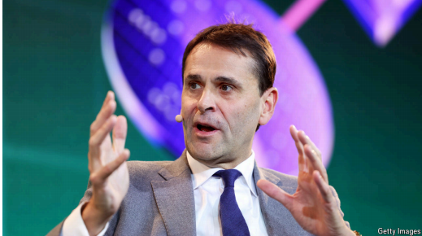
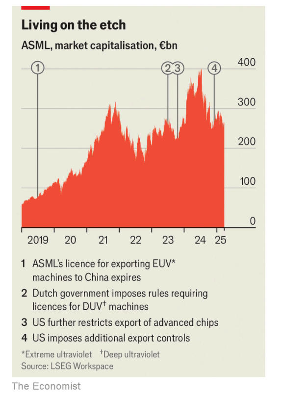

# ASML’s boss has a warning for Europe

*Christophe Fouquet says the continent’s champions could move elsewhere if they are not better protected*

原文：

**A**SML IS IN an enviable position. The Dutch company is the only

manufacturer of equipment that can reliably etch the most

advanced semiconductors, as required for everything from

artificial-intelligence (AI) accelerators to smartphone chips. Even

for less sophisticated processors—the types found in cars and

tumble dryers—its machines account for over 90% of global sales.

No rival comes close.

阿斯麦处于令人羡慕的地位。这家荷兰公司是唯一一家能够可靠蚀刻最先进半导体的设备制造商，从人工智能(AI)加速器到智能手机芯片，一切都需要这种设备。即使对于不太复杂的处理器——在汽车和滚筒式干衣机中发现的类型——它的机器也占全球销售额的90%以上。没有对手能与之匹敌。

学习：

etch：美 [etʃ] 蚀刻；铭刻；凿出（玻璃、金属等上的文字或图画）

tumble dryers：滚筒式烘干机      

原文：

The firm’s dominance has not spared it from problems, however. In

an attempt to thwart China’s AI ambitions, America has barred

ASML from selling its most advanced equipment to Chinese

companies. And demand for ASML’s more basic tools has

weakened, too. The firm was forced to cut its sales forecast for

2025 in October, causing its share price to drop by a fifth.

Nevertheless, in a recent interview with *The Economist,* Christophe

Fouquet, ASML’s boss, struck a bullish tone—and took aim at

European policymakers.

然而，该公司的主导地位并没有使其免于问题。为了挫败中国的人工智能野心，美国已经禁止阿斯麦向中国公司出售其最先进的设备。对阿斯麦更基本工具的需求也减弱了。该公司被迫在10月份下调了2025年的销售预期，导致其股价下跌五分之一。然而，在最近接受《经济学人》采访时，阿斯麦的老板克里斯托夫·芙凯语气乐观，并把矛头指向了欧洲的政策制定者。

学习：

thwart：美 [θwɔːrt] 阻挠；反对；挫败；妨碍；

bullish：对未来有信心的；积极向上的

原文：

ASML faces commercial difficulties on a number of fronts.

Chinese overcapacity has produced a chip glut, lowering demand

for its more basic machines elsewhere. Meanwhile, the firm’s latest

and most advanced extreme-ultraviolet (EUV) machines, which

cost more than $350m each, have received a mixed response from

chipmakers. These systems can cram processing power into ever

smaller areas, as is essential for making cutting-edge chips. Yet not

all customers are convinced the precision justifies the price.

According to SemiAnalysis, a research firm, similar results can be

achieved using older tools, albeit with a fiddlier manufacturing

process.

ASML在多个商业领域遭遇困境。中国产能过剩导致芯片供过于求，降低了其他市场对其基础型号光刻机的需求。与此同时，该公司最新、最先进的极紫外（EUV）光刻机（每台售价超3.5亿美元）在芯片制造商中反响不一。这些设备能将运算能力压缩至更小空间，对制造尖端芯片至关重要。但并非所有客户都认为其精度值得如此高价。研究机构SemiAnalysis指出，使用旧设备配合更复杂的制造工艺，也能达到类似效果。

学习：

cram：填塞；塞满；挤进；把…塞进；

fiddly：繁琐的；难处理的；费事的；难弄的

>
>
>**1. "fronts" 的含义**
>
>**fronts**（名词，复数）在此处指 **“方面；领域”**，表示ASML公司在多个商业领域或方向上遇到困难。  
>• **中文释义**：战线、领域、方面  
>• **英语音标**：/frʌnts/  
>• **例句解析**：  
>  > *"ASML faces commercial difficulties on a number of fronts."*  
>  > （ASML在多个商业领域面临困境。）  
>  > • 后文提到的 **中国产能过剩、高端EUV光刻机市场反应不一** 都是不同的 **fronts**（问题领域）。  
>
>**常见搭配**：  
>• *on all fronts*（在各方面）  
>• *economic front*（经济领域）  
>
>---
>
>**2. "mixed" 的含义**
>
>**mixed**（形容词）指 **“好坏参半的；褒贬不一的”**，表示市场对ASML最新EUV光刻机的反应既有支持也有质疑。  
>• **中文释义**：混合的、复杂的（此处指评价不一）  
>• **英语音标**：/mɪkst/  
>• **例句解析**：  
>  > *"The firm’s latest EUV machines... have received a mixed response from chipmakers."*  
>  > （该公司最新的EUV光刻机……在芯片制造商中反响不一。）  
>  > • **mixed response** 说明部分客户认可其技术，但另一些认为价格过高或性价比不足。  
>
>**近义词**：  
>• divided（分歧的）  
>• ambivalent（矛盾的）  
>
>
>
>---
>
>**深层含义**
>
>• **fronts** 的困境：  
>  • **中国产能过剩** → 基础光刻机需求下降  
>  • **高端EUV市场** → 客户对性价比存疑  
>• **mixed response** 的原因：  
>  • **支持方**：EUV技术是制造3nm/2nm芯片的唯一选择。  
>  • **反对方**：旧设备通过工艺调整可替代部分功能，且成本更低。  
>
>---
>
>**总结**
>
>• **fronts** = 商业领域或问题方向（此处指市场需求和技术接受度）  
>• **mixed** = 褒贬不一（指市场对EUV光刻机的矛盾态度）  
>整段话揭示了ASML在**高低端市场同时承压**的现状，反映全球芯片行业的技术与成本博弈。

原文：

The market for such equipment is inherently limited. Only a

handful of companies have the know-how and spending power to

deploy it. Although TSMC, a Taiwanese chipmaker and ASML’s

biggest customer, is pressing ahead with new American and

Taiwanese plants, Intel and Samsung have recently lowered their

capital spending because of financial difficulties. Still, Mr Fouquet

is upbeat about ASML’s commercial prospects. He expects AI

advances to prompt chipmakers to adopt the latest EUV machines.

这种设备的市场本来就有限。只有少数公司有技术和财力来部署它。尽管台湾芯片制造商、阿斯麦最大的客户台积电正在加紧建设美国和台湾的新工厂，但由于财务困难，英特尔和三星最近已经降低了资本支出。不过，芙凯对阿斯麦的商业前景持乐观态度。他预计人工智能的进步将促使芯片制造商采用最新的EUV机器。

学习：

upbeat: 乐观的；积极向上的；振奋人心的；

原文：

What troubles him more is geopolitics. The pressure on ASML

began to build in 2019, when the Dutch government, at America’s

urging, barred the company from exporting its advanced EUV

machines to China. Widening restrictions, enforced by both the

American and Dutch authorities, subsequently extended to some

older deep-ultraviolet machines. Even under Mr Biden the rationale

for restrictions was not always clear, Mr Fouquet says. President

Donald Trump’s second term brings the threat of still tighter

controls, and the near-guarantee of more uncertainty. As a

consequence, planning has become much more difficult for ASML.

更让他烦恼的是地缘政治。阿斯麦面临的压力始于2019年，当时荷兰政府在美国的敦促下，禁止该公司向中国出口其先进的EUV机器。由美国和荷兰当局实施的更广泛的限制，随后扩展到一些老式的深紫外线机器。芙凯说，即使在拜登先生的领导下，限制的理由也不总是很清楚。唐纳德·特朗普(Donald Trump)总统的第二个任期带来了更严格控制的威胁，以及更多不确定性的近乎保证。因此，对阿斯麦来说，规划变得更加困难。

原文：

That is why Mr Fouquet thinks that European politicians and

policymakers should be doing more to help his company. With its

head office on the outskirts of Eindhoven, ASML is Europe’s only

firm with something approaching a monopoly in a critical industry,

making it strategically important. Referring to the Dutch

government’s willingness to follow America’s lead on export bans,

Mr Fouquet says that Europe must “decide for itself what it wants”

and “should not be dictated to by anyone else”. He would like the

continent’s officials to support their world-leading companies more

forcefully. And if they fail to do so, he warns, such firms may not

want to remain in Europe.

这就是为什么芙凯先生认为欧洲政治家和政策制定者应该做更多来帮助他的公司。总部设在埃因霍温郊区的阿斯麦是欧洲唯一一家在关键行业近乎垄断的公司，这使得它具有重要的战略意义。在提到荷兰政府愿意效仿美国的出口禁令时，芙凯表示，欧洲必须“自己决定想要什么”，“不应该受任何人的支配”。他希望欧洲大陆的官员更有力地支持他们的世界领先企业。他警告说，如果他们做不到这一点，这些公司可能不想留在欧洲。

原文：

In reality, things would have to get much worse for ASML to even

consider leaving. The company’s extraordinarily sophisticated

supply chain is largely located in Europe. And if ASML did move

it would still be subject to America’s broad export controls, since it

relies on technology from Cymer, a subsidiary in San Diego. Mr

Fouquet’s threats nevertheless indicate the extent of his frustration.

事实上，情况会变得更糟，阿斯麦才会考虑离开。该公司极其复杂的供应链主要位于欧洲。即使阿斯麦真的搬迁了，它仍将受到美国广泛的出口管制，因为它依赖于圣地亚哥子公司Cymer的技术。然而，芙凯的威胁表明了他的沮丧程度。

原文：

He warns that if governments “go overboard with some decisions”,

the consequences could spread far beyond any single firm. What

the semiconductor industry has created together is “a miracle” that

is ultimately built on a delicate “chain of trust”, featuring deep

specialisation and collaboration. That is now under strain; if the

chain is broken it “could put some of the things we find so

extraordinary today at risk”, Mr Fouquet cautions. Maybe so. But

policymakers in Europe have plenty of problems they need to deal

with, and the wellbeing of ASML is far down their list. ■

他警告说，如果政府“在一些决策上走极端”，后果可能会远远超出任何一家公司。半导体行业共同创造的是一个“奇迹”，它最终建立在一个微妙的“信任链”上，以深度专业化和协作为特征。现在处于紧张状态；芙凯警告称，如果链条断裂，“可能会让我们今天觉得非常不寻常的一些东西面临风险”。也许是这样。但欧洲的政策制定者有很多问题需要解决，阿斯麦的福祉在他们要处理的问题清单很靠后的位置。■

学习：

overboard：做事过头；做得过分；做得过火；行为过激；过度行动；

under strain：受到压力

## 后记

2025年4月1日23点14分于上海。