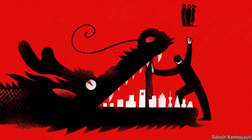

# Can foreign investors learn to love China again?

*Wall Street still needs more to coax it back. But non-American firms may be ready to return*

>
>
>**1. "coax" 的含义**
>
>**coax**（动词）在此处指 **“劝诱；耐心说服”**，表示华尔街投资者需要更多（利好条件或政策）才能被吸引回中国市场。  
>• **中文释义**：哄劝、诱使  
>• **英语音标**：/koʊks/  
>• **例句解析**：  
>
>  > *"Wall Street still needs more to coax it back."*  
>  > （华尔街仍需更多[条件]才能被吸引回来。）  
>  > • **coax it back** 中的 **it** 指代前文的 **foreign investors' love for China**（外资对中国的青睐），即通过政策、市场改善等手段重新赢得外资信心。  
>
>---
>
>**2. 语境分析**
>
>• **标题提问**：*Can foreign investors learn to love China again?*  
>  （外资能否重新爱上中国？）  
>  • 暗示外资因经济波动、地缘政治等因素对中国市场热情减退，需通过努力挽回。  
>• **coax 的隐含对象**：  
>  • **主体**：中国政府或市场条件（如开放政策、经济复苏信号等）。  
>  • **客体**：华尔街投资者（外资）。  
>  • **方式**：提供更多吸引力（如政策优惠、透明度提升、风险降低等）。  
>
>---
>
>**3. 近义词对比**
>
>| 单词       | 含义差异                        | 适用场景           |
>| ---------- | ------------------------------- | ------------------ |
>| **coax**   | 通过耐心或技巧说服（中性/积极） | 吸引犹豫的投资者   |
>| **lure**   | 可能含诱惑或欺骗意味（略消极）  | 贬义场景（如陷阱） |
>| **entice** | 强调用利益吸引（积极）          | 商业推广、优惠政策 |
>
>此处用 **coax** 更体现 **“克服阻力、逐步重建信任”** 的过程。  
>
>---
>
>**4. 整句翻译**
>
>**原文**：  
>*"Wall Street still needs more to coax it back. But non-American firms may be ready to return."*  
>
>**翻译**：  
>**“华尔街仍需更多[利好]才能回心转意，但非美国企业可能已准备回归。”**  
>• **coax it back** 译为 **“回心转意”**，保留“耐心争取”的语义。  
>
>---
>
>**5. 深层含义**
>
>• **coax 的弦外之音**：  
>  外资（尤其美国）对华投资仍持谨慎态度，需中国在以下方面努力：  
>  • 经济数据改善（如消费复苏、房地产风险化解）  
>  • 政策稳定性（如监管透明度、外资准入放宽）  
>  • 地缘政治缓和（如中美关系）  
>• **对比非美企业**：  
>  欧洲、日韩等企业可能因市场依赖度更高，或对政治敏感度较低，更早重返。  
>
>---
>
>**总结**
>
>• **coax** = 通过持续努力或条件吸引（此处指中国需采取措施挽回外资信心）。  
>• 标题与正文反映 **外资对华投资的分歧**：美国资本观望，其他地区资本或先行回归。

原文：

**F**OR CHINESE stocks to outperform American ones is rare

enough. But this year the MSCI China index has beaten its

American equivalent by an impressive 20 percentage points, on the

back of excitement about cutting-edge tech firms such as DeepSeek

and Manus AI. American shares, meanwhile, have been weighed

down by worries about a bellicose Trump administration and the

danger of a slowing economy

中国股票表现优于美国股票的情况非常罕见。但今年，摩根士丹利资本国际中国指数(MSCI China index)令人印象深刻地比美国同类指数高出20个百分点，原因是人们对DeepSeek和Manus AI等前沿科技公司感到兴奋。与此同时，由于担心好战的特朗普政府和经济放缓的危险，美国股市受到拖累

学习：

bellicose：美 [ˈbɛləˌkoʊs]	好战的；好斗的；好争辩的；斗志昂扬的

原文：

Could this revival be enough to entice international investors back

to China? It has been a rocky romance so far. When outsiders

looked at China’s vast economy and rapid growth in the early

2010s, many saw a land of endless opportunity. More recently,

however, slowing growth and a government crackdown on private

firms, ranging from video-game makers to tutoring companies, has

led to a reduction in the share of domestically listed stocks that are

held by foreign institutions. From 6.4% at the start of 2021, it fell

to just 4% at the end of 2024.

这种复苏足以吸引国际投资者回到中国吗？到目前为止，这是一段不稳定的爱情。2010年代初，当外人看到中国庞大的经济和快速增长时，许多人看到的是一片充满无限机遇的土地。然而，最近，增长放缓和政府对从视频游戏制造商到辅导公司等私营企业的打击，导致外国机构持有的国内上市股票份额减少。从2021年初的6.4%下降到2024年底的仅4%。

学习：

rocky：不稳固的；不稳定的

原文：

The main beneficiary of the market upswing has been Hong Kong

listed high-tech stocks, reflecting Western investors’ newfound

enthusiasm for Chinese artificial intelligence. Even after the recent

rally, many of the companies in question still look cheap. Hong

Kong’s Hang Seng tech index has a price-to-earnings ratio (based

on expectations of earnings next year) of around 19, compared with

almost 70 at its peak in 2021. China’s tech firms are not just

markedly cheaper than American tech stocks by the same measure;

they are cheaper than American stocks overall.

股市上涨的主要受益者是在香港上市的高科技股票，反映出西方投资者对中国人工智能的新热情。即使在最近的反弹之后，相关的公司看起来仍然很便宜。香港恒生科技股指数的市盈率(基于对明年收益的预期)约为19倍，而2021年的峰值接近70倍。以同样的标准衡量，中国的科技公司不仅明显比美国科技股便宜；它们总体上比美国股票便宜。

学习：

upswing：上升；改进；改善；提高；进步

>
>
>**1. "in question" 的含义**  
>
>**in question** 是固定短语，指 **“被讨论的；相关的”**，通常用于指代前文提到的特定事物。  
>• **中文释义**：所提及的、相关的  
>• **英语释义**：*the ones being discussed or referred to*  
>• **例句解析**：  
>  > *"many of the companies in question still look cheap."*  
>  > （许多相关公司仍显得估值低廉。）  
>  > • **in question** 指代前文提到的 **Hong Kong-listed high-tech stocks**（港股高科技股）。  
>
>---
>
>**2. 语境分析**  
>
>• **前文背景**：  
>  • 港股科技股（如人工智能相关企业）近期上涨，西方投资者对中概AI股重燃热情。  
>  • 即使上涨后，这些公司的估值（如市盈率）仍低于历史峰值和美股。  
>• **in question 的指代对象**：  
>  明确指 **“被讨论的港股科技公司”**（即前文的 *Hong Kong-listed high-tech stocks*）。  
>
>---
>
>**3. 近义词对比**  
>
>| 短语               | 差异                                   | 适用场景         |
>| ------------------ | -------------------------------------- | ---------------- |
>| **in question**    | 正式，强调“当前讨论的对象”             | 报告、分析类文本 |
>| **aforementioned** | 更正式，指“前文提过的”                 | 法律或学术文献   |
>| **concerned**      | 需搭配名词（如 *companies concerned*） | 商业或日常用语   |
>
>此处用 **in question** 更简洁且符合财经报道风格。  
>
>---
>
>**4. 整句翻译**  
>
>**原文**：  
>*"Even after the recent rally, many of the companies in question still look cheap."*  
>
>**翻译**：  
>**“即便近期上涨后，许多相关公司的估值仍显低廉。”**  
>• **companies in question** → **“相关公司”**（避免重复“港股科技股”）。  
>• **look cheap** → **“估值低廉”**（符合金融语境，非字面“便宜”）。  
>
>---
>
>**5. 深层含义**  
>
>• **in question 的作用**：  
>  避免重复前文名词（高科技股），同时强调分析对象是 **特定群体**（即受西方投资者关注的AI相关中概股）。  
>• **估值对比的隐含信息**：  
>  • 港股科技股当前市盈率（19）远低于2021年峰值（70），且低于美股同类或整体水平。  
>  • 暗示投资机会：**“估值修复空间大”**。  
>
>---
>
>**总结**  
>
>• **in question** = 所讨论的（此处指港股高科技股）。  
>• 翻译需根据上下文灵活处理，此处译为“相关的”或“所提及的”均可。  
>• 整段核心观点：**中概科技股估值吸引力仍存，或持续吸引外资回流**。

原文：

When it comes to mainland stocks, though, investors are more

reluctant. Cheapness may be necessary for a resumption of foreign

interest, but it is not sufficient. Three issues make investors

cautious. All would have to be resolved for them to return in good

number

然而，当谈到内地股票时，投资者就不那么情愿了。廉价可能是恢复外国兴趣的必要条件，但这还不够。三个问题让投资者变得谨慎。要让他们大批返回，一切都得解决

学习：

resumption：恢复；重新开始；取回；继续

原文：

Some progress has been made on the first issue, which was what

initially sent foreign investors running for the hills. China’s tech

crackdown began in 2020, when officials cancelled the initial

public offering of Ant Group, the fintech arm of Alibaba, a tech

giant, after the firm’s founder, Jack Ma, criticised the country’s

regulators. The move sparked discussion of whether China had

become “uninvestable”. Now a thaw seems to be in progress. Last

month Xi Jinping, China’s president, got together with a group of

private-sector leaders that included Mr Ma and Liang Wenfeng, the

founder of DeepSeek. Mr Xi stressed the importance of

entrepreneurship and the scale of the Chinese market.

在第一个问题上已经取得了一些进展，这个问题最初让外国投资者望而却步。中国的科技打击始于2020年，当时，在阿里巴巴创始人马云批评中国监管机构后，官员们取消了蚂蚁集团的首次公开发行。蚂蚁集团是科技巨头阿里巴巴的金融科技部门。此举引发了关于中国是否已变得“不可投资”的讨论。现在，解冻似乎正在进行中。上个月，中国国家主席会见了一些私营企业的领导人，其中包括马云和DeepSeek的创始人梁文峰。Xi强调了企业家精神的重要性和中国市场的规模。

学习：

>
>
>“Run for the hills” 是一个英语俚语，字面意思是“跑向山里去”，但在俚语中通常表示：  
>
>**“赶紧逃跑；快躲开；情况不妙，赶快避开”**  
>
>具体用法：  
>
>1. **危险或灾难来临**（强调紧迫性）  
>   • *When the volcano erupted, everyone ran for the hills.*  
>   （火山喷发时，所有人都拼命逃跑。）  
>
>2. **糟糕或可怕的事情即将发生**（夸张或幽默）  
>   • *If your date starts talking about their ex non-stop, run for the hills!*  
>   （如果你的约会对象一直聊前任，赶紧溜吧！）  
>
>3. **形容极度恐慌或厌恶的反应**  
>   • *When I saw the spider, I ran for the hills.*  
>   （看到蜘蛛时，我吓得立马逃了。）  
>
>文化背景：  
>
>这个表达可能源于灾难（如战争、自然灾害）中人们逃往山区避难的行为，后来被引申为一种幽默或夸张的警告。  
>
>类似的中文俚语可能是：  
>• **“快溜！”**  
>• **“赶紧跑路！”**  
>• **“三十六计，走为上计！”**  
>
>如果有具体语境需要分析，可以告诉我更多细节！

thaw：解冻（食物）；（结冰后）融化；融解；

原文：

A revival in the Chinese economy would help too. The slump of the

past few years, driven by the country’s troubled property industry,

has knocked consumer spending, the main engine of growth for

most large Chinese companies. Here, the necessary work is half

done at best. On March 16th the state laid out a new economic

rescue plan, apparently demonstrating its commitment to boosting

consumption. The plan included schemes to subsidise interest on

consumer loans and a modest increase in China’s stingy

government pension. Yet it was worth only 2% of GDP—not quite

the bazooka required to really get consumption going.

中国经济的复苏也会有所帮助。过去几年，由中国陷入困境的房地产行业引发的低迷打击了消费者支出，而消费者支出是中国大多数大型企业的主要增长引擎。在这里，必要的工作充其量是完成了一半。3月16日，中国出台了一项新的经济拯救计划，显然表明了其对刺激消费的承诺。该计划包括补贴消费贷款利息的计划，以及适度增加中国政府微薄的养老金。然而它只占GDP的2%——不太像是真正启动消费所需的火箭筒。

学习：
stingy：

>在上下文中，**"stingy"** 是一个带有贬义的形容词，意思是 **“吝啬的；小气的”**，用来批评某物（通常是金钱或资源）**给得太少、过于抠门或不慷慨**。  
>
>具体分析：  
>
>原句：  
>> *"The plan included schemes to subsidise interest on consumer loans and a modest increase in USA’s **stingy** government pension."*  
>> （该计划包括补贴消费贷款利息的方案，以及对美国**吝啬的**政府养老金的小幅增加。）  
>
>这里用 **"stingy"** 暗含以下含义：  
>1. **批评态度**：作者认为美国政府当前的养老金发放标准**过低**，显得抠门、不够慷慨。  
>2. **对比效果**：即使计划中养老金有所增加（"modest increase"），但作者用 "stingy" 强调**原本的基数太低**，小幅增加可能仍不足以解决问题。  
>
>类似表达：  
>
>• **中文对应**：  
>  • **“抠门的”**（口语）  
>  • **“吝啬的”**（正式）  
>  • **“寒酸的”**（形容待遇差）  
>• 英文近义词：  
>  • *miserly*（守财奴式的）  
>  • *meager*（少得可怜的）  
>  • *tightfisted*（攥紧拳头的，引申为吝啬）  
>
>例句对比：  
>
>• *The company’s **stingy** bonuses frustrated employees.*  
>  （公司**抠门的**奖金让员工不满。）  
>• *The **meager** pension left many retirees struggling.*  
>  （**微薄的**养老金让许多退休人士生活艰难。）  
>
>为什么用 "stingy" 而不用其他词？  
>
>• **"Stingy"** 更主观，直接表达不满；  
>• 如果是中性描述，可能会用 *"low"* 或 *"limited"*（如 *"limited pension benefits"*）。  
>
>如果这句话出自政治或经济评论，**"stingy"** 的选择可能反映了作者对政府福利政策的不满。

原文：

The last challenge, and the one that looks least likely to be resolved

in the foreseeable future, is politics. Miserable relations between

China and America have made Uncle Sam’s investors wary. In

2023 Joe Biden, then America’s president, signed rules that

required American private-equity investors to receive approval if

they wished to invest in some high-tech Chinese sectors. Mr Trump

is likely to expand their reach.

最后一个挑战，也是在可预见的未来最不可能解决的挑战，是政治。中美之间糟糕的关系让山姆大叔的投资者变得小心翼翼。2023年，时任美国总统的乔·拜登(Joe Biden)签署了一项规定，要求美国私募股权投资者如果希望投资中国的一些高科技行业，必须获得批准。特朗普可能会扩大他们的范围。

原文：

For Wall Street itself, that means the hurdle to investing in China

has been raised. But there are plenty of investors in other countries

who have trillions of dollars of their own to deploy. Capital

allocators in New York may feel as if they cannot appear too

bullish on China for political reasons. Their peers in Dubai, Geneva

and Singapore will not feel the same compunctions. Indeed,

American politics may push foreigners towards China even as it

keeps Americans out. The Trump administration’s chaotic spending

cuts and on-again, off-again tariff promises are a big part of why

American markets are in the doldrums.

对华尔街本身来说，这意味着投资中国的障碍已经提高。但在其他国家，有很多投资者自己也有数万亿美元可以配置。纽约的资本配置者可能会觉得，出于政治原因，他们似乎不能过于看好中国。他们在迪拜、日内瓦和新加坡的同行不会感到同样的内疚。事实上，美国政治可能会将外国人推向中国，即使它将美国人拒之门外。特朗普政府混乱的支出削减和断断续续的关税承诺是美国市场陷入低迷的重要原因。

学习：

compunction：内疚；良心不安；悔恨；自责；愧疚

doldrums：萧条；停滞；忧郁；低迷；无精打采

原文：

All this presents an opportunity for Chinese policymakers. A

recovering economy, a truce between the government and business,

and a swell of interest in China’s technological innovation have

begun to revive overseas interest. It is early days, and more is to be

done. But the opportunity to seal the deal is there—if they wish to

take it. ■

所有这些都为中国的政策制定者提供了一个机会。经济复苏、政府和企业休战，以及对中国技术创新的兴趣高涨，已开始重振海外兴趣。现在还为时过早，还有更多的工作要做。但是达成交易的机会就在那里——如果他们愿意的话。■

学习：

truce：停战；休战；暂时休战；停战期；缓和期；

## 后记

2025年4月3日20点02分于上海。

