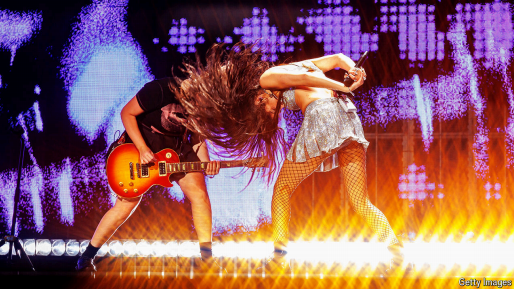
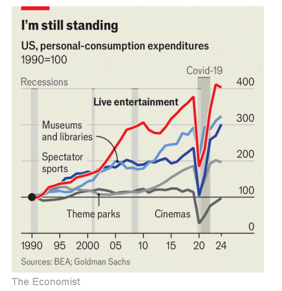

# Live music seems recession-proof. Thank ticket scalpers

现场音乐似乎不受经济衰退的影响。感谢票贩子

scalpers: 美 [ˈskælpərz] 黄牛；（scalper的复数）

*When demand softens, the secondary market absorbs the pain*

需求疲软

原文：

**T**HE MOOD music on Wall Street is downbeat, as America’s

government throttles trade and consumers seem poised to trim

spending. Yet one corner of the entertainment industry is partying

on regardless. Live Nation, a concert promoter, has said it expects

the live-music industry to break records in 2025. Its Ticketmaster

app had 70% more traffic this February than last, reckons Sensor

Tower, a data firm.

随着美国政府抑制贸易，消费者似乎准备削减支出，华尔街的情绪很低落。然而，不管怎样，娱乐产业的一个角落仍在狂欢。音乐会发起人Live Nation表示，预计现场音乐行业将在2025年打破纪录。据数据公司Sensor Tower估计，其Ticketmaster应用程序今年二月的流量比去年多了70%。

学习：

downbeat：悲观的；忧郁的；令人沮丧的；

throttle：美 [ˈθrɑːtl]  压制；调节（流量或速度）；减速

be poised to：准备

trim：削减；缩减；

on regardless：不管怎样

promoter：倡导者；支持者；赞助者；推动者；组织者；承办人；出资人；宣传者；

>
>
>在这段金融语境中，**"mood music"** 是一个**比喻性表达**，并非字面的“情绪音乐”，而是指 **（反映整体氛围或趋势的）背景基调、舆论风向或市场情绪**。  
>
>具体解析：  
>
>原句：  
>> *"The **mood music** on Wall Street is downbeat, as America’s government throttles trade and consumers seem poised to trim spending."*  
>> （华尔街的**整体氛围**低迷，因美国政府限制贸易，且消费者似乎准备缩减开支。）  
>
>这里的 **"mood music"** 暗喻：  
>1. **市场情绪的综合体现**：  
>   • 像背景音乐一样，虽不直接可见，但潜移默化地影响人们对经济或市场的感知。  
>   • 类似中文的“舆论风向”“市场基调”或“氛围”。  
>2. **负面基调（downbeat）**：  
>   • 后文提到贸易受限、消费疲软，说明当前情绪悲观（与“派对狂欢”的娱乐业形成对比）。  
>
>类比用法：  
>
>• **政治/经济领域**：  
>  • *"The **mood music** from the White House suggests new sanctions are imminent."*  
>    （白宫的**风向**暗示新制裁即将出台。）  
>• **商业报道**：  
>  • *"Despite the CEO’s optimism, the **mood music** among investors remains cautious."*  
>    （尽管CEO乐观，投资者的**整体情绪**仍谨慎。）  
>
>为什么用这个比喻？  
>
>• **音乐象征氛围**：就像电影配乐暗示剧情走向，"mood music" 暗示市场或舆论的潜在趋势。  
>• **生动形象**：比直接说 *"the general sentiment"* 更鲜活，符合英语媒体偏爱隐喻的特点。  
>
>注意区分：  
>
>• 字面意义的 "mood music"（如餐厅的背景音乐）在非比喻语境中仍可使用，但此处显然不是。  
>
>如果需要更直白的替换词，可以说：  
>• *"the prevailing sentiment"*（主流情绪）  
>• *"the general tone"*（整体基调）  
>• *"the atmosphere"*（氛围）  
>
>

原文：

This party may yet fizzle out. But the music business has a record

of performing well during downturns. Although concerts were

clobbered by covid-19 lockdowns in 2020-21, during America’s

previous three recessions live entertainment held up even as

spending on other forms of fun dipped, according to Goldman

Sachs, a bank (see chart).

这个派对可能会失败。但音乐行业有着在低迷时期表现良好的记录。根据高盛银行的数据，尽管音乐会在2020年至2021年间被新冠肺炎击垮，但在美国前三次经济衰退期间，即使在其他娱乐形式的支出下降时，现场娱乐仍保持坚挺(见图表)。

学习：

fizzle：失败；发出微弱的嘶嘶声；逐渐消失；虎头蛇尾；泡汤

fizzle out：失败；消失；破灭          

clobbered：狠揍；彻底打垮；（clobber的过去式和过去分词）

dipped：下沉；下降；（dip的过去式和过去分词）

原文：

Timing is one reason: concert-goers may book tickets months in

advance, so the impact of belt-tightening is delayed. Another is that

the average big-name gig in America is still cheaper than a night

out on Broadway or at the National Football League, meaning that

concerts are not the first treats to be forgone in a crunch (they may

even serve as cheaper substitutes). The globalisation of music

fandom also protects touring artists from downturns. If demand

falters in Johannesburg, add a date in Jakarta.

时间是一个原因:音乐会观众可能会提前几个月订票，所以勒紧裤腰带的影响会延迟。另一个原因是，在美国，大牌明星的普通演出仍然比在百老汇或国家足球联盟度过一个夜晚要便宜，这意味着音乐会不是危机中首先要放弃的项目(它们甚至可以作为更便宜的替代品)。音乐爱好者的全球化也保护了巡回演出的艺术家免受低迷的影响。如果约翰内斯堡的需求减弱，就在雅加达增加一场演出。

学习：

gig：（流行音乐或爵士乐）现场演奏会；现场演唱会

be forgone：被放弃

crunch：危机；经济紧缩；

fandom：影迷；运动迷；粉丝圈

falter：衰退

>
>
>在这段关于演唱会经济的语境中，**"add a date"** 是一个**行业术语**，意思是 **（在巡演计划中）增加一场演出（或一站巡演地点）**。  
>
>具体解析：  
>
>原句：  
>> *"If demand falters in Johannesburg, add a date in Jakarta."*  
>> （如果约翰内斯堡的需求下滑，就在雅加达**加演一场**。）  
>
>这里的 **"date"** 指：  
>1. **巡演日程中的具体场次**：  
>   • 音乐人或乐队的巡演通常按城市和日期排期，每个“date”代表一场演出（如“北京站”“伦敦站”）。  
>   • 类似中文的“加场”或“增设一站”。  
>2. **灵活调整策略**：  
>   • 前文提到音乐粉丝全球化（*globalisation of music fandom*），艺人可以通过在不同城市/国家**增加演出场次**来对冲局部市场需求波动。  
>
>类比用法：  
>
>• **演唱会公告**：  
>  • *"Due to popular demand, Taylor Swift has **added two more dates** to her Tokyo tour."*  
>    （由于需求火爆，泰勒·斯威夫特在东京站**加演两场**。）  
>• **媒体报道**：  
>  • *"The band **added a European date** after their American tour sold out."*  
>    （乐队在美国巡演售罄后，**增设了一场欧洲站**。）  
>
>为什么用 "date" 而不是其他词？  
>
>• **行业习惯**：演出行业常用 *"tour dates"* 指代巡演排期（如海报上的“March 15: Berlin”）。  
>• **简洁明确**：比 *"schedule an additional show"* 更简洁，且能关联到具体日期和地点。  
>
>中文对应表达：  
>
>• **加演一场** / **增设一站**（巡演）  
>• **追加场次**  
>• **增加演出日期**  
>
>如果需要更直白的解释，可以理解为：**“如果某个城市的门票卖得不好，就换到另一个城市多办一场演出”**。  
>
>

原文：

The most improbable saviours of live music in recessions are a

group more often cast as villains: ticket touts. Concerts are

deliberately underpriced, to ensure that true fans—young and hip

but penniless—make it into the audience alongside rich oldies and

corporate-hospitality bores. Scalpers take advantage by buying

tickets early, then reselling them at the true market-clearing price.

In booms they prosper: in 2019, just before the pandemic, Live

Nation said that the average uplift in ticket prices on the secondary

market in America was 70%, providing touts with a profit of

$1.3bn (more than Live Nation’s own operating profit that year).

在经济衰退中，现场音乐最不可思议的救星是一群更经常被扮演成反面角色的人:票贩子。音乐会故意定价过低，以确保真正的粉丝——年轻时髦但身无分文——与富有的老人和公司招待的无聊之人一起进入观众群。黄牛通过提前购买门票，然后以真实的市场出清价格转售，从中渔利。在繁荣时期，他们繁荣昌盛:2019年，就在疫情之前，Live Nation表示，美国二级市场的票价平均上涨了70%，为黄牛提供了13亿美元的利润(超过了Live Nation当年的运营利润)。

学习：

improbable：不大可能的；难以置信的；出乎意料的

saviours：救世主；（saviour的复数）

villains：恶棍；反派角色；（villain的复数）

touts：招揽员；兜售者；（tout的复数）

ticket touts：票贩子

hip：<非正式>赶时髦的；新潮的；嬉皮士的

penniless：一贫如洗的；身无分文的；穷困潦倒的

oldies：老人；（oldie的复数）

corporate-hospitality：公司招待

bores: 乏味的人

market-clearing：

>
>
>1. **"corporate-hospitality bores"**  
>
>这里的 **"corporate-hospitality bores"** 是一个略带讽刺的表达，指 **“那些因公司招待活动而获得赠票、但对演出本身并不真正感兴趣的乏味观众”**。  
>
>具体解析：  
>
>• **corporate hospitality**（公司招待）：  
>  • 指企业购买演唱会、体育赛事等门票，用于招待客户或员工（如商务应酬、公关活动）。  
>  • 这类票通常价格较高（如VIP包厢），但观众可能只是为了社交而非真正热爱演出。  
>• **bores**（乏味的人）：  
>  • 贬义词，形容这些人 **“无聊、缺乏热情”**，暗示他们只是被动出席，不会像真正的乐迷那样投入，甚至可能影响现场氛围。  
>  • 类似中文的“应酬客”“无趣的商务人士”。  
>
>上下文作用：  
>
>作者用 **"young and hip but penniless"（年轻时髦但没钱的真粉丝）** 和 **"rich oldies and corporate-hospitality bores"（有钱的老头子和无聊的公司招待客）** 对比，突出演唱会的定价矛盾——**低价本意是让真粉丝买得起，但实际观众中混入了许多非目标人群**。  
>
>---
>
>2. **"market-clearing price"**  
>
>**"market-clearing price"（市场出清价格）** 是一个经济学术语，指 **“能使供需平衡的价格”**，即在这个价格下，所有想卖的票都能卖出，所有想买的观众都能买到（没有剩余或短缺）。  
>
>具体解析：  
>
>• 文中提到，演唱会门票被 **"deliberately underpriced"（故意定价过低）**，导致供不应求。  
>• **票贩子（scalpers/touts）** 通过抢购低价票，再以 **"true market-clearing price"（真实的市场出清价）** 转售，即 **黄牛价**（反映实际供需关系的更高价格）。  
>  • 例如：原价100美元的票，因需求火爆，黄牛可能以170美元（+70%溢价）卖出，这个价格才是真正“出清市场”的价格。  
>
>为什么用这个词？  
>
>• 强调 **官方定价偏离市场真实价值**，而黄牛价才是供需平衡的结果（尽管不道德）。  
>• 类似概念：拍卖中的“均衡价格”或股票市场的“清算价格”。  
>
>---
>
>总结对比：  
>
>| 术语                            | 含义                     | 语境作用                     |
>| ------------------------------- | ------------------------ | ---------------------------- |
>| **corporate-hospitality bores** | 因公司招待获票的无趣观众 | 讽刺非乐迷占据真粉丝的席位   |
>| **market-clearing price**       | 供需平衡的黄牛价         | 揭示官方低价政策导致黄牛暴利 |
>
>其他问题？比如 **"ticket touts"（黄牛）** 或 **"uplift in ticket prices"（票价溢价）** 的详细解释？

原文：

But when demand softens, touts feel it first. Their billion-dollar

profit pool in effect shields the primary market from declines in

consumer spending, argue Stephen Laszczyk and Antares Tobelem

of Goldman Sachs. “In the event of a recession, we would expect

that the secondary market would absorb most of the pressure on

marginal demand, insulating the underlying profitability of the live

music industry,” they predict.

但当需求疲软时，黄牛会最先感受到。高盛的斯蒂芬·拉斯奇克（Stephen Laszczyk）和安塔雷斯·托贝勒姆（Antares Tobelem）认为，黄牛数十亿美元的利润池实际上 **缓冲了** 一级市场免受消费下滑的冲击。他们预测：“如果经济衰退来临，我们预计二级市场将吸收绝大部分边际需求压力，从而 **保护** 现场音乐行业的根本盈利能力。”  

学习：

>
>
>**"insulate" 的含义**
>
>在这段经济分析中，**"insulate"** 是一个动词，意思是 **“隔离、缓冲、保护……免受（不利影响）”**。  
>
>• **字面意思**：绝缘（如电线绝缘层防止漏电）。  
>• **经济学引申义**：指某种机制或因素能 **吸收冲击、减少外部波动对核心部分的直接影响**。  
>
>**关键点解析**  
>
>1. **"insulate the underlying profitability"**  
>   • **= 保护（现场音乐行业）的核心利润不受影响**  
>   • 这里的 **"underlying profitability"** 指行业本质的、长期的盈利能力（如主办方、艺人的收入）。  
>
>2. **经济学逻辑：**  
>   • **一级市场（primary market）**：官方售票（如Ticketmaster），价格较稳定。  
>   • **二级市场（secondary market）**：黄牛转售，价格波动大。  
>   • **黄牛的作用**：  
>     ◦ 经济好时，黄牛抬高票价赚取暴利；  
>     ◦ 经济差时，黄牛因需求减少先亏钱（如降价甩卖），但官方票价仍保持稳定，从而 **保护了行业的核心利润**。  
>
>3. **类似概念：**  
>   • **"absorb the pressure"** = 吸收压力（类似“减震器”）  
>   • **"shield from declines"** = 屏蔽下跌影响  
>
>**为什么用 "insulate"？**  
>
>这个词形象地比喻了二级市场（黄牛）像“绝缘层”一样，**替一级市场（主办方）承受经济波动**，使其利润不受直接冲击。  
>
>如果需要更口语化的表达，可以说：  
>• **“帮……挡刀”**  
>• **“缓冲……的冲击”**  
>
>其他问题？比如 **"marginal demand"（边际需求）** 或 **"profit pool"（利润池）** 的具体含义？

原文：

If the direst forecasts for America’s economy come true, fans may

not be willing to pay as much to see bands like Oasis, whose

comeback tour begins in July. Yet with tickets already sold out in

the primary market, the Gallagher brothers have no need to worry.

It is those trying to make a buck in the secondary market who will

have to roll with it. ■

如果对美国经济最可怕的预测成为现实，歌迷们可能不会愿意花那么多钱去看像绿洲乐队这样的乐队，他们的复出巡演将于7月开始。然而，由于门票已经在一级市场销售一空，加拉格尔兄弟没有必要担心。那些试图在二级市场赚钱的人将自求多福。■

学习：

direst：最可怕的；最悲惨的；最极端的；最极其的；（dire的最高级）          

oasis：沙漠中有树、水的地方）绿洲；慰藉物；慰藉所；

make a buck：挣钱

>
>
>**"roll with it" 的含义**
>
>在这段话中，**"roll with it"** 是一个英语习语（idiom），意思是 **“适应变化、接受现实、灵活应对”**，通常指面对困难或意外情况时 **不抵抗、顺势而为**。  
>
>#### **具体解析：**
>• **字面意思**：  
>  • *roll*（滚动） + *with it*（随着它）→ 像球一样“随势滚动”，不硬扛。  
>• **引申义**：  
>  • **接受无法改变的现实**（尤其是负面情况）。  
>  • **灵活调整策略**，避免被问题击垮。  
>
>**上下文翻译：**
>
>> *"It is those trying to make a buck in the secondary market who will have to roll with it."*  
>> **“那些想在二级市场赚钱的人，只能接受现实（或‘自求多福’）了。”**  
>
>**为什么用这个表达？**
>
>1. **黄牛（二级市场）的困境**：  
>   • 前文提到，如果经济恶化，粉丝不愿花高价看演唱会（如Oasis reunion tour），黄牛手中的票可能贬值。  
>   • 但主办方（Gallagher兄弟）已通过一级市场售罄门票，无需担心收入。  
>   • **只有黄牛需要承担风险**，必须“随行就市”（接受票价下跌的现实）。  
>
>2. **语气分析**：  
>   • *roll with it* 带有一丝 **无奈、认命** 的意味，暗示黄牛无法改变市场趋势，只能适应。  
>   • 类似中文的 **“硬扛”“自己看着办”** 或 **“随波逐流”**。  
>
>**其他例句：**
>
>• *"When life gives you lemons, just roll with it and make lemonade."*  
>  （生活给你柠檬时，接受它并做成柠檬水。—— 即“随遇而安”。）  
>• *"The plan failed, so we had to roll with it and try something else."*  
>  （计划失败，我们只能接受现实，尝试其他方法。）  
>
>**同义替换：**
>
>• *adapt to it*（适应）  
>• *deal with it*（应对）  
>• *go with the flow*（顺其自然）  
>
>**总结：**
>
>这里的 **"roll with it"** 并非字面“滚动”，而是强调 **二级市场的投机者（黄牛）在经济下行时被迫承受损失，无法转嫁风险**。  
>
>如果需要更犀利的翻译，甚至可以译为：  
>**“二级市场的投机客只能认栽了。”**  
>

## 后记

2025年4月4日17点43分于上海。