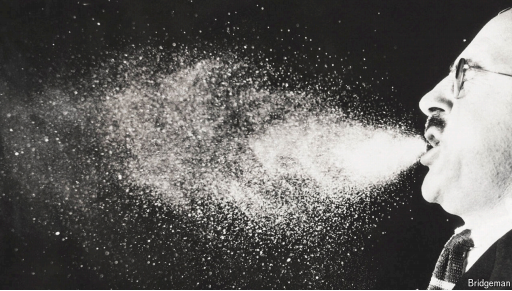

# Five years after covid, have scientists learned their lesson?

*The history of one of epidemiology’s least favourite ideas*

epidemiology：美 [ˌepɪˌdiːmiˈɑːlədʒi] 流行病学；疾病分布学

**Air-Borne.** By Carl Zimmer. *Dutton; 496 pages; $32. To be published in Britain by Picador in June; £25*

borne：承载的；传送的；携带的；由…携带的

air-borne：空气传播

原文：

**O**N MARCH 28TH 2020, as many countries went into lockdown,

the World Health Organisation (WHO) posted a tweet: “FACT:

\#COVID19 is NOT airborne.” People could try to avoid covid by

keeping their distance from others and washing their hands

regularly. The message was simple. It was also simply wrong: the

coronavirus is, in fact, airborne. It can remain active as an aerosol

for up to three hours, and the droplets can travel farther than

scientists realised. (Consensus-breaking researchers in Guangzhou,

China, proved this by studying the transmission of the virus in a

restaurant.) Yet it took more than a year—and a huge cache of

evidence—for the WHO to change its mind and messaging.

2020年3月28日，随着许多国家进入封锁状态，世界卫生组织(世卫组织)发布了一条推文:“事实:#COVID19不是空气传播的。”人们可以通过与他人保持距离和经常洗手来避免冠状病毒肺炎。信息很简单。这也是完全错误的:冠状病毒事实上是通过空气传播的。它可以作为气溶胶保持活性长达三个小时，并且液滴可以比科学家们意识到的传播得更远。(中国广州打破共识的研究人员通过研究病毒在一家餐馆的传播证明了这一点。)然而，世卫组织花了一年多的时间和大量的证据才改变了主意和信息。

学习：

aerosol:美 [ˈɛrəˌsɔl] 喷雾剂；气雾剂；雾化器；气溶胶；细小悬浮颗粒

droplet：液滴；小滴；微滴；细小的水珠；微小颗粒（如雾中的水珠）

a huge cache of：大量的

原文：

In “Air-Borne”, Carl Zimmer, a science journalist, shows that the

WHO’s wrongheadedness has historical precedent. Though

epidemiologists have long understood that coughs and sneezes

spread diseases, many never took seriously enough the possibility

that infective agents could hang around or travel through the air.

Instead received wisdom has had it that droplets of liquid, after

being exhaled, fall quickly to the ground. Had airborne diseases

received due attention from researchers, the book implies, then

covid-19 and perhaps some previous influenzas, would have been

more quickly controlled or even prevented entirely.

在《空气传播》中，科学记者卡尔·齐默展示了世卫组织的执迷不悟是有历史先例的。尽管流行病学家早就知道咳嗽和喷嚏会传播疾病，但许多人从未足够重视传染性病原体可能在周围游荡或通过空气传播的可能性。相反，公认的观点认为，液滴在被呼出后，会迅速落到地面上。这本书暗示，如果研究人员对空气传播的疾病给予了应有的关注，那么新冠肺炎病毒，或许还有之前的一些流感，可能会被更快地控制，甚至完全预防。

学习：

wrongheadedness ：固执己见      

sneezes：喷嚏；（sneeze的复数）

influenzas：流感

原文：

To explain epidemiologists’ resistance to the idea of airborne

disease transmission, Mr Zimmer goes back to the early days of

germ theory in the 19th century. For decades people believed that

“miasmas”—phantasmal toxic vapours—caused disease. (The

word “malaria”, for example, is Italian for “bad air”.) But as

scientists came to understand more about pathogens, the idea that

air could be a source of contagion became deeply unfashionable.

为了解释流行病学家对空气传播疾病的抵制，齐默先生追溯到19世纪细菌理论的早期。几十年来，人们认为“瘴气”——虚幻的有毒气体——会导致疾病。(例如，“疟疾”这个词在意大利语中是“糟糕的空气”的意思。)但是，随着科学家对病原体了解得越来越多，空气可能是传染源的想法变得非常过时。

学习：

transmission：传播

germ：细菌

miasma：美 [maɪˈæzmə]  瘴气；毒雾；不良气氛

phantasmal：幻影的; 幽灵的; 空想的

vapour：蒸汽；雾气；潮气；

pathogens：美 [ˈpæθədʒənz] 病原体（物）；（pathogen的复数）

原文：

Two of the heroes of Mr Zimmer’s book are William and Mildred

Wells, a married pair of American researchers. In the 1940s they

conducted experiments to see if ultraviolet lamps could kill germs

and purify air, fitting the lamps in hospitals, schools, barracks and

even an entire town in upstate New York. The outcome was

variable, but with enough successes—particularly against measles

—that open minds might have conducted larger, better-funded

studies. The second world war, however, put paid to much of their

research. It is ironic, Mr Zimmer writes, that America’s biological

weapons programme was predicated on the idea that the pathogens

would spread through the air, but that many still refused to change

their opinion about how natural germs got around.

齐默先生书中的两个英雄是威廉和米尔德里德·威尔斯，一对已婚的美国研究人员。在20世纪40年代，他们进行了实验，看看紫外线灯是否可以杀死细菌和净化空气，将这种灯安装在医院、学校、军营，甚至纽约北部的整个城镇。结果是可变的，但是有了足够的成功——特别是在麻疹上——开放思维可能已经进行了更大规模、资金更充足的研究。然而，第二次世界大战结束了他们的大部分研究。齐默先生写道，具有讽刺意味的是，美国的生物武器计划是基于病原体会通过空气传播的想法，但许多人仍然拒绝改变他们对自然细菌如何传播的看法。

学习：

measles：美 [ˈmiːzlz] 麻疹；风疹；

put paid to：终止；结束；使结束；

原文：

Has the message now got through? Engineers have built on the

Wells’ research and developed effective “far ultraviolet C” lamps

for spaces where aerial transmission of pathogens is likely, such as

clubs and restaurants. Yet whether epidemiologists have changed

their thinking remains to be seen. The hope is that, when the next

pandemic arrives, the WHO and others will give the possibility of

airborne transmission more oxygen. ■

这消息现在被理解了吗？工程师们以威尔斯的研究为基础，开发了有效的“远紫外线C”灯，用于可能通过空气传播病原体的场所，如俱乐部和餐馆。然而流行病学家是否改变了他们的想法还有待观察。人们希望，当下一个疫情到来时，世卫组织和其他人会给空气传播更多的关注和支持。■

学习：

>**原文：**  
>*"The hope is that, when the next pandemic arrives, the WHO and others will give the possibility of airborne transmission more oxygen."*  
>
>**1. 字面意思 vs. 实际含义**  
>
>• **字面直译**：  
>  “希望当下一场大流行来临时，世卫组织（WHO）和其他机构能给‘空气传播的可能性’**更多氧气**。”  
>  （听起来像“给空气传播供氧”，显然不合理。）  
>
>• **实际含义**：  
>  这是一个**英语隐喻（metaphor）**，**"give something more oxygen"** 的真实意思是：  
>  **“给予更多关注/支持”** 或 **“让某种观点/可能性有更大的生存/发展空间”**。  
>  （类似中文的“**留出余地**”“**给予重视**”或“**提供支持**”。）  
>
>**2. 为什么用 "oxygen" 比喻？**  
>
>• **氧气（oxygen）** 是生命必需的元素，**“给某物氧气”** = **“让它存活/发展”**。  
>• 这里暗指：  
>  • 过去WHO等机构可能**忽视或压制**“空气传播（airborne transmission）”的理论（如COVID-19初期争议）。  
>  • 希望未来能**更开放地接受科学证据**，避免因官僚或保守态度延误防控。  
>
>**3. 结合上下文的完整翻译**  
>
>> **“希望下一场大流行到来时，世卫组织和其他机构能**更重视空气传播的可能性**。”**  
>> 或更直白地：  
>> **“但愿下次疫情爆发时，WHO能**给空气传播理论留出更多空间**。”**  
>
>**4. 类似英文表达**  
>
>• *"give weight to"*（重视）  
>• *"allow room for"*（留出余地）  
>• *"take seriously"*（认真对待）  
>
>**5. 补充背景**  
>
>• 本文讨论的是**紫外线杀菌灯（far-UVC）**在防控空气传播病原体（如病毒）中的应用。  
>• 此前COVID-19期间，WHO曾因**迟迟不承认新冠病毒可空气传播**而受批评，导致防控措施（如通风、口罩）推广滞后。  
>• 作者希望未来科学共识能更快影响政策，避免重复错误。  
>
>---
>
>**总结答案**  
>
>**“give the possibility of airborne transmission more oxygen”**  
>= **“更重视空气传播的可能性”**  
>（隐喻：让这一科学观点得到应有的关注和支持，而非被忽视。）  
>
>

## 后记

2025年4月4日18点32分于上海。