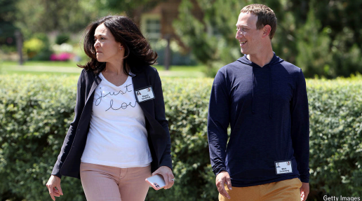

# How not to handle a corporate kiss-and-tell book

*Meta’s attempt to put a gag on “Careless People” is backfiring*

gag：封口布；塞口物；口塞

backfiring：适得其反；（backfire的现在分词形式）

>
>
>**1. "kiss-and-tell" 的含义**  
>
>**"kiss-and-tell"** 是一个英语固定短语，最初指 **“（名人）公开谈论私密关系细节”**（字面：接吻后泄密），后引申为：  
>• **任何揭露内部秘密的行为**（尤其涉及公司、名人或机构的负面内幕）。  
>• **中文近似表达**：  
>  • **“爆料”**（如明星绯闻、企业黑幕）  
>  • **“揭短”** / **“内幕曝光”**  
>
>**在标题中的具体含义**  
>
>*"How not to handle a corporate **kiss-and-tell** book"*  
>→ **“如何搞砸一本企业爆料书”**（指书中揭露Meta公司内部敏感信息）。  
>
>---
>
>**2. "put a gag on" 的含义**  
>
>**"put a gag on"** 是动词短语，字面意思是 **“给某人戴口套”**，引申为：  
>• **强制禁言**（通过法律、威胁等手段阻止他人发声）。  
>• **中文对应**：  
>  • **“封口”** / **“下达封口令”**  
>  • **“压制言论”**  
>
>**在文中的具体含义**  
>
>*"Meta’s attempt to **put a gag on** ‘Careless People’ is backfiring"*  
>→ **“Meta试图对《Careless People》一书下达封口令，结果适得其反。”**  
>（暗示Meta想阻止书中内容传播，反而引发更多关注。）  
>
>---
>
>**3. 为什么这两个短语用在这里？**  
>
>• **"kiss-and-tell"**：  
>  强调书中内容涉及Meta不愿公开的**内部秘密**（如高管决策黑幕、企业文化问题）。  
>• **"put a gag on"**：  
>  讽刺Meta试图用法律或权力**压制言论**，但手段笨拙，反而让事件更受关注（backfiring）。  
>
>---
>
>**4. 类似表达对比**  
>
>| 英文短语          | 字面意思   | 实际含义          | 中文近似词     |
>| ----------------- | ---------- | ----------------- | -------------- |
>| **kiss-and-tell** | 接吻后泄密 | 揭露私密/内部信息 | 爆料、揭短     |
>| **put a gag on**  | 戴口套     | 强制禁言          | 封口、压制言论 |
>
>---
>
>**5. 完整标题翻译建议**  
>
>**《如何搞砸一本企业爆料书——Meta对〈Careless People〉的封口令适得其反》**  
>
>其他问题？比如 **"backfiring"（适得其反）** 或 **"Careless People"（书名隐喻）** 的具体含义？

**Careless People.** By Sarah Wynn-Williams. *Flatiron Books; 400 pages; $32.99. Macmillan; £22*

原文：

**T**HE MAIN character in Sarah Wynn-Williams’s book about life

inside Facebook is not Mark Zuckerberg, the social network’s

founder and boss. Nor is it Sheryl Sandberg, its ex-chief operating

officer—though she dwells on both in riveting detail. It is the

author herself.

Sarah Wynn-Williams关于脸书生活的书的主角不是社交网络的创始人兼老板Mark Zuckerberg。也不是它的前首席运营官雪莉·桑德伯格——尽管她在引人入胜的细节中详述了这两者。是作者本人。

学习：
riveting：英 [ˈrɪvɪtɪŋ] 吸引人的；引人入胜的；扣人心弦的

dwells on：详述

原文：

Her memoir starts with the story of being attacked by a shark while

swimming in her native New Zealand when she was 13. Further

horror stories ensue. As head of global policy at Facebook (now

Meta) until she was fired in 2017, she casts herself as a lonely

crusader, risking jail in South Korea and abduction by the junta in

Myanmar—all, naively, for the cause of promoting Facebook as a

way to make the world a better place. She revels in dramatic effect:

the more self-righteous and gory the better.

她的回忆录以她13岁时在家乡新西兰游泳时被鲨鱼袭击的故事开始。更多的恐怖故事接踵而至。在2017年被解雇之前，她一直担任脸书(现为Meta)的全球政策主管，她将自己塑造成一名孤独的十字军战士，冒着在韩国坐牢和在缅甸被军政府绑架的风险——这一切都是天真地为了宣传脸书想让世界变得更美好。她陶醉于戏剧效果:越自以为是、越血腥越好。

学习：
ensue: 随之发生；接踵而至；紧接着发生；

abduction: 绑架；劫持；诱拐

junta: 军政府；执政团；军事集团；政变集团

Myanmar: 美 [ˈmjɑːnmɑːr] 缅甸(东南亚国家)

revels: 陶醉于；尽情享受；（revel的第三人称单数）

dramatic effect: 戏剧性的效果；显著的影响          

self-righteous: 自以为是的；自以为正直的；以正人君子自居的          

gory: 血淋淋的；血腥的；暴力的；残暴的；

原文：

In contrast, Mr Zuckerberg and Ms Sandberg are portrayed in terms

that almost make the shark look good. He is aloof, unfeeling and

shallow; she is mercurial and two-faced. Those depictions, too,

may sometimes stretch the truth for the sake of a good story. But it

is, to be sure, a good story—the more so because an arbitrator, at

Meta’s request, has blocked Ms Wynn-Williams from promoting or

distributing “Careless People”, arguing the author had violated her

severance agreement. It is a lesson in how not to deal with the

corporate equivalent of kiss-and-tell.

相比之下，扎克伯格先生和桑德伯格女士被描绘的程度几乎让邪恶的鲨鱼都看起来还不错。他孤傲、绝情、浅薄；她反复无常，两面三刀。这些描述有时也会为了一个好故事而夸大事实。但可以肯定的是，这是一个好故事——尤其是因为在Meta的要求下，仲裁人阻止了Wynn-Williams女士宣传或分发《粗心的人》,认为作者违反了她的离职协议。这是一个教训，告诉我们如何不去处理公司里泄密的事情。

学习：

aloof：冷漠的；冷淡的；疏远的

unfeeling：冷漠的；漠不关心的；无同情心的

shallow：肤浅的；浅薄的

mercurial：美 [ˌmərˈkjʊriəl] 多变的；反复无常的

two-faced：两副面孔的

severance：美 [ˈsevərəns] 终止；解雇；辞退；解聘赔偿

severance agreement：离职协议

原文：

Parts of the book are genuinely funny. Picture Mr Zuckerberg, fresh

off his private jet, sprawled across a daybed in an Indonesian

resort, his pale body propped up on cushions. “It feels like I’ve

stumbled into ancient Greece, though a toga and laurel wreath

would match the room better than his swimsuit,” she writes. At one

point he mysteriously asks for exposure to a “riot” in South-East

Asia. What he means, in true boy-king manner, is being “gently

mobbed” by adoring Facebookers.

**“书中部分内容非常滑稽。想象一下：扎克伯格刚下私人飞机，就瘫在印尼度假村的躺椅上，苍白的身体歪靠在垫子上。‘我感觉自己误入了古希腊——虽然他穿着泳衣，但换上托加长袍和月桂头冠会更配。’作者写道。有一次，他莫名其妙地要求体验东南亚的‘暴乱’。而这位‘男孩国王’真正的意思是：被崇拜他的Facebook用户‘温柔地围堵’。”**  

学习：

cushions：垫子；靠垫；（cushion的复数）

prop up

toga：托加袍；古罗马宽外袍；长袍

laurel：美 [ˈlɔːrəl] 月桂；月桂树；桂冠；

wreath：美 [riːθ] 花环；花圈（用于祭奠）；花冠（旧时用作荣誉的象征）；

mobbed：大举包围；蜂拥进入；围攻；（mob的过去式）          

>
>
>**1. "prop up" 的含义**  
>
>**"prop up"** 是一个动词短语，字面意思是 **“用支撑物固定/托起某物”**，在上下文中：  
>• **字面动作**：  
>  > *"his pale body **propped up** on cushions"*  
>  > → **“他苍白的身体（半躺）靠在垫子上”**（垫子支撑着他的身体）。  
>  > • **引申义**：  
>  > • **“勉强维持”**（如经济、政权等）。  
>  > • **“依赖外力支撑”**（常含贬义）。  
>
>**例句对比**  
>
>• *"She **propped up** her head with her hands."*（她用手托着头。）  
>• *"The government **propped up** the failing bank."*（政府扶持了濒临破产的银行。）  
>
>---
>
>**2. "fresh off" 的含义**  
>
>**"fresh off"** 表示 **“刚从……离开/抵达”**，强调 **时间上的紧接** 和 **状态的新鲜感**：  
>• **在文中**：  
>  > *"Mr Zuckerberg, **fresh off** his private jet"*  
>  > → **“扎克伯格刚下私人飞机”**（可能还带着旅途的疲惫或兴奋）。  
>  > • **其他用法**：  
>  > • *"He's **fresh off** a victory in the tournament."*（他刚赢得比赛。）  
>  > • *"The team is **fresh off** a long flight."*（球队刚结束长途飞行。）  
>
>**注意**  
>
>• **"fresh off the boat"** 是一个固定短语，原指新移民（略带贬义），但此处仅为中性描述。  
>
>---
>
>**3. "stumble" 的含义**  
>
>**"stumble"** 本义是 **“绊倒”**，但在文中是比喻用法：  
>• **字面动作**：  
>  > *"It feels like I’ve **stumbled** into ancient Greece"*  
>  > → **“我感觉自己误入了古希腊”**（像不小心闯进某个场景）。  
>  > • **引申义**：  
>  > • **“偶然发现/遇到”**（意外、无计划）。  
>  > • **“结巴/蹒跚”**（如演讲卡顿）。  
>
>**例句对比**  
>
>• *"He **stumbled** upon a rare book in the attic."*（他在阁楼偶然发现一本珍本书。）  
>• *"The drunk man **stumbled** down the street."*（醉汉踉跄地走在街上。）  
>
>---
>
>**4. 三个词在文中的综合作用**  
>
>• **"fresh off"** → 突出扎克伯格的 **“匆忙/高调登场”**（刚从飞机下来就瘫着）。  
>• **"propped up"** → 刻画他 **“慵懒、不正式”的姿态**（像被垫子勉强撑着）。  
>• **"stumbled"** → 作者用幽默比喻，形容场景 **“荒诞得像误入古希腊”**（与扎克伯格的现代形象反差）。  
>
>---
>
>**总结对比表**  
>
>| 英文词汇      | 文中含义           | 中文对应   | 其他常见用法             |
>| ------------- | ------------------ | ---------- | ------------------------ |
>| **prop up**   | （身体）靠在垫子上 | 支撑/托着  | 维持经济、扶持企业       |
>| **fresh off** | 刚下（飞机）       | 刚从……离开 | 刚结束（比赛/行程）      |
>| **stumble**   | 误入/偶然闯入      | 绊倒/踉跄  | 偶然发现（stumble upon） |
>

原文：

Likewise, Ms Sandberg, author of “Lean In”, a book about female

empowerment, has a regal air. In the book’s telling, she lights up

with charisma when it suits her. Her courtiers are young women.

She is portrayed as imperiously crossing personal boundaries.

When the author’s newborn baby can be heard during late-night

phone calls, Ms Sandberg advises her to “Be smart and hire a

Filipina nanny.” Ms Sandberg also allegedly asks a female assistant

to buy them both lingerie and invites her over to try it on.

同样，桑德伯格女士，一本关于女性赋权的书《向前一步》的作者，也有一种帝王般的气质。在书中，当魅力适合她时，她会发光发亮。她的朝臣都是年轻女性。她被描绘成专横地跨越个人界限。当深夜接电话，作者的新生孩子的声音被听到时，桑德伯格建议她“聪明点，雇个菲律宾保姆。”据称，桑德伯格还让一名女助理给他们俩买内衣，并邀请她过来试穿。

学习：
regal：帝王的；王室的；皇家的；豪华的

courtier：廷臣；朝臣；侍臣；奉承者；谄媚者

Filipina：英 [ˌfɪlɪˈpiːnə] 菲律宾女性；菲律宾女人；菲律宾女子；

nanny：保姆（照顾儿童的女性）；育儿嫂

lingerie：美 [ˌlɑn(d)ʒəˈreɪ] 女内衣；女睡衣

原文：

One of the book’s most serious claims is that Mr Zuckerberg lied

about the firm’s plans for China during a United States Senate

hearing in 2018. (The author has filed a whistleblower allegation

with the Securities and Exchange Commission.) Ms Wynn

Williams also says that she was harassed by Joel Kaplan, Meta’s

chief global affairs officer, which Meta denies.

该书最严重的指控之一是，扎克伯格在2018年美国参议院听证会上就该公司的中国计划撒谎。(作者已经向美国证券交易委员会提出了告密者指控。Wynn-Williams女士还说她被Meta公司的首席全球事务官Joel Kaplan骚扰，对此Meta公司予以否认。

原文：

Meta describes the book as “a mix of out-of-date and previously

reported claims about the company and false accusations about our

executives”. It is following the script of other companies

unsuccessfully trying to deter tell-all books. In 2020 Apple sought

to halt the publication of “App Store Confidential”, written in

German by Tom Sadowski, a former head of its app store. The

effort only boosted sales. When “Unsafe at Any Speed” by Ralph

Nader, a consumer advocate, was published in 1965, General

Motors tried to sabotage his reputation. The book quickly became a

classic and helped spur the creation of America’s Department of

Transportation.

Meta将这本书描述为“过时的和以前报道过的关于公司的说法以及对我们高管的不实指控的混合体”。它正在效仿其他公司的做法，试图阻止泄密书籍，但没有成功。2020年，苹果试图停止出版《应用商店机密》,该书由前苹果应用商店负责人汤姆·萨多夫斯基用德语撰写。这一努力只是提高了销售额。当消费者权益倡导者拉尔夫·纳德的《任何速度下都不安全》于1965年出版时，通用汽车公司试图破坏他的声誉。这本书很快成为经典，并帮助刺激了美国交通部的成立。

学习：

tell-all：托出；全盘托出          

sabotage：美 [ˈsæbətɑːʒ] 破坏；蓄意破坏（以防止敌方利用或表示抗议）；妨碍；捣乱

原文：

Today “Careless People” sits atop the *New York Times* non-fiction

bestseller list*.* On Amazon the publishers of the memoir are

hawking it as “the book Meta doesn’t want you to read”. If the

book’s claims are as old and untrue as Meta says, the firm should

simply have made light of them—or stayed carefully silent. ■

今天,《粗心的人》高居《纽约时报》非小说类畅销书榜首。在亚马逊上，这本回忆录的出版商将它标榜为“Meta不想让你读的书”来兜售。如果这本书的主张像Meta所说的那样陈旧和不真实，该公司就应该轻描淡写——或者保持谨慎的沉默。■

学习：

>**"hawking" 的含义及解析**  
>
>**原文：**  
>*"On Amazon the publishers of the memoir are **hawking** it as ‘the book Meta doesn’t want you to read’."*  
>
>**1. 基本定义**  
>
>**"hawking"** 是动词 **"hawk"** 的现在分词形式，本义指 **“叫卖、兜售”**（尤指沿街或大声推销），带有以下隐含意味：  
>• **主动推销**：积极宣传，甚至有些“硬销”。  
>• **夸张手法**：可能用煽动性语言吸引注意（如标题党）。  
>
>**2. 文中具体含义**  
>
>• 出版商在亚马逊上将书标榜为 **“Meta不想让你读的书”**，这是一种 **营销策略**：  
>  • 通过制造“禁书”噱头（**"the book Meta doesn’t want you to read"**）激发读者好奇心。  
>  • **"hawking"** 暗示出版商在 **刻意炒作争议**，而非平实描述内容。  
>
>**3. 情感色彩**  
>
>• **略带贬义**：  
>  • "hawking" 不同于中性的 *"selling"* 或 *"promoting"*，暗含 **“叫卖式推销”** 的功利感。  
>  • 类似中文的 **“吆喝”**（如小贩招揽顾客）或 **“炒作”**（贬义）。  
>
>**4. 类似表达对比**  
>
>| 英文词汇    | 程度/情感          | 中文对应         |
>| ----------- | ------------------ | ---------------- |
>| **hawking** | 叫卖（带贬义）     | 兜售、吆喝       |
>| *promoting* | 中性推广           | 宣传             |
>| *peddling*  | 贬义（常指劣质品） | 贩卖（劣质商品） |
>
>**5. 例句扩展**  
>
>• *"Street vendors were **hawking** counterfeit souvenirs to tourists."*  
>  （小贩向游客**兜售**假冒纪念品。）  
>• *"The tabloid **hawked** the scandal with sensational headlines."*  
>  （小报用耸人听闻的标题**炒作**丑闻。）  
>
>---
>
>**整句翻译建议**  
>
>> **“在亚马逊上，这本回忆录的出版商正以‘Meta不想让你读的书’为噱头大肆兜售。”**  
>> （用“大肆兜售”体现 **"hawking"** 的主动性和夸张感。）
>
>---
>
>**为什么用 "hawking" 而非其他词？**  
>
>• 作者可能暗讽出版商 **利用Meta的封口争议牟利**，而非单纯陈述事实。  
>• 呼应前文Meta“封口令适得其反”（**backfiring**）的主题——越压制，越被对手当卖点。  
>
>其他问题？比如 **"made light of"（轻描淡写）** 或 **"carefully silent"（谨慎沉默）** 的微妙含义？

## 后记

2025年4月4日19点10分于上海。

