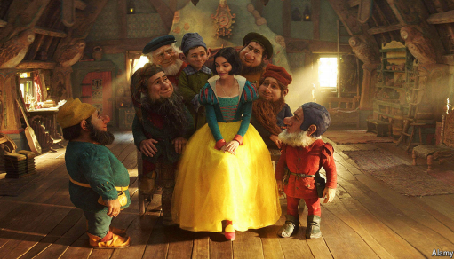

# What the controversial new “Snow White” can teach Hollywood

*Remakes are a riskier business than studios realise*

原文：

**“S**NOW WHITE”, Disney’s live-action remake of a beloved

animated film, had an icy reception before its release in cinemas on

March 21st. A trailer posted three months ago has earned just

60,000 likes and over 1m dislikes. “If I saw this movie on a plane I

would still walk out,” grumbled one YouTube user. “We thankfully

have the technology nowadays to make the animation look worse

than the original from 1937,” groaned another.

迪士尼根据一部受人喜爱的动画电影改编的真人版《白雪公主》在3月21日上映前反响冷淡。三个月前发布的预告片仅获得了6万个赞，超过100万个不喜欢。“如果我在飞机上看这部电影，我还是会走出去，”一名YouTube用户抱怨道。“谢天谢地，我们现在有技术让这部动画看起来比1937年的原版还要糟糕，”另一个人抱怨道。

学习：

live-action：真人版的          

remake：翻拍（电影等）；改造；改编（电影或歌曲等）；重新制作

had an icy reception：受到冰冷的接待

walk out：突然离去；愤然离去；走出；出走；

grumbled：怨言；发牢骚；抱怨；（grumble的过去式和过去分词）          

groaned：叹息；抱怨；（groan的过去式和过去分词）          

原文：

Among the remake’s many sins are seven in particular: the

dwarves, who have been cheesily rendered with computer

generated imagery (CGI), after a row over whether it was

politically correct to have actors with dwarfism in the roles. (In the

face of criticism, Disney recast the film’s dwarves as “magical

creatures”—whatever that means.) There is also the issue of Rachel

Zegler, the actress chosen to play Snow White, who panned the

original film as “extremely dated” and said that the prince “literally

stalks” the princess. It turns out fans do not like it when a remake’s

heroine villainises the classic film that inspired it.

“这部翻拍版电影有七大槽点，尤其是小矮人的设计：迪士尼因‘是否该由侏儒症演员出演’的争议，最终用电脑特效（CGI）粗制滥造地呈现了他们。（面对批评，迪士尼将小矮人改称为‘魔法生物’——天知道这是什么意思。）另一个争议点是饰演白雪公主的女演员瑞秋·泽格勒（Rachel Zegler），她批评原版电影‘极度过时’，并称王子‘根本是在跟踪公主’。事实证明，当翻拍版的女主角将经典原版‘妖魔化’时，粉丝们可不买账。”

学习：

sin：罪过

dwarves：矮子；侏儒；（dwarf的复数）

dwarfism：侏儒症；矮小症；矮小状态；发育不全；矮小型

pan：[非正式用语]严厉的批评；

stalk

heroine：美 [ˈheroʊɪn] 英雄；女侠；女战士；女性模范；女主角；

>### **1. "cheesily" 的含义**  
>**"cheesily"** 是形容词 **"cheesy"** 的副词形式，在英语中常含贬义，形容某物 **“俗气、廉价、做作”**，尤其指刻意讨好却显得低劣或不真诚。  
>
>• **文中用法**：  
>  > *"the dwarves, who have been **cheesily** rendered with computer-generated imagery (CGI)"*  
>  > → **“小矮人的CGI效果做得极其俗气”**（批评迪士尼用电脑特效替代真人演员，效果廉价且不自然）。  
>
>• **其他例子**：  
>  • *"The movie's special effects looked **cheesily** fake."*（电影特效假得掉渣。）  
>  • *"He gave her a **cheesy** pickup line."*（他对她说了一句土味情话。）  
>
>---
>
>### **2. "stalk" 的含义**  
>**"stalk"** 本义是 **“跟踪、尾随”**（带有骚扰或威胁意味），在文中被演员Rachel Zegler用来批评原版《白雪公主》的剧情：  
>
>• **文中引用**：  
>  > *"the prince ‘literally **stalks**’ the princess"*  
>  > → **“王子‘简直是在跟踪’公主”**（暗指原版中王子追求公主的方式在当代看来像骚扰）。  
>
>• **引申批评**：  
>  • 原版童话中，王子通过亲吻昏迷的白雪公主“拯救”她，这种情节在现代视角下可能被视为 **“非自愿接触”**。  
>
>### 
>> ****
>
>---
>
>**. 关键术语解析**  
>
>| 英文词汇                | 文中含义           | 翻译/解释          |
>| ----------------------- | ------------------ | ------------------ |
>| **cheesily**            | CGI效果廉价俗气    | 粗制滥造地、俗气地 |
>| **stalk**               | 王子行为像跟踪骚扰 | 跟踪、尾随         |
>| **politically correct** | 政治正确争议       | 是否冒犯少数群体   |
>| **villainises**         | 将经典污名化       | 妖魔化、贬低       |
>
>---
>
>**. 文化背景补充**  
>
>• **迪士尼的“政治正确”困境**：  
>  原版《白雪公主》（1937年）中，小矮人由侏儒症演员扮演，但现代翻拍版因担心被批“刻板印象”改用CGI，结果被嘲 **“两头不讨好”**。  
>• **女性主义视角的争议**：  
>  Rachel Zegler的言论反映现代女性主义对传统童话的批判，但粉丝认为她 **“否定经典”** 的行为反而招致反感。  

原文：

By respinning familiar tales, remakes can offer studios a surer path

towards commercial riches. In the amount of pushback and

controversy it has faced, “Snow White” is unusual. But in another

way the film reflects a current trend, which is for studios to reach

further back in history for source material. From 2020 to 2024 the

average age of the source films that new remakes were based on

was 35. That is about 13 years older than from 2011 to 2015,

according to our analysis of data from The Numbers, a film

website.

通过重播熟悉的故事，翻拍可以为电影公司提供一条更可靠的商业致富之路。《白雪公主》面临了大量的反对和争议，这是不寻常的。但从另一方面来说，这部电影反映了当前的一个趋势，那就是电影公司要追溯到更久远的历史来寻找素材。从2020年到2024年，新翻拍电影的平均年龄是35岁。根据我们对电影网站Numbers的数据分析，这比2011年至2015年的数据高出约13年。

学习：

pushback：（对政策、规范等的）抗拒、反对；抵制

source material：素材来源；源材料；源物质；材料来源         

>
>
>**"respinning" 的含义及解析**  
>
>**原文：**  
>*"By **respinning** familiar tales, remakes can offer studios a surer path towards commercial riches."*  
>
>**1. 基本定义**  
>
>**"respinning"** 是动词 **"respin"** 的现在分词形式，由前缀 **"re-"（重新）** + **"spin"（编织、讲述）** 构成，字面意思是 **“重新编织（故事）”**，引申为：  
>• **对经典故事进行改编或重新诠释**（通常指电影、文学等作品的翻拍或再创作）。  
>• 强调 **在原有框架上加入新元素**，而非完全复制。  
>
>**2. 文中具体含义**  
>
>• 指好莱坞通过 **翻拍（remakes）** 或 **重新演绎经典故事** 来降低商业风险（因观众已熟悉原作）。  
>• 与单纯“翻拍”（*remake*）不同，**"respinning"** 隐含 **“调整叙事角度或价值观”** 以适应现代观众口味。  
>
>**3. 情感色彩**  
>
>• **中性偏实用主义**：  
>  • 不直接褒贬，但暗示这是一种 **商业策略**（而非纯粹艺术创新）。  
>  • 类似中文的 **“老调新弹”** 或 **“旧瓶装新酒”**。  
>
>**4. 类似表达对比**  
>
>| 英文词汇       | 侧重含义     | 中文对应             |
>| -------------- | ------------ | -------------------- |
>| **respinning** | 重新诠释经典 | 翻新演绎、老调新弹   |
>| *remaking*     | 直接翻拍     | 翻拍、重制           |
>| *rebooting*    | 重启系列     | 重启（如新系列开篇） |
>
>**5. 例句扩展**  
>
>• *"The director is **respinning** Shakespeare’s ‘Hamlet’ as a cyberpunk thriller."*  
>  （导演将《哈姆雷特》**重新演绎**为赛博朋克惊悚片。）  
>• *"Disney’s live-action films often **respin** animated classics with modern values."*  
>  （迪士尼的真人电影常以现代价值观**重新诠释**动画经典。）  
>
>---
>
>**整句翻译建议**  
>
>> **“通过**重新演绎**熟悉的故事，翻拍电影能为制片公司提供一条更稳妥的赚钱路径。”**  
>
>---
>
>**为什么用 "respinning" 而非 "remaking"？**  
>
>• **"remake"** 仅强调“再次制作”，而 **"respin"** 突出 **叙事或角度的调整**（如《白雪公主》加入女性主义批判）。  
>• 呼应后文提到的 **“回溯更早的素材”**（*reach further back in history*）——不仅是翻拍，更是对老故事的现代化改造。  
>
>其他问题？比如 **"pushback"（抵制）** 或 **"source material"（素材来源）** 的具体含义？

原文：

What makes for a successful remake? It is a question on the minds

of many Hollywood executives, as well as cinephiles. To answer it,

*The Economist* analysed 200 remakes released since 1995; each

had a minimum of 5,000 ratings on IMDb, an online movie

database. (Our analysis only includes remakes of films, not

adaptations of books.) Three lessons stand out.

成功翻拍的要素是什么？这是许多好莱坞高管和影迷心中的疑问。为了回答这个问题,《经济学人》分析了自1995年以来发行的200个翻拍版本；在在线电影数据库IMDb上，每部电影都有至少5000次评级。(我们的分析只包括电影的翻拍，不包括书籍的改编。)三个教训比较突出。

学习：

cinephile：美 [ˈsɪnəˌfaɪl]  影迷；电影爱好者；电影狂热者

原文：

First, it is not enough to use state-of-the-art special effects;

computer-generated imagery needs to be handled carefully. Of the

20 worst remakes (as measured by IMDb audience ratings), half are

horror films, in part because of their use of unconvincing special

effects. In the fifth-worst-rated, a remake in 2005 of John

Carpenter’s cult classic “The Fog” from 1980*,* a supernatural,

vengeful fog descends on an island town off the coast of Oregon.

Cheap shocks substitute for tension: viewers have complained that

the fog moves too quickly and that ghosts in the fog (never clearly

visible in the original) are hokey, a complaint also made by viewers

about the dwarves in the new “Snow White”.

第一，用最先进的特效是不够的；计算机生成的图像需要小心处理。在20部最差的重拍电影中(以IMDb收视率衡量)，有一半是恐怖片，部分原因是它们使用了难以令人信服的特效。在2005年翻拍的约翰·卡彭特1980年的邪教经典“迷雾”中，一场超自然的复仇之雾降临在俄勒冈州海岸的一个岛上小镇，这是排名第五的最差电影。廉价的冲击代替了紧张:观众抱怨雾移动得太快，雾中的鬼魂(在原版中从未清晰可见)很做作，观众也抱怨新《白雪公主》中的小矮人。

学习：

special effects：特效

imagery：图像；视觉效果；

cult：邪教

vengeful：复仇的；心存报复的；怀恨在心的；报复性的

hokey：做作的；虚假的；

原文：

Second, comedies come with grave risks. This is the worst

performing genre for remakes, earning an average IMDb rating 1.5

points (out of ten) lower than the originals. Comedy remakes also

tend to make the least at the box office. Not a single one

significantly outshines the original film it was based on, according

to audience ratings. It may be that viewers of comedies and horrors

crave an element of surprise, which is hard to offer in a faithful

remake, because audiences already know which gags and gasps to

expect.

其次，喜剧伴随着严重的风险。这是翻拍电影中表现最差的类型，平均IMDb评分比原版低1.5分(满分10分)。喜剧翻拍也往往票房最低。根据观众评分，没有一部电影比它所基于的电影更出色。喜剧和恐怖片的观众可能渴望一种惊喜的元素，这在忠实的重拍中很难提供，因为观众已经知道会发生什么样的笑话和喘息。

学习：

crave：渴望；热望；

gags：恶作剧；玩笑；噱头

gasp：喘气；（gasp的复数）

原文：

The best remakes get their inspiration from abroad. Since 1995

about a third of the top remakes have been based on foreign source

material, including six of the top ten. So are the only two remakes

to have won Academy Awards for Best Picture: “The Departed”

(2006), based on a Hong Kong film, and “CODA” (2021), based on

a French-Belgian one.

最好的翻拍从国外获得灵感。自1995年以来，大约三分之一的翻拍作品是基于外国素材，包括前十名中的六个。仅有的两部获得奥斯卡最佳影片奖的翻拍电影也是如此:根据香港电影改编的《无间道》(2006)和根据法国和比利时电影改编的《尾声》(2021)。

原文：

Unfamiliarity with the originals may mean that audiences come in

with lower expectations and without any attachment to the original.

Take “Bugonia”, starring Emma Stone, set to be released in

November. It is an English-language remake of a South Korean

film; instead of a male chief executive, the new story centres on a

female one. However, audiences, lacking knowledge of the

original, are unlikely to kick up a fuss about the change. The same

cannot be said of the new “Snow White”, which seems destined for

an unhappily-ever-after ending. ■

对原作的不熟悉可能意味着观众对原作的期望较低，对原作没有任何依恋。以艾玛·斯通主演的《布戈尼亚》为例，该片将于11月上映。这是一部韩国电影的英文翻拍版；新的故事以一位女性首席执行官为中心，而不是男性首席执行官。然而，缺乏原著知识的观众不太可能对这一改动大惊小怪。新的《白雪公主》就不一样了，它似乎注定了一个不愉快的结局。■

学习：

fuss：美 [fʌs] 大惊小怪；小题大做；（为小事）大吵大闹；

kick up a fuss：大吵大闹；大发牢骚；引起骚动；制造麻烦；抱怨不停          

>### **"unhappily-ever-after" 的含义及解析**  
>
>**原文：**  
>*"The same cannot be said of the new ‘Snow White’, which seems destined for an **unhappily-ever-after** ending."*  
>
>**1. 词源与背景**  
>
>• **戏仿经典童话结局**：  
>  童话故事常以 **"happily ever after"（从此幸福快乐）** 结尾（如《白雪公主》原版）。  
>• **"unhappily-ever-after"** 是作者故意仿造的短语，将 **"happy"** 替换为 **"unhappy"**，形成反讽效果。  
>
>**2. 文中具体含义**  
>
>• 指新版《白雪公主》电影 **可能因争议和批评而失败**（商业或口碑上），无法像童话那样“圆满收场”。  
>• 暗示：  
>  • 电影因政治正确争议（如小矮人CGI、女性主义改编）**招致观众反感**。  
>  • 与《Bugonia》（无人熟知原版）不同，《白雪公主》的经典地位让观众更难接受改动。  
>
>**3. 情感色彩**  
>
>• **幽默与讽刺**：  
>  • 用童话式语言调侃电影的困境，类似中文 **“注定悲剧收场”** 或 **“翻车结局”**。  
>• 对比前文：  
>  • 《Bugonia》因观众不熟悉原版而 **"won’t kick up a fuss"（不会闹腾）**。  
>  • 《白雪公主》则因粉丝的经典情结 **“难逃厄运”**。  
>
>**4. 类似表达**  
>
>| 英文表达                 | 含义           | 中文对应      |
>| ------------------------ | -------------- | ------------- |
>| **happily ever after**   | 童话式圆满结局 | 从此幸福快乐  |
>| **unhappily-ever-after** | 反讽式失败结局 | 注定悲剧/翻车 |
>| *doomed to fail*         | 注定失败       | 难逃厄运      |
>
>---
>
>**整句翻译建议**  
>
>> **“但新版《白雪公主》就没这么幸运了，它似乎注定会迎来一个**‘不幸福快乐’的结局**。”**  
>> （保留反讽语气，或意译为 **“注定以惨败收场”**。）  
>
>---
>
>**为什么用这个表达？**  
>
>• **文化共鸣**：直接借用童话套路，让读者瞬间理解电影的“理想与现实落差”。  
>• **幽默效果**：用轻松的语言消解严肃批评，符合《经济学人》一贯的犀利文风。  
>
>其他问题？比如 **"kick up a fuss"（闹腾）** 或 **"destined for"（注定）** 的用法？

## 后记

2025年4月4日21点17分于上海。