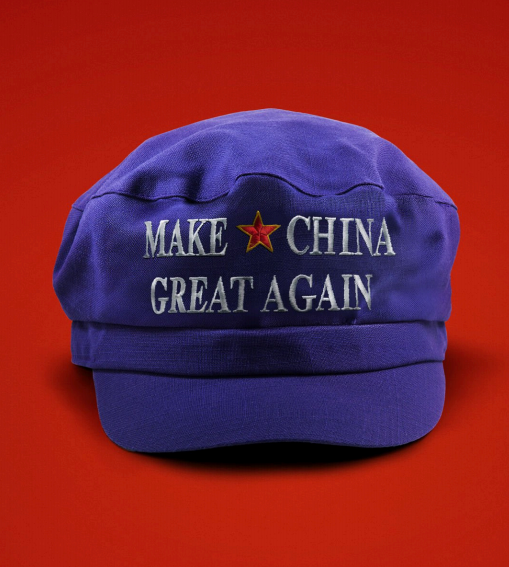

# How America could end up making China great again

*A big beautiful opportunity*	

原文：

**A**S DONALD TRUMP unleashes a volley of tariffs and his

administration talks up the strength of its military alliances in Asia,

you might think that these are anxious times in the country that

America sees as its main adversary. In fact, our reporting from

Beijing reveals a very different picture. MAGA is putting pressure

on China’s leaders to correct their worst economic errors. It is also

creating opportunities to redraw the geopolitical map of Asia in

China’s favour.

随着唐纳德·特朗普(DONALD TRUMP)推出一系列关税，以及他的政府大谈其在亚洲的军事联盟的实力，你可能会认为，这个被美国视为主要对手的国家正处于焦虑时期。事实上，我们来自北京的报道揭示了一个非常不同的画面。MAGA向中国领导人施压，要求他们纠正最严重的经济错误。这也为重新绘制有利于中国的亚洲地缘政治地图创造了机会。

学习：

unleash：释放；解开；发动；引发；激发（情感或能力）

volley：美 [ˈvɑːli] 连续射击；齐投；群射；

原文：

China has come out badly from Mr Trump’s Rose Garden rant·.

Counting the new levy of 34%, plus existing duties, the total rises

to 65%—and slightly higher if you include the disruptive removal

of a tariff exemption for small packages. Given that exports are still

roughly 20% of GDP, as they were in 2017, this will hurt China’s

economy. China’s tactic of rerouting its firms’ manufacturing

chains through countries such as Vietnam to bypass tariffs will

work less well now that America is erecting barriers globally

特朗普在玫瑰园的夸夸其谈给中国留下了不好的印象。算上新征收的34%的税，加上现有的关税，总数上升到65%——如果包括破坏性的取消小包装关税豁免，这个数字还会略高。鉴于出口仍约占GDP的20%，就像2017年一样，这将损害中国经济。鉴于美国正在全球范围内设置壁垒，中国通过越南等国转移其公司制造链以绕过关税的策略将不再奏效

学习：

https://en.wikipedia.org/wiki/White_House_Rose_Garden

Rose Garden:

>It is commonly used as a stage for receptions and media events due to its proximity to the White House.

rant：狂言；大话；夸夸其谈；豪言壮语；

rerouting：重编路线；重编路由

原文：

The trade war comes as China is still struggling with deflation, a

housing bust and dismal demography. For the past five years the

Communist Party has neglected weak consumption and embraced

an unwise statism that has cramped the private sector. China has

exported its overcapacity, swamping the world with goods, and

fostered a spiky chauvinism that unsettles America’s allies both in

Asia and Europe.

贸易战爆发之际，中国仍在与通货紧缩、房地产泡沫破裂和惨淡的人口状况作斗争。在过去的五年里，领导人忽视了疲软的消费，并采取了不明智的中央集权政策，这限制了私营部门的发展。中国输出了过剩的产能，用商品淹没了世界，并助长了让美国在亚洲和欧洲的盟友不安的尖锐的沙文主义。

学习：

bust：泡沫破裂

statism：国家主义；中央集权制；国家控制主义；国家干预主义；国家至上主义

cramp：限制…的发展；束缚；使受限

spiky：尖锐的；有尖刺的

chauvinism：美 [ˈʃoʊvɪnɪzəm] 沙文主义；盲目爱国主义；

原文：

Despite all this, China enters the new age of MAGA stronger than

in Mr Trump’s first term. President Xi Jinping has long argued that

America is too polarised and overstretched to sustain its global

role. One of his slogans warns of “great changes unseen in a

century”. His paranoid nationalism used to seem like dystopian

hyperbole. Now that Mr Trump is committing such wanton self

harm and general destruction, it looks ahead of its time.

现在，特朗普正在犯下如此肆意的自残和全面破坏，这看起来是超前的。

学习：

paranoid： 美 [ˈpærənɔɪd] 偏执的；多疑的；妄想的；患偏执症的；

hyperbole：美 [haɪˈpɜːrbəli] 夸张；夸张的修辞；夸张手法 **注意发音**

wanton：放纵；肆意嬉戏；恣意玩耍；无节制地行为

原文：

Mr Xi has been preparing for today’s chaotic world ever since

becoming China’s leader in 2012. He has urged economic and

technological self-sufficiency on his country. China has reduced its

vulnerability to American chokeholds, such as sanctions and export

controls. Although its banks still need access to dollars, it now

makes most non-bank international payments in yuan.

自2012年成为中国领导人以来，Xi一直在为当今混乱的世界做准备。他敦促他的国家在经济和技术上自给自足。中国已经减少了对美国的限制的脆弱性，如制裁和出口控制。尽管中国的银行仍需要美元，但中国现在用人民币进行大多数非银行国际支付。

学习：

chokehold：窒息控制；压制；控制手段；

原文：

China’s domestic economy has unrecognised strengths.

Competition and an embrace of technology mean that its industrial

firms thrash Western rivals in everything from electric vehicles to

the “low-altitude economy”, meaning drones and flying taxis.

Viewed from China, Mr Trump’s tariffs will condemn Detroit to

1970s-style obsolescence, just as his crusade against universities·

will set back innovation.

中国国内经济有着不为人知的优势。竞争和对技术的拥抱意味着它的工业公司在从电动汽车到“低空经济”，即无人机和飞行出租车的所有领域都击败了西方对手。从中国的角度来看，特朗普的关税将使底特律陷入上世纪70年代式的过时状态，正如他对大学的讨伐将阻碍创新一样。

学习：

thrash：美 [θræʃ] 痛打；鞭打；（作为惩罚用棍子等）抽打；连续击打；

low-altitude economy：低空经济

obsolescence： 美 [ˌɑːbsəˈlesns] 过时；陈旧；废弃

crusade：（长期而坚定的） 努力奋斗；奋斗；讨伐

原文：

One example of China’s promise is DeepSeek, which is taken as a

sign that the country can innovate around America’s semiconductor

embargoes. The party is comfortable with home-grown AI, and this

could allow the technology to diffuse through China faster than the

West, boosting productivity. That, and signs Mr Xi may have

grown more tolerant of entrepreneurs, help explain why the MSCI

index of Chinese shares has risen by 15% in 2025, even as

American stocks have slid.

中国希望的一个例子是DeepSeek，它被视为该国能够绕过美国半导体禁运进行创新的标志。党对本土人工智能感到满意，这可能使技术在中国的传播速度快于西方，从而提高生产率。这一点，以及Xi可能对企业家越来越宽容的迹象，有助于解释为什么2025年摩根士丹利资本国际(MSCI)中国股票指数上涨了15%，尽管美国股市有所下滑。

学习：

embargoes：美 [emˈbɑ:ɡəuz] 禁止；封港令；禁运（令）；禁运；（embargo的复数）

slid：滑动；滑落；（slide的过去分词）

原文：

Four years after the bubble burst, property is at last becoming less

of a drag on growth. In some cities, including Shanghai and

Nanjing, prices have even started to rise. The party has also

belatedly taken steps to boost consumption. Local governments can

refinance themselves with 6trn yuan ($830bn) of new bonds over

three years, and another 4.4trn of “special” bonds this year. Some

extra money will go to households.

泡沫破裂四年后，房地产对经济增长的拖累终于减轻了。在包括上海和南京在内的一些城市，房价甚至开始上涨。党也采取了迟来的措施来刺激消费。地方政府可以在三年内发行6万亿元人民币(8300亿美元)的新债券，并在今年发行4.4万亿元人民币的“特别”债券。一些额外的钱将会发放给家庭。

学习：

belatedly：延续地；延迟地

原文：

To grasp the full economic opportunities, the party needs to stop

persecuting the private sector. Even China’s Leninist autocrats

realise the “common prosperity” crackdown on entrepreneurs that

began in 2021 went too far. Although some zealous officials have

yet to get the message, Li Qiang, Mr Xi’s deputy, used a speech on

March 23rd to laud the “dragons” of Hangzhou, China’s capital of

innovation.

为了抓住所有的经济机会，需要停止迫害私营部门。始于2021年的对企业家的“共同富裕”打击有些过头了。尽管一些热心的官员还没有得到消息，Xi的副手李强在3月23日的一次演讲中称赞了中国创新之都杭州的“龙”。

学习：

persecuting：迫害；困扰；烦扰；（persecute的现在分词形式）

deputy：副手；副职

laud：赞美；颂扬；赞扬；称赞

原文：

The economy will also need more stimulus to boost consumption,

and more determined efforts to stabilise the property market, which

still weighs on household confidence. Extra consumption would

benefit Chinese relations abroad too, by helping absorb surplus

capacity. As America puts up walls, China will have a chance to

reset trade relations around the world by offering to invest in

manufacturing in partner countries rather than flooding them with

exports.

中国经济还需要更多刺激措施来提振消费，并需要更坚定的努力来稳定房地产市场，目前房地产市场仍在打压家庭信心。通过帮助吸收过剩产能，额外消费也将有益于中国的海外关系。随着美国筑起高墙，中国将有机会通过投资伙伴国的制造业，而不是向其出口大量商品，来重置全球贸易关系。

原文：

These economic opportunities sit alongside a geopolitical one.

America’s China policy is alarmingly unclear. Hawks in the

administration insist that, by turning away from Europe, America is

freeing up resources to contain China. However, Mr Trump

admires Mr Xi and has sent an ally, Senator Steve Daines, to

Beijing to put out feelers for a deal. In his first term, Mr Trump

struck a trade agreement with China; now he wants to haggle over

TikTok.

这些经济机遇与地缘政治机遇并存。美国的中国政策令人担忧地不清楚。政府中的鹰派坚持认为，通过远离欧洲，美国正在释放资源来遏制中国。然而，川普钦佩Xi，并已派一名盟友、参议员史蒂夫·戴恩斯(Steve Daines)来北京试探达成协议的可能性。特朗普在第一个任期内与中国达成了一项贸易协定；现在他想在TikTok问题上讨价还价。

学习：

feeler：触角；触须；试探性行动；探索性举措

haggle：美 [ˈhæɡəl] 讨价还价；砍价；讲价钱          

原文：

China is betting that MAGA talk of a “reverse Kissinger” deal,

with America prising Russia away from China, is silly. And

Trumpian protectionism, ally-abuse and indifference to human

rights are a repudiation of American values: the beacon of the free

world now seems capricious and dangerous. Mr Xi has no intention

of filling the vacuum left by Uncle Sam, but he has a chance to

expand China’s influence, especially in the global south. If, as well

as spreading clean technologies, China becomes bolder about

cutting emissions at home·, it could show leadership on climate

change.

中国认为，MAGA关于“反向基辛格”交易（会把俄罗斯从中国身边赶走）的说法是愚蠢的。特朗普式的保护主义、背弃盟友和对人权的漠视是对美国价值观的批判:自由世界的灯塔现在看起来反复无常且危险。Xi无意填补山姆大叔留下的真空，但他有机会扩大中国的影响力，尤其是在发展中世界。如果中国在传播清洁技术的同时，在国内减排方面变得更加大胆，它可能会在气候变化问题上显示出领导力。

学习：

abuse：虐待；诋毁；伤害；

>
>这里的 **“ally-abuse”** 是一个政治术语，指美国（尤其是特朗普政府时期）对传统盟友的 **轻视、打压或利用**，导致盟友关系受损。具体来说，它可能包括以下行为：  
>
>**1. 具体含义**  
>
>• **单边主义**：无视盟友利益，强行推行“美国优先”政策（如退出《巴黎协定》、伊核协议等）。  
>• **经济胁迫**：对盟友加征关税（如对欧盟钢铝关税）或威胁制裁（如要求北约成员国增加军费）。  
>• **言语侮辱**：公开贬低盟友领导人（如称德国“被俄罗斯控制”、嘲讽加拿大总理特鲁多“两面派”）。  
>
>**2. 上下文分析**  
>
>原文提到，特朗普政府的 **“ally-abuse”**（对盟友的粗暴对待）与其 **保护主义（protectionism）** 和 **对人权的漠视（indifference to human rights）** 共同构成对美国价值观的背离，导致国际社会认为美国 **“反复无常且危险”（capricious and dangerous）**。  
>
>**3. 中文对应表述**  
>
>可译为：  
>• **“践踏盟友”**（强调伤害性）  
>• **“背弃盟友”**（强调背叛）  
>• **“欺凌盟友”**（突出霸权行为）  
>
>**4. 类似概念**  
>
>• **“Abandonment of allies”**（抛弃盟友）：如美国从阿富汗撤军。  
>• **“Transactional diplomacy”**（交易式外交）：将盟友关系视为利益交换。  
>
>**总结**  
>
>“ally-abuse” 在此语境中批判了美国外交的功利化倾向，中国则试图利用这一机会扩大影响力（尤其在“全球南方”），同时通过气候行动等议题塑造领导力。

repudiation：美 [rɪˌpjudiˈeʃən] 否认；拒绝；抛弃；断绝关系

capricious：美 [kəˈprɪʃəs] （态度或行为）反复无常的；任性的；多变的；变化无常的；变幻莫测的；

原文：

Mr Trump’s disdain for NATO and Ukraine have corroded

confidence in his commitment to Asian allies and willingness to

fight for Taiwan. If America makes more of its own advanced

semiconductors, its incentive to defend Taiwan will decrease. This

is a gift for Mr Xi.

特朗普对北约和乌克兰的蔑视，削弱了人们对他对亚洲盟友的承诺以及为台湾而战意愿的信心。如果美国更多地制造自己的先进半导体，它保护台湾的动力就会减弱。这是给Xi先生的礼物。

学习：

disdain：轻蔑；藐视；不屑；鄙视；

corroded：美 [kəˈrəudid] 侵蚀；（corrode的过去式和过去分词）

原文：

Still, dangers lie ahead for China. A trade war could trigger a global

recession. If Mr Trump fails to strike a deal with the government in

Beijing, he could lash out over currencies and impose more

sanctions. China may yet poison relations with the rest of the world

by dumping exports on it. Whether it seizes this moment depends

on one man: Mr Xi. But the fact the opportunity exists owes much

to another: Mr Trump. ■

学习：

owe to：归功于

## 后记

2025年4月5日19点40分于上海。