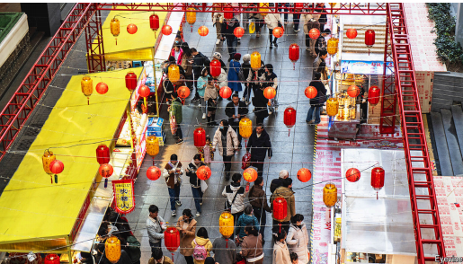

# As Donald Trump’s trade war heats up, China is surprisingly confident

*Should it be?*

原文：

**F**OR THE second time in less than a decade, the world’s biggest

importer is pummelling the world’s biggest exporter with tariffs.

On April 2nd America landed its biggest blow yet, raising the

average levy on Chinese goods above 60%. Yet the mood in

Beijing is not one of panic.

在不到十年的时间里，全球最大的进口国第二次对全球最大的出口国征收关税。4月2日，美国发动了迄今为止最大的一次打击，将中国商品的平均关税提高到60%以上。然而，北京的气氛并不恐慌。

学习：

pummel：美 [ˈpəməl]  捶打；连续猛击；反复拳打

原文：

In response to Donald Trump’s first term as president, Xi Jinping,

China’s leader, initiated a campaign to reduce China’s economic

dependence on America. Chinese officials are hoping that a revival

in domestic demand, after four years of property troubles and two

years of deflation, can cushion the blow from Mr Trump’s war on

trade. As proof that consumers are cheering up, Li Qiang, China’s

prime minister, has pointed to *Ne Zha 2*, an animated film that

smashed box-office records during the Spring Festival holiday.

Whereas American investors have recoiled at their new

government’s protectionism, sending the S&P 500 down by nearly

4% so far this year, the MSCI China index is up by 15% (see chart

1).

作为对唐纳德·特朗普第一届任期的回应，中国领导人发起了一场减少中国对美国经济依赖的运动。中国官员希望，在经历了四年的房地产问题和两年的通缩后，国内需求的复苏能够缓冲特朗普贸易战的打击。作为消费者振奋精神的证据，中国总理李强提到了春节期间打破票房纪录的动画电影《哪吒2》。尽管美国投资者对新政府的保护主义有所畏惧，导致标准普尔500今年迄今下跌近4%，但摩根士丹利资本国际中国指数却上涨了15%(见图表1)。

学习：

cushion：美 [ˈkʊʃn] 减轻冲击；起缓冲作用；缓和冲击；

recoil：退缩；畏缩

原文：

China has lots of experience of Mr Trump. His first administration

punished China for obliging American firms to hand over

intellectual property, under a legal provision, Section 301, that

allows the president to act against countries that abuse international

trade. A seven-month inquiry concluded that China’s extraction of

technology had cost America at least $50bn a year. Mr Trump’s

team therefore slapped tariffs on a similar sum of Chinese imports,

from arc lamps to chicken incubators. When China retaliated with

levies of its own, America upped the ante. By the end of the tussle,

America had imposed tariffs on roughly two-thirds of Chinese

goods. At its worst, the war reduced China’s GDP by as much as

0.8%, according to Goldman Sachs, a bank. America also almost

crippled one of the country’s leading telecoms companies, ZTE, by

denying it access to American technology, before Mr Trump spared

it as a personal “favour” to Mr Xi. The president’s team later

targeted Huawei, an even bigger icon, which America deemed a

threat to national security

中国对特朗普有很多经验。他的第一届政府根据301条款惩罚中国迫使美国公司交出知识产权，该条款允许总统对滥用国际贸易的国家采取行动。一项为期7个月的调查得出结论，中国提取技术每年至少花费美国500亿美元。因此，特朗普的团队对类似数量的中国进口商品征收关税，从弧光灯到小鸡孵卵器。当中国以自己的征税进行报复时，美国加大了赌注。争斗结束时，美国已经对大约三分之二的中国商品征收关税。根据高盛银行的数据，在最糟糕的情况下，贸易战使中国的GDP减少了0.8%。美国还差点让该国领先的电信公司之一中兴通讯(ZTE)陷入瘫痪，因为拒绝向它提供美国技术，后来特朗普作为个人“恩惠”放过了它。总统团队后来将目标对准了华为，一个更大的标志，美国认为它对国家安全构成了威胁

学习：

oblige：强迫；迫使

retaliated：报复；（retaliate的过去式和过去分词）

ante：英 [ˈanti] 赌注；底注（扑克牌游戏中每位玩家在发牌前必须交纳的赌注）

tussle：争斗，争端

cripple：严重损害；严重毁坏；给…造成严重障碍；削弱…的力量（或效能）

## **Urgent divergence**

原文：

Since then, China has tried to become less beholden to America as

either a market for its wares or as a supplier of vital technologies. It

now sells less than 15% of its exports to America, down from

almost a fifth in 2017. Its tech companies are also more robust.

Huawei has shown that it can produce surprisingly snazzy

semiconductors, despite the efforts of both Mr Trump and Mr

Biden to deny it access to advanced chips and chipmaking

equipment. DeepSeek, a Chinese AI firm, can almost match the

best Western large language models at a fraction of the cost. When

Mr Xi met global CEOs in Beijing on March 28th, his chest was

out: the message was, China’s technological prowess is greater than

ever.

从那以后，中国试图不那么依赖美国，无论是作为其商品的市场还是关键技术的供应商。它现在对美国的出口不到15%，低于2017年的近五分之一。它的科技公司也更加稳健。尽管特朗普和拜登都试图阻止华为获得先进的芯片和芯片制造设备，但华为已经证明，它能够生产出令人惊讶的华丽的半导体。中国人工智能公司DeepSeek几乎可以以极低的成本与最佳西方大型语言模型相媲美。3月28日，当Xi先生在北京会见全球首席执行官时，他吐露了心声:中国的科技实力比以往任何时候都要强大。

学习：

beholden

>
>
>这里的 **“beholden”** 是一个形容词，意思是 **“受惠于…的；依赖于…的；受制于…的”**，通常带有一种 **“因依赖而不得不感激或受约束”** 的负面含义。  
>
>**1. 具体含义**  
>
>• **在经济/技术依赖的语境下**：指中国过去在 **出口市场（美国）** 和 **关键技术（如芯片、AI）** 上对美国有较大依赖，但现在正努力减少这种依赖。  
>• **隐含的负面含义**：依赖往往意味着 **受制于人**（如美国对华为的制裁），因此中国希望摆脱这种被动局面。  
>
>**2. 原文分析**  
>
>> **“China has tried to become less beholden to America as either a market for its wares or as a supplier of vital technologies.”**  
>> （中国正努力减少对美国的两方面依赖：一是作为其商品的出口市场，二是作为关键技术的供应方。）  
>
>• **“beholden to America”** = **“受制于美国”** 或 **“依赖美国”**  
>• **“less beholden”** = **“减少依赖”**（强调自主性提升）  
>
>**3. 类似表达**  
>
>• **Dependent on**（中性，单纯表示依赖）  
>• **Reliant on**（中性）  
>• **At the mercy of**（更负面，强调受摆布）  
>
>**4. 中文翻译建议**  
>
>根据语境，可灵活译为：  
>• **“受制于”**（强调被动性）  
>• **“依赖”**（中性表述）  
>• **“受惠于”**（若依赖带来好处，但此处更偏向负面）  
>
>**5. 例句对比**  
>
>• 原句：*“He didn’t want to be beholden to anyone.”*  
>  → **“他不想欠任何人的人情。”**（情感依赖）  
>• 本文：*“Less beholden to America”*  
>  → **“减少对美国的依赖”**（经济/技术自主）  
>
>**总结**  
>
>“beholden” 在此处强调中国正摆脱对美国市场和技术的 **被动依赖**，体现其追求自主可控的战略方向（如华为芯片突破、DeepSeek AI 发展）。

snazzy：时髦的；华丽的；漂亮的；炫目的；吸引人的

his chest was out：吐露心声

原文：

Unfortunately, Mr Trump’s second trade shock will be much

stronger than the first. He had already raised tariffs on Chinese

goods by 20 percentage points since returning to power, lifting the

average rate above 30% (see chart 2). On April 2nd he said he will

raise tariffs by another 34 points. He also removed a loophole that

allowed packages worth less than $800 to escape duties. Further

imposts may be on the way. America might, for instance, charge

ships built in China an extra fee for docking in its ports.

不幸的是，特朗普的第二次贸易冲击将比第一次强烈得多。自重新掌权以来，他已经将中国商品的关税提高了20个百分点，将平均税率提高到30%以上(见图表2)。4月2日，他说他将把关税再提高34个百分点。他还消除了一个允许价值低于800美元的包裹逃避关税的漏洞。更多的关税可能即将出台。例如，美国可能会向中国制造的船只收取停靠其港口的额外费用。

## **Trump thump**

原文：

Mr Trump’s ultimate goals are obscure. America’s president has

painted tariffs as bargaining chips to win concessions from trading

partners. On March 26th, for instance, he floated the possibility of

reducing tariffs if China permits the sale of TikTok, a Chinese

owned short-video site that is popular in America. A few days

earlier Steve Daines, a senator and emissary of Mr Trump, told one

of China’s deputy prime ministers that trade talks were not possible

until China stemmed the flow of fentanyl precursors into the

Americas. Mr Trump has also described tariffs variously as a

source of revenue, a means to attract investment in manufacturing,

and a way to eliminate trade deficits, which he regards as robbery.

Even if China is eventually able to negotiate some degree of relief,

few in Beijing expect a deal to be struck soon.

特朗普的最终目标模糊不清。美国总统将关税描绘成赢得贸易伙伴让步的筹码。例如，在3月26日，他提出如果中国允许出售TikTok(一家在美国很受欢迎的中国人所有的短视频网站),就有可能降低关税。几天前，特朗普的特使、参议员史蒂夫·戴恩斯(Steve Daines)告诉中国的一位副总理，除非中国阻止芬太尼前体流入美洲，否则不可能进行贸易谈判。特朗普还将关税描述为不同的收入来源，吸引制造业投资的手段，以及消除贸易逆差（他认为这是抢劫）的方式。即使中国最终能够通过谈判获得某种程度的缓解，北京也很少有人认为会很快达成协议。

学习：

concession：让步；

emissary：美 [ˈɛməˌsɛri] 使者；特使；密使；代表

stem：阻止；抑制；遏制

fentanyl： 美 ['fentənɪl] [药]芬太奴（主要用作止痛剂）

precursors：先驱；先锋；预兆；前导；（precursor的复数）

>
>
>**Fentanyl precursors（芬太尼前体）** 是指用于合成强效阿片类药物 **芬太尼（fentanyl）** 的 **化学原料或中间体**。  
>
>**1. 具体含义**  
>
>• **芬太尼（fentanyl）** 是一种人工合成的阿片类药物，其药效比吗啡强 **50-100倍**，极易导致滥用和过量死亡（尤其在北美）。  
>• **前体（precursors）** 是制造芬太尼所需的化学物质（如 **NPP、4-ANPP、norfenatyl** 等），它们本身可能不是毒品，但经过简单化学反应即可制成芬太尼。  
>
>**2. 上下文分析**  
>
>原文提到，特朗普的使者（参议员 Steve Daines）向中国副总理施压，要求中国 **“阻止芬太尼前体流入美洲”**（stemmed the flow of fentanyl precursors into the Americas）。  
>• **背景**：美国认为中国是芬太尼前体的主要来源国之一，这些化学品通过墨西哥贩毒集团加工后流入美国，加剧阿片危机。  
>• **政治意图**：特朗普将贸易谈判与禁毒问题挂钩，试图迫使中国在芬太尼管控上让步，作为降低对华关税的条件之一。  
>
>**3. 中美相关争议**  
>
>• **中国立场**：已列管多种芬太尼前体（如2019年将全品类芬太尼类物质列为毒品），但监管难度大（因前体常以“普通化学品”名义出口）。  
>• **美国指责**：认为中国监管不力，导致前体通过灰色渠道（如虚假报关）流入墨西哥，再制成芬太尼走私至美国。  
>
>**4. 中文翻译建议**  
>
>• **直译**：芬太尼前体  
>• **补充说明**（如需）：**“制造芬太尼的化学原料”**  
>
>**5. 相关术语**  
>
>• **Fentanyl crisis（芬太尼危机）**：美国因芬太尼滥用导致的公共卫生灾难（每年数万人死亡）。  
>• **Synthetic opioids（合成阿片类药物）**：包括芬太尼及其类似物（如卡芬太尼）。  
>
>**总结**  
>
>“Fentanyl precursors” 是中美贸易谈判中的 **非关税壁垒议题**，特朗普政府试图通过施压中国切断这些化学品的流通，以缓解美国国内的阿片类药物危机，并作为对华贸易博弈的筹码。

原文：

Worse, some of the safety-valves that helped China before are

unlikely to work as well this time. When tariffs rose in 2018, China

redirected many of its exports to countries like Taiwan and

Vietnam. They bundled Chinese components into goods for final

sale in America. That dodge may be more difficult in the new war,

because Mr Trump is slapping tariffs on all of America’s big

trading partners.

更糟糕的是，一些曾经帮助过中国的安全阀这次不太可能再发挥作用了。当2018年关税上升时，中国将其许多出口转向中国台湾地区和越南等其他地方。他们将中国零部件打包成商品，最终销往美国。在新的贸易战中，这种逃避可能更加困难，因为特朗普正在对美国所有的大型贸易伙伴征收关税。

学习：

bundle：捆；包；束

原文：

China also fears a “tariff cascade”, points out Fred Neumann of

HSBC, a bank. If Mr Trump’s levies divert Chinese exports from

America to other markets, those other countries might impose

duties of their own on China. Many countries already have their

finger on the trigger. According to WTO statistics, 66 anti-dumping

investigations were initiated against China in the first half of 2024

alone, more than in the whole of 2023. Even Russia, China’s “no

limits” friend, has acted to stem the flow of Chinese cars into the

country

汇丰银行的Fred Neumann指出，中国也担心“关税级联”。如果特朗普的征税将中国的出口从美国转移到其他市场，那些其他国家可能会对中国征收自己的关税。许多国家已经开始行动了。据世贸组织统计，仅2024年上半年就有66起针对中国的反倾销调查，比2023年全年还多。就连中国“无限制”的朋友俄罗斯也采取行动，阻止中国汽车流入该国

原文：

To win goodwill, China has removed tariffs on imports from many

of the world’s poorest countries. A government researcher argues

that China should also woo Europe with unilateral measures to

boost trade and revive a long-stalled investment agreement.

European diplomats say there is little substance to China’s charm

offensive so far. The two parties are still arguing about electric

vehicles.

为了赢得好感，中国取消了来自世界上许多最贫穷国家的进口关税。一名政府研究人员认为，中国还应该采取单边措施来吸引欧洲，以促进贸易，并重启一项长期搁置的投资协定。欧洲外交官表示，迄今为止，中国的魅力攻势几乎没有实质内容。双方还在为电动车争论不休。

学习：

goodwill：善意；友好；亲善；好感；

woo：求爱；追求（异性）；争取…的支持

long-stalled：长期停滞

charm offensive：魅力攻势；亲善攻势；魅力攻关；讨好策略          

原文：

In the face of higher tariffs, a weaker currency could help China’s

exporters maintain market share, especially in price-sensitive

industries. But the central bank has kept the yuan steady against the

dollar. It does not want a sharp depreciation to antagonise other

countries or trigger destabilising capital outflows, as happened in 2015.

It may also have a more strategic motive. A weaker currency

would muffle the impact of tariffs on the dollar price of Chinese

goods, sparing American buyers some pain. China may be

understandably reluctant to save America from the consequences of

its own folly. China’s government has warned exporters not to give

in to American pressure on prices. Local customs officials have

been monitoring invoices, says an executive at a Chinese exporter

based in Shanghai. They want to discourage anything that

“undermines their ability to cause inflation in America”.

面对更高的关税，人民币贬值可能有助于中国出口商保持市场份额，尤其是在对价格敏感的行业。但中国央行一直保持人民币兑美元汇率稳定。它不希望人民币大幅贬值激怒其它国家，或引发破坏稳定的资本外流，就像2015年发生的那样。它也可能有更具战略性的动机。货币贬值会减弱关税对中国商品美元价格的影响，让美国买家免受一些痛苦。可以理解的是，中国可能不愿意将美国从其愚蠢行为的后果中拯救出来。中国政府警告出口商不要屈服于美国的价格压力。一家中国出口商驻上海的高管表示，当地海关官员一直在监控发票。他们希望阻止任何“削弱他们在美国引发通胀的能力”的事情。

学习：

antagonize：引起对抗/反感

muffle：抑制（声音）；使（声音）降低；

folly：愚蠢；愚笨；荒唐行为；

原文：

Inflation may soon be the least of America’s worries. Many fear it

is headed for a sharp slowdown. Indeed, the final reason why the

second trade war could be worse for China than the first is a little

counterintuitive: America looks more fragile this time. In 2018 it

grew robustly even as the trade war raged. Now American

consumer confidence is dropping precipitously. The stockmarket is

listing. Some leading indicators already pointed to negative growth

in the first quarter of the year, even before Mr Trump’s tariff

bombshell

通货膨胀可能很快成为美国最不担心的问题。许多人担心美国经济会大幅放缓。事实上，第二次贸易战对中国来说可能比第一次更糟糕的最后一个原因有点违反直觉:这次美国看起来更脆弱。2018年，尽管贸易战激烈，但它仍强劲增长。现在，美国消费者信心急剧下降。股票市场正在下跌。甚至在特朗普宣布关税重磅炸弹之前，一些先行指标已经显示今年第一季度出现负增长

学习：

precipitously：美 [prɪˈsɪpɪtəslɪ] 陡峭地；陡然地；出乎意料地

bombshell：出乎意料的事情；（常指不幸的）意外消息；

>
>
>此处的 **“listing”** 并非通常的“上市”或“列表”之意，而是指 **（股市）疲软、下跌、表现低迷**。  
>
>**1. 具体含义**  
>
>• **“Listing”** 在此处是 **航海术语的引申用法**，原指船只因失衡而 **倾斜、侧倾（to lean to one side）**，在金融语境中比喻 **市场失去动力、摇摇欲坠**。  
>• 结合上下文（美国消费者信心骤降、领先指标显示负增长），这里指 **股市呈现颓势**，可能因特朗普关税政策冲击而进一步下跌。  
>
>**2. 例句对比**  
>
>• **航海原义**：  
>  *“The ship was listing badly after hitting the iceberg.”*  
>  （船撞上冰山后严重倾斜。）  
>• **金融引申**：  
>  *“The stockmarket is listing amid trade war fears.”*  
>  （股市因贸易战担忧而低迷。）  
>
>**3. 中文翻译建议**  
>
>根据语境可译为：  
>• **“股市疲软”**（中性）  
>• **“股市摇摇欲坠”**（更形象）  
>• **“股市下跌”**（直白）  
>
>**4. 补充说明**  
>
>原文提到 **“American consumer confidence is dropping precipitously”**（消费者信心暴跌）和 **“leading indicators pointed to negative growth”**（经济指标恶化），进一步印证 **“listing”** 在此处强调市场的 **脆弱性**，而非单纯的技术性波动。  
>
>**总结**  
>
>这里的 **“listing”** 生动地描绘了美国股市在贸易战阴影下的 **不稳定状态**，暗示经济可能比2018年第一次贸易战时更加脆弱。

原文：

Chinese officials may smirk at the prospect of a recession in

America. But a state researcher notes that American demand for

Chinese goods is far more sensitive to changes in income than to

changes in price. Nimble exporters may be able to dodge American

tariffs, he says, but there is no escaping an American recession.

中国官员可能会对美国经济衰退的前景幸灾乐祸。但是一名州立研究员指出，美国对中国商品的需求对收入的变化比对价格的变化更加敏感。他说，灵活的出口商也许能够避开美国的关税，但却无法逃脱美国的衰退。

学习：

smirk：自鸣得意地笑；傻笑；假笑；狡黠地笑；

nimble：敏捷的；灵活的；机敏的；聪明的

原文：

With the outlook for exports becoming more forbidding, China’s

domestic economy will have to take up the slack. That might seem

unlikely, even laughable. In recent years China has been hobbled

by a painful property crisis, strained local-government finances, a

crackdown on big tech firms and shattered consumer confidence.

Mr Xi has been painfully slow to respond to these problems—

probably because he is the cause of many of them.

随着出口前景变得更加严峻，中国的国内经济将不得不提高。近年来，中国一直受到痛苦的房地产危机、紧张的地方政府财政、对大型科技公司的打击和消费者信心的打击。

学习：

take up the slack：提高(资金或人员使用的)效率          

hobbled：蹒跚；跛行；（hobble的过去式和过去分词）

原文：

But in the past six months, policy has begun to turn in a more

promising direction. The government has pledged to arrest the fall

in the property market and “vigorously” boost household

consumption. It is giving local governments more room to borrow.

Mr Xi and other Communist Party officials are signalling that

private enterprise is back in favour and that foreign investment is

welcome. Serendipitously, innovation in AI is also racing ahead,

potentially fostering growth.

但在过去6个月里，政策开始转向更有希望的方向。政府承诺遏制房地产市场的下跌，并“大力”提振家庭消费。这给了地方政府更多的借贷空间。Xi和其他共产党官员正在发出信号，私营企业重新受到青睐，外国投资受到欢迎。意外的是，人工智能领域的创新也在飞速发展，有可能促进增长。

学习：

arrest：阻止

vigorously：有力地

Serendipitously：意外地，惊喜的是

原文：

Reviving the property market is the first step. In 2020-21 the

central government orchestrated a credit crunch meant to halt the

unsustainable expansion of the sector. It succeeded all too well.

Most large developers have since buckled under the pressure.

Prices tumbled and demand for homes collapsed. Sales of

residential floorspace have halved since 2021.

重振房地产市场是第一步。2020年至2021年，中央政府策划了一场信贷紧缩，意在阻止该行业不可持续的扩张。它太成功了。大多数大型开发商在压力下屈服了。价格暴跌，住房需求崩溃。自2021年以来，住宅建筑面积的销售减少了一半。

学习：

orchestrated ：编配（或创作管弦乐曲）；精心策划；（orchestrate的过去式和过去分词）

buckle：扣紧；系紧（如腰带）；屈服

floorspace ：占地面积

原文：

Property and allied industries once accounted for roughly a quarter

of China’s GDP. Its collapse has therefore reverberated throughout

the economy. The slowdown in building hit labour markets and the

myriad industries that feed into construction, such as glass and

steel. Not even the government was spared. Because local

authorities relied heavily on land sales for revenue, their ability to

provide services and counteract the downturn was constrained.

Ordinary people have also been victims. Homeowners’ net worth

shrank on paper, denting their willingness to spend. In Shenzhen,

the country’s sparkling southern tech hub, average home prices fell

by nearly 20% between 2021 and 2023. Tens of millions of families

have also paid upfront for homes that have never been built by

cash-strapped developers.

房地产及相关产业一度约占中国GDP的四分之一。因此，它的崩溃已经波及整个经济。建筑业的放缓打击了劳动力市场和无数与建筑业相关的行业，比如玻璃和钢铁。就连政府也未能幸免。由于地方政府严重依赖卖地收入，他们提供服务和应对经济下滑的能力受到了限制。普通人也是受害者。房主的账面净值缩水，削弱了他们的消费意愿。在中国闪亮的南方科技中心深圳，平均房价在2021年至2023年间下跌了近20%。数以千万计的家庭已经预付了房款，但资金紧张的开发商从未建造过这些房屋。

学习：

reverberated: 回响；反响；（reverberate的过去式和过去分词）

myriad：无数的；数不清的；大量的；

feed into：注入；流入；提供原料          

denting：减少；削弱

upfront：预先；事先；预付款地；

cash-strapped： 现金拮据；囊中羞涩；资金拮据

原文：

The good news for the Communist Party, however, is that the worst

of the housing crisis appears to be behind it. Sales volumes are

falling less steeply now than a year ago. Prices in some large cities,

such as Shanghai and Nanjing, have started to rise again. Some

analysts believe national prices will stabilise by early next year.

Some government researchers argue that the deflation of the

property bubble was both desirable and inevitable. Even the timing

was good. China succeeded in popping the bubble in the brief

interval between the two trade wars. If property speculation had

been allowed to continue growing unchecked, only to collapse as

tariffs soared, the outcome would have been much worse.

然而，对党来说，好消息是房地产危机最糟糕的时期似乎已经过去。与一年前相比，现在的销售量下降幅度没有那么大。上海和南京等一些大城市的房价又开始上涨了。一些分析师认为，全国价格将在明年初企稳。一些政府研究人员认为，房地产泡沫的紧缩既是可取的，也是不可避免的。甚至时机也很好。在两次贸易战的短暂间隔中，中国成功地戳破了泡沫。如果允许房地产投机继续不受抑制地增长，只是随着关税飙升而崩溃，结果会糟糕得多。

学习：

Sales volumes：销售量

原文：

Long-suffering local governments have also been given more relief

this year. They have been allowed to raise an additional 6trn yuan

($830bn) in bonds over three years to refinance riskier “hidden”

liabilities that often lie on the balance-sheets of the investment

vehicles they sponsor. They can also issue a record 4.4trn yuan in

“special bonds” this year, up from 3.9trn yuan last year. These

funds can be used to pay off arrears to companies and employees

and even buy land. That should get more money circulating in

some of the worst-off places. China’s many local governments are,

after all, both big employers and big consumers of goods and

services in their own right, says Yao Yang, an economist. They may

underpin as much as 30% of domestic consumption.

长期受苦的地方政府今年也获得了更多的救济。他们被允许在三年内额外筹集6万亿元人民币(8300亿美元)的债券，用于再融资风险更高的“隐性”债务，这些债务通常存在于他们所赞助的投资工具的资产负债表上。他们今年还可以发行创纪录的4.4万亿元“特别债券”，高于去年的3.9万亿元。这些资金可以用来偿还拖欠公司和员工的款项，甚至用来购买土地。这应该会让更多的钱在一些最贫困的地方流通。经济学家姚洋表示，毕竟，中国许多地方政府本身既是商品和服务的大雇主，也是大消费者。它们可能支撑多达30%的国内消费。

学习：

arrears：美 [əˈrɪrz] 逾期；拖欠款项；未履行的义务

原文：

The financial woes of China’s local government have provoked a

broader shift in the party’s thinking on economic policy. In

September its powerful 24-member Politburo promised to stabilise

the property market and strengthen “counter-cyclical” measures. At

the annual meeting of China’s legislature in March, the government

unveiled additional borrowing amounting to about 2% of GDP in 2025.

Some of that extra money will be spent building better

infrastructure, a habitual priority. But an unusually large chunk will

be funnelled to households. Their consumption accounts for only

about two-fifths of GDP in China, compared with around a half to

two-thirds in most other big economies (see chart 3). “Vigorously”

boosting this share ranked first among ten pressing tasks for the

government this year, above Mr Xi’s cherished goals of

modernising industry and becoming more self-reliant in

technology	

中国地方政府的财政困境引发了党对经济政策的思维发生了更广泛的转变。9月，由24名成员组成的政治局承诺稳定房地产市场，加强“反周期”措施。在3月份的中国立法机关年度会议上，政府公布了2025年相当于GDP 2%的额外借款。一些额外的钱将用于建设更好的基础设施，这是一个习惯性的优先事项。但是异常大的一部分将会流入家庭。他们的消费只占中国GDP的五分之二，相比之下，其他大部分经济体的消费占GDP的五分之一到三分之二(见图表3)。“大力”提高这一份额被列为政府今年十项紧迫任务的第一位，高于Xi先生所珍视的工业现代化和在技术上更加自力更生的目标

学习：

woe：困境

Politburo：美 [pɑlɪt'bjᴜro] 政治局（共产党中央委员会的执行委员会）；政策制定委员会

funnelled：使经过漏斗；（funnel的过去式）

原文：

To this end, the government has doubled the size of its trade-in

scheme for consumer goods such as cars and household appliances,

now worth 300bn yuan. It has also broadened its scope to include

smartphones and other electronics. Civil servants’ pay has been

raised, as has the miserly pension available to city folk who do not

work and rural residents. More generous financial aid for students

and bigger subsidies for health insurance are also promised. In a

30-point plan released a few days after the legislative meeting,

officials pledged to raise the minimum wage and expand child-care

subsidies.

为此，政府将汽车和家用电器等消费品的以旧换新计划规模扩大了一倍，目前价值3000亿元。它还将其范围扩大到包括智能手机和其他电子产品。公务员的工资已经提高，没有工作的城市居民和农村居民的微薄养老金也提高了。对学生更慷慨的财政援助和对健康保险更大的补贴也已经承诺。在立法会议几天后发布的30点计划中，官员们承诺提高最低工资并扩大儿童保育补贴。

学习：

trade-in：折价换购的旧物；旧物折价；旧物置换；旧物抵价；以旧换新政策；置换优惠          

原文：

Local governments have begun to respond. Hohhot, the provincial

capital of Inner Mongolia, has said that it will give families 10,000

yuan upon the birth of their first child, five annual 10,000 yuan

payments for a second child, and ten more for a third child. If this

sort of scheme were rolled out nationally, it would put about 400bn

yuan a year into parents’ pockets, according to one calculation. The

hope is that such measures will give people more money to spend

and at last revive their confidence to spend it (see chart 4).

地方政府已经开始做出回应。内蒙古省会呼和浩特市表示，将在第一个孩子出生时给家庭1万元，第二个孩子每年5万元，第三个孩子每年10万元。根据一项计算，如果这种计划在全国范围内推广，每年将有大约4000亿元进入家长的口袋。希望这些措施能让人们有更多的钱去消费，并最终恢复他们消费的信心(见图表4)。

学习：

provincial capital ：省会

原文：

At the same time, the party has tried to revive the private sector’s

animal spirits. A meeting between Mr Xi and a handful of

entrepreneurs, including Jack Ma, a previously disgraced

billionaire, has brought cheer. Mr Ma had been the most famous

victim of a crackdown on tech companies, including his e-

commerce group, Alibaba, in 2020. The meeting has been seen as a

sign that the Communist Party is ready to succour rather than

denigrate private business once again. The valuations of many of

China’s biggest tech companies have soared in response. Alibaba’s

share price is up by 60% since the start of the year

与此同时，党试图重振私营部门的动物精神。Xi先生和一些企业家，包括之前名誉扫地的亿万富翁马云的会面带来了正面的消息。马云是2020年打击科技公司的最著名的受害者，包括他的电子商务集团阿里巴巴。此次会议被视为一个信号，表明中国共产党准备救助私营企业，而不是再次诋毁私营企业。作为回应，中国许多大型科技公司的估值飙升。自年初以来，阿里巴巴的股价已经上涨了60%

学习：

disgraced：贬黜；使失宠；使丢脸；（disgrace的过去式）

succour：美 [ˈsʌkər] 救助；援助；帮助；

denigrate：诋毁；贬低；污蔑；诽谤

原文：

The increase comes from a low base. But there is good reason to be

excited. A wave of AI exuberance has swept the country since

January, as DeepSeek’s models have dramatically lowered the cost

of the new technology. Its breakthrough has also demonstrated that

Chinese tech firms can innovate and thrive despite heavy American

export restrictions on semiconductors. Early evidence suggests that

Chinese adoption of AI is proceeding apace·. The party is

encouraging both private firms and arms of government to embrace

AI. By one estimate roughly half of the demand for DeepSeek’s

model comes from the state.

这一增长来自一个较低的基数。但是有很好的理由感到兴奋。自1月份以来，人工智能热潮席卷了整个国家，因为DeepSeek的模型大大降低了新技术的成本。它的突破还表明，尽管美国对半导体出口有严格的限制，但中国的科技公司可以创新并蓬勃发展。早期证据表明，中国对人工智能的采用进展迅速。党鼓励私营企业和政府部门接受人工智能。据估计，对DeepSeek模型的需求大约有一半来自政府。

学习：

apace：迅速地；快速地；急促地；高速地

## **Flappable capital**

浮动资本

flappable：易于烦乱的；容易兴奋的

原文：

All these measures will help, but more will be needed. Improved

sentiment, visible in the stockmarket, will take time to percolate

through the economy. Mr Xi’s rehabilitation of Mr Ma will not be

enough to reassure entrepreneurs, says an adviser to senior

officials: “Too much has happened in the past five years.” Some

cash-strapped local governments have imprisoned businessmen to

shake them down. A continuing crackdown on investment banking

has seen salaries slashed and some celebrity financiers disappear.

And even when the authorities are not hounding private investors,

they are crowding them out: the government is easily China’s

biggest provider of private equity and venture capital. China’s

stockmarket regulator, meanwhile, has stalled most IPOs, creating

a backlog of investors keen to cash out. All this leaves the private

sector wary of the hype around AI and of the government’s

newfound appreciation for entrepreneurship.

所有这些措施都会有所帮助，但还需要更多。从股票市场可以看出，情绪的改善需要时间来渗透到经济中。一位高级官员的顾问表示，Xi为马云平反不足以让企业家放心:“过去5年发生了太多事情。”一些囊中羞涩的地方政府已经监禁了商人来勒索他们。对投资银行业的持续打击导致薪酬大幅下降，一些知名金融家消失。即使当局没有追捕私人投资者，他们也在排挤他们:政府无疑是中国私人股本和风险资本的最大提供者。与此同时，中国的股票市场监管者已经停止了大多数的首次公开募股，造成了投资者急于套现的积压。所有这些都让私营部门对围绕人工智能的炒作以及政府对企业家精神的新欣赏保持警惕。

学习：

percolate：美 [ˈpərkəˌleɪt] 渗透；渗漏；渗入；透入；渗出

rehabilitation：美 [ˌrihəˌbɪlɪˈteʃən] 复兴；恢复名誉；复原；修复

shake them down

>
>
>这里的 **“shake down”** 是一个英语习语（phrasal verb），通常带有负面含义，指 **“以威胁、恐吓或滥用权力的方式强行索要钱财”**，类似于中文里的 **“敲诈勒索”** 或 **“强行敛财”**。  
>
>**具体含义**  
>
>• **“Shake down”** 原指通过恐吓、威胁或滥用职权逼迫某人交钱（尤其是不合法的行为）。  
>• 在原文中，**“cash-strapped local governments have imprisoned businessmen to shake them down”** 意思是 **“一些财政紧张的地方政府通过关押商人来勒索钱财”**，暗示可能存在 **滥用司法权力、非法罚款或逼迫“捐款”** 的行为。  
>
>**中文对应翻译**  
>
>根据语境，可以译为：  
>• **“敲诈勒索”**（最直接对应）  
>• **“强行敛财”**（强调政府行为）  
>• **“威逼索贿”**（如果涉及官员腐败）  
>
>**类似表达**  
>
>• **Extort（勒索）**  
>• **Strong-arm（强行逼迫）**  
>• **Shakedown（名词，指勒索行为）**  
>
>**例句参考**  
>
>• *The corrupt police officer shook down local businesses for protection money.*  
>  （那名腐败警察向当地商家勒索保护费。）  
>• *The government’s sudden fines felt like a shakedown.*  
>  （政府的突然罚款感觉像是变相勒索。）  
>
>**总结**  
>
>在原文中，**“shake them down”** 揭示了某些地方政府因财政困难而采取 **非法或高压手段逼迫商人交钱**，可能涉及 **滥用拘留权、随意罚款或变相索贿**。

hounding：烦扰；激励；追猎；（hound的现在分词形式）

backlog：积压的工作；未完成的事务；滞留物

原文：

More money will be needed as well as more charm. The stimulus

unveiled last month should be enough to stop deflation getting

worse, but it will not dispel the danger altogether. And it leaves

China with little margin for safety. Officials have said they stand

ready to do more if need be. “The central government has kept

sufficient tools and policy space in reserve,” said Lan Fo’an, the

finance minister, in early March. It will “introduce new incremental

policies when necessary”, assured Mr Li, the prime minister, a few

weeks later. China cannot afford such hesitancy when Mr Trump

shows none.

不仅需要更多的魅力，还需要更多的钱。上个月公布的刺激计划应该足以阻止通货紧缩恶化，但它不会完全消除危险。这让中国没有多少安全空间。官员们表示，如果有必要，他们随时准备采取更多措施。“中央政府已经储备了足够的工具和政策空间，”财政部长Lan Fo’an在3月初表示。几周后，中国总理李保证，中国将“在必要时出台新的增量政策”。当特朗普毫不犹豫时，中国承受不起这种犹豫。

原文：

There is little to suggest that Mr Xi has fundamentally changed his

views about how the economy works. His acceptance of the

importance of consumption and private enterprise is presumably

more tactical than heartfelt. But in the aftermath of a property bust

and amid another trade war, even he must recognise that

investment and exports cannot be the economic engines they were.

For two decades economists have urged China to embrace

consumption-led growth. If, having exhausted the alternatives, it at

last does so, it will be making a virtue of a perilous moment. ■

二十年来，经济学家一直敦促中国接受消费拉动型增长。如果在用尽了所有的选择之后，它最终还是这么做了，那将是在一个危险的时刻做一件好事。■

学习：

presumably：大概；可能；按理；想必是

## 后记

2025年4月5日21点36分于上海。