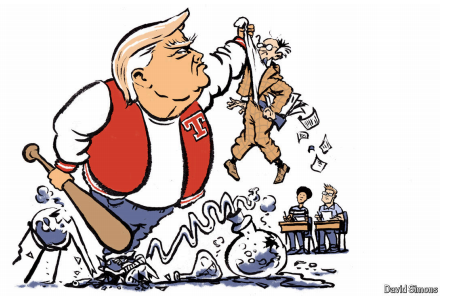

# Donald Trump is attacking what made American universities great

*More than Middle East Studies is in trouble*

原文：

**T**HE CONSERVATIVE counter-revolution began with a secret

memo, at least as the tale is often told on America’s political left,

with the mix of fear and envy characteristic of the conspiracy-

minded. In the summer of 1971 Lewis Powell was an eminent

corporate lawyer, soon to be nominated and confirmed for the

Supreme Court, when he drafted a confidential proposal for the US

Chamber of Commerce. Powell laid out a costly, co-ordinated,

years-long programme to counter the left’s influence in the media,

the courts, the boardroom and, above all, universities. “There is

reason to believe that the campus is the single most dynamic

source” of an intensifying assault on free enterprise, he warned.

保守的反革命始于一份秘密备忘录，至少这是美国政治左派经常讲述的故事，混合着阴谋论者特有的恐惧和嫉妒。1971年夏天，刘易斯·鲍威尔是一位杰出的公司律师，他为美国商会起草了一份机密提案，很快被提名并确认为最高法院大法官。鲍威尔提出了一个耗资巨大、协调一致、长达数年的计划，以对抗左派在媒体、法院、董事会，尤其是大学中的影响。他警告说,“有理由相信，校园是对自由企业愈演愈烈的攻击的唯一最活跃的源头”。

原文：

The memo seems dated now, though not because the conservative

institutions that Powell envisaged have become part of the political

wallpaper or the matters that preoccupied him have faded away.

The alarms Powell was ringing about Marxist faculty and

“ideological warfare” against “the values of Western society”, and

even about the specific influence of Herbert Marcuse and Eldridge

Cleaver, can be heard, if anything, more loudly half a century on.

What seems dated is Powell’s reasonableness. Liberal thought, he

cautioned, was “essential to a balanced viewpoint”; conservatives

should just insist on the same chances to speak that universities

accorded communists. “Few things are more sanctified in American

life than academic freedom,” Powell observed. “The ultimate

responsibility for intellectual integrity on the campus must remain

on the administrations and faculties.”

**如今这份备忘录看似过时，但并非因为鲍威尔预想的保守派机构已成为政治背景的一部分，或他担忧的问题已消失。相反，半个世纪后，鲍威尔对马克思主义教授、“西方社会价值观”遭受的“意识形态战争”的警告，甚至他对赫伯特·马尔库塞和埃尔德里奇·克利弗具体影响的担忧，在今天听来反而更加刺耳。真正显得过时的是鲍威尔的“理性”。他曾提醒，自由主义思想“对平衡观点至关重要”；保守派只需争取与共产主义者同等的发言机会。“在美国，没有什么比学术自由更神圣，”鲍威尔写道，“而维护校园智识正直的终极责任，必须由校方和教师承担。”**  

学习：

envisaged：美 [ɪnˈvɪzɪdʒd] 正视；想像；面对；（envisage的过去分词）

wallpaper：墙纸；壁纸；桌面背景；手机壁纸；无足轻重的装饰；室内装饰纸张

political wallpaper 

faculty：能力；才能；教师

Marxist faculty 

reasonableness：妥当；合理

accorded：给予；（accord的过去式和过去分词）

sanctified：批准的；认可的；神圣化的

 intellectual integrity：学术诚信

>
>
>**1. Political Wallpaper（政治墙纸）**  
>
>**含义**：  
>• **比喻用法**，指保守派机构（conservative institutions）已 **融入政治背景**，变得 **司空见惯、不再引人注目**，就像墙纸（wallpaper）是房间里不被注意的背景一样。  
>• 原文提到鲍威尔（Powell）预想的保守派机构并未成为“政治墙纸”，即 **这些机构仍未真正被主流接受**，反而其担忧的问题（如马克思主义教授）在今天更显突出。  
>
>**翻译建议**：  
>• **“政治背景的一部分”**（强调融入但未被重视）  
>• **“政治舞台上的常客”**（略带讽刺，指表面存在但无实质影响）  
>
>---
>
>**2. Marxist Faculty（马克思主义教授）**  
>
>**含义**：  
>• 指 **大学中持马克思主义意识形态的教授群体**。鲍威尔在备忘录中警告，这些教授正在对“西方社会价值观”发起 **“意识形态战争”**（ideological warfare）。  
>• 背景：1970年代美国保守派担忧大学左倾化，认为马克思主义教授 **系统性影响学生思想**，削弱传统价值观。  
>
>**翻译建议**：  
>• **“信奉马克思主义的教师”**（中性表述）  
>• **“马克思主义派系的教授”**（强调意识形态阵营）  
>
>---
>
>**3. Intellectual Integrity（学术诚信/智识正直）**  
>
>**含义**：  
>• **学术界的道德责任**：指大学应坚持 **思想严谨、学术自由、观点多元**，避免被单一意识形态垄断。  
>• 鲍威尔认为，维护这一责任的主体是 **校方和教师**（administrations and faculties），而非外部力量。  
>
>**翻译建议**：  
>• **“学术诚信”**（通用译法，侧重道德规范）  
>• **“智识正直”**（更贴合“思想独立性”的语境）  
>
>
>
>---
>
>**关键概念总结**  
>
>| 英文术语                   | 含义                               | 翻译建议                          |
>| -------------------------- | ---------------------------------- | --------------------------------- |
>| **Political wallpaper**    | 比喻保守派机构未被重视，沦为背景   | 政治背景的一部分/政治舞台上的常客 |
>| **Marxist faculty**        | 持马克思主义意识形态的大学教授群体 | 马克思主义派系的教授              |
>| **Intellectual integrity** | 学术界的道德与思想独立性           | 学术诚信/智识正直                 |
>
>**注**：鲍威尔的备忘录（即“鲍威尔备忘录”，1971年）是美国保守派反击高校左倾化的纲领性文件，影响了后来右翼智库和法律行动。文中提到的“理性过时”暗指当今政治极化下，保守派已放弃鲍威尔的温和策略，转而采取更激进的文化战争手段。

 ## 鲍威尔备忘录（Powell Memo, 1971）

>#### **1. 背景与起源**  
>1971年，美国保守派律师、后来成为最高法院大法官的**刘易斯·鲍威尔（Lewis F. Powell Jr.）**应美国商会（U.S. Chamber of Commerce）之邀，撰写了一份秘密备忘录，题为《对美国自由企业制度的攻击》（*Attack on American Free Enterprise System*）。这份文件后来被称为**“鲍威尔备忘录”**，成为美国保守派反击左翼意识形态、重塑政治话语权的战略蓝图。  
>
>#### **2. 核心内容**  
>鲍威尔在备忘录中警告，美国的企业界和保守派正面临来自**学术界、媒体和左翼活动家**的“系统性攻击”，尤其是：  
>• **大学的“左倾化”**：马克思主义和激进思想在高校蔓延，教授（如赫伯特·马尔库塞）通过教学影响学生，批判资本主义和传统价值观。  
>• **媒体的“自由派偏见”**：主流媒体（如《纽约时报》）倾向于支持政府干预和社会平等主义，损害商业利益。  
>• **监管政策的威胁**：环保、劳工权益等法规被视作对自由市场的压制。  
>
>鲍威尔提出，保守派必须**组织起来**，通过以下方式反击：  
>1. **资助智库与学术机构**：创建或支持右翼智库（如传统基金会、美国企业研究所），生产保守派学术成果。  
>2. **影响法律与司法**：推动保守派法官进入各级法院，挑战左翼政策（这一策略后来在联邦党人协会的运作中实现）。  
>3. **掌控媒体叙事**：鼓励商业领袖资助保守派媒体（如福克斯新闻的前身），平衡自由派话语权。  
>4. **校园文化战争**：要求大学给予保守派学者平等发言机会，抵制“政治正确”对学术自由的侵蚀。  
>
>#### **3. 历史影响**  
>• **右翼运动的纲领**：备忘录直接启动了美国保守派的长期战略。1970年代后，科赫兄弟（Koch brothers）等富豪开始系统性资助右翼组织，推动自由市场理念。  
>• **法律与政治的转折点**：通过联邦党人协会（Federalist Society），保守派成功将大批法官（包括最高法院大法官）送入司法系统，最终影响了堕胎权、枪支管制等关键判决。  
>• **文化战争的催化剂**：备忘录预见了“校园左倾化”问题，成为今天美国“反觉醒主义”（anti-wokeness）和“批判性种族理论”（CRT）论战的先声。  
>
>#### **4. 当代争议**  
>• **左翼批评**：认为备忘录是“资本权贵的阴谋”，通过金钱和司法手段压制社会平等诉求。  
>• **右翼辩护**：视其为“自由市场的觉醒”，成功抵制了社会主义倾向。  
>• **现实印证**：鲍威尔担忧的“意识形态战争”在今日美国愈演愈烈，例如大学对保守演讲者的抵制、迪士尼与佛州的“反LGBTQ+”立法冲突等。  
>
>#### **5. 关键语录**  
>> “Few things are more sanctified in American life than academic freedom.”  
>> （“在美国，没有什么比学术自由更神圣。”）  
>> ——鲍威尔强调保守派应争夺学术话语权，而非直接压制左翼。  
>
>#### **6. 总结**  
>鲍威尔备忘录是**美国保守派从防守转向进攻的转折点**，将企业利益、司法策略和文化战争结合，塑造了今日美国政治极化的格局。其核心矛盾——**“学术自由”与“意识形态控制”的边界**——仍是当前美国社会辩论的焦点。

原文：

Did political imagination fail Powell, or did principle get in the

way? Whichever the obstacle, it is not impeding Donald Trump.

Like a bully going from table to table in the school cafeteria, he is

muscling his way through the Ivy League, threatening or

withholding federal grants to force ideological change, impounding

money meant for the sciences to insist on changes in the humanities

or even athletics. His most recent target is Princeton University. On

April 1st its president, Christopher Eisgruber, disclosed that the

government had suspended dozens of research grants to the

college. He said it was not clear why

是政治想象力辜负了鲍威尔，还是原则妨碍了他？无论障碍是什么，它都不会阻碍唐纳德·特朗普。就像一个恶霸在学校自助餐厅里挨个桌子走来走去，他在常青藤联盟中强行挤过，威胁或扣留联邦拨款以迫使意识形态改变，扣押本应用于科学的资金以坚持人文学科甚至体育领域的变革。他最近的目标是普林斯顿大学。4月1日，该校校长克里斯托弗·艾斯格鲁伯透露，政府已经暂停了几十项对该学院的研究拨款。他说不清楚原因

学习：

impounding：没收；扣押；蓄水；（impound的现在分词形式）

原文：

Princeton was not among the ten universities listed for review by

Mr Trump’s task force on antisemitism, the main reason the

administration has given so far for its crackdown. But Mr Eisgruber

has been unusual among college presidents in speaking up to

defend higher education. In mid-March, in an essay in the *Atlantic*,

he called the administration’s cancellation of $400m in grants to

Columbia University “the greatest threat to American universities

since the Red Scare of the 1950s”. He is also chairman of the board

of the Association of American Universities, which on March 31st

issued a statement warning that “the withdrawal of research

funding for reasons unrelated to research sets a dangerous and

counter-productive precedent”.

普林斯顿不在特朗普反犹太主义工作组审查的十所大学之列，这是政府迄今为止给出的镇压理由。但是在大学校长中，艾斯格鲁伯先生站出来为高等教育辩护是不寻常的。3月中旬，在《大西洋月刊》的一篇文章中，他将政府取消对哥伦比亚大学的4亿美元拨款称为“自20世纪50年代红色恐慌以来对美国大学的最大威胁”。他也是美国大学协会的董事会主席，该协会在3月31日发表声明警告说“由于与研究无关的原因而撤回研究经费树立了一个危险的、适得其反的先例”。

学习：

counter-productive：产生相反效果的；事与愿违的；产生相反结果的          

## Red Scare of the 1950s（1950年代的“红色恐慌”）

>#### **1. 定义与背景**  
>**“红色恐慌”**（Red Scare）指20世纪中叶美国对**共产主义渗透**的极端恐惧与政治迫害浪潮，尤以**1950年代麦卡锡主义（McCarthyism）**为顶峰。  
>• **“红色”**象征共产主义（源自苏联红旗）。  
>• **核心事件**：参议员**约瑟夫·麦卡锡（Joseph McCarthy）**领导的反共调查，指控政府、军队、文艺界和学术界人士“通共”。  
>
>#### **2. 对大学的迫害**  
>• **忠诚度审查**：大学教授需宣誓效忠美国，拒绝者被解雇（如哈佛、加州大学等）。  
>• **黑名单与学术打压**：  
>  • 怀疑马克思主义或左翼思想的学者遭调查（如物理学家**罗伯特·奥本海默**因反核立场被撤销安全许可）。  
>  • 课程受监控，社会科学领域被要求“去意识形态化”。  
>• **寒蝉效应**：学术自由受严重压制，许多学者因恐惧而自我审查。  
>
>#### **3. 与当前语境的关联**  
>普林斯顿校长**艾斯格鲁伯（Eisgruber）**在《大西洋月刊》文章中警告：  
>> **特朗普政府以“反犹”为由取消哥伦比亚大学4亿美元研究拨款的行为，是“自1950年代红色恐慌以来对美国大学的最大威胁”。**  
>> • **共同点**：  
>> • **政治干预学术**：政府以意识形态理由（反共/反犹）切断高校资金。  
>> • **制造恐惧氛围**：学者可能因政治立场（如批评以色列政策）被惩罚。  
>> • **差异**：  
>> • 麦卡锡时代直接迫害个人，如今则通过**经济制裁（撤资）**施压机构。  
>
>#### **4. 历史教训**  
>• **红色恐慌的恶果**：  
>  • 大量冤案（如“好莱坞十君子”），1970年代后美国社会普遍反思其非理性。  
>  • 学术界长期对政治干预心有余悸。  
>• **当下争议**：  
>  • 保守派认为反犹调查是“保护西方价值观”，自由派则视其为**“新麦卡锡主义”**。  
>
>#### **5. 中文翻译建议**  
>• **直译**：1950年代的红色恐慌  
>• **补充说明**：**“麦卡锡主义反共浪潮”**（强调政治迫害性质）  
>
>#### **总结**  
>艾斯格鲁伯将特朗普政府的撤资行为比作**红色恐慌**，意在警示：**以政治立场打压学术自由将重蹈历史覆辙**。这一比喻凸显了美国高校在意识形态斗争中的脆弱性。

原文：

Universities are so vulnerable to Mr Trump for a reason they, and

America, are so strong. After the second world war, the

government hit upon the idea that America could lead the world in

innovation by sponsoring university research, an investment that

has yielded countless breakthroughs and the best research

universities in the world. The partnership was premised on the

principles of academic freedom developed in the first half of the

century and endorsed in 1957 by the Supreme Court, which found

that “to impose any straitjacket upon the intellectual leaders in our

colleges and universities would imperil the future of our Nation.”

大学在特朗普面前如此脆弱，是因为Trump他们和美国如此强大。第二次世界大战后，政府突然想到，美国可以通过资助大学研究来引领世界创新，这一投资已经产生了无数的突破和世界上最好的研究型大学。这种伙伴关系的前提是20世纪上半叶发展起来的学术自由原则，并于1957年得到最高法院的认可，最高法院认为，“对我们学院和大学的知识领袖施加任何束缚都会危及我们国家的未来。”

学习：

straitjacket：美 [ˈstreɪtˌdʒækət] 紧身衣；束缚衣；约束；限制；

imperil：美 [ɪmˈperəl] 危及；使陷入危险；使受到威胁；使遭受危险

原文：

Mr Trump sees no need to honour the terms of that partnership.

Thus Harvard risks losing up to $9bn in federal grants and

contracts because the administration accuses it of not protecting

Jewish students and of “promoting divisive ideologies”. Hoping to

head off Mr Trump, Harvard had taken such steps as pushing out

two leaders of its Centre for Middle Eastern Studies, but he was not

mollified. The administration has also suspended $175m in grants

to the University of Pennsylvania because, three years ago, it

allowed a transgender woman to compete on its women’s team, in

compliance with intercollegiate regulations.

**“特朗普认为无需遵守这一合作关系的条款。因此，哈佛可能因被政府指控‘未保护犹太学生’和‘宣扬分裂意识形态’而损失高达90亿美元的联邦拨款与合同。为抢先应对特朗普，哈佛已采取行动，例如逼退中东研究中心的两名负责人，但未能平息他的不满。政府还暂停向宾夕法尼亚大学提供1.75亿美元拨款，只因三年前该校遵循校际规定，允许一名跨性别女性参加女子比赛。”**  

学习：

head off：阻止；拦住；防止（尤指不愉快的事）发生；防止…发生；拦截

mollified：平息；安抚；缓和；（mollify的过去式） 美 ['mɑlɪfaɪd]

intercollegiate：美 [ˌɪn(t)ərkəˈlidʒ(i)ət] 大学间的；高校间的；（大学）校际的；学院之间的

>
>
>**"Push out" 的含义及翻译**  
>
>在原文中，**"push out"** 是一个短语动词（phrasal verb），通常指 **“迫使某人离开（职位或组织）”**，带有 **非自愿、施压或变相驱逐** 的意味。  
>
>**1. 具体语境分析**  
>
>> *"Hoping to head off Mr Trump, Harvard had taken such steps as **pushing out** two leaders of its Centre for Middle Eastern Studies, but he was not mollified."*  
>> （哈佛大学试图先发制人，采取了诸如**迫使**中东研究中心的两名负责人**离职**等措施，但特朗普并未因此缓和态度。）  
>
>• **背景**：  
>  • 特朗普政府以“未保护犹太学生”和“宣扬分裂意识形态”为由，威胁取消哈佛的联邦资金（高达90亿美元）。  
>  • 哈佛为平息争议，**施压中东研究中心的两位负责人辞职**（可能是因他们的政治立场或言论引发争议）。  
>
>• **"push out" 的隐含意义**：  
>  • 并非直接解雇（fire），而是通过内部压力（如舆论、审查、削减支持等）迫使当事人主动离开。  
>  • 类似中文的 **“逼退”“变相驱逐”** 或 **“劝退”**（委婉但强制）。  
>
>**2. 与其他词汇的区别**  
>
>| 英文词汇     | 力度/方式          | 中文对应   |
>| ------------ | ------------------ | ---------- |
>| **push out** | 间接施压，迫使离开 | 逼退、排挤 |
>| *fire*       | 直接解雇           | 开除       |
>| *force out*  | 更强势的驱逐       | 强行赶走   |
>| *resign*     | 主动辞职           | 辞职       |
>
>**3. 翻译建议**  
>
>根据上下文，可译为：  
>• **“迫使……离职”**（中性表述）  
>• **“逼退”**（强调施压）  
>• **“排挤”**（隐含不公）  
>
>**4. 例句扩展**  
>
>• *The CEO was **pushed out** after the scandal.*  
>  （丑闻后，CEO被**逼退**。）  
>• *The board **pushed out** the founder to take control.*  
>  （董事会**排挤**创始人以夺权。）  
>
>**5. 总结**  
>
>在哈佛的案例中，**"push out"** 揭示了高校为迎合政治压力而 **牺牲学者** 的妥协行为，反映了当前美国学术界在意识形态斗争中的困境。  
>
>

原文：

The administration does not appear to have the law on its side. By

statute, the government is supposed to hold a hearing and then

submit a written report to Congress of a legal violation before

cutting off funds—and even then it can cut off money only to the

specific noncompliant programme. But Mr Trump certainly has

politics on his side. He knows how to pick his culture battles. Elite

universities, which have become engines of inequality in American

life, would not have been sympathetic targets even before their

campuses were swept by identitarian politics and then protests over

the war in Gaza. Now Harvard’s own president says he has been

the victim of antisemitism on the job. Baiting Democrats into a

defence of fancy colleges would further pigeonhole them as the

party of the wealthy and credentialed. The failure of university

presidents to speak up for one another—with such honourable

exceptions as Mr Eisgruber—is making each more vulnerable.

**“特朗普政府的行为似乎缺乏法律依据。根据法规，政府在切断资助前应举行听证会并向国会提交违规书面报告——即便如此，也只能停拨涉事项目的资金。但特朗普无疑占据了政治优势。他深谙如何挑选文化战争的话题。精英大学已成为美国社会不平等的引擎，即便在校园被**身份认同政治**和加沙战争抗议席卷之前，它们也难获舆论同情。如今，哈佛校长甚至自称在工作中遭受反犹主义攻击。诱使民主党为精英学府辩护，只会进一步将其贴上‘富豪与高学历者政党’的标签。而大学校长们未能相互声援（除艾斯格鲁伯等少数例外），使得各自更加脆弱。”**  

---

学习：

statute：法令；法规；条例；章程；规章

swept：席卷；刮过；（sweep的过去式和过去分词）

identitarian：

identitarian politics

on the job：在职；在岗；在工作；工作时

baiting：诱惑；引诱；（bait的现在分词形式）；

pigeonhole 美 [ˈpɪdʒɪnhoʊl] ；把…留在记忆中；分类

credentialed：美 [krə'denʃld] 授以证书的

>
>
>**Identitarian Politics（身份认同政治）**  
>
>**“Identitarian Politics”**（或 **Identity Politics**）指一种以**特定群体身份**（如种族、性别、宗教、性取向等）为核心的政治动员和意识形态，强调群体差异、历史压迫及系统性不公，并以此为基础争取权益或政策倾斜。  
>
>**1. 核心特征**  
>
>• **群体优先**：政治诉求围绕身份标签（如“黑人”“LGBTQ+”“巴勒斯坦裔”）展开，而非阶级或经济议题。  
>• **对立叙事**：常以“压迫者 vs. 被压迫者”框架分析社会问题（如“白人特权”“殖民主义遗产”）。  
>• **文化斗争**：通过语言、符号、教育等领域的争议推动变革（如移除雕像、修改课程）。  
>
>**2. 文中语境**  
>
>原文提到：  
>> *"Elite universities... would not have been sympathetic targets even before their campuses were swept by **identitarian politics** and then protests over the war in Gaza."*  
>> （精英大学在卷入**身份认同政治**和加沙战争抗议之前，本就不是舆论同情的靶子。）  
>
>• **背景**：  
>  • 美国高校近年成为身份政治的主战场，例如：  
>    ◦ **“黑命攸关”（BLM）**运动推动种族议题；  
>    ◦ **“跨性别权利”**争议影响校园政策；  
>    ◦ **巴以冲突**引发学生阵营对立（亲巴勒斯坦 vs. 亲以色列）。  
>  • 这些冲突使大学陷入舆论漩涡，被保守派批评为“分裂意识形态”的温床。  
>
>**3. 争议与批评**  
>
>• **支持者观点**：  
>  身份政治为边缘群体争取平等，纠正历史不公（如 affirmative action）。  
>• **反对者观点**：  
>  • **加剧分裂**：将社会简化为身份对立，削弱共同价值观。  
>  • **忽视阶级**：掩盖经济不平等（如穷白人与穷黑人的共同困境）。  
>  • **学术干扰**：例如哈佛因巴以立场争议失去捐款，教授因言论遭围攻。  
>
>**4. 相关术语**  
>
>| 英文                  | 中文     | 说明                                                  |
>| --------------------- | -------- | ----------------------------------------------------- |
>| **Identity Politics** | 身份政治 | 广义，涵盖所有以身份为基础的运动                      |
>| **Identitarianism**   | 身份主义 | 更极端化版本，强调种族/文化排他性（如欧洲极右翼使用） |
>| **Wokeness**          | 觉醒主义 | 对系统性歧视的敏感性，常与身份政治挂钩                |
>
>**5. 翻译建议**  
>
>根据上下文，**“identitarian politics”** 可译为：  
>• **“身份认同政治”**（学术中性译法）  
>• **“身份主义政治”**（若强调其排他性）  
>• **“身份政治浪潮”**（突出席卷校园的态势）  
>
>---
>
>**总结**  
>
>**“Identitarian Politics”** 在文中揭示了美国高校近年来的意识形态冲突，这些冲突为特朗普政府打击精英大学提供了政治弹药。该术语的翻译需结合具体语境，避免与极端身份主义（如白人至上）混淆。

## **Biology 101**

原文：

But Mr Trump seems unlikely to stop with the Ivy League, and

who knows how extreme his demands may become. His executive

order of March 27th demanding an overhaul of the Smithsonian

Institution may offer hints. Mr Trump singled out a sculpture

exhibition for representing America, along with other societies, as

having “used race to establish and maintain systems of power,

privilege, and disenfranchisement”. Which, of course, it did. Even

more shocking, he condemned the exhibition for promoting the

idea that race “is not a biological reality but a social construct”. To

promote the idea that race is a biological reality is to nurture the

feedstock of racism. It would be a dark day indeed if America’s

great research universities were ever tasked with that project. ■

**但特朗普似乎不会止步于常春藤盟校，而他的要求会变得多极端也未可知。他在3月27日要求彻底整顿史密森尼学会的行政命令或许能提供线索。特朗普特别批评了一场雕塑展览，称其将美国与其他社会一同描绘为“利用种族建立并维护权力、特权和权利剥夺的体系”——事实的确如此。更令人震惊的是，他谴责该展览宣扬种族“并非生物学现实，而是社会建构”的观点。若将种族鼓吹为生物学现实，实则为种族主义提供温床。若美国顶尖研究型大学竟被委以如此任务，那将是至暗时刻。■**  

学习：

disenfranchisement：剥夺公民权      

feedstock：原料；投料；加工材料；

>
>
>### **Disenfranchisement（剥夺权利）的含义**  
>**Disenfranchisement** 指 **系统性剥夺特定群体的政治、经济或社会权利**，尤其针对少数族裔或边缘群体。在文中，它被用来描述美国历史上通过种族划分（race）建立的压迫性制度，例如：  
>• **选举权剥夺**：如“吉姆·克劳法”（Jim Crow Laws）阻止黑人投票。  
>• **经济边缘化**：限制少数族裔获得贷款、住房或教育的机会。  
>• **法律歧视**：如种族隔离（segregation）或移民排斥法案。  
>
>---
>
>**关键术语解析**  
>
>1. **Systems of... disenfranchisement**  
>   • 原文：权力、特权与权利剥夺的体系  
>   • 背景：指美国历史上通过种族主义法律（如奴隶制、排华法案）剥夺非白人群体权利的制度。  
>
>2. **Race as a social construct**  
>   • 学界共识：种族差异无基因依据，是历史/文化划分（如“黑人”定义随法律变化）。  
>   • 特朗普的立场：坚持种族是“生物学现实”，隐含种族主义伪科学（如优生学）。  
>
>3. **Dark day**  
>   • 比喻：指学术沦为政治工具，倒退至种族主义时代（如纳粹德国“科学”为歧视背书）。  
>
>---
>
>**段落核心矛盾**  
>
>• **特朗普的逻辑**：要求抹去对美国系统性种族主义的批判，代之以“种族天生论”。  
>• **作者的批判**：若大学屈从于此，将背叛学术使命，助长种族仇恨。  
>
>（翻译通过“至暗时刻”“温床”等词强化了原文对特朗普政策的警告意味。）

>
>
>### **"Biology 101" 的含义解析**  
>
>在英语中，**"XXX 101"**（如 *Biology 101*、*Economics 101*）是一种常见表达，源自美国大学课程编号体系，其中 **"101"** 代表**最基础的入门课程**。因此，这个标题具有双重含义：  
>
>**1. 字面意思**  
>
>• **"Biology 101" = 生物学入门课**  
>  • 暗指后文内容是对生物学基本概念的讨论（如“种族是否为生物学现实”）。  
>
>**2. 引申含义**  
>
>• **讽刺特朗普的反科学立场**：  
>  • 作者用“生物学入门”作标题，暗示特朗普对种族的理解**连基础科学常识都不符合**（科学界共识：种族是社会建构，非生物学事实）。  
>  • 类似中文说**“这是初中生物知识”**，嘲讽对方缺乏基本认知。  
>
>**3. 标题与内容的关联**  
>
>后文提到特朗普谴责展览宣扬“种族是社会建构”，而作者反驳：  
>> *“若将种族鼓吹为生物学现实，实则为种族主义提供温床。”*  
>> • **标题的讽刺**：特朗普的言论连“Biology 101”水平都达不到，违背科学共识。  
>
>**4. 类似用法举例**  
>
>• *"Democracy 101"* → 民主基础课（常用于科普民主原则）  
>• *"Finance 101"* → 金融入门（批评某人不懂经济常识）  
>
>**5. 中文翻译建议**  
>
>根据语境，可保留英文标题（加注说明），或意译为：  
>• **《生物学入门：特朗普不懂的事》**  
>• **《基础生物学打脸时刻》**  
>
>---
>
>**总结**  
>
>"Biology 101" 是一个**兼具科普性和讽刺性**的标题，旨在：  
>1. 强调后文内容的**基础科学性**（种族是社会建构）；  
>2. 揭露特朗普的**反智立场**（否认科学共识，迎合种族主义）。  
>
>

## 后记

2025年4月6日14点59分于上海。

