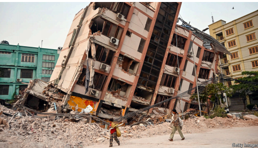
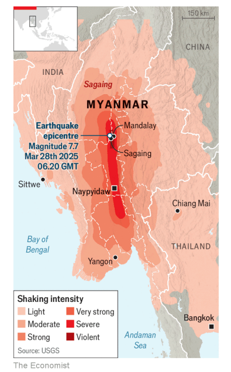

# Myanmar’s junta takes advantage of a devastating earthquake

Myanmar：美 [ˈmjɑːnmɑːr] 缅甸(东南亚国家)

junta： 英 [ˈdʒʌntə] 军政府

devastating：美 [ˈdevəsteɪtɪŋ] 毁灭性的；破坏性极大的；灾难性的

*The disaster may entrench a brutal regime*

entrench：牢固确立；巩固（地位、权力等）；使固守（传统、习惯等）

regime： 美 [reɪˈʒiːm] 政权；政体；体制；体系；**注意发音**

原文：

**S**INCE MARCH 28th, when a powerful earthquake shook

Myanmar’s central heartlands, the country’s brutal junta has tried to

show the world its softer side. Min Aung Hlaing, its leader, has

visited survivors in a hospital and asked foreigners to send help.

Yet the generals who seized power from a democratically elected

government four years ago—plunging the country into a civil war

that has displaced millions—are also seeking to draw advantage

from the catastrophe

自从3月28日，一场强烈的地震震撼了缅甸的中心地带，这个国家残暴的军政府试图向世界展示它柔软的一面。其领导人敏昂兰在医院看望了幸存者，并请求外国人提供帮助。然而，四年前从民选政府手中夺取政权的将军们也在寻求从这场灾难中获利，他们让这个国家陷入内战，导致数百万人流离失所

学习：

heartland：（国家或地区的）腹地；中心区域；中心部分；中心地区；

plunge：骤然陷入

原文：

Five days after the 7.7-magnitude quake the official death toll in

Myanmar had risen to around 3,000, though the true number is

doubtless much higher. Good information is scant, both because the

tremor has wrecked communication networks and because the junta

has long disrupted data services in order to control what people see.

Local journalists work under close scrutiny; the junta has said

foreign ones must keep out. Modelling by the American

government, using information such as the magnitude of the tremor

and the size of the population it affected, suggests the toll could

end up exceeding 10,000.

7.7级地震发生五天后，缅甸官方公布的死亡人数已上升至3000人左右，尽管真实数字无疑要高得多。好的信息很少，一方面是因为地震破坏了通讯网络，另一方面是因为军政府为了控制人们看到的东西而长期中断数据服务。当地记者在严密的监督下工作；军政府已经表示，外国记者不得入内。美国政府利用地震的震级和受影响的人口规模等信息进行的模拟显示，死亡人数最终可能超过1万人。

学习：

quake：摇晃

tremor：震颤；小地震；轻微震动

wreck：毁坏；破坏；摧毁

原文：

Destruction in Mandalay, Myanmar’s second-largest city, is

widespread. More than 500 buildings have been completely

destroyed (or close to it), according to analysis of satellite imagery

by Microsoft’s AI for Good Lab. All across the affected region, the

secondary impacts of the quake are starting to bite. Running water,

fuel and other basic necessities are in short supply; UN agencies

warn of a growing risk from cholera. International aid teams are

gaining access, though the going is slow. Journeys along the main

road from Yangon (Myanmar’s biggest city and business hub) to

Mandalay are taking around 13 hours, compared with eight before.

缅甸第二大城市曼德勒的破坏非常普遍。根据微软AI for Good Lab对卫星图像的分析，超过500座建筑被完全摧毁(或接近摧毁)。在整个受灾地区，地震的次级影响开始显现。自来水、燃料和其他基本必需品短缺；联合国机构警告说，霍乱的风险越来越大。尽管进展缓慢，但国际救援队正在进入该地区。从仰光(缅甸最大的城市和商业中心)到曼德勒，沿着主干道的旅程需要大约13个小时，而以前需要8个小时。

学习：

Mandalay：美 [ˌmændəˈleɪ] 曼德勒；曼德勒市

bite

cholera：美 [ˈkɑːlərə] 霍乱

Yangon： 美 [ˌjɑŋˈɡoʊn] 仰光

>
>
>**"Bite" 的含义及翻译解析**  
>
>在原文中，**"bite"** 是一个动词，用于比喻性表达，其含义并非字面的“咬”，而是指 **（负面影响的）逐渐显现、加剧或产生严重后果**。  
>
>**1. 具体语境分析**  
>
>> *"All across the affected region, the **secondary impacts** of the quake are starting to **bite**."*  
>> （在整个受灾地区，地震的**次生影响**开始**显现并造成痛苦**。）  
>
>• **"Secondary impacts"**（次生影响）：指地震后衍生的危机，如断水、燃料短缺、疾病传播等。  
>• **"Bite"** 在这里形象地比喻这些影响像“被咬”一样，**突然且疼痛地产生影响**，强调人们正切实感受到困境的加剧。  
>
>**2. "Bite" 的比喻用法**  
>
>英语中，"bite" 常用来描述抽象事物的负面效应突然显现，例如：  
>• *"Inflation is beginning to **bite**."* （通货膨胀开始**让民众感到压力**。）  
>• *"The new policy will soon **bite**."* （新政策很快会**引发不良后果**。）  
>
>**3. 中文翻译建议**  
>
>根据语境，可灵活翻译为：  
>• **“次生影响开始显现并恶化”**（中性描述）  
>• **“次生影响开始肆虐”**（强调破坏性）  
>• **“次生影响开始让民众苦不堪言”**（突出对人的直接影响）  
>
>**4. 整句参考翻译**  
>
>> **“在整个受灾地区，地震的次生影响开始肆虐。自来水、燃料等基本物资短缺；联合国机构警告霍乱风险正在上升。国际救援队伍虽已逐步进入，但进展缓慢。从缅甸最大城市兼商业中心仰光到曼德勒的主干道，如今车程需约13小时，而此前仅需8小时。”**  
>
>---
>
>**为什么用 "bite"？**  
>
>作者通过这个词，将抽象的“次生灾害”拟人化，暗示其如猛兽撕咬般**迅速、无情且难以躲避**，强化了灾难的紧迫感和对民众的伤害。  
>
>

原文：

Not long after the tremor, rebel groups who have been fighting the

junta said they would suspend offensives so that rescue efforts

could get under way. The junta, by contrast, waited until April 2nd

to announce that it was also going to pause its fighting, for 20 days.

It used the intervening period to give rebel forces a solid thumping.

The Kachin Independence Army, an armed group fighting the

generals in northern Myanmar, says at least 30 of the young

soldiers it was training were killed in an air strike on April 1st.

Residents of a township in Sagaing region, an area affected by the

quake that lies west of Mandalay, say they suffered bombing the

day before. “Most young people here want to help with earthquake

relief but they’re afraid of being attacked by the army,” says a local

rebel fighter.

地震后不久，一直与军政府作战的反叛组织表示，他们将暂停进攻，以便救援工作能够展开。相比之下，军政府一直等到4月2日才宣布也将暂停战斗20天。它利用这段时间给了叛军一个实实在在的重击。在缅甸北部与将军们作战的武装组织克钦独立军称，至少有30名受训的年轻士兵在4月1日的一次空袭中丧生。位于曼德勒西部受地震影响的实皆地区的一个镇的居民说，他们在前一天遭受了轰炸。“这里的大多数年轻人都想帮助抗震救灾，但他们害怕被军队袭击，”一名当地的叛军战士说。

学习：

offensives: 攻势；进攻；攻击；（offensive的复数）

thumping：猛击；重击；重敲；撞击

township：乡镇；小镇；城镇；区；

原文：

The UN has accused the junta of preventing aid from passing

through some checkpoints that lead to regions controlled by rebel

groups. On April 1st the regime’s soldiers fired shots at a convoy

operated by the Chinese Red Cross that was carrying relief supplies

to Mandalay through a region that was not under the junta’s

control, according to the Ta’ang National Liberation Army, a rebel

group that was escorting it at the time. Blowback from that incident

could help explain why the generals at last felt obliged to promise a

brief ceasefire of their own

联合国指责军政府阻止救援物资通过一些检查站，这些检查站通往反叛组织控制的地区。据当时护送救援物资的反叛组织塔昂民族解放军称，4月1日，该政权的士兵向中国红十字会的车队开枪，当时该车队正运送救援物资穿过一个不在军政府控制下的地区前往曼德勒。这一事件的反作用有助于解释为什么将军们最终不得不承诺他们自己的短暂停火

学习：

convoy：护航队；护送队；护卫船队；护卫车队

escorting：美 [ˈeskɔ:tɪŋ] 护送；护卫；（escort的现在分词）

blowback：反冲；逆火；后坐力；负面影响

原文：

Yet outright conflict is not the only thing that risks leaving

vulnerable people without aid. Although Mandalay and Sagaing

town, both very close to the epicentre, are under the junta’s control,

regions around them are rebel territory. On March 30th Ko Zaw

Zaw, a mechanic who has been using his tools and skills to help

rescue people, drove to Sagaing from a neighbouring city to extract

two people from a collapsed home. He says soldiers and police sent

his group packing. They accused his band of rescuers of being

criminals, thieves or members of the resistance. The people he was

trying to help died.

**“然而，公开冲突并非唯一威胁灾民获得援助的因素。尽管震中附近的曼德勒和实皆镇均受军政府控制，但周边地区是反抗军地盘。3月30日，机械师Ko Zaw Zaw从邻城驱车前往实皆镇，试图从倒塌房屋中救出两人——他长期用工具和技术参与救援。但他说，军警**勒令他的团队立即滚蛋**，指控这些救援者是‘罪犯、小偷或反抗军成员’。他试图救助的人最终丧生。”**  

学习：

outright： 美 [ˈaʊtraɪt] 公开的

epicenter：（地震的）震中；中心点；

>
>
>**"Sent his group packing" 的含义解析**  
>
>在原文中，**"sent his group packing"** 是一个英语习语（idiom），意思是 **“强行赶走某人”** 或 **“勒令立即离开”**，通常带有 **突然、粗暴或不讲理** 的意味。  
>
>**1. 具体语境分析**  
>
>> *"He says soldiers and police **sent his group packing**. They accused his band of rescuers of being criminals, thieves or members of the resistance. The people he was trying to help died."*  
>> （他说，军警**将他们驱离**，并指责他的救援队是罪犯、小偷或反抗军成员。他试图救助的人最终丧生。）  
>
>• **背景**：  
>  • 缅甸军政府（junta）控制震中附近的曼德勒和实皆镇（Sagaing），但周边是反抗军（rebels）的势力范围。  
>  • 机械师 Ko Zaw Zaw 自发参与救援，但军警以“可能是反抗军”为由，**粗暴驱逐他和他的团队**，导致受困者无法获救而死亡。  
>
>• **"Sent his group packing" 的隐含态度**：  
>  • 强调军警的 **蛮横无理**（无证据指控救援者是“罪犯”）。  
>  • 暗示 **官僚主义或敌意阻碍了人道救援**。  
>
>**2. "Packing" 的词源与形象化表达**  
>
>• 字面意思是“打包行李”，但习语中引申为 **“卷铺盖走人”**（类似中文的 **“轰走”** 或 **“扫地出门”**）。  
>• 类似表达：  
>  • *"They were **shown the door**."*（被赶出门）  
>  • *"The boss **gave him the boot**."*（老板解雇了他）  
>
>**3. 中文翻译建议**  
>
>根据语境，可译为：  
>• **“将他们驱离”**（中性）  
>• **“勒令他们滚蛋”**（带情绪，强调军警的粗暴）  
>• **“强行赶走他们”**（直白描述）  
>
>---
>
>**为什么用这个习语？**  
>
>作者通过 **"sent his group packing"** 暗讽军警的 **荒谬逻辑**（将救援者污名化）和 **冷血行为**（宁可让人死亡也不允许民间救援），凸显缅甸灾民在政治夹缝中的绝望处境。  
>

原文：

Analysts sense the junta is directing an outsize share of

international aid towards its capital, Naypyidaw, which was hit by

the earthquake but which does not appear to have needs as great as

those of communities closer to the epicentre. Ideally governments

would be trying harder to channel help across Myanmar’s borders

with China, India and Thailand, which abut the vast swathes of the

country that the junta does not control. “The junta should not be the

automatic go-to partner,” says Kim Jolliffe, an analyst who

specialises in Myanmar’s ethnic politics. “The ethnic armed

organisations are not just rebel groups. They are not just

insurgents,” says Nyantha Lin of Anagat Initiatives, a think-tank.

“Some have become excellent at delivering education, health care

and agricultural support in the territory they control.”

分析人士指出，军政府将国际援助的过大比例调拨至其首都内比都——该市虽受地震影响，但需求远不及震中附近社区。理想情况下，各国政府应更努力地**协调援助物资**跨越缅甸与中国、印度和泰国的边境，这些地区毗邻军政府无法控制的大片领土。‘军政府不应该是**默认的首选合作伙伴**，’研究缅甸民族政治的专家金·乔利夫（Kim Jolliffe）表示。智库Anagat Initiatives的南塔·林（Nyantha Lin）指出：‘民族地方武装组织不仅是叛乱团体，他们中的一些在其控制区已能高效提供教育、医疗和农业支持。’

学习：

channel 

abut:邻接；毗连；紧靠； 美 [əˈbət]

go-to: 默认的首选  

insurgents：起义者；（insurgent的复数）

>
>
>**1. "Channel" 的含义**  
>
>在原文中，**"channel"** 是动词，意为 **“引导、输送（资源或援助）”**，强调通过特定路径或方式将援助传递到目标地区。  
>
>• **例句**：  
>  > *"Governments would be trying harder to **channel** help across Myanmar’s borders."*  
>  > （各国政府应更努力地**引导**援助跨越缅甸边境。）  
>
>• **中文对应**：  
>  • **“输送”**（强调物资流动）  
>  • **“协调分配”**（强调组织行为）  
>
>---
>
>**2. "Go-to" 的含义**  
>
>**"Go-to"** 是形容词，指 **“默认的首选”** 或 **“最常依赖的对象”**，通常用于形容权威或惯用选项。  
>
>• **例句**：  
>  > *"The junta should not be the automatic **go-to** partner."*  
>  > （军政府不应是**默认的首选**合作对象。）  
>
>• **中文对应**：  
>  • **“首选”**  
>  • **“默认合作方”**  
>
>---
>
>**关键术语总结**  
>
>| 英文术语                       | 中文翻译         | 说明                         |
>| ------------------------------ | ---------------- | ---------------------------- |
>| **channel help**               | 协调援助输送     | 强调跨国界资源调配           |
>| **automatic go-to partner**    | 默认首选合作伙伴 | 批评国际社会过度依赖军政府   |
>| **ethnic armed organisations** | 民族地方武装组织 | 缅甸非政府控制区的实际治理者 |
>
>---
>
>**核心矛盾**  
>
>• **军政府的资源垄断**：将援助集中到需求较低的首都，忽视重灾区。  
>• **替代方案**：通过邻国边境直接支援民族地方武装控制区（这些组织已具备基层治理能力）。  
>
>（翻译通过**“协调援助输送”**和**“默认首选”**等表述，清晰传递了原文对国际援助分配不公的批评。）

原文：

Before the earthquake the junta had been losing territory—and yet

its leaders were, oddly, being granted more opportunities to hobnob

on the international stage. Min Aung Hlaing recently made official

visits to Russia and Belarus, having trekked to China last year. On

April 4th he is due to attend a high-level summit in Thailand for

countries situated along the Bay of Bengal; this will be his first

appearance at a big multilateral meeting since the coup. In the best

case the catastrophe could help remind the world that Myanmar

was already suffering a deep humanitarian crisis—and galvanise

fresh efforts to resolve it. It is more likely that the international

attention ends up strengthening the junta’s callous rule. ■

地震前，军政府一直在失去地盘，但奇怪的是，其领导人却获得了更多在国际舞台上交流的机会。敏昂兰最近对俄国和白俄罗斯进行了正式访问，去年还长途跋涉访问了中国。4月4日，他将出席在泰国举行的孟加拉湾沿岸国家高层峰会；这将是政变后他首次出现在大型多边会议上。在最好的情况下，这场灾难可能有助于提醒世界，缅甸已经遭受了深刻的人道主义危机——并激发新的努力来解决它。更有可能的是，国际社会的关注最终会加强军政府冷酷无情的统治。■

学习：

hobnob：共饮；交谈；亲切交谈；亲密来往

Balarus：白俄罗斯

trekked：长途跋涉；艰苦跋涉；（trek的过去式）

due：预定的；约定的

Bengal：孟加拉（位于亚洲）；孟加拉生丝（织品）

coup：美 [kuː] 政变；意外而成功的行动；

galvanize：刺激；激励；激发；使震惊；促使行动；

callous：美 [ˈkæləs] 无情的；冷漠的；冷酷无情的；

## 后记

2025年4月6日17点10分于上海。

