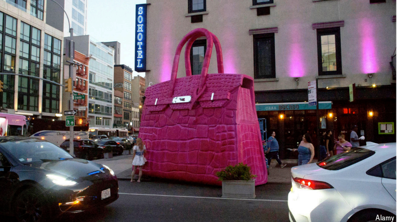
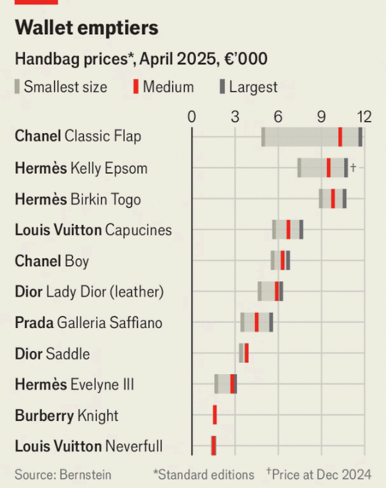

# How Hermès defied the luxury slump

*And its lessons for other high-end brands*

原文：

**T**HE LUXURY industry has lost its sparkle. A slowdown in the

Chinese economy and a cost-of-living crisis in the West have led to

a slump in sales of fancy frocks and posh bags. If, after a pause

announced on April 9th, the high levels of tariffs threatened by

Donald Trump are enacted they could throw the industry into a

tailspin. Kering, a French luxury group that owns Gucci, has posted

a string of profit warnings in recent quarters. At LVMH, another

French luxury giant which owns Louis Vuitton, sales of fashion and

leather goods have gone into decline.

奢侈品行业已经失去了光彩。中国经济放缓和西方生活成本危机导致高档连衣裙和高档手袋的销量大幅下滑。在4月9日宣布暂停后，如果唐纳德·特朗普威胁的高关税成为现实，可能会使该行业陷入混乱。拥有古驰的法国奢侈品集团开云集团(Kering)最近几个季度发布了一系列利润预警。在另一家拥有路易威登的法国奢侈品巨头LVMH，时装和皮具的销售已经开始下滑。

学习：

sparkle：闪耀；熠熠生辉；充满活力；神采飞扬；生机勃勃

frock：连衣裙

posh：优雅豪华的；高档的；时髦的；精致的；

tailspin：混乱；慌乱；失控；失控旋转；

原文：

Yet one firm seems immune to the downturn: Hermès. Sales surged

by 15% in 2024 to €15.2bn ($16.4bn). Citigroup, a bank, reckons

that figure could rise to a symbolic €20bn by 2027 and soon

overtake sales at Louis Vuitton. The S&P Global Luxury index has

dropped by more than 20% over the past year, but Hermès shares

have lost just 4%. What can other luxury groups learn?

然而，有一家公司似乎不受经济低迷的影响:爱马仕的销售额在2024年飙升15%，达到152亿英镑(164亿美元)。花旗银行认为，到2027年，这一数字可能上升到象征性的200亿€，并很快超过路易威登的销售额。标普全球奢侈品指数在过去一年中下跌了20%以上，但爱马仕的股价仅下跌了4%。其他奢侈品集团能学到什么？

原文：

First lesson: control supply chains. Hermès runs small workshops

filled with highly trained artisans. Some 55% of its goods are

produced in-house or in exclusive partnerships; Adam Cochrane of

Deutsche Bank reckons that figure is around 35-40% for

competitors. Even in ready-to-wear clothing, where the firm uses

outside manufacturers, it keeps suppliers close. Stéphane Wargnier,

who worked in communications at Hermès for 18 years, was told to

invite suppliers to the firm’s internal Christmas parties. In recent

years the likes of Chanel, LVMH and Prada have poured money

into buying their suppliers.

第一课:控制供应链。爱马仕经营着小作坊，里面都是训练有素的工匠。大约55%的商品是内部生产或独家合作生产的；德意志银行的Adam Cochrane认为竞争对手的这一数字约为35-40%。即使在成衣领域，该公司也使用外部制造商，与供应商保持密切联系。在爱马仕企业传播部门工作了18年的Stéphane Wargnier被告知邀请供应商参加公司的内部圣诞派对。近年来，像香奈儿、路威酩轩和普拉达这样的公司已经投入大量资金收购他们的供应商。

学习：

in-house：组织内的；内部处理的；（公司或机构）内部存在的；内部进行的；

artisans：工匠；手艺人；（artisan的复数）

ready-to-wear：成衣的；现成的；即穿的；现成服装的

Deutsche：美 ['dɔɪtʃ] 德意志

Deutsche Bank：德意志银行

>
>
>在上下文中，**"communications"** 指的是 **企业传播部门**（Corporate Communications），通常负责品牌公关、媒体关系、内部沟通和对外形象管理。  
>
>**具体解析：**  
>
>1. **职能范围**：  
>   • 对内：员工沟通、企业文化传达（如邀请供应商参加圣诞派对）。  
>   • 对外：媒体发布、危机公关、品牌叙事（如维护爱马仕手工匠人形象）。  
>
>2. **与其他部门的区别**：  
>   • **Marketing（市场营销）**：侧重产品销售和广告。  
>   • **PR（公共关系）**：属于传播的一部分，但更聚焦媒体和公众关系。  
>   • **Communications**：更广义，涵盖内外部所有信息传递策略。  
>
>3. **例句中的角色**：  
>   > *"Stéphane Wargnier, who worked in **communications** at Hermès for 18 years, was told to invite suppliers..."*  
>   > （在爱马仕**企业传播部**工作18年的Stéphane Wargnier被要求邀请供应商……）  
>   > • 此处体现该部门协调**供应商关系**（属于外部利益相关方沟通）。  
>
>**奢侈品行业的特殊性**  
>
>• 传播部门在奢侈品集团中尤为重要，需通过精心策划的叙事（如手工技艺、品牌历史）维持高端形象。  
>• 类似案例：  
>  • **Chanel**的传播部常主导工坊纪录片拍摄；  
>  • **LVMH**通过传播部门强化环保和社会责任议题。  
>
>**中文对应术语**  
>
>• 直译：**“传播部”** 或 **“企业传播部”**  
>• 实际使用中也可能称：**“公关传播部”**（PR & Communications）  

原文：

The second lesson is that luxury groups benefit from disciplined

price increases. In-house production at Hermès crimps supply.

Waiting lists for the brand’s most coveted bags stretch for years

even though it charges some of the highest prices in the industry

(see chart). Yet Hermès hasn’t targeted ever-fatter margins; it raises

prices in line with costs of production and currency fluctuations.

Over the past decade that has led to average price increases of 6-

7% per year, according to Bernstein, a broker. The price of its

classic Birkin bag has risen by about 29% since 2016 to $12,100,

according to estimates from Sotheby’s, an auctioneer, while the

price of Chanel’s quilted bag has more than doubled.

第二个教训是，奢侈品集团受益于有序的价格上涨。爱马仕内部生产限制供给。该品牌最令人垂涎的包的等候名单长达数年，尽管它的价格在业内是最高的(见图表)。然而，爱马仕并没有瞄准越来越丰厚的利润；它根据生产成本和货币波动提高价格。据经纪人Bernstein称，在过去的十年里，这导致了平均每年6- 7%的价格上涨。据拍卖商苏富比估计，自2016年以来，经典的柏金包价格上涨了约29%，至12100美元，而香奈儿的绗缝包价格上涨了一倍多。

学习：

crimp：美 [krɪmp] 阻碍，限制

coveted：美 [ˈkʌvətɪd]垂涎的；梦寐以求的

auctioneer：美 [ˌɔkʃəˈnɪr] 拍卖师；拍卖人；拍卖商

>**1. "Quilted" 在这里指什么？**  
>
>**"Quilted"** 在此处特指 **香奈儿（Chanel）经典菱格纹绗缝工艺的包款**，尤其是其标志性的 **"Chanel Flap Bag"（香奈儿翻盖包）**，俗称 **"2.55"** 或 **"Classic Flap"**。  
>
>• **工艺解释**：  
>  "Quilted"（绗缝）是一种将两层皮革或面料缝合，中间填充软质材料（如棉絮）的工艺，形成立体菱格纹（diamond-shaped quilting）。这一设计源自香奈儿创始人 **Coco Chanel** 的灵感，最初受马术骑手外套的绗缝内衬启发。  
>
>• **代表产品**：  
>  • **Chanel Classic Flap Bag**（经典翻盖包）  
>  • **Chanel Boy Bag**（Boy 链条包）  
>  • **Chanel 19**（2019年推出的新款绗缝包）  
>
>**2. "Birkin" 的中文名称是什么？**  
>
>**"Birkin"** 的中文通译为 **"铂金包"**（音译），是爱马仕（Hermès）最经典的顶级手袋之一。  
>
>• **名称由来**：  
>  1984年，爱马仕时任CEO **Jean-Louis Dumas** 在飞机上遇到女演员 **Jane Birkin**，因她抱怨找不到实用的大容量手提包，遂为她设计了这款包，并以她的姓氏命名。  
>
>• **特点**：  
>  • **手工制作**：每只铂金包由一位工匠耗时约 **48小时** 手工完成。  
>  • **稀缺性**：需长期等待（waiting lists）或配货（购买其他产品积累消费记录）。  
>  • **保值性**：二手市场价格常高于零售价（文中提到2016年至今涨价29%，达 **$12,100**）。  
>
>• **中文延伸术语**：  
>  • **"Birkin 25/30/35"**：数字代表包的高度（厘米），如 **Birkin 25**（迷你款）、**Birkin 30**（经典款）。  
>  • **"喜马拉雅铂金包"**：最稀有款式，采用尼罗鳄皮染色仿雪山顶效果，拍卖价超 **$400,000**。  
>
>**补充对比（Birkin vs. Chanel Quilted Bag）**  
>
>| 特性           | Hermès Birkin（铂金包）  | Chanel Quilted Bag（菱格纹包） |
>| -------------- | ------------------------ | ------------------------------ |
>| **工艺**       | 单层皮革+手工缝制        | 绗缝菱格纹+链条肩带            |
>| **价格趋势**   | 年均涨幅6-7%（文中数据） | 2016年以来价格翻倍             |
>| **标志性设计** | 锁扣+梯形包型            | 菱格纹+双C logo                |
>

>
>“绗缝”的拼音是：**háng féng**  
>
>补充说明：
>
>1. **“绗”** 读作 **háng**（第二声），特指用针线将填充物固定在面料夹层中的工艺。  
>2. **“缝”** 读作 **féng**（第二声），意为缝合。  
>
>**示例用法**：  
>• “Chanel的经典**绗缝（háng féng）**包”  
>• “这款包的**绗缝（háng féng）**工艺非常精细”  
>
>（注意：口语中常误读为“kàng féng”，但正确读音应为 **háng féng**）

原文：

That restraint puts the firm in an enviable position. Most brands

raised prices dramatically after the pandemic as customers started

“revenge shopping”. According to McKinsey, a consultancy, 80%

of the increase in revenues in the luxury market between 2019 and

2023 came from price increases and only 20% from growing

volumes. As consumer sentiment has turned, brands are being

forced to discount existing products and introduce cheaper ones.

Most luxury executives are jittery about tariffs and a global trade

war squeezing margins further. Hermès’s boss, Axel Dumas, is

sanguine. He plans to pass on the cost of any new duties. “Our

American customers will understand,” he says.

这种约束让该公司处于令人羡慕的地位。疫情事件后，随着消费者开始“报复性购物”，大多数品牌都大幅提价。根据咨询公司麦肯锡的数据，2019年至2023年间，奢侈品市场80%的收入增长来自价格上涨，只有20%来自数量增长。随着消费者情绪的转变，品牌被迫对现有产品打折，推出更便宜的产品。大多数奢侈品高管对关税和全球贸易战进一步挤压利润率感到不安。爱马仕的老板阿克塞尔·杜马斯很乐观。他计划转嫁任何新关税的成本。“我们的美国客户会理解的，”他说。

学习：

jittery：不安

sanguine：美 [ˈsæŋɡwɪn] 乐观的；充满信心的；充满希望的；

pass on：将…交给；将…转移给；将…转嫁给

原文：

The third lesson is that it is possible for luxury groups to sell less

pricey lines to “aspirational” customers without destroying brand

image. Though a large chunk of its wares are eye-wateringly

expensive, Hermès also sells more affordable products, like lipstick

and nail polish. Carole Madjo at Barclays, a bank, says the attitude

is: “you buy a lipstick today but in ten years you might buy a

Birkin bag.”

第三个教训是，奢侈品集团有可能在不破坏品牌形象的情况下，向“有抱负的”顾客出售价格较低的产品。尽管爱马仕的大部分商品都贵得惊人，但它也销售更实惠的产品，比如口红和指甲油。巴克莱银行的Carole Madjo说，人们的态度是:“你今天买一支口红，但十年后你可能会买一个柏金包。”

学习：

lipstick：口红

nail polish：指甲油；甲油；趾甲油；美甲油

原文：

It is a tricky balancing act. Brands such as Gucci have churned out

cheaper items, like socks and bucket hats, and destroyed their

reputation for exclusivity. By staying small and restricting supply

Hermès has avoided that fate. The group has fewer than 300 shops

worldwide, compared with 530 or so for Gucci. It increases

production of leather goods by just 6-7% a year.

这是一种微妙的平衡。古驰等品牌生产了袜子和渔夫帽等更便宜的商品，破坏了它们的独家声誉。通过保持小规模和限制供应，爱马仕避免了这种命运。该集团在全球拥有不到300家店铺，相比之下，古驰有530家左右。它每年仅增加6-7%的皮革制品产量。

学习：

tricky：需要技巧的；

churn out：生产出

balancing act：平衡行为；权衡之举；平衡术；协调行动；艰难的平衡

bucket hats：渔夫帽;水桶帽;盆帽;

原文：

Other luxury groups will struggle to copy the model entirely. Luca

Solca of Bernstein says Hermès is “in a league of its own”. The

firm, founded in 1837 and still in family control, has spent time and

money training artisans to produce high-quality bags. But if there is

a weakness it is that there are only so many shoppers looking for a

€10,000 handbag. Hermès’s wealthy customers may be less

affected by the economic cycle. But when recovery comes and

consumers open their wallets again, luxury houses that cater to the

“aspirational” middle classes may gain the most. ■

其他奢侈品集团将很难完全复制这种模式。伯恩斯坦公司的卢卡·索尔卡说爱马仕“独树一帜”。该公司成立于1837年，仍由家族控制，它花时间和金钱培训工匠生产高质量的包。但如果说有什么弱点的话，那就是想要一个价值1万英镑的手袋的顾客人数只有那么多。爱马仕的富裕客户受经济周期的影响可能较小。但是，当复苏到来，消费者再次打开钱包时，迎合“有抱负的”中产阶级的奢侈品店可能会获益最多。■

## 后记

2025年4月10日于上海。