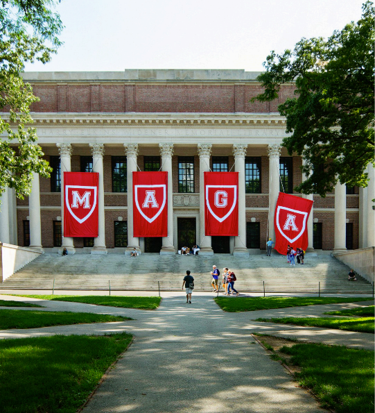

# The campus counter-revolution

*Donald Trump’s plan to remake universities threatens America’s prosperity and freedom*

原文：

**“T**HIS IS AN economic revolution and we will win.” Donald

Trump’s line on tariffs sounds like something from Robespierre or

Engels. And as any revolutionary knows, to sweep away the old

order it is not enough just to raise import duties. You also have to

seize and refashion the institutions that control the culture. In

America that means wresting control of Ivy League universities

which play an outsize role in forming the elite (including Mr

Trump’s cabinet). TheMAGA plan to remake the Ivies could have

terrible consequences for higher education, for innovation, for

economic growth and even for what sort of country America is.

And it is only just beginning.

“这是一场经济革命，我们将取得胜利。”唐纳德·特朗普的关税路线听起来像罗伯斯庇尔或恩格斯的东西。任何革命者都知道，要扫除旧秩序，仅仅提高进口税是不够的。你还必须抓住并改造控制文化的机构。在美国，这意味着夺取对常春藤联盟大学的控制权，这些大学在形成精英(包括特朗普的内阁)方面发挥了巨大作用。TheMAGA计划重建常青藤联盟可能会对高等教育、创新、经济增长甚至美国是什么样的国家产生可怕的后果。这才刚刚开始。

学习：

refashion：改造；重新制作；重新设计；重塑；改装

wresting：费力取得；（wrest的现在分词）

原文：

The target has been exquisitely chosen. Over the past decade elite

universities have lost the bipartisan support they used to enjoy. This

was partly their own fault. In too many cases they succumbed to

faddish groupthink about oppression, became scared of their

student-customers and turned away speakers in the name of safety.

At the same time, American politics became more polarised by

educational achievement. Kamala Harris lost the popular vote in

the 2024 presidential election. But she won Americans with post

graduate degrees by 20 points. This combination left the academy

vulnerable.

目标选择得很巧妙。在过去的十年里，精英大学失去了他们曾经享有的两党支持。这部分是他们自己的错。在太多的情况下，他们屈服于关于压迫的从众思维，变得害怕他们的学生顾客，以安全的名义拒绝演讲者。与此同时，美国政治因教育成就而变得更加两极分化。卡玛拉·哈里斯在2024年总统选举中输掉了普选。但她以20分的优势赢得了拥有研究生学位的美国人。这种组合让学院变得脆弱。

学习：

exquisitely：美 [ˌekˈskwɪzɪtli , ɪkˈskwɪzɪtli] 敏锐地；精致地；精巧地

faddish：流行一时的；时尚的

groupthink：群体思维；团体迷思；团体思维定势；从众思维

原文：

But the most substantive change has been within the Republican

Party. Conservatives considered elite universities to be hostile

territory even before William F. Buckley published “God and Man

at Yale” in 1951. Yet they also respected the basic compact that

exists between universities and the federal government: that

taxpayers fund scientific research and provide grants for students

from poor families, and in return, universities do world-changing

research.

但最实质性的变化发生在共和党内部。甚至在威廉·F·巴克利1951年出版《耶鲁的上帝与人》之前，保守派就认为精英大学是敌对的领地。然而，他们也尊重大学和联邦政府之间存在的基本契约:纳税人资助科学研究，为贫困家庭的学生提供助学金，作为回报，大学进行改变世界的研究。

学习：

compact：协议；协定；合同；合约；契约

原文：

Some of the researchers may have views that irk the White House

of the day. Many are foreigners. But their work ends up benefiting

America. That is why, in 1962, the government funded a particle

accelerator, even though some people who would use it had long

hair and hated American foreign policy. And why, later that decade,

researchers at American universities invented the internet, with

military funding.

一些研究人员的观点可能会惹恼当时的白宫。很多是外国人。但是他们的工作最终造福了美国。这就是为什么，在1962年，政府资助了一个粒子加速器，尽管一些会使用它的人留着长头发，讨厌美国的外交政策。这也是为什么在那十年后，美国大学的研究人员在军方的资助下发明了互联网。

学习：

irk：使烦恼；使厌烦；激怒；惹恼

of the day：当天的；当日的；

原文：

This deal has been the source of military as well as economic

power. It has contributed to almost every technological leap that

has boosted output, from the internet to mRNA vaccines and GLP-

1 agonists to artificial intelligence. It has made America a magnet

for talented, ambitious people from around the world. It is this

compact—not bringing car factories back to the rust belt—that is

the key to America’s prosperity. And now the Trump administration

wants to tear it up.

这笔交易是军事和经济实力的来源。从互联网到mRNA疫苗和GLP- 1激动剂到人工智能，它几乎为每一个提高产出的技术飞跃做出了贡献。它使美国成为吸引世界各地有才华、有抱负的人的磁石。正是这种契约——不把汽车工厂带回铁锈地带——是美国繁荣的关键。现在特朗普政府想要撕毁它。

原文：

His government has used federal grants to take revenge on

universities: the presidents of Princeton and Cornell criticised the

government and promptly had over $1bn in grants cancelled or

frozen. It has arrested foreign students who have criticised the

conduct of Israel’s war in Gaza. It has threatened to increase the tax

on endowments: J.D. Vance (Yale Law School) has proposed

raising it on large endowments from 1.4% to 35%.

他的政府利用联邦拨款对大学进行报复:普林斯顿大学和康奈尔大学的校长批评政府，并迅速取消或冻结了超过10亿美元的拨款。它逮捕了批评以色列在加沙发动战争的外国学生。它威胁要增加捐赠基金的税收:J.D. Vance(耶鲁大学法学院)已经提议将大型捐赠基金的税收从1.4%提高到35%。

原文：

What it wants in return varies. Sometimes it is to eradicate the

woke-mind virus. Sometimes it is to eradicate antisemitism. It

always involves a double standard on free speech, according to

which you can complain about cancel culture and then cheer on the

deportation of a foreign student for publishing an op-ed in a college

newspaper. This suggests that, as with any revolution, it is about

who has power and control.

它想要的回报各不相同。有时是为了根除觉醒病毒。有时候是为了根除反犹太主义。它总是涉及言论自由的双重标准，根据这一标准，你可以抱怨取消文化，然后为一名外国学生因在大学报纸上发表专栏文章而被驱逐出境欢呼。这表明，与任何革命一样，这是关于谁拥有权力和控制权的问题。

学习：

eradicate：根除；消灭；杜绝；拔除（植物）

od-ed：专栏版；评论版；专栏文章；评论文章；

>
>
>**"Cancel culture"**（取消文化）指的是一种社会现象，即个人或团体因言行（尤其是涉及政治、种族、性别等敏感议题）被认为不当而遭到公开谴责、抵制，甚至被剥夺职业机会、社交平台封禁等后果。其核心是通过集体施压“取消”（cancel）某人的社会影响力或生存空间，以达到惩罚或 silencing（压制）的目的。
>
>在上下文中的具体含义：
>
>这段文字批判了某些势力在“言论自由”（free speech）问题上的**双重标准**（double standard）：
>1. **一方面**，他们抱怨“取消文化”对保守派或特定观点的压制（例如反对“觉醒主义/woke-mind virus”）；  
>2. **另一方面**，他们又支持用类似手段惩罚异见者（例如驱逐一名因发表专栏文章而惹争议的外国学生）。  
>
>这里的“cancel culture”被用作一个**标签**，用来描述“压制言论”的行为，但作者指出，批评者自身也可能在利用同样的逻辑去打压对手，本质是**权力争夺**（who has power and control）。
>
>补充说明：
>
>• **“取消文化”的争议**：支持者认为它是弱势群体对抗歧视的正当工具；反对者则认为它助长舆论审判，侵蚀言论自由。  
>• 文中提到的“**woke-mind virus**”是保守派对进步派社会运动（如BLM、LGBTQ+权利等）的贬义称呼，暗示其像“病毒”一样传播。  
>
>作者借此揭露：无论哪一方，标榜“自由”的同时都可能在实际操作中选择性打压异己，最终围绕的是**权力控制**而非原则。

原文：

So far, universities have tried to lie flat and hope Mr Trump leaves

them alone, just like many of the big law firms that the president

has targeted. The Ivy presidents meet every month or so, but have

yet to come up with a common approach. Meanwhile, Harvard is

changing the leadership of its Middle East studies department and

Columbia is on its third president in a year. This strategy is unlikely

to work. The MAGA vanguard cannot believe how quickly the

Ivies have capitulated. The Ivies also underestimate the fervour of

the revolutionaries they are up against. Some of them don’t just

want to tax Harvard—they want to burn it down.

到目前为止，大学一直试图躺平，希望特朗普不要管它们，就像总统针对的许多大型律师事务所一样。常青藤大学的校长们大约每个月会面一次，但是还没有想出一个共同的方法。与此同时，哈佛正在更换其中东研究部门的领导，哥伦比亚大学在一年内更换了第三任校长。这种策略不太可能奏效。MAGA领导者无法相信常青藤这么快就投降了。常春藤联盟也低估了他们所对抗的革命者的热情。他们中的一些人不仅仅想向哈佛征税，他们还想烧掉哈佛。

学习：

vanguard：美 [ˈvænɡɑːrd] （政治、艺术、工业等社会活动的）领导者；先驱者；先锋；前卫；先头部队；

capitulated：有条件投降；（capitulate的过去式和过去分词）

原文：

Resisting the administration’s assault requires courage. Harvard’s

endowment is about the same size as the sovereign-wealth fund of

the oil-rich sultanate of Oman, which should buy some bravery.

But that mooted tax could shrink it quickly. Harvard receives over

\$1bn in grants each year. Columbia’s annual budget is \$6bn; it

receives $1.3bn in grants. Other elite universities are less fortunate.

If even the Ivies cannot stand up to bullying, there is not much

hope for elite public universities, which are just as dependent on

research funding and do not have vast endowments to absorb

government pressure.

抵制政府的攻击需要勇气。哈佛的捐赠基金与石油资源丰富的阿曼苏丹国的主权财富基金规模相当，这应该能买到一些勇气。但是正在讨论的税收可能会使其迅速缩水。哈佛每年获得超过10亿美元的拨款。哥伦比亚大学的年度预算是60亿美元；它获得了13亿美元的拨款资助。其他精英大学就没这么幸运了。如果连常春藤盟校都无法抵挡欺凌，那么精英公立大学就没有多少希望，因为它们同样依赖研究经费，也没有足够的资金来承受政府压力。

学习：

sultanate：美 [ˈsʌltəˌnet] 伊斯兰教君主的地位；回教君主的领地；伊斯兰教君主的领地

mooted：提出…供讨论；（moot的过去式）

原文：

How, then, should universities respond? Some things that their

presidents want to do anyway, such as adopting codes protecting

free speech on campus, cutting administrative staff, banning the use

of “diversity” statements in hiring and ensuring more diverse

viewpoints among academics, accord with the views of many

Republicans (and this newspaper). But the universities should draw

a clear line: even if it means losing government funding, what they

teach and research is for them to decide.

那么，大学应该如何应对呢？他们的校长无论如何都想做的一些事情，如通过保护校园言论自由的法规，削减行政人员，禁止在招聘中使用“多样性”声明，确保学术界观点更加多样化，符合许多共和党人(和本报)的观点。但是大学应该划清界限:即使这意味着失去政府资助，他们教什么和研究什么是他们自己决定的。

学习：

codes：法规，规则

## **Like Ike**

原文：

This principle is one reason why America became the world’s most

innovative economy over the past 70 years, and why Russia and

China did not. Yet even that undersells its value. Free inquiry is one

of the cornerstones of American liberty, along with the freedom to

criticise the president without fear of retribution. True

conservatives have always known this. “The free university”, said

Dwight Eisenhower in his farewell presidential address in 1961,

has been “the fountainhead of free ideas and scientific discovery”.

这一原则是过去70年美国成为世界上最具创新力的经济体，而俄罗斯和中国却没有的原因之一。然而，即使这样也低估了它的价值。自由调查是美国自由的基石之一，还有批评总统而不用担心报复的自由。真正的保守派一直都知道这一点。德怀特·艾森豪威尔在1961年的总统告别演说中说，“自由大学”是“自由思想和科学发现的源泉”。

学习：

undersell：贱卖；低估

retribution：报应；惩罚；应得的惩罚；严惩；

fountainhead：源头；泉源；根源；发源地；起源

原文：

Eisenhower, who was president of Columbia before he was

president of the United States, warned that when universities

become dependent on government grants, the government can

control scholarship. For a long time that warning seemed a bit

hysterical. America never had a president willing to exert such

authority over colleges. Now it does. ■

在担任美国总统之前担任哥伦比亚校长的艾森豪威尔警告说，当大学变得依赖政府拨款时，政府可以控制奖学金。长期以来，这一警告似乎有点歇斯底里。美国从来没有一位总统愿意对大学行使如此大的权力。现在有了。■

## 后记

2025年4月13日下午2点于上海。