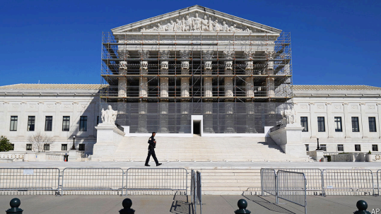

# Trump’s tariff blitz faces strong legal challenges

*The president has drawn fire from some conservative legal scholars*

blitz：美 [blɪts] 闪电战；闪击式行动；突袭；

>
>
>**"Draw fire" 的含义**  
>
>**直译**：字面意思是“吸引火力/招致炮火”，源自军事术语（士兵暴露位置引来敌方射击）。  
>
>**比喻义**：  
>• **引发批评/抨击**（常用在政治、舆论语境）  
>• **成为众矢之的**（强调因言行不当或争议性政策遭到多方指责）  
>
>---
>
>**在本文中的用法**  
>
>**原文语境**：  
>*"The president has drawn fire from some conservative legal scholars..."*  
>（特朗普的关税政策激怒了一些**保守派法律学者**——这群人通常支持共和党，但此次因**法律程序或宪法问题**公开批评他。）  
>
>**隐含信息**：  
>• 连“自己人”（保守派学者）都反对，说明争议极大。  
>• “fire”暗示批评的激烈程度（如公开撰文、联名抗议等）。  
>
>---
>
>**翻译建议**  
>
>**直译（保留比喻）**：  
>• “特朗普的关税攻势引来（保守派法律学者的）猛烈炮轰”  
>• “总统的政策招致保守派法学家的抨击”  
>
>**意译（强调后果）**：  
>• “特朗普关税政策引发保守派法律界强烈反对”  
>• “连保守派学者也群起批评总统的关税行动”  
>
>---
>
>**搭配扩展**  
>
>• **Draw fire from allies** → 连盟友也翻脸批评  
>• **Draw heavy fire** → 遭到猛烈抨击  
>• **Draw bipartisan fire** → 两党齐声反对（如关税政策同时得罪民主党和共和党人）  
>
>（根据上下文，可调整“fire”的译法强度，例如“质疑”“声讨”等。）

原文：

**W**ITH MARKETS gyrating from the tariffs Donald Trump has

imposed on around 180 countries, only to pause some of the most

punishing ones on April 9th, a conservative organisation has filed a

lawsuit challenging an initial round of tariffs the president

announced on Chinese imports in February, duties he has since

escalated. The New Civil Liberties Alliance (NCLA), which counts

Charles Koch, a right-wing billionaire, among its supporters,

argues that the president lacked the authority to impose these

levies. With Chinese goods still a prime target, the case retains its

salience. Similar lawsuits against other tariffs could yet scuttle the

boldest—and most destabilising—move of Mr Trump’s second

term.

随着市场因唐纳德·特朗普(Donald Trump)对约180个国家征收的关税而波动，仅在4月9日暂停了一些最具惩罚性的关税，一个保守组织提起诉讼，挑战总统在2月份宣布的对中国进口商品的首轮关税，自那以来他一直在升级这些关税。右翼亿万富翁查尔斯·科氏是新公民自由联盟(NCLA)的支持者之一，该联盟认为总统没有权力征收这些税。由于中国商品仍是主要目标，此案仍有其显著性。针对其他关税的类似诉讼可能会破坏特朗普第二任期最大胆——也是最不稳定——的举措。

学习：

gyrate：剧烈波动

scuttle：美 [ˈskədl] 破坏计划；使（计划等）失败

>
>
>**"Count" 在此处的含义**  
>
>**原句结构**：  
>*"The New Civil Liberties Alliance (NCLA), which counts Charles Koch, a right-wing billionaire, among its supporters..."*  
>
>**核心意思**：  
>• **Count** 在这里表示 **"将……列为"** 或 **"拥有……作为成员/支持者"**（强调该组织的重要影响力）。  
>• 类似表达：**include**, **list**, **have as a member**。  
>
>---
>
>**具体解析**  
>
>1. **字面理解**：  
>   • "Count X among Y" = **"将X算作Y的一部分"**（Y通常是群体、名单或资源）。  
>   • 例句：*The university counts three Nobel laureates among its faculty.*  
>     （这所大学的教师中包括三位诺贝尔奖得主。）  
>
>2. **本文语境**：  
>   • NCLA（新公民自由联盟）是一个保守派组织，**其支持者中包括右翼亿万富翁Charles Koch**。  
>   • 通过"count"强调Koch的参与提升了该组织的**政治分量和资源背景**（暗示诉讼有财力/影响力支持）。  
>
>---
>
>**翻译建议**  
>
>• **直译**：  
>  “新公民自由联盟（NCLA）的支持者中包括右翼亿万富翁Charles Koch……”  
>• **意译（突出影响力）**：  
>  “NCLA背后有右翼富豪Charles Koch等金主支持……”  
>  “NCLA获Charles Koch等保守派巨富资助……”  
>
>---
>
>**对比其他用法**  
>
>• **Count on**（依赖）：*We can count on his support.*（我们指望他的支持。）  
>• **Count as**（视为）：*This counts as a violation.*（这算违规。）  
>• **Count against**（对……不利）：*His past mistakes count against him.*（他过去的错误对他不利。）  
>
>**注**：此处"count"是及物动词，直接接宾语（X among Y），与上述短语动词不同。

原文：

The power “to lay and collect taxes, duties, imposts and excises”,

per Article 1, section 8 of the constitution, lies with Congress. The

constitution assigns no direct role to presidents in this domain. In

1977, however, Congress passed the International Emergency

Economic Powers Act (IEEPA) in an attempt to curb powers

granted to the president during the first world war. This law

empowered presidents to restrict imports, freeze assets and impose

sanctions in the event of an “unusual and extraordinary threat” to

the “national security, foreign policy or economy of the United

States”. Mr Trump invoked the IEEPA in February, pointing to the

influx of fentanyl, to justify tariff hikes on Canada, Mexico and

China. He did so again on April 2nd to support his radical tariff

overhaul, declaring that America’s “large and persistent” trade

deficits threaten the nation’s security and economic stability.

根据《宪法》第1条第8款，国会拥有“规定和征收税收、关税、捐税和消费税”的权力。《宪法》没有在这一领域赋予总统直接的角色。然而，在1977年，国会通过了国际紧急经济权力法案(IEEPA ),试图限制第一次世界大战期间授予总统的权力。该法案授权总统在“美国的国家安全、外交政策或经济”受到“不寻常和非同寻常的威胁”时，限制进口、冻结资产并实施制裁。特朗普今年2月援引《国际环境保护法》，指出芬太尼的流入，为加拿大、墨西哥和中国提高关税提供了理由。4月2日，他再次这样做，以支持他的激进关税改革，宣称美国“巨大而持续的”贸易赤字威胁着国家的安全和经济稳定。

学习：

invoke：援引；引用

hike：（价格）大幅上涨；猛涨；急剧提高

原文：

The NCLA’s lawsuit, filed in Florida on April 3rd, does not quarrel

with Mr Trump’s declaration of a national emergency concerning

fentanyl. But it argues that the IEEPA “does not even mention

tariffs” and notes that “no previous president” has turned to the

statute to introduce tariffs in its nearly five-decade history. Even if

tariffs were authorised, the law requires measures to be “necessary”

to resolve the emergency, yet there is “no connection between the

opioid problem and the tariff he ordered”. The lawsuit also claims

that “Congress passed the IEEPA to counter external emergencies,

not to grant presidents a blank cheque to write domestic economic

policy”.

NCLA于4月3日在佛罗里达州提起的诉讼，与川普宣布芬太尼进入国家紧急状态并无争议。但它认为，IEEPA“甚至没有提到关税”，并指出，“没有任何一位前任总统”在其近50年的历史中求助于该法规来引入关税。即使关税得到授权，法律要求采取措施是解决紧急情况“必要的”，但“阿片类药物问题和他下令征收的关税之间没有联系”。该诉讼还声称，“国会通过IEEPA是为了应对外部紧急情况，而不是授予总统空白支票来制定国内经济政策”。

原文：

In 2023 the Supreme Court balked when Joe Biden stretched

statutory language to relieve $430bn in student loans. The loan

forgiveness triggered the “major questions doctrine”—the idea that

when an executive action involves a question of vast “economic

and political significance”, it requires clear and specific

authorisation from Congress. The NCLA draws on the same

doctrine to condemn Mr Trump’s first round of tariffs, calling them

“the largest tax increase in a generation”.

2023年，当乔·拜登(Joe Biden)延伸法定语言以减免4300亿美元学生贷款时，最高法院犹豫了。贷款豁免引发了“重大问题原则”(major questions doctrine)，即当一项行政行动涉及一个具有巨大“经济和政治意义”的问题时，它需要得到国会明确而具体的授权。NCLA利用同样的原则谴责特朗普的第一轮关税，称其为“一代人以来最大的增税”。

学习：

balk：拒绝；阻碍；妨碍；阻止；犹豫

statutory：法定的；依照法令的；依法必须执行的；法定程序的

原文：

If the fentanyl tariffs on China raised a major question, reckons

Alan Morrison, a law professor at George Washington University,

sweeping levies of the type announced by Mr Trump on April 2nd

pose a “cataclysmic” one. Asserting presidential authority to upend

the global trading system, he argues, “blows the sky off the

statute”. And the haphazard details—seemingly picking numbers

out of a hat, penalising an island inhabited only by penguins,

exempting Russia, starting and stopping—suggests Mr Trump’s

approach to tariffs “could hardly be more of an ‘I can do what I

want to do.’”.

乔治·华盛顿大学的法学教授艾伦·莫里森认为，如果对中国征收芬太尼关税提出了一个主要问题，那么特朗普4月2日宣布的全面征税将带来一个“灾难性”问题。他认为，维护总统权威以颠覆全球贸易体系，“打破了法律”。随意的细节——似乎从帽子里挑出数字，惩罚一个只有企鹅居住的岛屿，豁免俄罗斯，开始和停止——表明特朗普对关税的态度“简直就是‘我可以做我想做的事情’。”".

学习：

cataclsymic：美 [ˌkædəˈklɪzmɪk] 灾难性的；剧变的；

asserting：维护；

upend：颠覆

haphazard：随意的；偶然的；无序的；杂乱无章的；

>
>
>**"Blow the sky off the statute" 的含义解析**  
>
>**1. 字面拆解**  
>
>• **Blow the sky off**：字面意思是“把天空炸飞”，比喻**极度夸张、超出合理范围的行为**（类似中文“捅破天”“无法无天”）。  
>• **The statute**：指**法律条文**（此处特指授权总统征收关税的相关法规，如《贸易法》第201/232条等）。  
>
>**2. 整体含义**  
>
>• 教授Alan Morrison认为，特朗普宣称总统有权**单方面颠覆全球贸易体系**，这种主张**完全突破了法律条文的限制**，甚至到了“荒谬”的地步。  
>• 相当于说：**“这简直是把法律条文炸得粉碎”**（暗示总统权力被滥用，远超国会立法的原意）。  
>
>**3. 修辞效果**  
>
>• **夸张手法**：强调特朗普关税政策的**极端性和破坏性**（“cataclysmic”一词前后呼应）。  
>• **讽刺意味**：暗示总统在“捏造法律依据”，像“随意从帽子里抽数字”（后文提到的haphazard details）一样无视规则。  
>
>---
>
>**翻译建议**  
>
>• **直译（保留比喻）**：  
>  “（这种主张）简直是把法律条文炸上了天。”  
>• **意译（强调越界）**：  
>  “（这）完全践踏了法律底线。”  
>  “（这）根本是对法律的彻底无视。”  
>
>---
>
>**补充说明**  
>
>• **背景关联**：美国宪法规定，贸易政策（如关税）主导权在**国会**，总统需依**国会授权法案**行动。特朗普援引《国际紧急经济权力法》（IEEPA）等扩大权力，被法学界质疑“扭曲法律原意”。  
>• **类似表达**：  
>  • *"Stretch the law to breaking point"*（将法律扭曲至断裂）  
>  • *"Fly in the face of the statute"*（公然违抗法律）  
>
>（根据上下文，此处翻译需突出**“总统权力失控”+“法律被架空”**的双重批判。）

原文：

Mr Morrison highlights another legal tool that could be turned

against Mr Trump: the “non-delegation doctrine”, which holds that

Congress cannot just hand over its legislative powers by granting

excessive authority to the executive. If the Supreme Court were to

accept Mr Trump’s expansive reading of the IEEPA, it might be

forced to strike down the statute as an unconstitutional delegation

of Congress’s power over tariffs.

莫里森强调了另一个可以用来对付特朗普的法律工具:“非授权主义”，即国会不能通过授予行政部门过度权力来交出立法权。如果最高法院接受特朗普对IEEPA的宽泛解读，它可能会被迫撤销该法规，因为它是对国会关税权力的违宪授权。

学习：

strike down：打倒；击打；推翻

原文：

If that argument were to prevail, then Mr Trump’s executive order

lays out something of a plan B. In addition to the IEEPA, it briefly

cites three laws as alternative sources of tariff authority. The

National Emergency Act allows presidents to activate emergency

powers embedded in other laws. Section 604 of the Trade Act of

1974 permits them to adjust tariff schedules within limits set by

Congress. And section 301 of Title 3 of the US Code allows

presidents to delegate powers to cabinet members. Yet none of

these appears to grant the sweeping tariff powers Mr Trump asserts.

如果这种观点占上风，那么特朗普的行政命令列出了b计划。除了IEEPA，它还简要列举了三项法律作为关税权力的替代来源。《国家紧急状态法》允许总统激活其他法律中的紧急权力。1974年贸易法第604条允许他们在国会设定的范围内调整关税表。美国法典第三篇第301节允许总统将权力授予内阁成员。然而，这些似乎都没有授予特朗普所声称的广泛关税权力。

原文：

If Mr Trump sticks with punishing tariffs against countries or

industries, the pool of potential plaintiffs to take this fight to the

courts is vast. Many companies in America stand to suffer. But

Nicholas Bagley, a law professor at the University of Michigan,

wonders if giant corporations like Walmart and Nike will “pick a

high-profile fight with the president on one of his signature policy

objectives”. Trade groups like the American Petroleum Institute, he

reckons, may be more willing to sue in the event tariffs are

switched on again in 90 days, as may “scrappy, right-wing

property-rights-oriented NGOs”.

如果特朗普坚持对一些国家或行业征收惩罚性关税，那么将这场斗争诉诸法庭的潜在原告会非常多。美国的许多公司都将遭受损失。但是密歇根大学的法学教授尼古拉斯·巴格利怀疑像沃尔玛和耐克这样的大公司是否会“就总统的一个标志性政策目标与他进行一场高调的斗争”。他认为，像美国石油协会这样的贸易团体可能更愿意在90天内再次启动关税的情况下提起诉讼，就像“好斗的、右翼的以产权为导向的非政府组织”一样。

学习：

plaintiffs：原告

sue：提起诉讼

scrappy：好斗的

原文：

What happens when this fight reaches the Supreme Court? That,

says Mr Bagley, is tricky to predict. On one hand, the justices tend

to defer to presidents on policies “with a foreign-affairs

connection”. On the other, the Roberts court tends to be pro

business and its conservative majority favours a “limited,

constrained administrative state that will clash with Mr Trump’s

muscular use” of the law, Mr Bagley notes.

当这场斗争到达最高法院时会发生什么？巴格利先生说，这很难预测。一方面，在“与外交事务有关的”政策上，大法官倾向于遵从总统的意见。巴格利指出，另一方面，罗伯茨法院倾向于支持商业，其保守派多数支持一个“有限的、受约束的行政国家，这将与特朗普对法律的强力运用相冲突”。

学习：

muscular：美 [ˈmʌskjələr] 强劲有力的；强有力的；

原文：

There are other wrinkles. If a banana importer successfully

challenges a tariff on bananas from Costa Rica, courts will not

issue a blanket order cancelling Mr Trump’s entire tariff regime.

(Ilya Somin, a law professor at George Mason University, says a

lawsuit he is preparing with the Liberty Justice Centre, a right-wing

legal advocacy organisation, will seek relief against “the entire

invocation of the IEEPA to impose tariffs, not just those against

particular nations”.) Ordinarily, the government would withdraw

tariff hikes across the board if the Supreme Court rules that it lacks

the authority to undertake them. But “that voluntary respect” for

the rule of law, Mr Bagley says, “seems very much open to

question.”

此事还有其他复杂之处。即使某家香蕉进口商成功挑战了针对哥斯达黎加香蕉的关税，法院也不会一纸命令直接废除特朗普的整个关税体系。（乔治梅森大学法学教授伊利亚·索明表示，他正与右翼法律维权组织“自由正义中心”筹备诉讼，目标是寻求**“全面禁止政府援引《国际紧急经济权力法》（IEEPA）征收关税，而非仅针对特定国家”**。）通常而言，若最高法院裁定政府无权实施关税，行政部门应全面撤回加税措施。但巴格利指出，“这种对法治的自愿遵从”现在看来“非常值得怀疑”。  

学习：

>**"Wrinkles" 在此处的含义解析**
>
>**1. 字面意思**
>
>"Wrinkle" 原意是**“皱纹”**，指物体表面的褶皱。但在非正式英语中，它常被用作**比喻**，表示：
>
>• **复杂因素**（a complication or difficulty）  
>• **意料之外的障碍**（an unexpected problem or nuance）  
>• **需要额外处理的细节**（a small but important issue that needs to be addressed）
>
>**2. 在本文中的具体含义**
>
>原文开头说：  
>*"There are other wrinkles."*  
>（**“此事还有其他复杂因素。”**）  
>
>结合上下文，这里的 **"wrinkles"** 指的是：  
>• 法律诉讼中可能遇到的**额外难题**（比如法院不会直接废除整个关税体系，而是逐案审理）。  
>• 特朗普关税政策中的**模糊地带或潜在漏洞**（例如政府可能不自愿遵守最高法院的裁决）。  
>
>**3. 类似用法举例**
>
>• *"The plan sounds good, but there might be a few wrinkles we haven’t considered."*  
>  （“这个计划听起来不错，但可能有些我们没考虑到的复杂因素。”）  
>• *"The new law has some legal wrinkles that could cause problems later."*  
>  （“新法律存在一些可能引发后续问题的法律细节。”）  
>
>---
>
>**翻译建议**
>
>• **直译（保留比喻）**：  
>  **“此事还有其他褶皱。”**（较少用，但能保留原文风格）  
>• **意译（更自然）**：  
>  **“此事还有其他复杂因素。”**  
>  **“这里还有一些棘手的问题。”**  
>  **“此外，还有一些细节需要处理。”**  
>
>---
>
>**为什么不用“问题”或“困难”？**
>
>• **"Wrinkles"** 比 **"problems"** 语气更轻，强调**“需要额外注意的细节”**，而非完全负面的“困难”。  
>• 在政策/法律语境中，它常指**技术性复杂因素**，而非根本性错误。  
>
>---
>
>**总结**
>
>在本文中，**"wrinkles"** 指的是**法律挑战中的额外复杂因素**，翻译时可灵活处理，但需保留其“微妙但重要”的隐含意义。

invocation

rule：裁定，裁决

across the board：全面的；影响全体的；普遍的

>
>
>**"Invocation" 的含义解析**
>
>**原句结构**：  
>*"...will seek relief against 'the entire invocation of the IEEPA to impose tariffs, not just those against particular nations'."*  
>
>**核心意思**：  
>• **Invocation**（名词）指**“援引、调用（法律条文）”**，即政府引用《国际紧急经济权力法》（IEEPA）作为征收关税的法律依据。  
>• 此处强调诉讼目标是**挑战政府“整体性援引IEEPA”的合法性**，而非仅针对某国关税。  
>
>**法律语境**：  
>IEEPA通常用于应对国家安全威胁（如制裁敌国），但特朗普政府将其扩大解释为**“经济紧急状态”**以加征关税，被质疑滥用法律。  
>
>
>
>---
>
>**翻译要点说明**  
>
>1. **Wrinkles** → **“复杂之处”**（比喻政策/法律中的棘手细节）  
>2. **Blanket order** → **“一纸命令”**（保留“blanket”全覆盖的意象）  
>3. **Invocation of the IEEPA** → **“援引IEEPA”**（明确法律术语）  
>4. **Voluntary respect for the rule of law** → **“对法治的自愿遵从”**（讽刺政府可能拒不服从判决）  
>
>**注**：最后一句暗示特朗普政府可能**无视最高法院裁决**，延续关税政策，反映其对法治的漠视。

原文：

Some conservative activists say they are unimpressed by the April

9th announcement of a 90-day delay to pursue negotiations with

dozens of countries, as it does not alter the constitutional issues.

“Ten percent tariffs for nearly the whole world are still in effect

without pause,” notes Mr Somin. “Absolutely moving ahead!” ■

一些保守派活动人士表示，他们对4月9日宣布的“90天谈判延迟”**无动于衷**，因为这并未改变宪法层面的争议。索明指出：“**针对几乎全世界的10%关税仍在持续生效，毫无暂停迹象**。绝对是在推进！” ■  

学习：

alter：改变

>
>
>**"Unimpressed" 的含义解析**
>
>**原句结构**：  
>*"Some conservative activists say they are unimpressed by the April 9th announcement..."*  
>
>**核心意思**：  
>• **Unimpressed** 表示**“不为所动、不觉得有说服力”**，即保守派活动人士认为特朗普4月9日宣布的“90天谈判延迟”**并未解决根本问题**，因此对其**不认可、不买账**。  
>• 隐含态度：**失望/批评**（认为政策调整只是表面功夫）。  
>
>**语境延伸**：  
>• 尽管特朗普暂缓部分关税（如对欧盟、加拿大等），但**10%的全球性关税仍持续生效**，且**宪法争议（总统越权）未解决**，因此保守派认为此举无实质意义。  
>
>
>
>---
>
>**翻译要点说明**  
>
>1. **Unimpressed** → **“无动于衷”**（强调“不认可”而非字面“不印象深刻”）  
>   • 替代译法：**“不买账”“认为毫无意义”**（根据语气强弱调整）。  
>2. **Constitutional issues** → **“宪法层面的争议”**（点明核心矛盾是总统权力合法性）。  
>3. **Absolutely moving ahead!** → **“绝对是在推进！”**（保留原文感叹语气，暗讽政策强硬不变）。  
>
>---
>
>**修辞与背景补充**  
>
>• **讽刺对比**：政府宣称“暂缓谈判”展现灵活性，但实际关税仍在实施（**“without pause”**）。  
>• **保守派的立场**：即使支持特朗普，也反对**行政权滥用**（体现美国宪政传统对权力扩张的警惕）。

## 后记

2025年4月14日于上海。