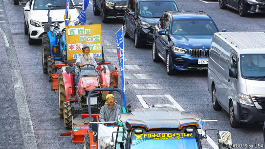

# Japan faces a reckoning over rice

*A crisis over its staple reveals cracks in the country’s food system*

reckoning：面临严峻考验

Staple: 美 [ˈsteɪpl] 主食

>#### **词汇解析与翻译要点**  
>
>#### **1. Reckoning**  
>• **原义**：清算、算账；引申为**“面临严峻考验/必须正视的问题”**。  
>• **语境**：日本大米（主食）危机暴露了其食品系统的深层问题，暗示**“不得不面对的挑战”**。  
>• **译法**：  
>  • **直译**：清算 → 略显生硬（中文不常用）。  
>  • **意译**：**“日本大米面临严峻考验”** / **“日本迎来大米危机”**（更自然）。  
>
>#### **2. Staple**  
>• **原义**：主食；必需品（此处指**大米**，日本饮食核心）。  
>• **译法**：**“主食”**（明确指代大米）或直接译为**“大米”**（避免歧义）。  
>
>#### **3. Cracks**  
>• **原义**：裂缝；比喻**“系统缺陷/结构性漏洞”**。  
>• **语境**：大米危机揭示了日本食品系统的**“脆弱性”**或**“长期积弊”**。  
>• **译法**：**“暴露了……的隐患”** / **“揭示了……的裂痕”**（保留比喻）。  
>
>---
>
>**标题与副标题翻译参考**  
>
>**原文**：  
>**Japan faces a reckoning over rice**  
>*A crisis over its staple reveals cracks in the country’s food system*  
>
>**翻译**：  
>**日本大米危机：主食困境倒逼食品系统改革**  
>*一场大米危机，暴露了日本食品体系的深层隐患*  
>
>（或更简洁版：**“日本迎来大米危机：主食问题暴露食品系统缺陷”**）  
>
>---
>
>**翻译策略说明**  
>
>1. **标题**：  
>   • **“Reckoning”** 译为**“危机”**（突出紧迫性），补充**“倒逼改革”**（隐含“被迫应对”）。  
>   • 若需保留“清算”隐喻，可用**“日本大米之殇”**（文艺但稍偏离原义）。  
>
>2. **副标题**：  
>   • **“Cracks”** 译为**“隐患”**（符合中文政策/经济报道用语习惯）。  
>   • **“Food system”** 译**“食品体系”**（比“系统”更专业）。  
>
>---
>
>**背景与修辞补充**  
>
>• **日本大米问题**：可能涉及**自给率下降、进口依赖、农业政策僵化**等（“cracks”指向长期结构性问题）。  
>• **标题双关**：  
>  • “Rice”既是具体作物，也象征**粮食安全**；  
>  • “Reckoning”暗示**“过去政策失误的后果”**。

原文：

**A** RECENT FARMERS’ protest in central Tokyo created an

unusual spectacle in a district better known for stylish cafés and

luxury boutiques. Dozens of tractors rumbled through the streets,

accompanied by thousands of demonstrators. Many of them were

rice farmers in jumpsuits and rubber boots, carrying placards

declaring “Farmers are a national treasure” or “NO RICE NO

LIFE”. A combination of factors, such as ageing and poor incomes,

have pushed many out of farming, says Kanno Yoshihide, a farmer

who organised the protest (which was dubbed *Reiwa no hyakusho*

*ikki*—or, a modern-day peasant revolt). “It’s the first time we take

to the streets at such scale,” says Mr Kanno.

最近，东京市中心的农民抗议活动在这个以时尚咖啡馆和奢侈品专卖店闻名的地区创造了一个不同寻常的景象。数十辆拖拉机隆隆驶过街道，伴随着数千名示威者。他们中的许多人是穿着连衣裤和胶靴的稻农，举着标语牌，上面写着“农民是国家的财富”或者“没有米就没有生活”。组织这次抗议活动的农民Kanno Yoshihide说，老龄化和低收入等综合因素迫使许多人放弃了农业。菅野表示:“这是我们第一次以如此大的规模走上街头。”。

学习：

stylish：时髦的；新潮的；有风格的；优雅的；

boutiques：美 [bu:ˈti:ks] 精品店；（boutique的复数）

tractors：拖拉机；（tractor的复数）

rumbled：隆隆作响；（rumble的过去式）

demontrators：示威者

jumpsuits：连裤衫；（jumpsuit的复数）

rubber：橡胶；合成橡胶；

boots：靴子

placards：海报；标语牌；布告；（placard的复数）

revolt：起义；叛乱；反叛；反抗

原文：

The protest comes on the back of broader anxieties about Japan’s

most sacred staple. Last year shoppers looking to buy rice faced

empty shelves. Rice is now available, but prices remain high: in

March the cost in Tokyo jumped by nearly 90% from a year earlier,

the steepest rise for half a century. The government recently started

releasing 210,000 tonnes of its emergency rice reserves in an

unprecedented move to lower prices.

抗议发生的背景是对日本最神圣主食的广泛焦虑。去年，想买大米的顾客面对着空空的货架。大米现在可以买到，但是价格仍然很高:三月份东京的大米价格比一年前上涨了近90%,这是半个世纪以来最大的涨幅。政府最近开始释放21万吨紧急大米储备，这是史无前例的压低价格举措。

原文：

With weak opposition parties, the ruling Liberal Democratic Party

is unlikely to be unseated—but mounting frustration among both

consumers and rural voters could still weigh on the party as

elections loom. The episode has revealed cracks in the country’s

food system, which has left it vulnerable to climate risks.

由于反对党实力较弱，执政的自由民主党不太可能被赶下台——但随着选举的临近，消费者和农村选民日益增长的挫折感仍可能给该党带来压力。这一事件暴露了该国食品体系的裂缝，这使其容易受到气候风险的影响。

学习：

unseated：使从座位上（或马背上）摔下；使失去资格；（unseat的过去式）

loom：临近

weigh on：使苦恼；压在…；打压

原文：

The original cause of the shortage was the blistering heat in the

summer of 2023, which damaged crops. Because rice is harvested

once a year, stored and then distributed gradually, the impact has

lingered. Meanwhile demand spiked, explains Ogawa Masayuki, an

agricultural economist. Rising prices for imported staples such as

wheat—driven in part by the war in Ukraine—made rice a cheaper

alternative. Restaurants, buoyed by the return of tourists, stocked

up. And some households began hoarding in response to warnings

about a possible mega-earthquake last year. “Customers panicked

after seeing headlines about shortages,” says Akizawa Marie, who

runs a rice shop in Tokyo.

短缺的最初原因是2023年夏天的酷热，它损害了农作物。因为大米一年收获一次，储存起来，然后逐渐分配，所以影响一直存在。农业经济学家小川奈那·雅行解释说，与此同时，需求激增。进口主食如小麦的价格上涨——部分原因是乌克兰战争——使得大米成为更便宜的替代品。受游客归来的鼓舞，餐馆囤积大米。一些家庭开始囤积，以应对去年可能发生大地震的警告。在东京经营一家米店的Akizawa Marie说:“顾客们在看到缺货的头条新闻后感到恐慌。

学习：

blistering：炽烈的；极热的；有力的；强烈的

原文：

But the continuing crisis has also highlighted deeper structural

problems. For decades, Japan has quietly restricted rice production

under a policy known as *gentan seisaku*, which was introduced in

the 1970s. As rice consumption began to decline, driven by

changing diets, the government moved to prevent oversupply.

Farmers were paid to plant less, in order to stabilise prices. Though

officially scrapped in 2018, the policy lives on through subsidies

steering farmers away from rice towards alternatives such as

soyabeans and animal feed. This has created a market with little

room for manoeuvre, where small hiccups trigger serious

disruption, says Honma Masayoshi of the Asian Growth Research

Institute, a think-tank in Japan.

但持续的危机也凸显了更深层次的结构性问题。几十年来，日本一直在一项名为gentan seisaku的政策下悄悄限制水稻生产，该政策于20世纪70年代出台。由于饮食结构的改变，大米消费量开始下降，政府采取措施防止供应过剩。为了稳定价格，农民得到报酬减少种植。尽管该政策在2018年被正式取消，但它仍通过补贴继续存在，补贴引导农民放弃大米，转向大豆和动物饲料等替代品。日本智库亚洲增长研究所的本间正芳说，这创造了一个几乎没有回旋余地的市场，小问题会引发严重的混乱。

学习：

scrap：取消

animal feed：动物饲料

manoeuvre：

>
>
>**词汇解析：Manoeuvre（英式拼写，美式拼写为 maneuver）**  
>
>#### **1. 基本含义**  
>• **原义**：指**“策略性调动、灵活操作”**（军事/战术术语），引申为**“回旋余地”**或**“调整空间”**。  
>• **经济学语境**：常描述市场、政策或企业应对变化的**灵活性**。  
>
>**2. 句中含义**  
>
>• **原文**：  
>  > *This has created a market with little room for manoeuvre, where small hiccups trigger serious disruption.*  
>  > （这一政策导致市场**缺乏调整空间**，轻微波动便会引发严重混乱。）  
>  > • **具体指**：  
>  > • 日本政府通过补贴限制水稻种植，农民被迫转种大豆/饲料作物，导致**大米供应链僵化**。  
>  > • 市场无法根据需求波动灵活调整产量（如突发短缺时难以快速增产），**抗风险能力低下**。  
>
>**3. 译法建议**  
>
>• **直译**：**“回旋余地”** / **“调整空间”**（保留原比喻）。  
>• **意译**：**“灵活性”** / **“应变能力”**（更口语化）。  
>• **全句参考**：  
>  > *这导致市场**缺乏应变能力**，稍有风吹草动便会引发严重混乱。*  
>
>---
>
>**补充说明**  
>
>• **政策背景**：日本**“减反政策”（gentan seisaku）**人为压制大米产量，虽稳定价格，但牺牲了市场弹性（**“little room for manoeuvre”**）。  
>• **修辞效果**：用军事术语**manoeuvre**暗示日本农业政策如**“僵化军队”**，无法应对突发状况。  
>
>

hiccup：小问题；轻微故障；短期困难

原文：

Each rice crisis has brought policy shifts—the previous one in 1993

led to market liberalisation as well as the creation of an emergency

stockpile system. More recently, geopolitical tensions have

renewed the debate over food security and how to raise Japan’s low

food self-sufficiency rate, which stood at just 38% in 2023, far

below Germany’s 83%. The country’s rice and agriculture policy

“is at a turning-point”, says Mr Ogawa. The government has

pledged to increase rice exports seven-fold by 2030 from around

46,000 tonnes in 2024. It is betting that overseas demand can boost

production, without oversupplying the domestic market and

crashing the price.

每一次大米危机都带来了政策的转变——1993年的前一次导致了市场自由化和紧急储备系统的建立。最近，地缘政治紧张重新引发了关于粮食安全和如何提高日本低粮食自给率的争论。2023年，日本的粮食自给率只有38%，远低于德国的83%。小川奈那先生说，该国的水稻和农业政策“正处于转折点”。日本政府承诺，到2030年，将大米出口量从2024年的约4.6万吨增加7倍。它押注海外需求能够促进生产，而不会导致国内市场供应过剩和价格暴跌。

学习：

stockpile：储备；库存；积累；物资储备；

原文：

But the farmers at the protest still ask: who will be left to farm?

Last year, a record number of farmers went bankrupt or shut down,

according to Teikoku Data Bank, a research outfit. Among them,

more than 60% were in their 70s or older. Policymakers often

promote consolidation and large-scale production as a solution.

但是抗议的农民仍然会问:谁会被留下来种田？根据研究机构Teikoku数据库的数据，去年破产或倒闭的农民数量创下纪录。其中，超过60%的人年龄在70岁以上。政策制定者经常提倡整合和大规模生产作为解决方案。

学习：

outfit：机构

原文：

Suzuki Nobuhiro of the University of Tokyo points out that much

of Japan’s farmland is mountainous and fragmented, making it

difficult to scale up efficiently. He instead calls for better protection

of small farmers; many of them have not benefited from the current

price rises, having already sold their rice to agricultural co

operatives at pre-determined prices long ago. “The current situation

is unsustainable—more people will continue to leave the industry,”

says Tenmyo Nobuhiro, a rice farmer in northern Japan. “In the

end, it’s the consumers who pay the price.” ■

东京大学的铃木·信广指出，日本的大部分农田都是山地和分散的，很难有效地扩大规模。相反，他呼吁更好地保护小农场主；他们中的许多人没有从当前的价格上涨中受益，因为他们很久以前就已经以预定的价格将大米卖给了农业合作社。“目前的情况是不可持续的——更多的人将继续离开这个行业，”日本北部的稻农Tenmyo Nobuhiro说。"最终，买单的还是消费者。"■

## 后记

2025年4月15日于上海。