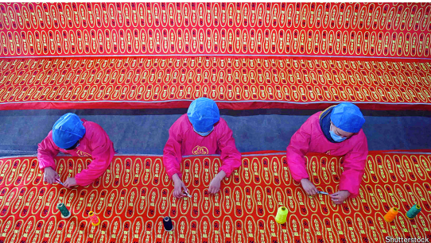

# China’s shoemakers seem more sanguine than its politicians

*A trade war will cause a lot of damage, but many have weathered storms before*

sanguine：美 [ˈsæŋɡwɪn] 乐观的；充满信心的；充满希望的

原文：

**S**OME 1,200 MILES south of where government officials in

Beijing have been breathing retaliatory fire at American tariffs lies

the coastal province of Fujian. This is where the rubber of a million

running shoes will hit the road as the tariffs take effect.

在北京政府官员对美国关税进行报复性反击的地方以南约1200英里，是沿海省份福建。随着关税生效，一百万双跑鞋的橡胶将在这里上路。

学习：

rubber：橡胶

原文：

Fujian exported footwear worth 79bn yuan ($11bn) in 2024, a

quarter of China’s total, bound mainly for North America and

Europe. The city of Quanzhou is home to some 3,000 footwear

firms. Its streets are draped in everything needed to make shoes,

from reams of fabrics spilling out of shop fronts, to plastic soles

displayed alongside laces of every colour. Mr Trump’s tariffs· are

top of workers’ minds, but the mood is surprisingly sanguine.

2024年，福建出口价值790亿元人民币(110亿美元)的鞋类，占中国出口总额的四分之一，主要销往北美和欧洲。泉州是大约3000家制鞋企业的所在地。它的街道上挂满了制造鞋子所需的一切，从铺满店面的大量布料，到陈列在各种颜色鞋带旁边的塑料鞋底。特朗普的关税是工人们最关心的问题，但情绪出奇地乐观。

学习：

footwear：鞋子；鞋靴；鞋类产品

drape：悬挂（布料等）；披上；覆盖；装饰

reams of：大量的

shop fronts：商店门面

soles：鞋底；脚底；袜底；脚掌；（sole的复数）

laces： 系紧（鞋带）；（lace的第三人称单数）；鞋带；花边；

原文：

Many manufacturers had thought ahead, and stopped taking new

American orders after Mr Trump was elected in November, says

Mr Ding, a shoe-leather supplier in town. They knew tariffs might

be coming and did not want to be locked into contracts that would

result in losses.

镇上的一家皮鞋供应商丁先生说，许多制造商早就想好了，在特朗普去年11月当选后，就停止了接受新的美国订单。他们知道关税可能会到来，不希望被会导致亏损的合同所束缚。

原文：

Mr Ding’s sales are down as a result, at least 70% this year, largely

owing to the loss of his customers’American orders. While the

burden of lower tariffs in the past could be shared along the supply

chain, he says, the American tariff wall is now far too high to scale.

“You have to endure this period of pain and see who can persevere

to the end.” It is likely that many will not make it.

结果，丁先生的销售额下降了，今年至少下降了70%,这主要是由于他的客户失去了美国订单。他说，虽然过去降低关税的负担可以在供应链上分担，但美国的关税壁垒现在太高，难以承受。“你要忍受这段痛苦，看谁能坚持到最后。”很可能很多人都不能成功。

原文：

Tariffs imposed by Mr Trump in his first term led Chinese

manufacturers to move some production to South-East Asia,

sending materials from Quanzhou for final processing. That

loophole looked set to close, with 46% American tariffs placed on

Vietnam, but Mr Trump paused those on April 9th. Ms Wu, an

insole maker, said she recently made a sample for a friend in

Vietnam who expected an order of 60,000, but the deal disappeared

after the announcement of the high tariff. Co-operation may now

continue, but so will uncertainty.

特朗普在第一个任期内征收的关税导致中国制造商将部分生产转移到东南亚，从泉州运送材料进行最终加工。随着美国对越南征收46%的关税，这个漏洞看起来将会关闭，但特朗普在4月9日暂停了这些关税。鞋垫制造商吴(音)表示，她最近为一个越南朋友做了一个样品，预计订单为6万只，但在宣布高关税后，这笔交易就消失了。合作现在可能会继续，但不确定性也会继续。

学习：

insole：鞋垫；内底；鞋内垫

原文：

With few other export options available, some are looking within

China’s own borders. Only about a quarter of the shoemakers Mr

Ding serves sell to Chinese consumers, and the domestic market is

saturated. “We have to see whether domestic demand can take off,”

he says. “No one has any business or any money, so they dare not

consume.”

由于几乎没有其他出口选择，一些人把目光投向了中国境内。丁先生服务的鞋店中，只有大约四分之一卖给中国消费者，而且国内市场已经饱和。“我们必须看看国内需求能否起飞，”他表示。“没人有生意，也没钱，所以不敢消费。”

学习：

saturated：饱和

原文：

The same price wars that afflict many competitive industries mean

that margins are razor thin. By the end of last year’s third quarter,

nearly a quarter of China’s listed firms were losing money, more

than double the number five years ago. Mr Zhang, who makes a

few million shoes in a good year in Quanzhou, is not in the red yet.

But since entering the industry eight years ago, he has seen the

profit on a pair of shoes drop from 30 yuan to less than ten yuan.

折磨着许多竞争性行业的价格战意味着利润微薄。截至去年第三季度末，近四分之一的中国上市公司亏损，是五年前的两倍多。在泉州，一个好年景能生产几百万双鞋的张先生还没有亏损。但自从8年前进入这个行业以来，他看到一双鞋的利润从30元下降到不到10元。

学习：

affilict：使痛苦；折磨；困扰；使苦恼；

razor thin：极薄

in the red：赤字, 亏损

原文：

State media’s projection of confidence has persuaded some. “The

Chinese government will find a way forward,” says Ms Wu. “I

believe in them.” Even those not looking to the government are

surprisingly upbeat. Many have weathered storms before, including

during Mr Trump’s first term and the pandemic. Mr Ding offers the

advice of a veteran who has seen a few business cycles. “If you

don’t have any orders, you should basically consider taking a

holiday in the second half of the year.”

官方媒体表现出的信心说服了一些人。“中国政府会找到前进的道路，”吴女士说。“我相信他们。”甚至那些不指望政府的人也出人意料地乐观。许多人以前都经历过风暴，包括特朗普的第一个任期和疫情。丁先生给出了一位经历过几次商业周期的资深人士的建议。“如果没有什么订单，基本上可以考虑下半年休假了。”

学习：

upbeat：乐观的

veteran：老兵，资深人士

原文：

Some will do exactly that. They can only drop their prices by one

yuan at most if they are to pay workers and rent, says Mr Zhang.

“I’m still confused and not sure what to do.” ■

有些人会这样做。张先生说，如果要支付工人和租金，他们最多只能降价1元。“我还是很迷茫，不确定该怎么办。”■

## 后记

2025年4月17日于上海。