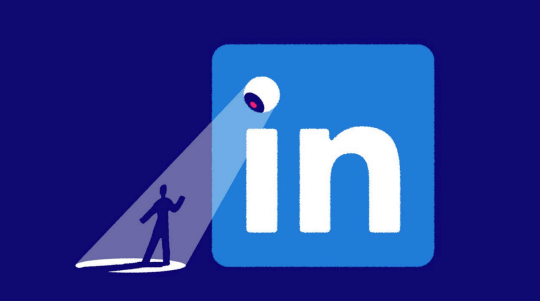

# LinkedIn’s unlikely role in the AI race

*People are using the social networks differently. It is using them differently, too*

原文：

**C**ONGRATULATE LINKEDIN on its work anniversary! Next

month the business world’s favourite social network will turn 22.

The 1.1bn users of LinkedIn—which is a year older than even

Facebook—can celebrate two decades of humblebrags,

motivational quotes and automated congratulations from long

forgotten acquaintances. Microsoft, its owner, can meanwhile toast

a canny acquisition. Since the tech giant bought LinkedIn eight

years ago, for \$26bn, the platform’s annual revenue has grown

from \$3bn to \$17bn.

祝贺LINKEDIN工作周年！下个月，这个商界最受欢迎的社交网络将迎来22岁生日。LinkedIn的11亿用户——甚至比脸书还大一岁——可以庆祝20年来的卑微生活、激励性名言和来自长期被遗忘的熟人的自动祝贺。与此同时，它的所有者微软可以庆祝一次精明的收购。自从8年前这家科技巨头以260亿美元收购LinkedIn以来，该平台的年收入已经从30亿美元增长到170亿美元。

学习：

humblebrags：谦虚自夸（言论）；谦虚炫耀；谦逊自负；（humblebrag的复数）

canny：精明的；精于算计的；老谋深算的；

>
>### **Work Anniversary 的含义**  
>
>**Work Anniversary** 指**“工作周年纪念日”**，即员工加入某公司或组织的周年纪念（如入职1周年、5周年等）。在职场社交平台（如LinkedIn）上，系统会自动提醒用户庆祝自己或联系人的工作周年纪念，并推送祝贺消息。  
>
>#### **具体解析**  
>1. **字面意思**：  
>   • *Work* = 工作  
>   • *Anniversary* = 周年纪念  
>   → 合起来即“工作周年”。  
>
>2. **LinkedIn 的语境**：  
>   • 文中提到 *automated congratulations from long forgotten acquaintances*（来自久未联系的人的自动祝贺），指的是LinkedIn会通过算法自动提醒用户为联系人点赞或留言祝贺其“工作周年”。  
>   • 这类通知已成为LinkedIn的标志性功能（甚至略带调侃意味，因为有些祝贺可能不够走心）。  
>
>3. **中文对应说法**：  
>   • 直译：**“工作周年纪念”**  
>   • 口语化：**“入职X周年”** / **“职场周年庆”**  
>
>#### **例句参考**  
>• *"LinkedIn just notified me about your 5-year work anniversary—congrats!"*  
>  （LinkedIn刚提醒我你入职五周年了——恭喜！）  
>• *"My feed is full of work anniversary posts today."*  
>  （今天我的动态里全是工作周年庆的帖子。）  
>
>---
>
>**为什么LinkedIn强调这一功能？**  
>
>• **社交粘性**：通过自动提醒互动，保持用户活跃度。  
>• **职场文化**：西方职场中，公开庆祝工作年限（尤其是长期服务）是一种认可形式。  
>• **幽默吐槽**：文中用 *humblebrags*（凡尔赛式谦虚自夸）和 *long forgotten acquaintances*（早被遗忘的熟人）暗示这种功能可能流于形式化。  

原文：

As LinkedIn matures, two aspects of its business are evolving.

First, people are using the platform differently. What used to be

simply a contact network is increasingly becoming a content

channel. This presents LinkedIn with an opportunity in advertising

—but at a risk to its professional identity. Second, LinkedIn is

taking on a new strategic function for Microsoft. As the tech giant

bets big on artificial intelligence (AI), LinkedIn is providing its

owner with a billion willing guinea pigs, perhaps giving it an edge

in the AI race.

随着LinkedIn的成熟，其业务的两个方面正在演变。首先，人们使用平台的方式不同了。过去只是一个联系网络，现在正日益成为一个内容渠道。这给LinkedIn提供了一个广告机会——但对其职业身份构成了风险。其次，LinkedIn正在为微软承担一项新的战略职能。随着这家科技巨头在人工智能(AI)上下大赌注，LinkedIn正在为其所有者提供10亿只自愿的豚鼠，这可能使其在人工智能竞赛中占据优势。

学习：

guinea：美 [ˈɡɪni] 几尼（旧时英国金币）；（Guinea）几内亚地区

guinea pigs：豚鼠；天竺鼠；荷兰猪

原文：

With its profile pages and newsfeed, LinkedIn looks much like

other social networks—until you see the content. Whereas the most

followed people on other platforms are athletes and models, the

king of LinkedIn is Bill Gates, who treats his 37m followers to

posts about subjects as varied as agriculture and tuberculosis. “The

stuff that bores people at parties works really well on LinkedIn,”

says Dan Roth, who runs its editorial team, citing a recent viral

discussion on the merits of em dashes—a worthy subject for

debate.

有了个人资料页面和新闻订阅，LinkedIn看起来很像其他社交网络——直到你看到内容。其他平台上最受关注的人是运动员和模特，而LinkedIn的王者是比尔·盖茨，他发布从农业到结核病等各种主题的帖子给3700w粉丝看。“在派对上让人们厌烦的东西在LinkedIn上效果很好，”负责其编辑团队的丹·罗斯(Dan Roth)说，他引用了最近关于长破折号优点的热点讨论——这是一个值得辩论的主题。

学习：

tuberculosis： 美 [tuːˌbɜːrkjəˈloʊsɪs] 结核病；肺结核；痨病

em dash：长破折号；全身破折号；全角破折号；长划线

原文：

Its business model is also different. Every other social network

lives on advertising: Meta, which owns Facebook and Instagram,

gets 98% of its revenue from them. LinkedIn sells ads too—$7bn

worth last year, analysts estimate—but makes the largest share of

its revenue from its recruitment business. LinkedIn claims that it is

the world’s biggest, filling a job vacancy every couple of seconds.

The company also made $2bn last year from paid subscriptions, a

business no other social network has cracked. Every platform is

trying to diversify, says Jeremy Goldman of eMarketer, a data

company. “LinkedIn solved that before a lot of them did.”

它的商业模式也不一样。其他所有社交网络都靠广告生存:拥有脸书和Instagram的Meta公司98%的收入来自广告。LinkedIn也销售广告——分析师估计去年价值70亿美元——但其最大的收入份额来自招聘业务。LinkedIn声称它是世界上最大的，每几秒钟就填补一个职位空缺。该公司去年还从付费订阅中赚了20亿美元，这是其他社交网络从未涉足的业务。数据公司eMarketer的杰里米·戈德曼(Jeremy Goldman)表示，每个平台都在尝试多元化。“LinkedIn在很多公司之前就解决了这个问题。”

原文：

This success disguises a weakness: although more than 1bn people

have signed up for LinkedIn, many do not use it all that much. The

company does not reveal usage figures. But Sensor Tower, a data

provider, estimates that Android-phone users with the LinkedIn app

spend an average of only 48 minutes a month on it. For TikTok the

figure is around 35 hours.

这一成功掩盖了一个弱点:尽管逾10亿人注册了LinkedIn，但许多人并不经常使用它。该公司没有透露使用数据。但数据提供商Sensor Tower估计，使用LinkedIn应用的安卓手机用户平均每月只花48分钟在上面。对于抖音来说，这个数字大约是35小时。

原文：

Lower engagement means fewer chances to show ads, an area

where the opportunity for LinkedIn is large. Business-to-business

(B2B) advertising, LinkedIn’s speciality, is a laggard in the great

move online. Of all adverts sold in America this year, more than

80% by value will be digital, estimates eMarketer. By contrast, less

than half of B2B ads will be. Some $20bn-worth of such ads are

ripe to be plucked from offline channels, such as trade journals and

conferences, if LinkedIn can make people spend enough time on its

platform to see them.

**低用户参与度意味着广告展示机会减少，而这正是LinkedIn潜力巨大的领域。** 作为企业间（B2B）广告的专家，LinkedIn所在的B2B广告领域在数字化大潮中进展缓慢。eMarketer估计，今年美国所有广告中，**按价值计算超过80%将是数字广告**；相比之下，B2B广告的数字化占比还不到一半。如果LinkedIn能让用户在其平台上花费足够时间浏览广告，**约200亿美元的B2B广告预算**（目前仍流向贸易期刊、行业会议等线下渠道）将有望被转移到线上。  

学习：

>
>
>**"Pluck" 的含义及翻译**  
>
>#### **1. "Pluck" 的解析**  
>在原文中，**"pluck"** 意为 **“摘取、夺取”**，引申为 **“从线下渠道抢占（广告份额）”**。  
>• 原义：摘（水果）、拔（羽毛）、夺取（机会）  
>• 此处：**“转移、抢占”**（指将B2B广告预算从线下渠道吸引到LinkedIn平台）  
>
>#### 
>---
>
>**关键点说明**  
>
>1. **"Laggard in the great move online"**  
>   → **“在线上化浪潮中落后”**（B2B广告数字化程度低）。  
>
>2. **"Ripe to be plucked"**  
>   → **“已成熟可摘取”**（比喻线下广告预算亟待被线上平台吸纳）。  
>
>3. **隐含逻辑**：  
>   • LinkedIn需提升用户停留时间 → 吸引广告主将预算从线下（如展会、杂志）转到线上（LinkedIn）。  
>   • 200亿美元是待挖掘的“蛋糕”。  
>

原文：

An effort is under way. Three years ago LinkedIn began adjusting

its algorithm to show users more content suited to their interests,

rather than just from people in their network (think more posts

from Mr Gates, fewer from your colleague in accounts). Last year

it introduced puzzles. Users get reminders to post more often. Mr

Roth’s team cultivates star creators such as the boss of

McDonald’s, Chris Kempczinski, who posts deadpan video reviews

of the chain’s international dishes (“A very, very lemony taste. You

gotta like lemon if you want this Koldskål McFlurry”).

正在进行努力。三年前，LinkedIn开始调整其算法，向用户展示更多符合他们兴趣的内容，而不仅仅是来自他们网络中的人(想想看，更多来自盖茨先生的帖子，更少来自你的客户同事)。去年它推出了拼图游戏。用户会更频繁地收到发帖提醒。Roth先生的团队培养了明星创造者，如麦当劳老板Chris Kempczinski，他发布了对该连锁店的国际菜肴的面无表情的视频评论(“非常非常柠檬味。如果你想要这款koldskl MC flurry，你必须喜欢柠檬。

学习：

deadpan：面无表情的；不带感情色彩的；冷漠的

## **In profile**

原文：

External factors are helping. People are changing jobs more often,

making them more eager to polish their public brand. Covid-19

lockdowns blurred the line between work and home, encouraging

more personal posts. Meta’s decision to reduce the visibility of

news on its platforms, and X’s feral turn, have also driven

conversation to LinkedIn. Comments there have risen by 37% year

on-year; video uploads have increased by nearly as much. This

attention is being monetised. LinkedIn’s ad business will grow by

11.6% this year, forecasts eMarketer. Paid membership has risen

50% faster in the past two years.

外部因素在起作用。人们越来越频繁地换工作，这让他们更加渴望提升自己的公共品牌。新冠肺炎隔离模糊了工作和家庭之间的界限，鼓励更多的个人帖子。Meta降低其平台上新闻可见性的决定，以及X的疯狂转向，也将话题引向了LinkedIn。领英的评论同比上升了37%；视频上传量也增加了差不多同样多。这种关注正在被货币化。eMarketer预测，LinkedIn的广告业务今年将增长11.6%。在过去的两年里，付费会员人数增长了50%。

学习：

feral：野生的；凶猛的；未驯服的；野性的；野蛮的

原文：

The flood of content risks trapping LinkedIn into quagmires it has

thus far avoided. More news and debate could politicise a platform

that strives to stay above the fray (and whose owner has to deal

with America’s mercurial regulators). Content moderation is a

growing chore. In the first half of 2020 LinkedIn removed 56,000

posts for violating its community rules; in the same period last year

it took down nearly 500,000, owing to more content and tougher

policing of it.

内容的泛滥有可能让LinkedIn陷入它迄今避免的困境。更多的新闻和辩论可能会使一个努力置身于纷争之外的平台政治化(其所有者必须与美国多变的监管者打交道)。内容审查是一项日益繁重的工作。2020年上半年，LinkedIn删除了56000条违反社区规则的帖子；去年同期，由于内容增加和监管力度加大，该网站删除了近50万个帖子。

学习：

quagmire：美 [ˈkwæɡˌmaɪ(ə)r] 泥潭；泥沼；泥淖；湿地；困境；

fray：战斗；冲突；打斗；争斗；纷争；

Content moderation：内容审核

chore：美 [tʃɔːr] 家务活；日常事务；例行工作；琐事

原文：

Perhaps the main danger is that its business-focused brand gets

watered down. The LinkedIn feed is seeing more “thirsty” content

from people desperate for likes, says Simon Kemp of Kepios, a

digital-advisory firm. Such posts may get traction, but they provoke

complaints that “this belongs on Facebook”, he says. LinkedIn has

responded by tuning its algorithm to send most personal posts only

to the author’s network, giving wider distribution to work-oriented

content. AI makes this sorting easier, it says.

**或许最大的风险在于，LinkedIn以职场为核心的品牌定位可能被稀释。** 数字咨询公司Kepios的Simon Kemp指出，LinkedIn的动态中正涌现更多“求关注”的内容——来自那些渴望点赞的用户。这类帖子或许能获得热度，但也引发了许多抱怨，比如“这该发在Facebook上”。对此，LinkedIn已调整算法：将大部分个人动态仅推送给作者的好友圈，而优先推广与工作相关的内容。平台表示，人工智能让这种分类筛选变得更加容易。  

---

**翻译要点解析**  

1. **"Thirsty" content**  
   → 译为“求关注的内容”，保留俚语讽刺语气（原指“饥渴”般迫切求互动）。  
2. **"This belongs on Facebook"**  
   → 处理为“这该发在Facebook上”，体现用户对内容调性错位的吐槽。  
3. **"Tuning its algorithm"**  
   → “调整算法”，用主动语态避免生硬。  
4. **"Work-oriented"**  
   → 译为“与工作相关的”，符合中文简洁表达习惯。  

学习：

watered down：掺水；冲淡；打折扣的

traction：吸引力；受欢迎度；知名度

原文：

AI is also central to the second big change at LinkedIn. Eight years

ago Microsoft bought the platform to complement its suite of

enterprise software. Although LinkedIn is still independently run, it

has become integrated with the Microsoft machine: Outlook,

Microsoft’s email and calendar app, can retrieve contact

information from LinkedIn; Dynamics, its customer-relationships

software, uses data from LinkedIn to help salespeople reach the

right people in companies they are hoping to do business with.

“Microsoft very much has a view of thinking of the whole…they’re

driven by synergies between what they own,” says Mark Moerdler

of Bernstein, a broker.

人工智能也是LinkedIn第二个重大变化的核心。八年前，微软收购了该平台，以补充其企业软件套件。虽然LinkedIn仍然独立运行，但它已经与微软的机器融为一体:微软的电子邮件和日历应用程序Outlook可以从LinkedIn检索联系人信息；其客户关系软件Dynamics利用LinkedIn的数据来帮助销售人员找到他们希望与之做生意的公司中合适的人。“微软很有全局观念……他们被他们所拥有的东西之间的协同作用所驱动,”伯恩斯坦的经纪人马克·莫尔德勒说。

学习：

synergies：协同作用；（synergy的复数）

原文：

Now those synergies are changing. As Microsoft pushes at the

frontiers of research into AI, LinkedIn is emerging as a test-bed for

ideas. The network was given a sneak preview of the “inflection

point” that had been reached in generative AI around six months

before ChatGPT was released by Microsoft’s partner, OpenAI, says

Dan Shapero, LinkedIn’s chief operations officer. LinkedIn

immediately began developing the AI tools that users now have

access to for tasks like writing posts or evaluating a job

opportunity; users can even practise their people-management

skills on a voice-activated chatbot. More AI tools are on the way,

including an agent that tracks down job candidates. Siemens, a

German technology company which got early access, reports that it

radically reduced time spent searching for staff.

现在，这些协同效应正在发生变化。随着微软推进人工智能研究的前沿，LinkedIn正在成为思想的试验台。LinkedIn的首席运营官Dan Shapero说，在微软的合作伙伴OpenAI发布ChatGPT之前大约六个月，该网络就已经在生成式人工智能达到了“拐点”。LinkedIn立即开始开发人工智能工具，用户现在可以使用这些工具来完成写帖子或评估工作机会等任务；用户甚至可以在声控聊天机器人上练习他们的人员管理技能。更多的人工智能工具正在路上，包括一个跟踪求职者的代理。较早进入该领域的德国技术公司西门子(Siemens)报告称，它大大减少了寻找员工的时间。

学习：

sneak：突然的；出其不意的；无预警的

原文：

As LinkedIn gets to use Microsoft’s AI technology, Microsoft gets

to use the data that LinkedIn’s tests generate. It is a “symbiotic

relationship”, says Mr Shapero: “These models that are being built

are incredibly powerful, but they’re most powerful when you

combine them with very specific data.” LinkedIn’s rich

demographic information could give Microsoft insights into not

only which AI features work, but also what kind of users engage

with them. “The reason why Microsoft is better positioned than its

hyperscaler peers—Amazon, Google, etc—is not simply, as some

people argue, because of OpenAI…They’ve also had an enormous

amount of lessons learned from all the places in which they

themselves are using the technology,” says Mr Moerdler.

随着LinkedIn开始使用微软的人工智能技术，微软也开始使用LinkedIn测试产生的数据。沙佩罗表示，这是一种“共生关系”:“这些正在建立的模型非常强大，但当你将它们与非常具体的数据结合起来时，它们才是最强大的。”LinkedIn丰富的人口统计信息不仅可以让微软了解哪些人工智能功能有效，还可以了解什么样的用户会使用它们。“微软比其超大规模的同行——亚马逊、谷歌等——更有优势的原因并不像一些人认为的那样，仅仅是因为open ai……他们也从自己使用该技术的所有地方学到了大量的经验教训，”莫尔德勒先生说。

原文：

The new technology comes with risks. LinkedIn consistently polls

better than other social networks for trust, partly because it is more

cautious about how it shares users’ data. Some people are unsettled

by Facebook’s micro-targeted adverts, which seem eerily familiar

from their web-browsing history. As LinkedIn and Microsoft race

to develop and test AI features, their deep knowledge of their

customers could turn out to be a big advantage. The companies

must only hope that users do not feel that their chatbots know them

a little bit too well.■

新技术伴随着风险。LinkedIn的信任度一直比其他社交网络好，部分原因是它对如何分享用户数据更加谨慎。一些人对脸书的微定位广告感到不安，从他们的网页浏览历史来看，这些广告似乎出奇地熟悉这些内容。随着LinkedIn和微软竞相开发和测试人工智能功能，他们对客户的深刻了解可能会成为一大优势。这些公司只能希望用户不会觉得聊天机器人太了解他们。■

学习：

errily：怪诞地; 奇异地; 可怕地

## 后记

2025年4月18日于上海。