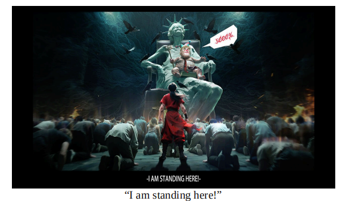

# China’s propagandists preach defiance in the trade war with America

*The public seems on board, for now*

propagandists：宣传者；（propagandist的复数）

preach：宣讲；宣传（某种信念或理念）；宣扬；鼓吹；

defiance： 美 [dɪˈfaɪəns] 挑战；抵抗；反抗；不服从；

原文：

**E**VEN BEFORE getting embroiled in a trade war with America,

China’s officials were struggling to keep up public morale. Many

people were already fretting about a weak job market and a

property downturn. Now, American levies on most Chinese goods

have reached a staggering 145% and China’s levies on American

imports are at 125%.

即使在卷入中美贸易战之前，中国官员也在努力保持公众士气。许多人已经在为疲软的就业市场和房地产低迷而担忧。现在，美国对大多数中国商品征收的关税已经达到惊人的145%，而中国对美国进口商品征收的关税是125%。

学习：

embroiled：搅乱；牵连；卷入；（embroil的过去式和过去分词）

fretting：苦恼的；焦急的

staggering：令人震惊的；难以置信的

原文：

On April 14th China’s customs bureau tried to reassure, saying that

“the sky won’t fall” because of tariffs. But officials are worried

about consumer sentiment and, in the long run, social stability. So

they are trying to convince the public that China’s defiant approach

to America is the right one, and the pain will be bearable. “Believe

in China. Believe in tomorrow,” gushed an editorial on April 11th

on the front page of the *People’s Daily*, a Communist Party

mouthpiece. China is an “oasis of certainty” in a chaotic world, it

argued, alongside a list of technological achievements, from AI to

space travel. In America, meanwhile, there has been a shortage of

eggs, state-run media reported.

4月14日，中国海关总署试图消除疑虑，称由于关税原因“天不会塌下来”。但官员们担心消费者情绪，以及长期的社会稳定。因此，他们试图让公众相信，中国对抗美国的方式是正确的，痛苦是可以忍受的。“相信中国。相信明天，”《人民日报》4月11日头版的一篇社论如是说。它认为，中国是混乱世界中“确定性的绿洲”，还有一系列技术成就，从人工智能到太空旅行。与此同时，据国营媒体报道，美国出现了鸡蛋短缺。

学习：

oasis：美 [oʊˈeɪsɪs] （沙漠中有树、水的地方）绿洲；慰藉物；慰藉所

原文：

Propagandists are also digging into China’s revolutionary past for

inspiration. On social media officials shared a grainy video of Mao

Zedong speaking in 1953, during the Korean war, when China’s

armed forces fought America’s. In it Mao proclaims that “No

matter how long this war is going to last, we’ll never yield. We’ll

fight until we completely triumph.” State-run media are also

quoting another fiery saying of Mao: “America is just a paper tiger.

Don’t believe its bluff.”

宣传人员也在挖掘中国的革命历史来寻找灵感。在社交媒体上，官员们分享了一段毛泽东在1953年朝鲜战争期间讲话的模糊视频，当时中国军队与美国军队作战。在这篇文章中，毛宣称“不管这场战争要打多久，我们决不屈服。我们会战斗到完全胜利。”官方媒体也引用了毛的另一句激烈的话:“美国只是一只纸老虎。不要相信它的虚张声势。”

学习：

grainy：粗糙的；粒状的；有纹理的；模糊的

bluff：虚张声势；欺骗；唬人；虚张声势的行为

原文：

China keeps tight control on public opinion surveys. But many

Chinese do seem to support fighting a trade war. “We must let

everyone know that we have a strong backbone and will never bow

down,” proclaimed Zijin Gongzi, a blogger with 430,000 followers

on Weibo, a social-media platform. Wuheqilin, a digital artist with

3.5m followers, created an iconic image (pictured), widely shared

online, of a figure in red, representing China, standing defiantly

before a grotesque Mr Trump, with the title “I am standing here!”

中国对民意调查保持严格控制。但许多中国人似乎确实支持打贸易战。“我们必须让所有人知道我们有坚强的脊梁，永远不会低头，”在社交媒体平台微博上拥有43万粉丝的博主Zijin Gongzi宣布。拥有350万粉丝的数字时代艺术家Wuheqilin创作了一幅在网上被广泛分享的标志性图像(如图)，一个穿着红色衣服的人代表中国，挑衅地站在一个荒谬的特朗普面前，标题是“我站在这里！”

学习：

grotesque：美 [ɡroʊˈtesk] 怪诞的；荒诞的；荒唐的；荒谬的；

原文：

Some are trolling Mr Trump for wanting to bring manufacturing

jobs back to America. They share AI-generated videos of

overweight American workers clumsily trying to make iPhones.

One video features Mr Trump himself in a factory, getting slapped

by his supervisor.

“一些人正用恶搞视频嘲讽特朗普‘让制造业岗位回流美国’的承诺。他们分享AI生成的视频：超重的美国工人笨手笨脚地组装iPhone，甚至还有特朗普本人在工厂里被主管扇耳光的画面。”  

学习：

trool：在网络上故意制造争议；发布挑衅性的帖子以激怒他人

>
>在这段语境中，"trolling" 的含义是 “故意挑衅/嘲讽”，具体指一些人通过发布AI生成的恶搞视频来戏弄（或挖苦）特朗普，暗讽他“让制造业岗位回流美国”的政策主张不切实际。  
>
>---
>
>**补充说明：**  
>
>1. "Trolling" 的深层含义  
>   • 在互联网文化中，"troll" 作动词时，常指通过煽动性、讽刺性或虚假内容故意激怒或戏弄某人（尤其是公众人物）。此处并非单纯的“批评”，而是带有 “恶意幽默” 的意味。  
>
>   • 例：*He’s just trolling you.*（他就是在故意气你。）  
>
>
>2. 中文对应词选择  
>   • 根据上下文，若强调“戏弄”可用 “恶搞”；若强调“政治讽刺”可用 “嘲讽”。  
>
>
>3. 文化适配  
>   • 原文视频内容荒诞（如“特朗普被扇耳光”），中文用 “恶搞” 更能传递这种戏谑感，避免直译“挑衅”显得过于严肃。  
>
>
>

原文：

Many Chinese people are worried as well, though. Users of

Douyin, a video-sharing platform, are asking which goods Chinese

people should start hoarding. Others look for tips about buying

gold, perceived to be a haven for investors in times of turmoil.

They are anxious, as well as defiant. ■

然而，许多中国人也很担心。视频分享平台Douyin的用户正在询问中国人应该开始囤积哪些商品。其他人寻找购买黄金的建议，黄金被认为是动荡时期投资者的避风港。他们焦虑不安，同时具有反抗精神。■

## 后记

2025年4月22日于上海。