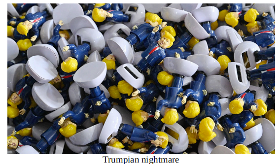

# America is turning away China’s goods. Where will they go instead?

*South-East Asia is exposed to both Chinese import competition and American ire*

ire:美 [ˈaɪ(ə)r] 愤怒；激怒；愤慨；恼怒；

原文：

**D**ONALD TRUMP’S sky-high tariffs are not a ban on trade with

China, but they come close. Although it is hard to estimate quite

how sharp the decline in business between the two countries will

be, since firms will find new routes and Mr Trump keeps changing

the scope of the levies, a vertiginous drop is assured.

唐纳德·特朗普(DONALD TRUMP)的天价关税并不是对华贸易的禁令，但也很接近。尽管很难估计两国之间的商业下降会有多严重，但由于企业会找到新的路线，特朗普不断改变征税范围，这种令人眩晕的下降是肯定的。

学习：

vertiginous：美 [vərˈtɪdʒənəs] 引起眩晕的；使人感到晕眩的

原文：

Once turned away, where will China’s exports to America go

instead? As supply chains adjust, firms will expand abroad to

qualify for lower tariffs, as many did in Mr Trump’s first trade war.

Less scrupulous types may try to dupe American customs officials.

But rerouting, legal or otherwise, is unlikely to offset a steep drop

in demand from the world’s biggest goods importer. The rest of the

world will make up much of the difference, whether it wants to or

not.

一旦被拒之门外，中国对美出口将何去何从？随着供应链的调整，企业将向海外扩张，以获得更低的关税，正如许多企业在特朗普的第一场贸易战中所做的那样。不太谨慎的人可能会试图欺骗美国海关官员。但是，无论合法与否，改道都不太可能抵消这个全球最大商品进口国需求的急剧下降。不管它愿不愿意，世界其它地区将弥补这一差距。

学习：

scrupulous：细心的；仔细的；细致的；一丝不苟的；谨慎小心的

dupe：欺骗；诈骗；愚弄；哄骗

原文：

By the end of Mr Trump’s first term American tariffs covered two

thirds of imports from China at an average rate of 19%, up from

3% before. However, newly incentivised tariff-dodgers found

workarounds. They undervalued shipments, relabelled goods,

forged paperwork and rerouted goods via third countries. Goldman

Sachs estimates that Chinese exports worth around $120bn

bypassed tariffs in 2023.

到特朗普第一任期结束时，美国关税覆盖了从中国进口的三分之二，平均税率为19%，高于之前的3%。然而，新近受到激励的逃税者找到了变通办法。他们低估了货物的价值，给货物重新贴标签，伪造文件，并通过第三国改变货物路线。高盛(Goldman Sachs)估计，2023年，价值约1200亿美元的中国出口绕开了关税。

学习：

workarounds：变通方法

forge：伪造

原文：

This time it will be much harder to avoid border levies. One reason

is that Mr Trump has introduced prohibitive tariffs on all Chinese

goods—bar, for the time being, certain electronics and

pharmaceuticals—rather than a subset, meaning exporters have less

to gain from relabelling products. Rerouting hubs including Mexico

and Vietnam have become wary of Chinese firms using them to

dodge tariffs, owing to threats of American retaliation against their

own export industries. Claudia Sheinbaum, Mexico’s president, has

announced her willingness to work with Mr Trump on

transshipment, including with new tariffs aimed at Chinese goods

and raids on Chinese-owned stores.

这一次，避免边境税将困难得多。一个原因是，特朗普对所有中国商品征收禁止性关税——暂时除了某些电子产品和药品——而不是一个子集，这意味着出口商从重新标记产品中获益较少。包括墨西哥和越南在内的改线枢纽已经对中国公司利用它们来逃避关税变得小心翼翼，因为美国威胁要对他们自己的出口行业进行报复。墨西哥总统克劳迪娅·申鲍姆(Claudia Sheinbaum)已宣布，她愿意在转运问题上与特朗普合作，包括针对中国商品的新关税和对中国商店的突袭。

学习：

transshipment：美 ['trænsʃɪpmənt] 转载；转运

raids：突袭；突然查抄；

原文：

There is a reason for her obsequiousness. Mr Trump’s fixation on

bilateral trade balances observes little distinction between dubious

rerouting and supply chains legally adjusting to tariffs. At risk are

countries such as Cambodia, India, Mexico, Thailand and Vietnam,

which all now supply more of America’s imports than before Mr

Trump’s first trade war. Thai negotiators have offered a crackdown

on “counterfeiting from third countries”; Vietnamese officials

promise to stamp out “trade fraud” and tighten rules of origin.

她的谄媚是有原因的。特朗普专注于双边贸易平衡，认为可疑的改道和供应链合法调整关税之间没有什么区别。面临风险的是柬埔寨、印度、墨西哥、泰国和越南等国家，这些国家现在对美国进口的供应都超过了特朗普第一次贸易战之前的水平。泰国谈判代表提议打击“来自第三国的假冒商品”；越南官员承诺杜绝“贸易欺诈”并收紧原产地规则。

学习：

obsequiousness： 美 [əb'si:kwiəsnis] 奉承；谄媚

fixation：固定；痴迷；依恋；过分关注；

counterfeiting：美 ['kaʊntəfɪtɪŋ] 伪造；仿制品；伪造物；赝品；冒牌货

stamp out：消灭；根除；扑灭；

## **Building barriers**

原文：

Chinese goods that cannot be sold to America will head elsewhere.

This comes at a time when neighbours are already concerned by

Chinese industrial production. In response to weak economic

growth, the country’s policymakers are funnelling cash and loans to

manufacturers, leading output to surge. Chinese firms have cut

export prices by 20% since 2023, and the country’s manufacturing

trade surpluses with Asian and Latin American countries have

grown much more quickly than those with America or Europe. Last

year 198 complaints were filed against China at the WTO, a record,

including 37 from India.

卖不到美国的中国商品将流向别处。此时，邻国已经对中国的工业生产感到担忧。为了应对疲软的经济增长，该国的政策制定者正在向制造商提供现金和贷款，导致产量激增。自2023年以来，中国企业已经将出口价格降低了20%，中国与亚洲和拉丁美洲国家的制造业贸易顺差增长速度远快于与美国或欧洲的贸易顺差。去年，世贸组织收到了创纪录的198起针对中国的投诉，其中37起来自印度。

原文：

Although a flood of cheap goods would be a boon for consumers,

politicians worry it will put domestic manufacturers out of

business. Take Thailand, where industrial production has shrunk by

a tenth since 2019, at the same time as the country’s trade deficit

with China has doubled in size. Computer and electronics firms

have suffered most of all, with their output falling by 40%, despite

hopes that Thailand could fashion itself into a production centre for

laptops. China last year exported portable computers worth $33bn

to America, which will have to find a new home.

尽管廉价商品的涌入对消费者来说是一件好事，但政治家们担心这会让国内制造商破产。以泰国为例，该国工业生产自2019年以来萎缩了十分之一，而与此同时，该国对中国的贸易逆差却增加了一倍。尽管泰国有望成为笔记本电脑的生产中心，但电脑和电子公司遭受的损失最大，产量下降了40%。中国去年向美国出口了价值330亿美元的便携式电脑，美国将不得不寻找新的来源。

学习：

boon：好事

fashion：塑造；

原文：

This could bite even in countries that benefited from the first trade

war. One example is the toy market in Vietnam, worth $1bn a year,

in which firms such as Bandai Namco and Lego have invested. The

industry now faces competition from cut-price Chinese goods that

would have gone to America. Another is textiles, where America

imported $29bn-worth of goods from China last year. Mr Trump

has scrapped “de minimis” rules, which let packages under $800

into America duty-free, aiding Chinese firms including Temu and

Shein. Trade deflection could hurt manufacturers in Bangladesh

and India.

这甚至会影响那些从第一次贸易战中受益的国家。一个例子是越南的玩具市场，每年价值10亿美元，像Bandai Namco和Lego这样的公司已经投资了这个市场。该行业现在面临着本来会流向美国的低价中国商品的竞争。另一个是纺织品，去年美国从中国进口了价值290亿美元的商品。特朗普取消了“微量”规则，该规则允许低于800美元的包裹免税进入美国，帮助了包括Temu和Shein在内的中国公司。贸易转向可能会伤害孟加拉国和印度的制造商。

学习：

textiles：纺织品；织物；纺织业；

scrap：取消

原文：

More protectionist countries will not hesitate to hit back against

China. India and Indonesia were fast to do so last time round.

Others were more cautious, however. Malaysia and Thailand have

largely refrained from counter-measures, for instance, fearful of

angering their imposing neighbour. The pressure on their leaders

will only grow in the months to come. ■

更多的保护主义国家会毫不犹豫地反击中国。上次，印度和印度尼西亚很快就这样做了。然而，其他人更加谨慎。例如，马来西亚和泰国在很大程度上避免采取反制措施，担心激怒他们咄咄逼人的邻居。在接下来的几个月里，这些国家领导人面临的压力只会越来越大。■

学习：

refrained：克制；避免；（refrain的过去式和过去分词）

## 后记

2025年4月23日于上海。