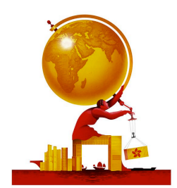

# The trade war may reverse Hong Kong’s commercial decline

*Asia’s once-dominant business centre is regaining ground lost to Shanghai, Singapore and New York*

原文：

**A**S DONALD TRUMP’S tariff tantrum destroyed trillions of

dollars in shareholder value, shrieks of horror from American chief

executives grew high-pitched. If you think America Inc had it bad,

then spare a thought for Hong Kong. The self-governing Chinese

territory is the world’s gateway to Asia, and China in particular. It

is also Asia’s, and China’s, gateway to the world. And for the trade

warmonger-in-chief, China and Asia are enemies number one and

two.

随着唐纳德·特朗普的关税愤怒摧毁了数万亿美元的股东价值，美国首席执行官们的恐惧尖叫变得尖锐起来。如果你认为美国公司过得很糟糕，那么想想香港吧。这个自治的中国领土是世界通往亚洲，尤其是中国的门户。它也是亚洲和中国通向世界的大门。对于这位贸易战争贩子（特朗普）来说，中国和亚洲是头号和二号敌人。

学习：

tantrum：美 [ˈtæntrəm] 发怒；耍脾气；发火；情绪发作；

shrieks：尖叫；尖叫声；（shriek的复数）美 [ʃriks]

high-pitched：音调高的；尖声的；尖锐的；

warmonger：战争贩子；好战者；战争挑起者

原文：

In the week after “Liberation Day” on April 2nd, the Hang Seng

index of Hong Kong-listed shares fell by 13%. April 7th was its

worst day since the Asian financial crisis of 1997. Despite a

subsequent 90-day pause to most of Mr Trump’s “reciprocal” tariffs

and a temporary exemption for some electronics, a tit-for-tat with

China has ended (for now) with mutual levies in excess of 100% on

most goods, plus a Chinese ban on exports of some critical

minerals for good measure. This amounts to a trade embargo which

prises apart the world’s two largest economies.

在4月2日“解放日”后的一周，香港上市股票的恒生指数下跌了13%。4月7日是自1997年亚洲金融危机以来最糟糕的一天。尽管特朗普的大部分“对等”关税随后暂停了90天，并对一些电子产品暂时豁免，但与中国的针锋相对已经结束(目前),双方对大部分商品征收超过100%的关税，另外中国还禁止出口一些关键的矿产品。这相当于贸易禁运，使世界上两个最大的经济体分崩离析。

学习：

tit-for-tat：针锋相对

for good measure：额外的；附加的；另外的；额外地；

原文：

You would expect their historical go-between to be freaked out by

all this. Yet throughout the turmoil, Hong Kong’s business elites

have displayed a surreal calm. Some could simply be frozen in

stupor. Some may be shrieking at ultrasonic frequencies and so be

inaudible. But many seem to believe that Hong Kong can withstand

the trade shock. And a few reckon that after years of losing ground

to rival commercial centres in the region and beyond, the

realignment of global business gives it a shot at clawing some of

this back. It is not just a trauma-induced hallucination.

 人们或许以为，香港商界精英作为历史的中间人，面对这一切会惊慌失措。然而在这场动荡中，他们却展现出一种超乎现实的平静。有些人可能只是惊愕到僵在原地，有些人或许正以超声波般的频率尖叫（只是无人听见）。但多数人似乎相信香港能承受这场贸易冲击，更有少数人认为——在多年被区内外的商业竞争对手蚕食地盘后，全球商业格局的重整反而给了香港夺回部分失地的机会。这并非创伤催生的幻觉。

学习：

go-between：中间人；媒介；调解人；中介；掮客

stupor：昏迷；恍惚；麻木；

>**解析 "Some could simply be frozen in stupor"**
>
>1. 字面意思：
>    • *frozen in stupor* = 因极度震惊/麻木而僵住（像被“冻住”一样）
>
>   • 类似中文的 “呆若木鸡”，但更强调因突发事件导致的短暂性僵滞。
>
>2. 语境适配：
>    • 前文提到商界精英“超现实的平静”（*surreal calm*），此处用 “惊愕到僵住” 既能承接“平静”的表象，又暗示内在的冲击。
>
>   • 若需更生动，可用 “吓懵了”（口语）或 “陷入茫然无措”（书面）。
>
>3. 修辞对照：
>    • 后文 *shrieking at ultrasonic frequencies*（用超声波尖叫）是夸张比喻，因此前句的 *frozen in stupor* 也需保留形象化表达，避免直白翻译成“完全不知所措”。

原文：

Hong Kong has had a rough few years. Before the outbreak of

covid-19 it was upstaged by Shenzhen, Shanghai and, for the most

ambitious Chinese firms, New York as the place to go public and

plot global expansion. Between 2010 and 2019 mainland bourses

added 2,100 listings, over two and a half times the increase in the

2000s. A little over 700 Chinese businesses picked Hong Kong, not

much better than the 450 or so in the preceding decade.

香港经历了艰难的几年。在新冠肺炎事件爆发之前，它被深圳、上海和纽约抢了风头，对于最雄心勃勃的中国公司来说，纽约是上市和策划全球扩张的地方。2010年至2019年间，内地交易所增加了2100家上市公司，是2000年的两倍半以上。略多于700家的中国企业选择了香港，并不比之前十年的450家好多少。

学习：

plot：策划；密谋；计划

bourses：美 [buəsiz] 交易所；（bourse的复数）

原文：

During the pandemic, city authorities made things worse, first by

mishandling the response with harsh lockdowns, then by enforcing

a draconian national-security law which made outsiders feel

unwelcome. In both cases they became “extremely overcompliant”

with edicts from Beijing, recalls a Western banker.

在疫情期间，城市当局让事情变得更糟，首先是通过严厉的封锁错误地应对，然后是执行严厉的国家安全法，让外来者感到不受欢迎。一位西方银行家回忆道，在这两起事件中，他们对北京的法令变得“极度顺从”。

学习：

draconian：美 [drəˈkoʊniən] （法律等）严厉的；残酷的；

edicts：布告；法令；（edict的复数）

原文：

Nineteen global law firms had closed their Hong Kong practices by 2023.

FedEx opted to ship its regional headquarters to expat-

friendlier Singapore. So did other multinationals, from L’Oréal, a

French maker of posh cosmetics, to Lidl, a German cut-price

retailer. LVMH started running its luxury labels from the mainland.

截至2023年，已有19家全球律师事务所关闭了在香港的业务。联邦快递选择将其地区总部迁至对外国人更友好的新加坡。其他跨国公司也是如此，从法国高档化妆品制造商欧莱雅到德国降价零售商Lidl。LVMH开始在中国大陆经营其奢侈品品牌。

学习：

posh：优雅豪华的；高档的；时髦的；

原文：

Hong Kong’s capital markets hit snooze. Companies sold new

shares worth a combined $40bn in 2022 and 2023, down from

more than $200bn in the two previous years, according to data

from Dealogic, which tracks such things. Offerings declined in

mainland China, too, but only from \$288bn to \$234bn. Bond sales

in Hong Kong followed a similar pattern. Investment banks shifted

some staff to Singapore. A couple of Australian lenders, Westpac

and National Australia Bank, moved out altogether.

香港资本市场打起了瞌睡。追踪此类交易的Dealogic的数据显示，2022年和2023年，企业发行的新股总价值为400亿美元，低于此前两年的逾2000亿美元。中国大陆的发行额也有所下降，但仅从2880亿美元降至2340亿美元。香港的债券销售也遵循了类似的模式。投资银行将一些员工转移到新加坡。几家澳大利亚贷款机构，西太平洋银行和澳大利亚国家银行，一起搬走了。

学习：

snooze：小睡；打盹；瞌睡

lender：贷款机构

原文：

All rather unpropitious—until Mr Trump stepped in. Since he won

the election in November Hong Kong’s prospects have brightened

relative to its challengers’ in direct proportion to the intensity of his

China-bashing. The entrepot now looks like the only place for

Chinese companies to gaze abroad and for foreigners to get a look

in on unmissable pockets of Chinese growth.

所有这些都相当不利——直到特朗普介入。自从他在11月赢得选举以来，香港的前景相对于其挑战者来说已经变得更加光明，这与他抨击中国的力度成正比。这个转口港现在看起来像是中国企业放眼海外、外国人得以一窥中国增长不可错过的领域的唯一地方。

学习：

unpropitious: 不吉利的；不顺利的；不祥的；不利的

Entrepot: 仓库；转口港；贸易中心；货物集散地

unmissable: 不容错过的；不能错过的；

原文：

Start with Chinese businesses. Shanghai is great if your focus is the

domestic market. But as China’s economy slows, many spy future

profits overseas. To do that they need dollars (or other hard

currency) and international expertise. They will not find them on

the mainland, surrounded by a perimeter of capital controls and

growingly hostility towards foreign advisers. Mr Trump’s anti

Chinese antics are putting a target on the back of American lawyers

and consultants, many of whom were packing up as it is.

从中国企业开始。如果你的重点是国内市场，上海是很棒的。但随着中国经济放缓，许多人在海外寻找未来的利润。为此，他们需要美元(或其他硬通货)和国际专业知识。他们在中国内地找不到这些，因为中国内地被资本管制包围，对外国顾问的敌意也越来越强。特朗普的反华闹剧让美国律师和顾问成为众矢之的，他们中的许多人已经卷铺盖走人。

学习：

perimeter：边界；边缘；外缘

原文：

Singapore has the worldly know-how but its financial markets

remain too shallow. And under Mr Trump Chinese companies

might as well forget about New York. Chagee, a Shanghainese

teashop chain which on April 10th inexplicably chose to launch an

initial public offering on the Nasdaq exchange despite the market

chaos, may be the last Chinese firm to try for some time.

新加坡拥有世界知识，但其金融市场仍太肤浅。在特朗普的领导下，中国企业可能会忘记纽约。4月10日，尽管市场混乱，上海茶叶店连锁店Chagee莫名其妙地选择在纳斯达克交易所推出首次公开发行，它可能是一段时间内最后一家尝试的中国公司。

学习：

teashop chain：奶茶连锁

inexplicably: 无法说明地；说不清的；令人难以理解地

原文：

That leaves Hong Kong. In March BYD, a Chinese firm bent on

world domination in electric vehicles, and Xiaomi, a phonemaker

with a growing sideline in EVs, sold nearly $6bn-worth of shares

apiece in follow-on offerings. These were the biggest of their kind

on the city’s stock exchange since 2021. All told, this year

companies have raised \$15bn in such sales plus \$26bn in dollar

debt—not far off the total in all of 2024 and nearly twice as much

as in the entire year before. Initial public offerings have picked up,

too. Many bankers are making the return trip from Singapore. The

number of foreign law firms is up to 84, from a covid-era low of

73.

那就剩下香港了。3月，一家致力于在电动汽车领域占据世界主导地位的中国公司比亚迪和一家在电动汽车领域副业不断增长的手机制造商小米，在后续发行中分别出售了价值近60亿美元的股票。这是自2021年以来该市证券交易所同类交易中最大的一次。总的来说，今年企业通过此类销售筹集了150亿美元，外加260亿美元的美元债务——与2024年全年的总额相差不远，几乎是之前全年的两倍。首次公开募股也有所回升。许多银行家正从新加坡返回。外国律师事务所的数量从冠状病毒肺炎时代的73家增至84家。

## When red is green

原文：

All this excitement has not been lost on Western investors. In the

words of a finance bigwig, China was uninvestible only until its

dormant stockmarkets surged. Artificial-intelligence darlings like

DeepSeek are bolstering confidence in Chinese ingenuity. The

trade war is pushing President Xi Jinping to discard his aversion to

economic stimulus, which may prop up other firms. For foreigners

fearful of missing out but fretting about repatriating returns from

the mainland, Hong Kong is a way to get a piece of the action. The

Hang Seng is 9% higher than at the start of the year. Its tech sub

index is up by 15%.

原文：

It could all still go horribly wrong. As Mr Xi warned Mr Trump on

April 14th, the trade war will have “no winner”. But it may help

Hong Kong notch up a few points against its entrepot rivals. ■

一切仍有可能变得糟糕透顶。正如老大4月14日警告川普的那样，贸易战将“没有赢家”。但这可能有助于香港在与转口贸易对手的竞争中获得几分优势。■

学习：

notch：赢取；获得

## 后记

2025年5月5日于上海。

