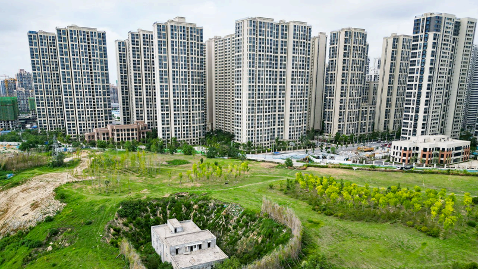

# Is China justified in still calling itself a developing country?

*The reasons are more about self-image than money*

原文：

**I**N A SPEECH on April 23rd America’s treasury secretary, Scott

Bessent, laid out the Trump administration’s vision for the global

financial system. Rather than announcing that America was leaving

the IMF and World Bank, as some had feared, Mr Bessent’s

“blueprint to restore equilibrium” put the Bretton Woods

institutions clearly at its centre. They are now to police abuses of

the system, he said, including those committed by China.

在4月23日的一次演讲中，美国财政部长斯科特·贝森特阐述了特朗普政府对全球金融体系的愿景。有些人担心美国会退出国际货币基金组织和世界银行，但贝森特先生的“恢复平衡蓝图”明确将布雷顿森林机构置于核心位置。他说，他们现在要监督系统的滥用，包括中国犯下的那些。

原文：

Among Mr Bessent’s list of complaints was one that particularly

raises the hackles of officials in Beijing, but also shines a light on

China’s place in the modern world. “Treating China…as a

‘developing country’ is absurd,” he said, adding that if China wants

to play a role in the global economy commensurate with its actual

importance, then it needs to “graduate up”.

在贝森特的抱怨清单中，有一条尤其激怒了北京的官员，但也让人们看到了中国在现代世界中的地位。“将中国……视为‘发展中国家’是荒谬的，”他表示。他补充称，如果中国希望在全球经济中扮演与其实际重要性相称的角色，那么它需要“升级”。

学习：

hackle：（猫等动物的）竖起的颈毛

commensurate：美 [kəˈmenʃərət] 相称的；（在大小、重要性、质量等方面）相当的

原文：

He has a point. China gets cheap loans, avoids billions of dollars in

contributions to global climate-adaptation funds and earns itself

extra years to phase out carbon emissions all by retaining its

“developing” status. But Mr Bessent’s comments also highlight a

contradiction that tells the world a lot about China’s perception of

itself. It is not all about money.

他说得有道理。中国获得了低息贷款，避免了数十亿美元的全球气候适应基金捐款，并通过保持其“发展中”地位为自己赢得了额外的时间来逐步减少碳排放。但贝森特的言论也凸显了一个矛盾，这个矛盾告诉了世界很多关于中国对自己的看法。这不全是钱的问题。

学习：

phase out：逐步淘汰；逐渐停止使用；逐步放弃；逐步废止

原文：

China is obsessed with history, especially its history of humiliation.

In a recent speech President Xi Jinping said: “The modernisation of

Western countries is full of bloody crimes such as war, slave trade,

colonisation and plunder, which have brought…suffering to…

developing countries.” China, he said, is one of them.

原文：

Soon after the Communist Party took power in 1949, it began to

present itself as a champion of the developing world. And it still

sees itself in that way. China wears its developing-nation status as a

badge of honour and a sign of moral superiority. (This support for

the global south also helps create numerous voting allies at the

United Nations and other organisations.)

共产党在1949年掌权后不久，就开始将自己标榜为发展中国家的捍卫者。它仍然这样看待自己。中国将发展中国家的地位作为荣誉的象征和道德优越感的标志。(这种对全球南方的支持也有助于在联合国和其他组织建立众多投票盟友。)

原文：

Wang Yi, the foreign minister, has called China the global south’s

“ex officio” member, and leaders are unlikely to give up that status

lightly. No matter how rich China grows, said Mr Xi in 2024, it

“will always belong to the developing world”.

外交部长王毅称中国是全球南方的“当然”成员，领导人不太可能轻易放弃这一地位。Xi在2024年表示，无论中国变得多么富有，它“将永远属于发展中国家”。

学习：

ex officio：依职权的；按职务的；当然的

## **Who are you?**

原文：

Part of the challenge is that there is no agreed definition of a

developing economy. In most international organisations, countries

can simply declare themselves to have “developing” status. Half a

century ago China’s gross national income per head was less than

Sudan’s and Zambia’s. But China now nudges $13,400 in income

per person and the World Bank reckons that puts it second, behind

Costa Rica, among the “upper middle-income” economies. It is

expected to join the high-income group next year.

挑战的一部分在于，对于发展中经济体没有一个公认的定义。在大多数国际组织中，各国可以简单地宣布自己拥有“发展中”地位。半个世纪前，中国的人均国民总收入低于苏丹和赞比亚。但是中国现在的人均收入接近13，400美元，世界银行认为中国在“中上收入”经济体中排名第二，仅次于哥斯达黎加。明年有望加入高收入群体。

学习：

nudge：达到；接近；使达到；使接近

原文：

Policymakers in Beijing point to lingering challenges, such as

enduring rural poverty, to justify retaining their status. The billions

of dollars in loans China receives at developing-country rates from

the World Bank are tiny relative to GDP. Yet it insists it should not

“graduate” from the scheme, so it can learn from the bank’s

development expertise. Other countries, such as Qatar and Saudi

Arabia, also claim “developing country” status.

北京的政策制定者指出了挥之不去的挑战，如持续的农村贫困，以证明保留他们的地位是合理的。中国从世界银行以发展中国家的利率获得的数十亿美元贷款相对于GDP来说微不足道。然而，它坚持认为自己不应该从该计划中“毕业”,因此它可以从世行的发展专长中学习。其他国家，如卡塔尔和沙特阿拉伯，也声称“发展中国家”的地位。

原文：

There are other perks. Around 40 global bodies give special status

to poor countries, to broaden access to global public goods and

make it easier to comply with international rules. For example,

low-income countries (but including China) pay a fraction of the

ordinary fees to send mail across borders. In effect, rich countries

subsidise the mail of poor ones. Developing states are allowed to

subsidise some industries, such as agriculture, at a higher rate.

They also get more time to comply with global trade rules, cheaper

UN membership fees and at least ten more years to achieve net

zero carbon emissions.

还有其他特权。大约有40个全球机构给予贫穷国家特殊地位，以扩大全球公共产品的获取渠道，并使其更容易遵守国际规则。例如，低收入国家(但包括中国)只需支付普通跨境邮件费用的一小部分。实际上，富裕国家补贴贫穷国家的邮件。发展中国家被允许以更高的比例补贴某些行业，比如农业。他们也有更多的时间来遵守全球贸易规则，更便宜的联合国会员费和至少十年以上的时间来实现净零碳排放。

学习：

perks：特权；额外津贴

原文：

Mr Bessent’s comments seem reasonable when you consider how

China’s power has grown with its wealth. It now has the world’s

largest navy and is challenging the West’s technological dominance

in fields from quantum computing to artificial intelligence. The

World Bank’s statistics do not measure things like space

programmes and aircraft-carriers, which soak up money that could

be used to ease poverty.

当你考虑到中国的实力是如何随着财富的增长而增长的，贝森特先生的评论似乎是合理的。它现在拥有世界上最大的海军，并在从量子计算到人工智能等领域挑战西方的技术主导地位。世界银行的统计数据不包括像太空计划和航空母舰这样的项目，这些项目吸收了本可以用来缓解贫困的资金。

原文：

Rich countries are eager for China to step up. Negotiations at the

COP29 climate talks in November almost collapsed because rich

country envoys were unhappy that China, though it is the world’s

largest carbon-emitter, initially refused to contribute money to help

poor countries deal with climate change. Mr Xi’s envoy, Liu

Zhenmin, told Chinese media: “The West has always wanted to

separate China [from the global south]…we do not agree with

this.”

富裕国家渴望中国被认定为发达国家。去年11月的COP29气候谈判几乎破裂，因为富裕国家的代表对中国(尽管它是世界上最大的碳排放国)最初拒绝出资帮助贫穷国家应对气候变化感到不满。Xi的特使Liu对中国媒体表示:“西方一直想把中国(从全球南方)分离出去……我们不同意这一点。”

学习：

envoys：使者；使节；（envoy的复数）代表

原文：

In practice, Mr Xi gives up the perks when pushed. His COP29

delegation, at Europe’s urging, unblocked the talks with crafty

accounting. It let some of China’s indirect climate lending be

counted in the rich countries’ pile upon assurance that it was

voluntary and did not imply a change in its “developing” status.

Most new trade agreements prevent China accessing the benefits of

its status, says Henry Gao of Singapore Management University.

实际上，中国在受到压力时会放弃特权。在欧洲的敦促下，他的COP29代表团用巧妙的会计手段解除了谈判。它让中国的一些间接气候贷款被计入富国之列，并保证这是自愿的，并不意味着其“发展中”地位的改变。新加坡管理大学的Henry Gao说，大多数新的贸易协定阻止中国获得其地位的好处。

学习：

crafty：狡猾的；狡诈的；诡计多端的；机智的；

原文：

There is some room for pragmatism; but maintaining the

contradiction is difficult. China’s interests often reflect those of a

great power, leaving its “developing-world champion” routine

looking hypocritical. It is an unforgiving overseas lender itself. It

drives a hard bargain when lending to the developing world, and it

links projects in poor countries with how a recipient country votes

at the UN.

实用主义有一定的空间；但是维持矛盾是困难的。中国的利益往往反映了一个大国的利益，这让其“发展中世界冠军”的套路看起来很虚伪。它本身就是一个海外贷款人。在贷款给发展中国家时，它推动了一个艰难的讨价还价，并且它将贫穷国家的项目与受援国在联合国的投票联系起来。

原文：

In changes being discussed at the IMF and World Bank, China

prefers “vote” reforms that would give more votes and influence to

those with greater GDP, diluting the power of poorer states, notes

David Passarelli of the UNU Centre for Policy Research, a think

tank in New York. It is less keen on “voice” reforms that would

give representatives from poor countries more top jobs and a better

slice of resources.

纽约智库UNU政策研究中心的David Passarelli指出，在国际货币基金组织和世界银行正在讨论的变革中，中国更倾向于“投票”改革，给予那些GDP更高的国家更多的投票权和影响力，削弱贫穷国家的权力。它对“声音”改革不太感兴趣，这种改革会给来自贫穷国家的代表更多的高层职位和更好的资源分配。（感觉这个人在放屁）

原文：

The same dynamics are visible at the UN, where China says it

backs expanding the Security Council to include developing

countries. But when America proposed a plan last year that would

have created two (permanent non-veto) African seats, China

rejected it, apparently because it would have included spots for

India and Japan.

在联合国也可以看到同样的动态，中国表示支持扩大安理会，将发展中国家纳入其中。但是，当美国去年提出一项计划，将创造两个(永久无否决权)非洲席位时，中国拒绝了，显然是因为它将包括印度和日本的席位。

原文：

In Geneva, where a global pandemic treaty was recently agreed,

China also played a double game. Poor countries wanted to force

the rich to hand over intellectual property on vaccines and other

things in times of crisis. Rich countries resisted, and so did China,

looking to protect its own biotech industry.

在日内瓦，最近达成了一项全球性的疫情条约，中国也扮演了双重角色。在危机时刻，贫穷国家希望迫使富裕国家交出疫苗和其他东西的知识产权。富裕国家反对，中国也反对，希望保护自己的生物技术产业。

原文：

Nevertheless, Mr Xi continues to view developing countries as

keen on his push to remake the global order. Development is a

permanent “political identity”, says Wang Yiwei of the Academy of

Xi Jinping Thought at Renmin University. The party’s legitimacy

depends in part on the riches yet to come. “Once you are

‘advanced’,” says Mr Wang, “you are declining.” ■

## 后记

 2025年5月6日于上海。只是用来学英语，感觉这篇文章有偏见。