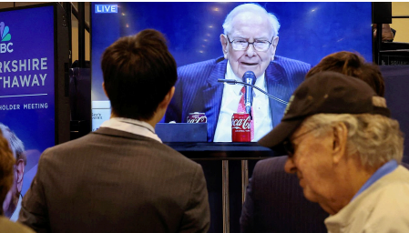

# Warren Buffett has created a $348bn question for his successor

*Berkshire Hathaway’s next CEO has huge shoes to fill—and a mountain of cash to invest*

>
>
>翻译建议：
> 沃伦·巴菲特给接班人留下3480亿美元的难题
> *伯克希尔·哈撒韦的下一任CEO既要填补巨人的空缺，又面临堆积如山的待投资现金*
>
>------
>
>**解析 "shoes to fill"**
>
>1. 字面意思：
>    • 直译为“需要填满的鞋子”，源自英文谚语 "fill someone's shoes"，意为“接替某人的职位并达到同等成就”，强调前任的卓越与继任者的压力。
>
>2. 中文对应表达：
>    • “填补巨人的空缺”（突出巴菲特作为“巨人”的标杆地位）
>
>   • 其他选项：
>
>   ◦ “接过重任”（中性，但弱化对比性）
>
>   ◦ “比肩传奇”（侧重挑战，但稍偏离原句结构）
>
>3. 语境适配：
>    • 标题中 $348bn question（3480亿美元的难题）已暗示挑战，因此译文需保留“继任压力”与“巨额现金”的双重含义。
>
>   • *mountain of cash* 译为“堆积如山”既保留比喻，又与“巨人”形成大小意象的呼应。

原文：

**S**URPRISING PEOPLE at the age of 94 is no mean feat. But that is

what Warren Buffett did at the end of Berkshire Hathaway’s annual

shareholder meeting on May 3rd, when he announced that he

would be stepping down as the company’s chief executive at the

end of the year. Mr Buffett gave most of Berkshire’s directors no

advance notice of his decision. Nor did he tell Greg Abel, his

presumptive successor.

在94岁高龄让人大吃一惊绝非易事。但这正是沃伦·巴菲特在5月3日伯克希尔·哈撒韦公司年度股东大会结束时所做的，当时他宣布他将在年底辞去公司首席执行官的职务。巴菲特没有提前通知伯克希尔的大多数董事他的决定。他也没有告诉他假定的继任者格雷格·亚伯。

学习：

no mean feat：不平凡的壮举

原文：

Berkshire Hathaway was a textile-maker when Mr Buffett bought it

in 1965. In the years that followed he turned it into an immense

insurance firm and a sprawling conglomerate with interests in

everything from energy to sweets. He employed a value-investing

strategy, seeking out companies that appeared cheap relative to

their intrinsic value. From 1965 to the end of last year, Berkshire’s

market value had increased by more than 5,500,000%, with a

compounded annual return of almost 20%. The total return of the

S&P 500 index over the same period was 39,000%.

巴菲特1965年收购伯克希尔·哈撒韦公司时，该公司还是一家纺织品制造商。在接下来的几年里，他把它变成了一个巨大的保险公司和一个从能源到糖果无所不包的庞大企业集团。他采用价值投资策略，寻找相对于内在价值看起来便宜的公司。从1965年到去年年底，伯克希尔的市值增长了超过5，500，000%，综合年回报率接近20%。同期标准普尔500指数的总增长率为39，000%。

原文：

Today Berkshire has a market capitalisation of $1.1trn, having

dropped a bit on Mr Buffett’s announcement. Mr Abel has been

with the company for a quarter of a century. He has run its non

insurance operations—such as its energy, railway and retail

businesses—since 2018. His next challenge goes beyond filling Mr

Buffett’s shoes as an “oracle”. Berkshire’s strategy is becoming

more difficult to pull off.

如今，伯克希尔的市值为1.1万亿美元，略低于巴菲特宣布的市值。阿贝尔先生已经在这家公司工作了25年。自2018年以来，他一直负责该公司的非保险业务，如能源、铁路和零售业务。他的下一个挑战不仅仅是接替巴菲特成为“先知”。伯克希尔的战略变得越来越难以实现。

学习：

pull off：成功完成；办成；做成（困难的事情）

原文：

Over the past year, Mr Buffett has aggressively sold stocks,

including a large chunk of its stake in Apple. Now, for the first time

in two decades, Berkshire owns more cash than listed equities. At

the end of March it held $348bn in cash and short-term American

government debt, more than twice the amount it held at the close of 2023.

The firm’s Treasuries account for 5% of the outstanding

market. If Berkshire was a country, it would be the tenth-largest

holder of American government debt, above India, Switzerland and

Taiwan.

过去一年，巴菲特积极抛售股票，包括大量苹果股票。现在，20年来伯克希尔首次拥有比上市股票更多的现金。截至3月底，伯克希尔哈撒韦持有3480亿美元现金和短期美国政府债券，是2023年末持有量的两倍多。该公司的国债占已发行市场的5%。如果伯克希尔是一个国家，它将是美国政府债券的第十大持有者，超过印度、瑞士和中国台湾地区。

原文：

Mr Buffett’s decision to withdraw from the stockmarket has so far

benefited the company. Its stock is up by 14% this year, while the

S&P 500 is down by 4%. The problem, for Messrs Buffett and

Abel, is working out what to do with the enormous pile of cash.

Lately Mr Buffett has griped that there is not much out there to buy

at a reasonable price. Even after the recent market tumult,

valuations of listed companies are high relative to their historical

levels.

巴菲特先生从股票市场撤退（卖出股票）的决定到目前为止对公司有利。其股票今年上涨了14%，而标准普尔500下跌了4%。对巴菲特和亚伯来说，问题是如何处理这笔巨额现金。最近，巴菲特抱怨说，没有多少东西可以以合理的价格购买。即使在最近的市场动荡之后，上市公司的估值仍高于历史水平。

学习：

griped：发牢骚；抱怨；（gripe的过去式和过去分词）

原文：

One option would be to expand more aggressively overseas. In

recent years Mr Buffett has made successful bets abroad. For

example, he has poured billions of dollars into several of Japan’s

trading conglomerates, such as Mitsubishi and Sumitomo. Mr Abel

might note that among companies worth over $5bn and with price-to-earnings 

ratios below ten—suggesting they are cheaply valued—

80% by value are domiciled outside America.

一种选择是更积极地向海外扩张。近年来，巴菲特在海外进行了成功的押注。例如，他向三菱和住友等几家日本贸易集团注入了数十亿美元。阿贝尔先生可能会注意到，在价值超过50亿美元、市盈率低于10倍的公司中，80%的公司位于美国以外。

原文：

Another option would be to stray from value investing in the hope

of finding firms worthy of capital allocation. That seems unlikely,

at least for now. Such a move would transform Berkshire’s culture

and risk the ire of Mr Buffett’s admirers. After 25 years at the firm,

Mr Abel is unlikely to pull an immediate handbrake turn.

另一个选择是偏离价值投资，希望找到值得资本配置的公司。这似乎不太可能，至少目前是这样。此举将改变伯克希尔的文化，并有可能激怒巴菲特的崇拜者。在该公司工作了25年后，Abel先生不太可能立即拉起手刹。

学习：

handbrake turn：手刹转弯；手刹急转弯；手刹漂移；手刹转向；手刹急转

原文：

Absent a change of strategy, Berkshire will have to wait for a

market downturn. Mr Buffett has a history of spotting such

opportunities. He snapped up a large stake in Wells Fargo, an

American bank, during a slump in 1990. He invested in companies

including Johnson & Johnson and Kraft Foods (and Wells Fargo

again) following the global financial crisis of 2007-09. The list

goes on. Berkshire’s shareholders must hope that Mr Abel has the

same vision. ■

如果不改变策略，伯克希尔将不得不等待市场低迷。巴菲特有发现此类机会的历史。他在1990年经济衰退时抢购了美国银行富国银行的大量股份。2007-09年全球金融危机后，他投资了包括强生公司和卡夫食品公司(以及富国银行)在内的公司。这样的例子不胜枚举。伯克希尔的股东一定希望亚伯先生也有同样的远见。■

## 后记

2025年5月9日周五于上海。