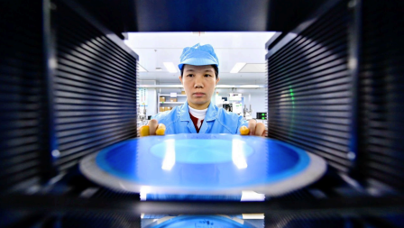

# Huawei and other Chinese chip firms are catching up fast

*But they still depend on America and its allies in a few vital areas*

原文：

**A** WAVE OF optimism has lately swept through China’s chip

industry. Share traders in Shanghai joke that Cambricon, a local

firm, not only offers a substitute for Nvidia’s processors, but for its

stock, too. Although the Chinese semiconductor firm is worth but a

fraction of its giant American rival, its share price has rocketed by

350% over the past year, around 15 times as much as Nvidia’s.

最近，一股乐观情绪席卷了中国的芯片行业。上海的股票交易者开玩笑说，本地公司Cambricon（寒武纪）不仅提供了Nvidia处理器的替代品，还提供了其股票的替代品。尽管这家中国半导体公司的价值只是其美国竞争对手的一小部分，但其股价在过去一年里飙升了350%，大约是英伟达的15倍。

原文：

In recent years America has tried to halt the flow of advanced chips

and chipmaking tools to China in the hope of stymieing its progress

in artificial intelligence (AI). Last month Nvidia was, in effect,

barred from selling its H20 chip there, which it had developed in

response to previous rules. The Trump administration plans to

rescind a complicated export-licensing regime that was due to

come into force on May 15th. But whatever replaces it—most

likely a patchwork of bilateral deals and other measures—will not

help China.

近年来，美国试图阻止先进芯片和芯片制造工具流向中国，希望以此阻碍中国在人工智能(AI)方面的进步。上个月，英伟达实际上被禁止在中国销售其H20芯片，这种芯片是英伟达根据之前的规定开发的。特朗普政府计划废除原定于5月15日生效的复杂出口许可制度。但是无论取而代之的是什么——很可能是双边协议和其他措施的拼凑——都不会帮助中国。

学习：

rescind：撤销；取消；废止

patchwork：（不同图案杂色布块的）拼缝物；拼接物；混合物

原文：

Despite America’s efforts to hold it back, however, Chinese AI

continues to power ahead. At least for the time being, the country’s

AI labs do not appear to be suffering from a shortage of chips.

Internet giants such as Alibaba and Tencent are building vast

numbers of AI data centres, apparently unimpeded.

尽管美国努力阻止它，然而，中国的人工智能继续向前推进。至少就目前而言，中国的人工智能实验室似乎没有遭遇芯片短缺。阿里巴巴和腾讯等互联网巨头正在建设大量人工智能数据中心，显然没有受到阻碍。

学习：

