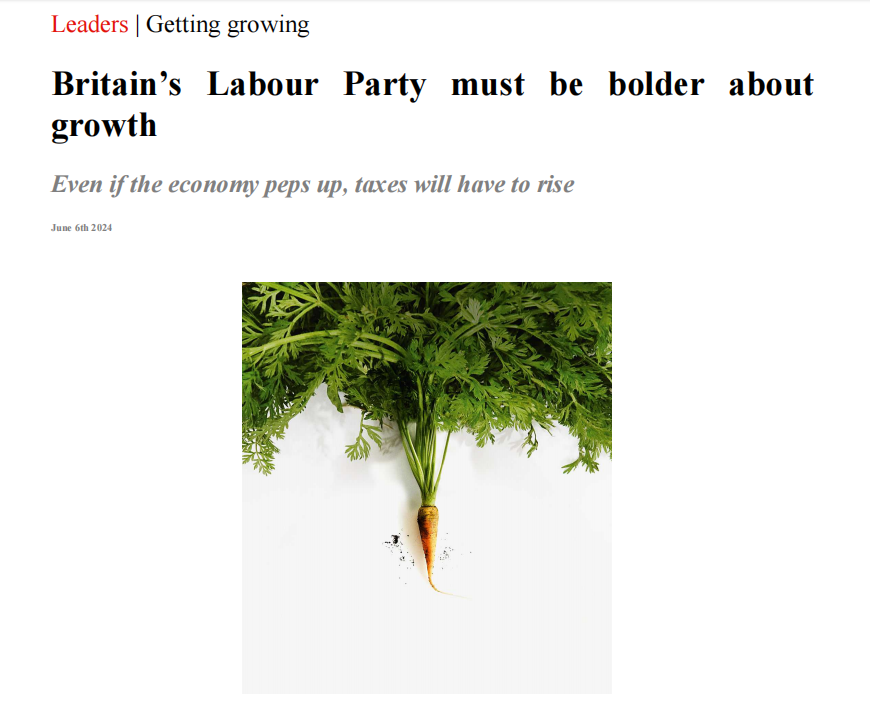

# **Britain’s Labour Party must be bolder about** growth

本文是阅读《经济学人》2024年6月8日这期**Britain’s Labour Party must be bolder about** **growth** 这篇文章的学习记录。

**Even if the economy peps up, taxes will have to rise**

“Pep up”在这里的意思是“振兴”或“使活跃”。整句话的意思是：“即使经济振兴，税收也必须增加。”

以下是几个使用“pep up”的例子：

1. **Music**: "She played some lively music to pep up the party."
   - 她播放了一些欢快的音乐来活跃派对的气氛。
2. **Speech**: "He added some jokes to his speech to pep it up."
   - 他在演讲中加入了一些笑话以增加趣味性。
3. **Workout**: "A quick jog in the morning can really pep you up for the day."
   - 早晨快跑一会儿可以让你精神振奋一整天。
4. **Work environment**: "They painted the office in bright colors to pep up the workspace."
   - 他们用亮色粉刷办公室以使工作环境更加活跃。
5. **Food**: "Add some spices to pep up the bland soup."
   - 加一些香料来提味这淡而无味的汤。

STAGNATION IS MISERABLE, as Britain has discovered. The parliament

that ended last month may have the unwanted distinction of being the first in

at least 60 years to leave the average Briton worse off than when it started in 2019.

A repeat of this sorry feat over the next term is unlikely: the country

would be unlucky to face blows to rival the impact of Brexit, covid-19 and

the Russian energy shock. Inflation is falling; interest rates should soon start

to come down. But doing a little bit better is not enough for Britons, or their

next government.

停滞是痛苦的，正如英国所发现的那样。上个月结束的议会可能会有一个不受欢迎的区分，那就是在至少60年中首次让平均英国人比2019年开始时更糟糕。如果在下一个任期内重复这种遗憾的成就是不太可能的：国家将很不幸地面临与英国脱欧、新冠疫情和俄罗斯能源冲击类似的打击。通货膨胀正在下降；利率应该很快就会开始下降。但是，做得稍微好一点对英国人或他们的下一届政府来说是不够的。

stagnation: 美 [stæɡˈneɪʃ(ə)n]  停滞

miserable：美 [ˈmɪzrəbl] 痛苦的；悲惨的

parliament：美 [ˈpɑːrləmənt]  议会；国会

distinction：区别

Briton：美 [ˈbrɪtn]  英国人；大不列颠人；不列颠人

the average Briton：普通英国人，英国平民

sorry feat：

在这段话中，“sorry feat”指的是一个令人遗憾的成就或表现。具体来说，指的是英国在过去的议会期间，英国人的生活水平下降了，而这在过去60年中是第一次发生。这是一个令人遗憾的结果，所以用了“sorry feat”这个短语。

“Sorry”在这里的意思是“令人遗憾的”或“糟糕的”。这个词通常表示一种负面的情绪或情况，所以“sorry feat”可以翻译为“令人遗憾的成就”或“糟糕的结果”。

简而言之，“sorry feat”在这个上下文中指的是英国在过去的议会期间，国民的生活水平下降，这是一个不好的结果。

face blows：面对打击

Barring a last-minute collapse in support or a catastrophic polling error, that

government will be formed by the Labour Party under Sir Keir Starmer. The

campaign so far has solidified Labour’s large poll lead over the beleaguered Conservatives. The decision by Nigel Farage to take the reins of Reform 

UK, a challenger party, has intensified the threat to the Tories from their right.

Increasingly, therefore, the question is not who will win, but what Labour

will do in power. And on economic growth, the avowed centrepiece of

Labour’s plan for government, the answer is: not enough.

除非最后一刻支持率暴跌或出现灾难性的投票错误，否则凯尔·斯塔莫爵士领导下的工党将组建新政府。到目前为止，这场竞选巩固了工党对陷入困境的保守党的大幅民调领先优势。奈杰尔·法拉奇决定执掌挑战者政党英国改革党，这加剧了右翼对保守党的威胁。因此，问题越来越不在于谁会获胜，而在于工党执政后会做什么。在经济增长这个公认的工党政府计划的核心问题上，答案是:不够。

barring：美 [ˈbɑrɪŋ] 除… 以外；除非

campaign：竞选

beleaguered：美 [bɪˈligərd]  包围的；围困的；饱受批评的；处于困境的

"Take the reins" 是一个惯用短语，意思是“掌控”或“接管领导”。这个短语来源于骑马或驾车时握住缰绳以控制方向的动作。在文中的意思是奈杰尔·法拉奇决定接掌和领导改革英国党。

intensify the threat to：加剧威胁

“Tories” 是对英国保守党的非正式称呼。保守党是英国两大主要政党之一，另一个是工党（Labour Party）。保守党的起源可以追溯到17世纪，起初是支持君主制和保守传统价值观的政治派别。今天的保守党通常主张自由市场经济、较小的政府干预以及传统的社会价值观。

avowed：英 [əˈvaʊd] 公开宣布的；自认的；公开承认的

centrepiece：英 [ˈsɛntəpiːs] 最引人注目的事物

介绍Labour Party：

The Labour Party is one of the two major political parties in the United Kingdom, alongside the Conservative Party. Founded in 1900, it has traditionally represented the interests of the working class and has a strong affiliation with trade unions. The party's political stance is generally center-left, advocating for social equality, public ownership, and social justice.

History

- **Founding and Early Years**: The Labour Party was established by trade unionists and socialists, with the goal of representing workers in Parliament. It gained its first MP in 1900 and grew steadily over the following decades.
- **Post-War Period**: Labour achieved significant success in the 1945 general election under Clement Attlee, introducing wide-ranging social reforms including the establishment of the National Health Service (NHS) and nationalizing key industries.
- **Late 20th Century**: The party faced challenges in the 1970s and 1980s, including economic crises and internal divisions. Under Tony Blair in the 1990s, the party rebranded as "New Labour" and shifted towards the political center, leading to a landslide victory in 1997.

 Key Policies

- **Economy**: Labour supports progressive taxation, increased public spending on services like healthcare and education, and government intervention in the economy.
- **Social Welfare**: The party advocates for a robust welfare state, including unemployment benefits, pensions, and social housing.
- **Healthcare**: Labour is a staunch supporter of the NHS and seeks to ensure it remains publicly funded and free at the point of use.
- **Education**: The party emphasizes the importance of education, advocating for increased funding for schools and free university tuition.
- **Workers' Rights**: Labour aims to protect and enhance workers' rights, including advocating for higher minimum wages and stronger labor protections.

 Leadership

- **Clement Attlee**: Prime Minister from 1945 to 1951, known for implementing the welfare state and the NHS.
- **Harold Wilson**: Prime Minister during the 1960s and 1970s, overseeing significant social reforms.
- **Tony Blair**: Led the party from 1994 to 2007, known for modernizing the party and winning three consecutive general elections.
- **Jeremy Corbyn**: Led the party from 2015 to 2020, shifting it back towards its traditional socialist roots.
- **Keir Starmer**: The current leader since 2020, focusing on rebuilding the party and addressing contemporary issues like climate change and economic inequality.

Electoral Performance

Labour has experienced fluctuating success in general elections. It has formed the government several times, most notably in the post-war period under Attlee and during Blair's tenure in the late 1990s and early 2000s. In recent years, the party has faced challenges but remains a significant force in British politics.

Current Focus

- **Climate Change**: Promoting green energy and policies to address the climate crisis.
- **Economic Recovery**: Plans to rebuild the economy post-COVID-19, focusing on job creation and sustainable growth.
- **Social Justice**: Continuing efforts to reduce inequality and improve social mobility.

The Labour Party continues to play a crucial role in shaping the political landscape of the United Kingdom, advocating for policies aimed at creating a fairer and more just society.

工党（Labour Party）是英国的两个主要政党之一，另一个是保守党。工党成立于1900年，传统上代表工人阶级的利益，与工会有着密切的联系。工党的政治立场通常是中左翼，倡导社会平等、公有制和社会正义。

 历史

- **创立与早期**：工党由工会主义者和社会主义者成立，旨在代表工人在议会中的声音。工党于1900年获得了第一个议员席位，并在接下来的几十年里逐步壮大。
- **战后时期**：在克莱门特·艾德礼（Clement Attlee）的领导下，工党在1945年大选中取得了巨大成功，实施了广泛的社会改革，包括建立国家医疗服务体系（NHS）和国有化关键产业。
- **20世纪后期**：工党在1970年代和1980年代面临经济危机和内部分裂等挑战。在1990年代托尼·布莱尔（Tony Blair）的领导下，工党重新定位为“新工党”，向中间派靠拢，并在1997年大选中大获全胜。

主要政策

- **经济**：工党支持渐进的税制改革、增加公共服务（如医疗和教育）的支出以及政府对经济的干预。
- **社会福利**：工党倡导强大的福利国家，包括失业救济金、养老金和社会住房。
- **医疗**：工党坚定支持NHS，确保其资金来源于公共财政，并在使用时免费。
- **教育**：工党重视教育，主张增加对学校的资金投入和免费大学学费。
- **工人权利**：工党旨在保护和加强工人权利，包括提高最低工资和加强劳动保护。

领导人

- **克莱门特·艾德礼（Clement Attlee）**：1945年至1951年任首相，以实施福利国家和NHS而著称。
- **哈罗德·威尔逊（Harold Wilson）**：1960年代和1970年代的首相，进行了一系列重要的社会改革。
- **托尼·布莱尔（Tony Blair）**：1994年至2007年任党魁，以现代化工党和连续三次赢得大选而著称。
- **杰里米·科尔宾（Jeremy Corbyn）**：2015年至2020年任党魁，将工党重新向其传统的社会主义根源靠拢。
- **基尔·斯塔默（Keir Starmer）**：自2020年起任党魁，致力于重建工党并解决气候变化和经济不平等等当代问题。

选举表现

工党的选举成绩波动较大。工党多次组建政府，最著名的时期是战后艾德礼领导下和布莱尔任期内的1990年代末和2000年代初。近年来，工党面临一些挑战，但仍然是英国政治中的重要力量。

 当前重点

- **气候变化**：推动绿色能源和政策应对气候危机。
- **经济复苏**：计划在COVID-19疫情后重建经济，关注就业机会和可持续增长。
- **社会正义**：继续努力减少不平等并改善社会流动性。

工党在塑造英国政治格局中继续扮演重要角色，倡导旨在创造更公平和更公正社会的政策。

One way of thinking about how fast the economy needs to grow is to look at

the fiscal hole that Britain is in. On paper, the Tory government’s tax-and-spending plans 

meet the fiscal rule that the ratio of public debt to 

GDP should start falling in the final year of a five-year forecast period. In reality, these

plans already imply unrealistic cuts for underfunded courts and denuded

local government. Worse still, the spending plans are based on implausibly

optimistic medium-term forecasts by the Office for Budget Responsibility (OBR), 

a watchdog that checks the government’s sums. According to *The*

*Economist*’s calculations, if Britain grows by the consensus forecast of

1.5%, rather than the 1.8% expected by the OBR, the annual hole in the public

finances would deepen by roughly £30bn ($38.4bn, or 1.1% of GDP). 

Growth of 1.1%, the average since 2008, would create a gap of roughly £60bn.

思考经济需要多快增长的一个方法是看看英国的财政漏洞。理论上，保守党政府的税收和支出计划符合财政规则，即公共债务占GDP的比例应该在五年预测期的最后一年开始下降。事实上，这些计划已经意味着对资金不足的法院和被剥夺权力的地方政府进行不切实际的削减。更糟糕的是，支出计划是基于预算责任办公室(OBR)令人难以置信的乐观中期预测，OBR是一个检查政府资金的监督机构。根据《经济学人》的计算，如果英国经济增长达到1.5%的共识预测，而不是OBR预期的1.8%，公共财政的年度亏空将加深约300亿英镑(384亿美元，或GDP的1.1%)。2008年以来的平均增长率为1.1%，将产生约600亿英镑的缺口

fiscal：美 [ˈfɪskl] 政府岁入的；财政（尤指税收）的；金融的

fiscal hole: 财政漏洞

meet the fiscal rule：满足财政规则

underfunded 资金不足的，underfunded courts，资金不足的法院

denude：美 [dəˈn(j)ud] 使变光秃；剥夺… 的财物

denuded local government: 被剥夺财务的当地政府

watchdog：监督人员，监督

Such sobering numbers have two implications. The first is that taxes will in

fact need to go up—whatever the main parties say and whoever is in power.

Borrowing at high interest rates to compensate for slow growth is

unsustainable. And the money cannot be found simply by cutting public

services further. The pressures on the public purse are rising. For Labour, in

particular, raiding public services would be self-defeating, because it wants

growth to fund their expansion

这些发人深省的数字有两层含义。首先，不管主要政党说什么，不管谁掌权，税收实际上都需要增加。以高利率借款来弥补缓慢的增长是不可持续的。而且这些钱不能简单地通过进一步削减公共服务来筹集。公共财政的压力越来越大。特别是对工党来说，掠夺公共服务将会弄巧成拙，因为它希望经济增长为其扩张提供资金

sobering：美 [ˈsoʊbərɪŋ] 发人深省的

implication: 含义

compensate：美 [ˈkɑːmpenseɪt] 赔偿；偿付；弥补；

purse：美 [pɜːrs] 小钱包；小钱袋；资金；财源

public purse:公共财政

raiding：美 [redɪŋ] 劫掠；突击搜捕；突然搜查；（raid的现在分词）

self-defeating:达不到目的的；自我拆台的；弄巧成拙的

Desperate not to trip up before the election, Labour has pledged to leave

Britain’s main tax rates unchanged even though small increases to income

tax or VAT would be the most painless way to fill the hole. Labour has other

options: if it chose a land-value or a carbon tax *The Economist* would set off

fireworks. More likely is a mess of smaller levies and threshold fiddles that

further complicate Britain’s tax system.

为了在选举前不出纰漏，工党承诺不会改变英国的主要税率，尽管小幅提高所得税或增值税（VAT）是填补财政缺口最无痛的方式。工党还有其他选择：如果他们选择土地价值税或碳税，《经济学人》将放烟花庆祝。更有可能的是，一系列小额税收和门槛调整，这将进一步使英国的税收体系变得复杂。

"Trip up" 是一个短语，通常指犯错误或出差错，特别是在做重要或关键的事情时。在文中，描述工党在选举前希望避免犯错误，即不希望在此期间出现任何失误或差错。

pledged：美 [pledʒd] 保证；许诺；（pledge的过去式和过去分词）

set off fireworks：放烟花

levy：美 [ˈlevi]征收；征兵；征得的税；levies，复数

further complicate xxx：进一步使得xxx变得更复杂

threshold fiddles：门槛调整

"fiddle" 是一个多义词，可以作为动词或名词使用，具体意思取决于上下文。在这里，“threshold fiddles” 中的"fiddle" 指的是对某事物进行欺骗性或不诚实的调整或修改。这个词通常带有负面的意义，暗示着某种不正当的操作或小聪明。

fiddle：乱弄；拨弄 ；摆弄；倒腾

The second implication is that Labour should be single-minded in its pursuit

of growth. To achieve annual increases in 

GDP much above 1.5% requires

more than a vague promise of political stability. British productivity growth—the ability to make more with the same labour—has been feeble ever since

the financial crisis. An ageing population does not help.

第二层含义是，工党应该一心一意追求增长。要实现远高于1.5%的GDP年增长率，需要的不仅仅是政治稳定的模糊承诺。自金融危机以来，英国的生产率增长——用同样的劳动力生产更多产品的能力——一直疲软。人口老龄化于事无补。

single-minded:   一心一意的；专心致志的          

pursuit of growth: 追求增长

vague： 模糊的
vague promise：模糊的承诺

feeble:美 [ˈfiːbl]  虚弱的；衰弱的；乏力的；

Unfortunately, the simplest way to boost the economy is also the trickiest.

Brexit made Britain poorer, but negotiations on renewed integration with the

European Union would soak up diplomatic and political capital. Unless the

Tories become more constructive on Europe, the EU would also be wary of

making an agreement that a future British government could immediately

undo. A deeper relationship with Brussels ought to be a medium-term goal

for Labour. Until then, streamlining food checks, intra-firm transfers and the

like, though worthwhile, are unlikely to have much effect on growth.

不幸的是，提振经济的最简单方法也是最棘手的。英国退出欧盟让英国变得更穷，但与欧盟重新整合的谈判将吸收外交和政治资本。除非保守党在欧洲问题上变得更具建设性，否则欧盟也会对达成一项未来英国政府可能会立即撤销的协议持谨慎态度。深化与布鲁塞尔的关系应该是工党的中期目标。在此之前，简化食品检查、公司内部转移等措施尽管值得，但不太可能对增长产生太大影响。

boost the economy: 提振经济

sock up: 吸收

renewed: 美 [rɪˈnuːd] 更新的；复兴的；重建的

be wary of: 提防；警惕；

streamline: 美 [ˈstriːmlaɪn] 使成流线型；精简（组织或过程）；简化（程序或系统)

have much effect on growth: 对增长产生太大影响

The big opportunity is fixing the planning system. Britain has no more built-up 

land per person than it did in the 1990s; last year the number of planning

applications fell to the lowest in almost three decades. Labour’s leaders have

identified the problem, but their rhetoric far outruns their policies. More

planning officers and tougher house-building targets are too timid. Building

new towns, a Labour enthusiasm, would be costly and slow: better to make

cities bigger and denser. Instead of trying to squeeze more out of the current

planning system, Labour should overhaul it. That means allowing building

on the green belt, the rings of protected land surrounding many English

cities, and moving from a discretionary model to a rules-based one in which

projects that meet a design code go ahead automatically.

最大的机会是修复规划系统。英国人均建筑用地不比20世纪90年代多；去年，规划申请数量降至近30年来的最低水平。工党领导人已经意识到了这个问题，但是他们的言辞远远超过了他们的政策。更多的规划官员和更严格的住房建设目标过于胆小。建设新城镇——一种工党热情——既昂贵又缓慢:最好是让城市更大更密集。工党不应该试图从当前的计划体系中榨取更多，而应该彻底改革它。这意味着允许在绿化带(许多英国城市周围受保护的土地环)上进行建设，并从自由裁量模式转向基于规则的模式，在这种模式下，符合设计规范的项目将自动进行。

built-up 楼房密集的；高楼林立的；

built-up land:建筑用地
identify the problem：意识到问题

rhetoric：美 [ˈretərɪk] 花言巧语，修辞

squeeze：榨取

overhaul:解体检修；拆修；大修

meet a design code: 符合设计规范

discretionary: 美 [dɪˈskreʃəneri] 可任意使用的；

A Labour government should sweep aside other obstacles to growth, too.

Regional mayoralties were a good first step by the Tories, but mayors still

lack control of their budgets or the ability to raise enough money. A

fragmented pensions system brings poor returns and locks capital out of

growth-friendly investments. Restrictive visa rules and high fees dampen

valuable high-skilled immigration.

工党政府也应该扫除增长的其他障碍。地区市长选举是保守党迈出的良好的第一步，但是市长们仍然缺乏对预算的控制或者筹集足够资金的能力。一个支离破碎的养老金体系带来了糟糕的回报，并将资本挡在了有利于增长的投资之外。限制性签证规则和高额费用抑制了宝贵的高技能移民。

sweep aside obstacles: 扫清障碍

mayoralty: 美 [ˈmeɪərəlti] 市长（或区长、镇长）职位；市长任期

lack control of : 缺乏控制

pension: 养老金

fragmented pensions system: 支离破碎的养老金体系

dampen：美 [ˈdæmpən] 减弱；减缓；

A growth-obsessed government would also smooth out the worst distortions

to the tax code. Stamp duty jams up the property market by deterring

downsizing; the £90,000 VAT-registration threshold subsidises unproductive

small businesses; national insurance is three-quarters lower for the self

employed. Reform all that and the economy would rev up nicely.

一个痴迷于增长的政府也会消除税法最严重的扭曲。印花税阻碍了规模缩小，从而堵塞了房地产市场；90，000的增值税登记门槛补贴了非生产性小企业；个体户的国民保险要低四分之三。改革所有这些措施，经济将会健康发展。

stamp duty：印花税："Stamp duty" 是一种税费，通常在购买不动产时征收。在英国和其他一些国家，购买房屋或土地时需要支付这种税。税额根据购买价格的不同而变化。印花税的名字来源于历史上实际在文件上粘贴的印花，以表明税款已缴纳。

deter：阻碍

"jam up" 的意思是 "阻碍" 或 "卡住"。具体来说，句子中的意思是印花税阻碍了房地产市场的发展，因为它使得人们不愿意缩小住房规模或搬家，从而影响了市场的流动性。

“Property market”指的是房地产市场。它包括住宅、商业地产、工业地产和土地等不同类型的房地产交易和投资活动。房地产市场涉及买卖、租赁、开发和管理等方面，并受到经济、政策、人口变化和金融市场等多种因素的影响。在房地产市场中，房价、租金、交易量、供应和需求等都是关键指标，用于衡量市场的健康状况和发展趋势。

subsidise：美 [ˈsʌbsɪdaɪz] 给…发津贴；补助

small businesses：小企业

rev up：加速；加快；加速运转

这些问题的改革需要从整体经济效率和公平性的角度来考虑：

1. **印花税阻碍房地产市场的发展**：
   - **问题**：印花税是一种在房产交易时需要缴纳的税费。较高的印花税税率可能会阻碍人们进行房产交易，尤其是对于那些考虑缩小住房规模（downsizing）的人群，比如老年人。这些人可能因为高额的印花税而选择不卖掉大房子，搬到更小、更适合他们需求的房子。
   - **需要改革的原因**：这种情况导致了房屋市场的停滞，不利于住房资源的优化配置。如果减少或取消印花税，可以鼓励更多的房产交易，促进住房市场的流动性，增加住房供应，使得不同需求的人群能够更容易地找到合适的住房，从而提高整体经济效率。

2. **£90,000的增值税（VAT）注册门槛补贴了低效的小企业**：
   - **问题**：年收入低于£90,000的小企业不需要注册和缴纳增值税，这相当于对这些小企业提供了某种形式的补贴。然而，这种补贴可能会导致这些企业为了避免超过这个门槛而控制其收入，进而限制了它们的发展。
   - **需要改革的原因**：这种行为会导致一些小企业故意保持在一个较低的生产力水平，而不是追求更高的增长和效率。这不利于经济的整体发展。降低或取消这一门槛，可以鼓励小企业扩大经营规模，提高生产力，从而促进经济增长。

3. **自雇人士的国民保险费率较低**：
   - **问题**：自雇人士缴纳的国民保险费率比雇员低三分之二。这意味着自雇人士在享受同样的社会福利和公共服务时，缴纳的税款却少得多。
   - **需要改革的原因**：这种差异不仅造成了税收上的不公平，也可能鼓励更多的人选择自雇以避免较高的税收负担。这不仅影响了政府的税收收入，还可能导致社会保险系统的资金不足。通过提高自雇人士的国民保险费率，使其与雇员的费率相匹配，可以增加税收收入，确保社会保险系统的可持续性。

总结

这些问题需要改革的主要原因是为了提高税收制度的公平性和经济效率。通过改革印花税，可以促进房地产市场的流动性和资源优化配置；通过调整增值税注册门槛，可以鼓励小企业追求更高的增长和效率；通过调整自雇人士的国民保险费率，可以增加税收收入，确保社会福利系统的可持续性。

**The timidity trade-off**

timidity：美 [tɪˈmɪdəti] 羞怯；胆怯；胆小

Labour is better placed to boost growth than the Tories are. It is less

neuralgic on Europe and immigration and its voters want more houses. But

its policies are either unequal to the scale of Britain’s economic and fiscal

challenge or, as with its green subsidies, likely to do more harm than good.

工党比保守党更有能力促进经济增长。它对欧洲和移民问题没有那么头疼，它的选民想要更多的房子。但其政策要么与英国经济和财政挑战的规模不相称，要么就像其绿色补贴一样，可能弊大于利。

boost growth：促进增长

neuralgic: 美 [njᴜ'rældʒɪk] 神经痛的

subsidies: 美 [ˈsʌbsədiz] 津贴；补贴；补助金；（subsidy的复数）

Sir Keir may have bolder plans for office than he is willing to admit before

an election: he ran a cautious leadership campaign in 2020, then ruthlessly

reshaped the party after he won. But on both tax and growth he faces a trade-off 

between being timid now and having a mandate to get things done in

office. A Labour government is likely to oversee a modest economic

recovery. But it has not yet outlined a path to prosperity.

Sir Keir可能有比他在选举前愿意承认的更大胆的执政计划:他在2020年参加了一场谨慎的领导竞选，然后在获胜后无情地重塑了该党。但是在税收和经济增长两方面，他都面临着一个权衡，要么现在畏首畏尾，要么在任期内完成任务。工党政府可能会监督温和的经济复苏。但它还没有勾勒出一条通往繁荣的道路。

bolder：更大胆的

ruthlessly: 美 [ˈruːθləsli] 冷酷地；无情地；残忍地

mandate: 美 [ˈmændeɪt] 命令；指令；执政权

## 后记

2024年6月14日11点25分完成经济学人这篇文章的学习。

