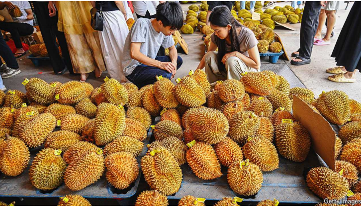

# **China is going crazy for durians**

**Locals love the pungent fruit. The government sees an opportunity**

这是阅读2024年6月15日《经济学人》杂志的**China is going crazy for durians**这篇文章的学习笔记。

durian：美 [ˈdʊriən] 榴莲

A whiff of diplomacy 一点外交手段

whiff：美 [wɪf] 一阵…气味；吸气；吸烟

pungent:美 [ˈpʌndʒənt]  辛辣的；刺激性的；犀利的；刺鼻的；

pungent fruit：刺鼻的水果

原文：

ERIC CHAN has long sold durians, a pungent fruit, to South-East Asians.

Now he is eyeing a bigger prize. The Musang King variety that he cultivates

in Malaysia is beloved by Chinese consumers. But at the moment his

country only has permission to export frozen durians to China, where many

want them fresh. In total, Chinese foodies gobbled up $6.7bn-worth of

imported fresh durians last year, up from \$4bn in 2022 and \$1.6bn in 2019,

the year durians overtook cherries as China’s largest fresh-fruit import by

value.

ERIC CHAN长期向东南亚出售榴莲，这是一种刺鼻的水果。现在他正着眼于更高的价格。他在马来西亚培育的桑木国王品种深受中国消费者的喜爱。但目前，他的国家只允许向中国出口冷冻榴莲，因为中国人想要新鲜的榴莲。总体而言，中国美食家去年吞下了价值67亿美元的进口新鲜榴莲，高于2022年的40亿美元和2019年的16亿美元，2019年榴莲取代樱桃成为中国进口价值最大的新鲜水果。

学习：

is beloved by：被xxx喜爱

frozen durians：冻榴莲

foodie：美 [ˈfuːdi]  美食家

gobble：美 [ˈɡɑːbl] 狼吞虎咽；贪婪地吃；大量消耗； **注意发音**

gobble up：吞掉；狼吞虎咽；

cherries：美 [ˈtʃeriz] 樱桃；（cherry的复数）

原文：

Apart from a love of the fruit, two shifts help to explain China’s increasing

appetite for durians. The first is the growth of the country’s middle class.

More and more Chinese are able to afford durians, which are not cheap. An

average one from Thailand, the supplier of much of China’s stock, can sell

for around 150 yuan ($20). The Musang King variety can fetch up to 500

yuan each. (A durian is often big enough to be shared by two people.)

除了对榴莲的喜爱，两个转变也有助于解释中国人对榴莲越来越大的胃口。首先是中国中产阶级的增长。越来越多的中国人买得起榴莲，榴莲并不便宜。泰国是中国大部分库存的供应国，一个普通的榴莲可以卖到150元左右(20美元)。桑木国王品种可以卖到500元一个。(一个榴莲往往大到可以两个人分享。)

学习：

be able to afford durians：买得起榴莲

fetch up：到达，来到

原文:

The high price puts some buyers off. For others, though, it adds to the

appeal. Durians have become a status symbol, like a “fine wine”, says Mr

Chan. Fans of the Musang King variety call it the “Hermès of durians”. The

fruit is sometimes given as a gift at birthdays or weddings.

高昂的价格让一些买家望而却步。然而，对其他人来说，这增加了吸引力。陈先生说，榴莲已经成为一种身份的象征，就像一种“美酒”。桑木国王品种的粉丝称之为“榴莲中的爱马仕”。这种水果有时在生日或婚礼上作为礼物赠送。

学习：

put xxx off：让xxx望而却步

add to the appeal：增加了吸引力

status symbol：地位象征

 Hermès：/ehr-mez/. 爱马仕

原文：

The second change is that in recent years China has opened up its market.

Until 2022 it only let in fresh durians from Thailand (though it bought

frozen ones from other countries). Since then fresh-durian sellers from

Vietnam and the Philippines have gained access, having agreed to China’s

phytosanitary requirements (which prevent the spread of pests and diseases).

Malaysia is hoping to be next.

第二个变化是，近年来中国开放了市场。直到2022年，它只从泰国进口新鲜榴莲(尽管它从其他国家购买冷冻榴莲)。从那时起，来自越南和菲律宾的新鲜榴莲卖家已经获得了准入，他们同意中国的植物检疫要求(防止病虫害的传播)。马来西亚希望成为下一个。

学习：

phytosanitary：美 [ˌfaɪdoʊˈsænɪtɛri] 植物检疫的；免疫证书的

原文：

China’s moves are in part a response to the increasing demand of its citizens.

But some observers also see them as strategic. “Durian diplomacy” is one of

several ways China tries to foster goodwill in South-East Asia. It has funded

big infrastructure projects in the region under its Belt and Road Initiative,

including some that bring durians to its doorstep. And it is a signatory, along

with most South-East Asian countries, to the Regional Comprehensive

Economic Partnership, a free-trade deal that came into force in 2022.

中国的举措在一定程度上是对其公民日益增长的需求的回应。但一些观察家也认为它们具有战略意义。“榴莲外交”是中国试图在东南亚培养善意的几种方式之一。它在“一带一路”倡议下资助了该地区的大型基础设施项目，包括一些将榴莲带到家门口的项目。它和大多数东南亚国家都是区域全面经济伙伴关系(Regional Comprehensive Economic Partnership)的签署国，这是一项于2022年生效的自由贸易协定。

学习：

foster goodwill：培养善意

fund xxx project：资助xxx项目

doorstep：美 [ˈdɔːrstep] 门前的台阶；（比喻）家门口；

come into force：生效

signatory：美 [ˈsɪɡnəˌtɔri] 签署者；签署国

原文：These thicker economic ties also provide China with a source of leverage if

its neighbours upset it. Like the durian, Chinese officials can be prickly. In

the past they have restricted banana imports from the Philippines, blaming

issues with pests. But this coincided with disputes over territory in the South

China Sea. Some Vietnamese durian sellers fear similar treatment. “They

know China can also use trade as a penalty,” says Nguyen Thanh Trung of

Fulbright University Vietnam.

这些更紧密的经济联系也为中国提供了一个杠杆来源，如果它的邻国惹它不高兴的话。就像榴莲一样，中国官员也很敏感。过去，他们限制从菲律宾进口香蕉，指责虫害问题。但这与南海的领土争端同时发生。一些越南榴莲卖家害怕类似的待遇。“他们知道中国也可以用贸易作为惩罚，”越南富布赖特大学的Nguyen Thanh Trung说。

学习：

thick economic ties：紧密的经济联系

prickly：美 [ˈprɪk(ə)li] 多刺的；棘手的；易怒的；

coincide：美 [ˌkoʊɪnˈsaɪd]  重合；重叠；位置重合；（事件、现象）同时发生；

原文：

Meanwhile, Chinese farmers are looking to cash in on the action. The first

durian trees in China were planted in 1958, say state media. They produced

little fruit. Farmers in Hainan have been giving it another try. The island

province is one of the few places in China with the right climate for durian

cultivation. The farmers’ output is increasing, to perhaps 200 tonnes this

year, according to reports. But self-reliance is a long way off. China

imported 1.4m tonnes of durians last year

与此同时，中国农民希望从这一行动中获利。官方媒体称，中国第一批榴莲树种植于1958年。他们几乎不产水果。海南的农民已经尝试了另一种方法。这个岛屿省是中国少数几个气候适合榴莲种植的地方之一。据报道，农民的产量正在增加，今年可能达到200吨。但是自力更生还有很长的路要走。中国去年进口了140万吨榴莲

学习：

cash in on： 从...上获利；利用；在...中谋取利益          

state media：官方媒体

durian cultivation：榴莲种植

## 后记

2024年6月21日13点13分于上海。

