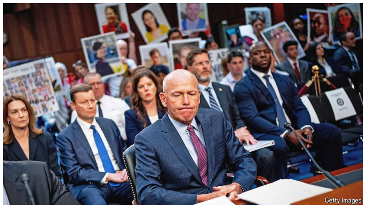

# The world this week:  Business

原文：

Dave Calhoun, **Boeing’s** CEO, was questioned by American senators about

recent safety incidents involving his company’s planes, such as the blowout

of a door panel on a 737 MAX. Richard Blumenthal, the chairman of the

committee investigating the failures, described Boeing as “an iconic

company…that somehow lost its way”. Mr Calhoun, who is stepping down,

apologised for the recent incidents and two earlier fatal crashes. Meanwhile,

the latest whistleblower to make a complaint revealed that Boeing lost track

of 400 faulty parts, and that some of them may have been installed on

planes. Boeing’s share price is down by 30% this year.

波音公司首席执行官戴夫·卡尔霍恩(Dave Calhoun)被美国参议员质疑最近涉及其公司飞机的安全事故，如737 MAX的门板爆裂。故障调查委员会主席理查德·布卢门撒尔(Richard Blumenthal)将波音描述为“一家标志性的公司……不知何故迷失了方向”。即将卸任的卡尔霍恩先生为最近的事故和之前的两起致命撞击道歉。与此同时，最新一位投诉的举报者透露，波音公司丢失了400个故障零件的踪迹，其中一些零件可能已经安装在飞机上。波音公司的股价今年下跌了30%。

学习：

Boeing：波音公司

senator：参议员

blowout：美 [ˈbloʊˌaʊt] 爆裂；过压故障；盛宴；大型聚会；

iconic：美 [aɪˈkɑːnɪk] 标志性的，图标的

step down：下台，卸任

whistleblower：美 [hwɪsəlˌbloɚ] 告发者ˌ检举者 **注意发音**

make a complaint：投诉

share price：股价

原文：

**Nvidia** overtook Microsoft and Apple to become the world’s most valuable

company, with a stockmarket value of more than $3.3trn. The maker of

chips for artificial intelligence has seen its share price surge by 40% since

issuing bumper quarterly revenues and profits a month ago, and expects

sales to increase from the roll-out of its Blackwell chip, billed as the world’s

most powerful. Nvidia is only one of a dozen companies to lead the 

S&P 500 since its creation in 1926. It recently split its stock, lowering the share price

to make it more attractive to small investors.

Nvidia超越微软和苹果成为世界上最有价值的公司，股票市值超过3.3万亿美元。自一个月前发布丰厚的季度收入和利润以来，这家人工智能芯片制造商的股价飙升了40%，并预计其Blackwell芯片(号称世界上最强大的芯片)的推出将增加销售额。自从标准普尔500于1926年创立以来，英伟达只是领导它的十几家公司之一。该公司最近分拆股票，降低股价，以吸引小投资者。

学习：

share price surge: 股价飙升

quarterly revenues and profits：季度收入和利润

bumper：美 [ˈbʌmpər] 丰盛的；异常丰富的；特大的；盛大的；极为成功的；

roll-out：初次公开展出；新产品（或服务项目的）上市          

billed：用海报宣传；宣布；开账单；（bill的过去式和过去分词）          

split its stock：拆分股票

原文：

**Broadcom’s** share price also hit new highs, after the chipmaker announced a

ten-for-one stock split that comes into effect in July. Over the past few years

big tech companies have been using stock splits to dilute the price of their

surging shares, though Meta and Microsoft have notably not done so.

博通的股价也创下新高，此前该芯片制造商宣布将于7月份生效的10比1股票分割。在过去的几年里，大型科技公司一直在使用股票分割来稀释其飙升的股票价格，尽管Meta和微软显然没有这样做。

学习：

hit new highs：创下新高

come into effect：生效

dilute：美 [daɪˈluːt] 稀释；降低（强度、纯度或价值）

原文：

A study by the IMF said that the “sheer scale and speed of the transformation”

in AI would amplify job losses, reducing the share of **labour income** in

national accounts and exacerbating inequality. It called on governments to

prepare social systems that will “cushion the transition costs for workers”.

国际货币基金组织(IMF)的一项研究表示，人工智能的“巨大规模和速度的转变”将放大失业，降低劳动收入在国民账户中的份额，并加剧不平等。它呼吁各国政府准备好“缓冲工人转型成本”的社会体系。

学习：

sheer：完全的；十足的；垂直的；陡峭的；

sheer scale：绝对规模，巨大规模

job losses：失业

amplify：放大

exacerbate：美 [ɪɡˈzæsərbeɪt] 加剧（病情、问题等）；使恶化；使加重

cushion：美 [ˈkʊʃn] 缓冲；减轻…的不利作用

原文：

The **Bank of England** held its main interest rate steady, at 5.25%. The day

before the decision new figures showed headline annual inflation in Britain

dropping to 2% in May, bang on the bank’s target, though the core rate,

excluding food and energy, was 3.5%, and inflation for services didn’t fall as

much as expected. The bank’s next monetary-policy meeting is on August

1st, after a general election that is expected to usher Labour into power.

英格兰银行将主要利率稳定在5.25%。在做出决定的前一天，新的数据显示，英国5月份的总体年通胀率降至2%，正好达到银行的目标，尽管不包括食品和能源在内的核心通胀率为3.5%，服务业的通胀率也没有预期的下降那么多。该银行的下一次货币政策会议将于8月1日举行，此前预计将举行使工党掌权的大选。

学习：

new figures show：新的数据显示

bang on：完全正确；完全符合          

usher Labour into power: 使得Labour掌权

## **Investor reprieve**

reprieve：美 [rəˈpriv]  赦免；缓刑；暂时缓解；暂时解救

原文：

A judge in Texas dismissed what remained of **ExxonMobil’s** lawsuit against

activist investors over its emissions targets. Arjuna Capital and Follow This

had proposed a proxy vote on quickening the pace of Exxon’s emission cuts,

but they dropped the proposal when it threatened to sue, claiming they were

abusing the proxy system. The judge ruled that the case against Arjuna was

now invalid, as it had pledged not to refile the motion. He had already

removed Follow This from the suit.

德克萨斯州的一名法官驳回了埃克森美孚公司针对激进投资者的排放目标诉讼的剩余部分。Arjuna Capital和Follow This曾提议就加快埃克森的减排步伐进行代理投票，但当它威胁要起诉时，他们放弃了这一提议，声称他们滥用了代理制度。法官裁定，针对阿尔诸那的诉讼现在无效，因为它已经承诺不再提起诉讼。法官已经将Follow This从诉讼中移除。

学习：

sue：控告；对（人；机构）提起诉讼；

rule：裁定

pledge：美 [pledʒ] 承诺；正式承诺；保证；

motion：正式提议

原文：

**Tesla** submitted a letter to a judge in Delaware asking for new legal

arguments on Elon Musk’s 2018 pay deal, after 77% of the company’s

shareholders backed the package at their annual meeting. In January the

judge voided the package in a case brought by a dissident shareholder, who

claimed the sum, now worth around $46bn, was too large. Tesla says the

vote backing Mr Musk’s pay “significantly impacts” the issue. But lawyers

for the dissident investor insist the vote has no legal impact.

特斯拉向特拉华州的一名法官提交了一封信，要求就埃隆·马斯克的2018年薪酬协议进行新的法律辩论，此前该公司77%的股东在年会上支持这个薪酬方案。今年1月，在一个由持不同政见的股东提起的案件中，法官宣布该方案无效，该股东声称，目前价值约460亿美元的金额太大。特斯拉表示，支持马斯克薪酬的投票“显著影响”了这个问题。但是这位持不同意见的投资者的律师坚持认为投票没有法律影响。

学习：

annual meeting：年会

void：宣布xx无效

dissident：美 [ˈdɪsədənt]   持不同政见者；持不同政见的

原文：

**Fisker**, a maker of electric vehicles, filed for bankruptcy protection in

America. The company went public in 2020 amid a wave of optimism in the

industry, but its sales never took off. Fisker was delisted by the New York

Stock Exchange recently because its share price was “abnormally low”.

电动汽车制造商菲斯克在美国申请破产保护。该公司于2020年在行业乐观浪潮中上市，但其销售额从未起飞。菲斯科近日被纽交所摘牌，原因是股价“异常低”。

原文：

Toyoda Akio’s reappointment as chairman of **Toyota** won the support of just

72% of shareholders, down from 85% last year. Two big proxy advisers had

recommended voting against Mr Toyoda for failing to oversee the proper

certification process on some vehicles. It was a rare instance of a rebellion in

corporate Japan.

丰田章男连任丰田董事长仅获得72%的股东支持，低于去年的85%。两名大型代理顾问建议投票反对丰田章男，因为他未能监督一些汽车的适当认证程序。在日本企业界，这是一次罕见的反抗。

学习：

Toyota：丰田

rebellion：美 [rɪˈbeljən] 反抗；反对；

rare instance：罕见的例子

原文：

The ownership structure of **Heathrow** was overhauled, following the

decision of Ferrovial, an infrastructure group, to sell down its stake. Ardian,

a French private-equity firm, is now the airport’s largest shareholder, with a

22.6% stake. Saudi Arabia’s sovereign-wealth fund is taking 15%. The other

big investor is the Qatar Investment Authority, with a 20% holding.

(Heathrow’s chairman, Lord Deighton, is also chairman of *The Economist*’s

parent company.)

在基础设施集团Ferrovial决定出售其股份后，希思罗机场的所有权结构进行了彻底改革。法国私募股权公司Ardian现在是机场的最大股东，拥有22.6%的股份。沙特阿拉伯的主权财富基金拿走了15%。另一个大投资者是卡塔尔投资局，持有20%的股份。(希思罗机场的主席，戴顿勋爵，也是《经济学人》母公司的主席。)

学习：

Heathrow：希思罗机场

private equity：私募股权

sell down：卖掉；抛售；减持          

stake：股份

原文：

Singapore returned to the top spot in an annual ranking of **competitiveness**

among 67 countries compiled by IMD, a business school. The city-state last

topped the poll in 2020. Switzerland came second and Denmark, last year’s

champion of efficiency, came third. America dropped three places to 12th

spot. China climbed seven places to 14th. Venezuela took the wooden spoon.

在IMD商学院编制的67个国家的年度竞争力排名中，新加坡重返榜首。这个城市国家上次高居榜首是在2020年。瑞士排名第二，去年的效率冠军丹麦排名第三。美国下降了三位，排名第12位。中国上升了7位，排在第14位。委内瑞拉是最后一名。

学习：

return to the top spot：重回榜首

drop three places:下降了三名

climb seven places：上升了7位

wooden spoon：俚语，倒数第一

最后一句话 "Venezuela took the wooden spoon." 的意思是，委内瑞拉在这次竞争力排名中得了最后一名。"Wooden spoon" 是一个英语俚语，通常用来形容在竞赛或排名中垫底或得倒数第一的情况。

## **Knights of Wall Street**

Employees from Chessify, an online chess platform, won the **World**

**Corporate Chess Championship** in New York, beating a team from

ChessMood, another platform. Banks and financial firms, including

BlackRock and Goldman Sachs, took part in the rapid-round format, though

only two, Susquehanna and UBS, made it through to the semi-finals. A team

from Google came second-bottom in its group.

在线象棋平台Chessify的员工在纽约赢得了世界企业象棋冠军，击败了另一个平台ChessMood的一支队伍。包括贝莱德(BlackRock)和高盛(Goldman Sachs)在内的银行和金融公司参加了快速轮的形式，但只有Susquehanna和瑞银(UBS)两家公司进入了半决赛。谷歌的一个团队在小组中排名倒数第二。

## 后记

2024年6月23日15点26分于上海。

