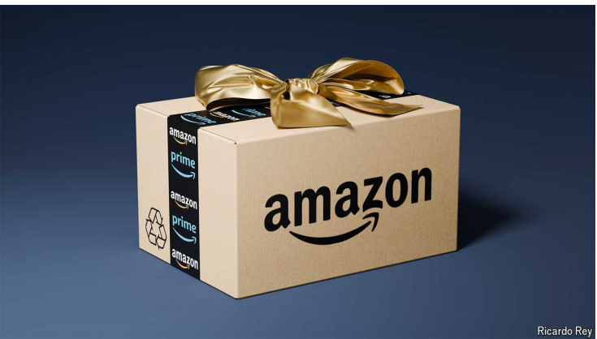

# As Amazon turns 30, three factors will define its next decade

It will have to deal with trustbusters, catch up on AI and revive its core business

它将不得不应对反垄断者，追赶人工智能并重振其核心业务

trustbuster： 美 [ˈtrəs(t)ˌbəstər] 反托拉斯法的执行人；反托拉斯官员；（反垄断的人）

原文：

About a week ago Amazon joined an exclusive club. Its market value ticked

over $2trn, putting it in the company of only four other firms: Alphabet,

Apple, Microsoft and Nvidia. In its 30 years Amazon, which began life as an

online bookseller in Seattle on July 5th 1994, has been astonishingly

successful. Its network of warehouses and vans delivers more packages each

year than FedEx or UPS, equivalent to $850bn-worth of goods worldwide. Its

pioneering cloud-computing business is used by millions of customers and

generates annual revenues of $100bn. Beyond its core operations, it is

investing in delivery drones, satellite networks and self-driving cars.

大约一周前，亚马逊加入了一个独家俱乐部。其市值超过2万亿美元，仅次于其他四家公司:Alphabet、苹果、微软和英伟达。亚马逊于1994年7月5日在西雅图以网上书店起家，在其30年的历史中，取得了惊人的成功。它的仓库和货车网络每年递送的包裹比联邦快递或UPS还多，相当于全球价值8500亿美元的商品。其开创性的云计算业务被数百万客户使用，年收入达1000亿美元。除了核心业务，它还投资于送货无人机、卫星网络和自动驾驶汽车。

学习：

exclusive club：独家俱乐部；独家会所          

begin life as an online bookseller: 以网上书店起家

astonishingly：令人惊讶地；惊人地；异常地

astonishingly successful：惊人的成功

warehouses：仓库；货栈；（warehouse的复数）

core operations：核心业务

原文：

This success is the result of the company’s tireless focus on customers and

its enthusiasm for experimenting. Activists may complain about how it kills

off brick-and-mortar stores. But punters are delighted with their sackfuls of

smiling cardboard boxes; Amazon routinely tops customer-satisfaction

surveys. In its quest to please shoppers, it diligently ploughs its profits back

into its business. Last year no firm spent more on research and development

or capital expenditure than Amazon. Plenty of companies say they are

customer-obsessed. But for Amazon, that claim actually rings true.

这一成功是该公司孜孜不倦地关注客户和热衷于试验的结果。活动人士可能会抱怨它如何扼杀了实体店。但是顾客们对他们装满微笑的纸箱感到高兴；亚马逊经常在顾客满意度调查中名列前茅。在追求取悦消费者的过程中，它努力将利润重新投入到业务中。去年，没有哪家公司比亚马逊在研发或资本支出上花费更多。许多公司说他们顾客至上。但对亚马逊来说，这种说法听起来确实没错。

学习：

tireless：不知疲倦的；孜孜不倦的；持续不懈的；

brick-and-mortar：实体的

punter：顾客；赌徒

sackfuls：满袋；（sackful的复数）

cardboard：纸板；硬纸

routinely：经常地

diligently：勤奋地；勤勉地          

plough：美 [plaʊ]  犁；耕；开垦；猛撞；清除（积雪）；艰难前进；

plough in：投资；再投资

customer-obsessed：顾客至上

原文：

What lies in store for the company as it enters its fourth decade? In recent

years Apple and Microsoft have joined a more rarefied club still; both have a

market capitalisation above $3trn. Whether Amazon manages to catch up

with them will depend on how well it navigates three tricky areas: slowing

e-commerce; increasing competition in artificial intelligence (AI); and an

onslaught from antitrust regulators.

当公司进入第四个十年时，它将面临什么？最近几年，苹果和微软加入了一个更小的俱乐部；两家公司的市值都超过了3万亿美元。亚马逊能否赶上他们将取决于它在三个棘手领域的表现:放缓的电子商务；人工智能(AI)领域的竞争日益加剧；以及反垄断监管机构的猛烈抨击。

学习：

in store for：即将到来；（命运等）等待着          

rarefied：美 [ˈrɛrəˌfaɪd] 使纯化；使稀薄；（rarefy的过去式和过去分词）

market capitalisation：市值 = market cap

tricky：需细心和技巧的；难对付的；

onslaught：美 [ˈɑːnslɔːt] 攻击；猛攻；

原文：

During the pandemic, the firm’s e-commerce operation went into overdrive,

with global revenues surging by 40% in 2020. In the past 12 months sales

grew by 5%, a third of their pre-covid pace. That is a problem because,

when you include shipping and other services sold to vendors, retail

accounts for two-thirds of Amazon’s sales. Worse still, analysts reckon it is

barely profitable and is propped up by the cloud-computing and ads

businesses. In response, Amazon has tried to move into groceries, a market

worth $2trn in America, but in which only a tenth of spending takes place

online. It is also making inroads into pharmaceuticals. Yet so far it has little

to show for its investments.

在疫情期间，该公司的电子商务业务进入超速运转，2020年全球收入飙升40%。在过去的12个月里，销售额增长了5%，是冠状病毒肺炎之前的三分之一。这是一个问题，因为当你包括运输和其他出售给供应商的服务时，零售占亚马逊销售额的三分之二。更糟糕的是，分析师认为它几乎没有盈利，是由云计算和广告业务支撑的。作为回应，亚马逊试图进军杂货市场，这个市场在美国价值2万亿美元，但只有十分之一的支出发生在网上。它还进军制药领域。然而到目前为止，它的投资几乎没有任何回报。

学习：

overdrive：（汽车的）超速挡；超负荷工作；

vendors：美 [ˈvendərz] 小贩；卖主；[贸易]自动售货机；供应商；（vendor的复数）

barely profitable：没有盈利

propped：支柱；支持者；道具；支撑；（prop的过去式和过去分词）          

prop up：支撑

groceries： 美 [ˈgroʊsəriz] 食品；杂货；杂货店；（grocery的复数）

inroads：侵犯；侵入；侵害；（inroad的复数）

make inroads into：进军（某个领域）

pharmaceuticals：美 [ˌfɑmə'sjutɪkəlz] 药品；药剂；药物；制药公司股票；（pharmaceutical的复数）

原文：

The next challenge is generative AI, in which Amazon ought to excel because

much of the demand associated with the technology is for cloud-based

services. But, thanks to its partnership with OpenAI, Microsoft has grabbed

the lead. As a result, Amazon’s dominance in cloud computing is waning. In

2022 its market share was 13 percentage points higher than that of

Microsoft. Today the difference is just six points.

下一个挑战是生成式人工智能，亚马逊应该在这方面表现出色，因为与该技术相关的大部分需求是基于云的服务。但是，由于与OpenAI的合作，微软已经占据了领先地位。因此，亚马逊在云计算领域的主导地位正在减弱。2022年，它的市场份额比微软高13个百分点。如今，差距只有6个百分点。

学习：

ought to：（表示期望或可能发生的事）应当；应该；

partnership：合作关系；合伙企业；合作协议；

grab the lead：占据领先地位

waning：月亏；逐渐减弱或变小的；亏缺；衰落；减少；减弱；（wane的现在分词）          

原文：

There are signs that Amazon is tackling these problems. In March it invested

$3bn in Anthropic, an OpenAI rival. This week it hired part of the senior team

from Adept, another AI startup. Its capital spending will probably jump by a

fifth this year, as it splurges on AI gear to fill its data centres. In e-commerce,

meanwhile, the company is trying to extract more value by tying the retail

business more closely to its advertising units and video-streaming services.

有迹象表明，亚马逊正在解决这些问题。今年3月，该公司向开放竞争对手Anthropic投资了30亿美元。本周，它从另一家人工智能初创公司Adept聘请了部分高管团队。今年，该公司的资本支出可能会增加五分之一，因为它在人工智能设备上投入巨资，以填充其数据中心。与此同时，在电子商务领域，该公司正试图通过将零售业务与其广告部门和视频流媒体服务更紧密地结合起来，来获取更多价值。

学习：

tackle problems：解决问题

senior team：高管团队

splurge：美 [splərdʒ]  挥霍；大手大脚地花钱

AI gear：AI 设备

原文：

Yet this closer integration may sharpen a third threat: antitrust. Regulators

everywhere have become wary of big tech, and Amazon’s plethora of

different businesses makes it a natural target. Knitting them together more

closely may attract even more scrutiny. Take, for example, the complaints

brought against the firm by America’s Federal Trade Commission last year.

One was that sellers who wanted their products to be eligible for free

delivery to shoppers with Prime subscriptions were being forced to use

Amazon’s logistics networks. Regulators elsewhere have disrupted its plans

to expand. Those in the European Union blocked the company’s ambition to

buy iRobot, a maker of automated vacuum cleaners.

然而，这种更紧密的融合可能会加剧第三种威胁:反垄断。各地的监管者都对大型科技公司保持警惕，亚马逊过多的不同业务使其成为自然的目标。将它们更紧密地编织在一起可能会吸引更多的审查。以去年美国联邦贸易委员会对该公司的投诉为例。其中之一是，希望自己的产品能够免费交付给Prime订阅用户的卖家被迫使用亚马逊的物流网络。其他地方的监管者已经打乱了它的扩张计划。欧盟的那些人阻止了该公司收购自动吸尘器制造商iRobot的雄心。

学习：

wary： 美 [ˈweri] （对待人或事物时）小心的；谨慎的；提防的；戒备的

plethora：美 [ˈpleθərə] 太多；过多；泛滥；过剩；

knitting：美 [ˈnɪtɪŋ] 编织（纺织品）；针织；联合；结合；（knit的现在分词）

complaint：控告；抗议；申诉；

eligible：美 [ˈelɪdʒəbl] 合格的；有资格的；符合条件的；

vacuum cleaner：吸尘器

原文：

All told, the company’s fourth decade will be harder going than its third. It

will have to factor antitrust scrutiny into its decisions, which could impede

growth. There may come a time when it will need to pull the plug on

groceries as ruthlessly as it did with the Fire phone. In AI, cut-throat

competition from startups will test the giant firm’s ability to keep pace.

总而言之，该公司的第四个十年将比第三个更加艰难。它将不得不在决策中考虑反垄断审查，这可能会阻碍增长。可能会有这么一天，公司需要像当初果断放弃Fire Phone那样无情地停止其杂货业务。在人工智能领域，来自初创公司的激烈竞争将考验大公司的跟上步伐的能力。

学习：

all told：总共

impede growth：阻碍增长

cut-throat：你死我活的；不择手段的；

cut-throat competition：激烈的竞争

解释这句话：There may come a time when it will need to pull the plug on groceries as ruthlessly as it did with the Fire phone

>这句话的意思是：“可能会有这么一天，公司需要像当初果断放弃Fire Phone那样无情地停止其杂货业务。”
>
>具体来说，这段话是关于公司在其第四个十年面临的挑战。它指出，反垄断审查可能会影响公司的决策和增长。此外，在人工智能领域，来自初创公司的激烈竞争将考验这家大公司的应对能力。句子中的"pull the plug"是一个比喻，意指果断地停止或放弃某项业务或项目。拿Fire Phone（亚马逊之前失败的一款智能手机）作为例子，表示公司可能需要同样果断地放弃杂货业务（例如，亚马逊的生鲜业务）来应对未来的挑战。

pull the plug：阻止事物发生；放弃某项项目

原文：

Yet Amazon’s focus on its customers and innovation should stand it in good

stead throughout. People often counted Amazon out over the years; in the

build-up to the dotcom bust commentators nicknamed it “Amazon.bomb”,

and many jeered when the firm launched its cloud-computing service. To

dismiss Amazon again today would be a mistake. ■

然而，亚马逊对其客户和创新的关注应该会一直对其有利。多年来，人们经常把亚马逊排除在外；在互联网泡沫破裂的过程中，评论家们给它起了个绰号叫“Amazon.bomb ”,当该公司推出云计算服务时，许多人嘲笑它。今天再次抛弃亚马逊将是一个错误。■

学习：

stead：美 [sted]  位置；地位；处境；

stand it in good stead: 占据有利地位

bust：经济衰退；不景气时期；失败；破产；

jeer：美 [dʒɪr]  嘲笑

dismiss：对…不屑一提；不予考虑；

## 后记

2024年7月5日15点00分于上海。

