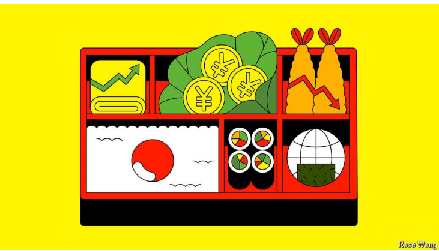
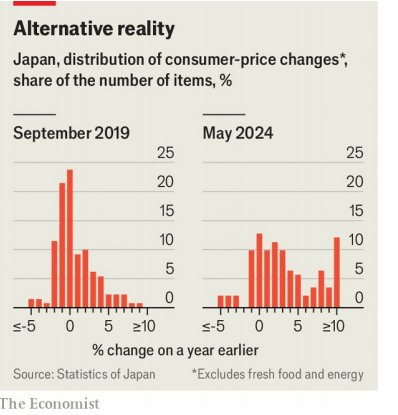

# Japan’s mind-bending bento-box economics

日本令人费解的便当盒经济学

mind-bending：使人知觉不正常的；使人精神恍惚的；使人精神错乱的          

bento：美 ['bentoʊ] 盒饭；盒饭或饭盒

The paradox of red-hot labour markets, falling demand and rising prices

red-hot：赤热的；炽热的；令人非常激动的；非常流行的；热烈的；热得发烫的；烫得发红的；充满热情的；最被看好的；最有希望获胜的；

>"Red-hot" 在这里的意思是非常热的、火爆的或极其活跃的。在这句话中，它形容劳动力市场非常活跃或紧张，意味着就业需求高，失业率低，工作岗位很多。
>
>几个例子：
>
>1. **The tech industry is experiencing a red-hot job market with companies competing fiercely for skilled workers.**
>   - 科技行业正经历一个火爆的就业市场，各公司激烈争夺技术人才。
>
>2. **Housing prices are skyrocketing in the city's red-hot real estate market.**
>   - 在这个城市火爆的房地产市场中，房价飞涨。
>
>3. **The startup scene in Silicon Valley is red-hot, with new companies being founded every day.**
>   - 硅谷的创业氛围非常火爆，每天都有新公司成立。
>
>所以，"The paradox of red-hot labour markets, falling demand and rising prices" 的意思是描述了一个悖论：即使劳动力市场非常活跃，但需求下降，价格却在上涨。

原文：

For much of the past three decades Japan’s economy has been defined by

deflation, stagnation and fading global relevance. That is no longer the case.

Between 1991 and 2021 Japan’s annual inflation rate averaged 0.35%.

Inflation has been above 2% every month since April 2022. In March the

Bank of Japan (BoJ) raised rates for the first time in 17 years, doing away

with the world’s last experiment in negative interest rates; it will debate

another rise at its next meeting at the end of this month. The blue-chip

Nikkei stock index broke its bubble-era high this February; the Topix, a

broader benchmark index, hit its highest level since 1990 last week. It seems

that the lost decades are over.

在过去30年的大部分时间里，日本经济被定义为通缩、停滞和全球影响力下降。情况不再是这样了。1991年至2021年间，日本的年通胀率平均为0.35%。自2022年4月以来，通胀率每月都在2%以上。3月，日本银行17年来首次提高利率，结束了世界上最后一次负利率实验；它将在本月底的下次会议上讨论再次加息。蓝筹股日经指数今年2月突破了泡沫时代的高点；更广泛的基准指数东证指数上周触及1990年以来的最高水平。似乎失去的几十年结束了。

学习：

blue-chip：可靠的；赚钱的；蓝筹的；

Nikkei： 美 ['nikei] 日经股价指数

stock index：股票指数；股指；股市指数          

the lost decades：迷失的几十年

原文：

But what comes next? Some see opportunity. Japan, the optimists crow, is

back—this time for real. Morgan Stanley, a bank, touts a “revitalised Japan”.

Higher inflation and more dynamic companies will put the country back on a

growth trajectory, allowing it to keep its public debt in check and hang on to

its place among the world’s top economies. Japan has become a destination

for high-tech firms seeking to reinforce supply chains: TSMC, the Taiwanese

semiconductor giant, is pouring billions of dollars into new manufacturing

plants.

但是接下来会发生什么呢？有些人看到了机会。乐观主义者欢呼道，日本回来了——这次是真的回来了。摩根士丹利银行吹捧一个“复兴的日本”。更高的通胀和更有活力的公司将使该国回到增长轨道，使其能够控制公共债务，并保持其在世界顶级经济体中的地位。日本已经成为寻求加强供应链的高科技公司的目的地:半导体巨头台积电正在向新的制造工厂投入数十亿美元。

学习：

touts：美 [taʊts] 兜售；吹捧；招徕；（tout的第三人称单数）

revitalised： 美 [riːˈvaɪtəˌlaɪzd] 使恢复生机；给予……新活力；使复苏；（revitalise的过去式和过去分词）

in check：被控制住；在抑制之下；在控制中；

原文：

Others take a gloomier view. Some argue that after three straight quarters of

contraction or no growth, Japan has already fallen into mild stagflation.

Long-term potential growth remains low, the yen is in freefall and

demographic headwinds loom. Pessimists fret that Japan’s future is as a

middling economy with burdensome debt, a weak currency and a greying

workforce.

其他人持更悲观的观点。一些人认为，在连续三个季度收缩或无增长后，日本已经陷入轻度滞胀。长期潜在增长率依然较低，日元汇率直线下跌，人口结构的逆风隐约可见。悲观主义者担心日本的未来是一个中等经济体，债务负担沉重，货币疲软，劳动力老龄化。

学习：

gloomier: 前景黯淡的；令人沮丧的；（gloomy的比较级）          

contraction：收缩；缩小

mild：美 [maɪld] 温和的；轻微的；柔和的； **注意发音**

freefall：自由下落

headwinds：顶头风；逆风；（headwind的复数）

loom：隐约可见

fret：美 [fret]

>
>
>在这段文字中，"fret" 的意思是“担忧”或“焦虑”。这里的意思是悲观主义者担忧日本未来会成为一个经济平庸、负债沉重、货币疲软和劳动力老龄化的国家。
>
>几个例子：
>
>1. **Parents often fret about their children's safety.**
>   - 父母经常担忧孩子们的安全。
>
>2. **She fretted over the delay in the delivery of her package.**
>   - 她为包裹的延误感到担忧。
>
>3. **The manager fretted about meeting the project deadline.**
>   - 经理为能否按时完成项目感到焦虑。

middling：中等的；普通的；一般的；

greying：老龄化；斑白的；

greying workforce：劳动力老龄化

原文：

The implications of the new era can be seen in Nihonbashi, a neighbourhood

in Tokyo’s north-east. Its fate has long moved in parallel with that of the

national economy. During the Edo era (between 1603 and 1868), merchants

congregated there, making it the country’s commercial centre; during the

Meiji period (1868-1912), when Japan opened up to the world, it became

home to the first institutions of modern finance. Highways built above

Nihonbashi’s bridge in 1963 symbolised the country’s booming growth in

the decades after the second world war; shuttered stores along Nihonbashi’s

avenues attested to the bursting of the asset bubble in the 1990s.

新时代的影响可以在日本桥看到，这是东京东北部的一个街区。它的命运长期以来与国民经济同步发展。在江户时代(1603年至1868年)，商人聚集在那里，使其成为该国的商业中心；在明治时期(1868-1912)，当日本向世界开放时，它成为了第一批现代金融机构的所在地。1963年在日本桥上修建的高速公路象征着日本在二战后的几十年里飞速发展；日本桥大街上关门的商店证明了20世纪90年代资产泡沫的破灭。

学习：

merchants： 美 [ˈmɜrtʃənts] 商人；批发商；（merchant的复数）

congregated：美 [ˈkɔŋɡriɡeitid] 使集合；聚集；（congregate的过去式）

Edo：美 [ˈɛdoʊ] （日本历史上的）江户

Meiji：美 [ˈmeɪdʒi] 明治

attest：证明；表明

原文：

Today, the neighbourhood offers a window on Japan’s new economic reality.

Start at Benmatsu Souhonten, which bills itself as Japan’s oldest continuous

purveyor of *bento*, or boxed lunches, with a history that stretches back to

before America’s “black ships” arrived to open Japan to foreign trade. More

recently the soaring cost of imports caused by the pandemic and the war in

Ukraine have acted as a black ship of sorts. What was once unimaginable

has become commonplace: companies consistently raise prices and

consumers keep coming back. Benmatsu Souhonten has increased *bento*

prices twice in the past two years. “These days customers understand prices

go up,” says Higuchi Junichi, the shop’s eighth-generation owner.

如今，这一地区为日本新的经济现实提供了一个窗口。从Benmatsu Souhonten开始，它标榜自己是日本历史最悠久的盒饭供应商，其历史可以追溯到美国“黑船”抵达日本开放对外贸易之前。最近，疫 情和Ukraine战 争导致进口成本飙升，这在某种程度上是一艘黑船。曾经不可想象的事情已经变得司空见惯:公司不断提高价格，消费者不断回来。在过去的两年里，Benmatsu Souhonten已经两次提高了便当价格。“如今，顾客明白价格在上涨，”该店第八代老板Higuchi Junichi说。

学习：

bill itself as：自称为

purveyor： 美 [pərˈveɪə(r)] 承办商；伙食承办商；供应商

stretch back：回溯到

the soaring cost：飙升的成本

of sorts：各种各样的；(表示某事物不够好)勉强算的, 凑合的

原文：

It is a change that officials inside the Bank of Japan, down the street from

Benmatsu Souhonten, have spent years trying to engineer, to little effect.

While central banks elsewhere raised rates in response to rising inflation, the

BoJ did nothing, hoping to use the external shocks to re-anchor domestic

expectations for inflation near its 2% target. The strategy appears to be

working. Prices for a wider swathe of goods are rising at faster rates than at

any time since the 1990s (see chart). Expectations have risen and stayed up:

the BoJ’s latest Tankan survey on corporate sentiment, released on July 1st,

shows that firms expect inflation of 2% or higher five years into the future.

这是一个日本银行内部官员花了数年时间试图策划的变化，但收效甚微。当其他地方的央行提高利率以应对不断上升的通胀时，日本央行却无所作为，希望利用外部冲击将国内通胀预期重新锚定在2%的目标附近。这一策略似乎奏效了。自20世纪90年代以来，更多商品的价格正以前所未有的速度上涨(见图表)。预期已经上升并保持不变:日本银行7月1日发布的关于企业情绪的最新短观调查显示，企业预计未来五年的通货膨胀率为2%或更高。

学习：

a wider swathe of：更大范围的

原文：

Price growth has helped push firms to raise wages, too. Annual negotiations,

known as *shunto*, have produced big salary increases for two years running.

This year’s average nominal wage growth will exceed 5% for the first time

since 1991. The trend is likely to continue, thanks to demographic and

generational changes. As Japan’s working-age population shrinks, the

competition for talent is heating up. Changing jobs was once seen as taboo;

young Japanese today have fewer qualms about that.

价格上涨也促使企业提高工资。被称为shunto的年度谈判已经连续两年大幅提高了工资。自1991年以来，今年的平均名义工资增长率将首次超过5%。由于人口结构和代际变化，这一趋势可能会持续下去。随着日本劳动年龄人口的减少，人才竞争正在升温。换工作一度被视为禁忌；如今的日本年轻人对此没有那么多顾虑。

学习：

taboo：美 [təˈbuː] 禁忌；禁忌行为

qualms：美 [kwɑlms] 良心之谴责；不安；（qualm的复数）

原文：

Strong wage growth is a big reason why the BoJ normalised its policy in

March. Though the bank has maintained a relatively accommodating stance

(its policy rate stands between 0% and 0.1%), analysts expect at least one

more rise this year. Goldman Sachs, a bank, estimates that the BoJ policy rate

will gradually increase to 1.5% by 2027. The implications of rising prices

and, potentially, rising rates are vast. They will force executives to “think

about changing their business model—not only about their prices, but about

the mix of goods, about efficiency, about strategy itself”, says Okina Yuri,

chair of the Japan Research Institute, a think-tank.

强劲的工资增长是日本央行在3月份实现政策正常化的一大原因。尽管日本央行一直保持相对宽松的姿态(其政策利率介于0%和0.1%之间)，但分析师预计今年至少还会有一次加息。高盛银行估计，到2027年，日本银行的政策利率将逐步提高到1.5%。价格上涨以及潜在的利率上升的影响是巨大的。智库日本研究所的主席奥菜亚美·尤里说，他们将迫使高管们“考虑改变他们的商业模式——不仅仅是价格，还有商品组合、效率和战略本身”。

学习：

implications：含意；含蓄；暗示；（implication的复数）这里翻译成影响

原文：

Such pressure, along with gradual improvements in corporate governance, is

fuelling optimism at the Japan Stock Exchange, just south of Nihonbashi’s

bridge. As far as the market is concerned, “we have already passed the

turning point”, says Yamaji Hiromi, the bourse’s boss. “Many are convinced

that Japan is now different.” Many corporate leaders are shifting from cost

cutting to investment-driven growth. Piling up cash makes less sense in an

inflationary environment. “It’s a totally different mindset,” Mr Yamaji says.

这种压力，加上公司治理的逐步改善，正在日本桥以南的日本证券交易所激起乐观情绪。就市场而言，“我们已经度过了转折点”，该交易所的老板山治上原广美说。"许多人相信日本现在已经不同了。"许多企业领导人正从削减成本转向投资驱动型增长。在通胀环境下，囤积现金没什么意义。“这是一种完全不同的心态，”山次先生说。

学习：

bourse：美 [bʊrs] 证券交易所；巴黎证券交易所

原文：

Some Japanese households are also starting to put their savings to work. 

NISA, a new government programme to encourage retail investing by offering

exemptions from capital-gains taxes, has been a hit since its launch in

January. Younger Japanese, who did not experience the trauma of the bubble

bursting, have proved especially keen. Nearly ¥7trn ($44bn) flowed into 

NISA accounts in the first four months of this year; roughly half of the funds are

being invested in domestic markets. “It takes a generation to recover from a

bad bubble burst,” Mr Yamaji says.

一些日本家庭也开始将储蓄用于工作。NISA是一项新的政府计划，通过免除资本利得税来鼓励零售投资，自一月份推出以来一直很受欢迎。年轻的日本人没有经历过泡沫破裂的创伤，事实证明他们尤其热衷于NISA计划。今年前4个月，近7万亿日元(合440亿美元)流入NISA账户；大约一半的资金投资于国内市场。山治表示:“从一场严重的泡沫破裂中恢复需要一代人的时间。”。

学习：

exemptions：豁免；免除；免税；（exemption的复数）

原文：

Yet for all the investor enthusiasm, the mood among Japanese consumers is

gloomy. At the top of a department store in Nihonbashi last month Kasai

Hidekazu, a retired schoolteacher, munched on a *bento*. “It sure doesn’t feel

like the situation is getting better,” he mused. Wage growth still lags behind

inflation, meaning pay cuts for many Japanese in real terms. Consumption is

sluggish. In the boutiques that fill the floors below, many shoppers are

foreign tourists who have been arriving in droves, lured in part by Japan’s

relative cheapness. The yen’s exchange rate, against a basket of currencies

and adjusted for inflation, is at a historic low. Germany recently surpassed

Japan as the third-largest economy in the world, measured in current dollars.

然而，尽管投资者热情高涨，日本消费者的情绪却很悲观。上个月，在日本桥的一家百货商店的顶层，一位退休教师Kasai Hidekazu正津津有味地吃着便当。“感觉情况肯定不会好转，”他沉思道。工资增长仍然落后于通货膨胀，这意味着许多日本人的实际工资减少了。消费不振。在楼下的精品店，许多购物者是成群结队的外国游客，部分是被日本相对便宜的价格所吸引。经通胀调整后，日元对一篮子货币的汇率处于历史低点。以当前美元计算，德国最近超过日本成为世界第三大经济体。

学习：

department store：百货商店；

schoolteacher：教师

munched：美 [mʌntʃt]大声咀嚼；（munch的过去式和过去分词）

mused：沉思；冥想；（muse的过去式和过去分词）

sluggish：美 [ˈslʌɡɪʃ] 萎靡不振的；疲软的；经济低迷的；市场萧条的

boutiques： 美 [bu:ˈti:ks] 精品店；（boutique的复数）

in droves：成群结队

lured：美 [lʊrd] 诱惑；引诱；吸引；（lure的过去式）

at a historic low：处于历史低位

原文：

The BoJ hopes wages will start growing in real terms later this year, once the

results of this spring’s wage negotiations filter through to salaries. That

should encourage consumer spending. But Japanese consumers, conditioned

by decades of deflation, may not behave as the economic textbooks predict.

“It’s so expensive now,” Mr Kasai says. “It makes me think I’d rather save

some money.”

日本央行希望，一旦今年春季工资谈判的结果渗透到工资中，工资将在今年晚些时候开始实际增长。这应该会鼓励消费者支出。但是，受几十年通货紧缩影响的日本消费者可能不会像经济学教科书预测的那样行事。“现在太贵了，”葛西先生说。“这让我觉得我还是省点钱的好。”

学习：

conditioned：受到...的影响；习惯于…的；

>But Japanese consumers, **conditioned** by decades of deflation, may not behave as the economic textbooks predict.
>
>在这句话中，"conditioned" 的意思是“习惯于”或“受到...的影响”。意思是日本消费者因为经历了数十年的通货紧缩，可能不会像经济学教科书所预测的那样行为。
>
>几个例子：
>
>1. **The dog was conditioned to salivate at the sound of a bell.**
>   - 这只狗习惯于一听到铃声就会流口水。
>
>2. **People in cold climates are conditioned to wear warm clothing.**
>   - 生活在寒冷气候中的人们习惯于穿保暖的衣服。
>
>3. **Employees conditioned by years of strict management might resist a more relaxed work environment.**
>   - 受到多年严格管理影响的员工可能会对更轻松的工作环境产生抵触。
>
>4. **Children conditioned by their parents to be polite often exhibit good manners.**
>   - 被父母教育得有礼貌的孩子通常表现出良好的礼仪。
>
>5. **She was conditioned to wake up early after years of working a morning shift.**
>   - 经过多年的早班工作，她习惯于早起。

原文：

Ultimately, the demographic pressure that has helped tighten labour markets

also drags down growth. Japan’s working-age population (now 74m) is

projected to shrink by 30m between 2020 and 2070. For all Japan’s

improvements, its potential growth rate is still below 1%.

最终，帮助收紧劳动力市场的人口压力也会拖累经济增长。日本的工作年龄人口(现在是7400万)预计在2020年到2070年间将减少3000万。尽管日本有所改善，但其潜在增长率仍低于1%。

原文：

These dynamics can be seen at the shops and cafés that line the *shotengai*, or

market street, in Ningyocho, on Nihonbashi’s eastern edge. “There are just

fewer and fewer people,” laments Masukawa Yoshio, the head of the local

business association. His café has gone from being open six days a week to

five, for lack of staff. He is unsure who may take over when he retires. Yet

as he looks towards the future, he feels hope, despite all the challenges.

“Everything was very stagnant,” he says. “At least now there’s movement.”

■

在日本桥东部边陲宁之町的shotengai(市场街)两旁的商店和咖啡馆里，可以看到这种动态。“人越来越少了，”当地商业协会的会长Masukawa Yoshio感叹道。由于人手不足，他的咖啡馆已经从一周营业六天变成了五天。他不确定他退休后谁会接任。然而，当他展望未来时，尽管面临种种挑战，他仍感到希望。“一切都停滞不前，”他说。“至少现在有运动了。”■

学习：

laments：英 [ləˈmɛnts] 哀悼；悲叹；（lament的第三人称单数）感叹道

## 后记

2024年7月7日15点40分于上海。

