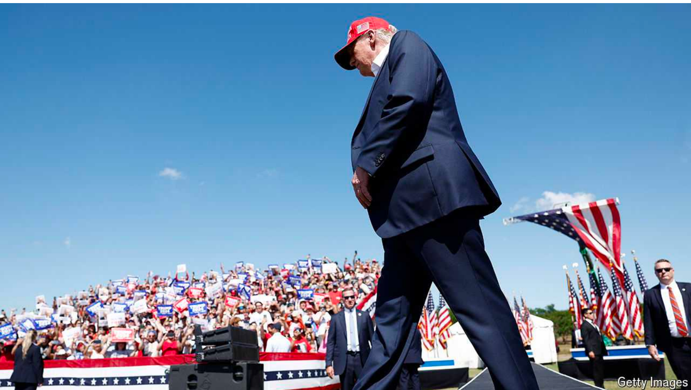

# Trumponomics would not be as bad as most expect

Opposition would come from all angles

原文：

In markets it is known as the “Trump trade”, a bet that Donald Trump’s

return to the White House would herald more inflation and higher interest

rates. Many of Mr Trump’s core policies push in this direction: tariffs would

add to import costs, deportations of immigrants could push up wages and

deficit-financed tax cuts would juice the economy. Amid mounting inflation,

the Federal Reserve would have little choice but to opt for higher rates.

在市场上，这被称为“特朗普交易”(Trump trade)，即押注唐纳德特朗普(Donald Trump)重返白宫将预示着更多通胀和更高利率。特朗普的许多核心政策都在朝着这个方向推进:关税将增加进口成本，驱逐移民可能推高工资，由赤字融资的减税将刺激经济。在通货膨胀加剧的情况下，美联储别无选择，只能选择更高的利率。

学习：

herald：美 [ˈherəld] 预兆；宣布（好或重要）；预示；

push up wages：推高工资

juice：给予活力；

juice the economy：刺激经济

deportation：驱逐

原文：

In the wake of Joe Biden’s calamitous debate on June 27th, a preview of the

trade played out. As investors grappled with the likelihood that Mr Trump

would romp to the presidency, they sold off Treasuries, which led to a brief

surge in yields. The big fear is that much worse would come to pass. If Mr

Trump fought the Fed on rates, he might sow doubts about the central bank’s

independence, undermining confidence in America’s markets and the dollar.

That is the economic nightmare scenario for a second Trump administration.

在6月27日乔·拜登灾难性的辩论之后，这场交易的预演开始了。随着投资者努力应对特朗普轻而易举当选总统的可能性，他们抛售美国国债，导致收益率短暂飙升。最大的担忧是更糟糕的事情会发生。如果特朗普在利率问题上与美联储对抗，他可能会让人怀疑美联储的独立性，削弱人们对美国市场和美元的信心。这是特朗普第二届政府的经济噩梦。

学习：

in the wake of：紧随其后；在…之后；

calamitous： [kəˈlæmɪtəs] 灾难的；悲惨的；不幸的

grapple with：与xxx搏斗，努力应对

romp：轻易取胜；轻松完成

sow：引起；造成

sow doubts：引起怀疑

原文：

But as with any nightmare, the bogeyman of Trumponomics may be more

terrible than its reality. Mr Trump and his advisers have many rotten ideas.

They also have some decent ones. And their ability to implement damaging

policies will be constrained, with Congress, America’s institutions and

markets all serving as checks.

但与任何噩梦一样，特朗普经济学的幽灵可能比现实更可怕。特朗普和他的顾问们有许多馊主意。他们也有一些像样的。他们实施破坏性政策的能力将受到限制，国会、美国机构和市场都将起到制衡作用。

学习：

bogeyman：美 [ˈboʊɡimæn] 假想怪物；鬼怪；可怕的人

原文：

Mr Trump has honed his agenda in speeches and interviews, and on July 8th

it was enshrined by Republicans as the party’s election platform. Three

elements stand out. The first is deregulation, a staple for Republicans. In

contrast to 2017, when he and his advisers were ill prepared for the

presidency, this time they have lined up personnel and policies. Mr Trump

will waste little time in rescinding many of the Biden administration’s

environmental rules, easing drilling restrictions for oil companies and

putting pressure on federal agencies to cut spending. He has promised, as in

his first presidency, to eliminate two regulations for each one issued.

特朗普在演讲和采访中完善了他的议程，7月8日，它被共和党人奉为该党的竞选纲领。有三个因素很突出。第一个是放松管制，这是共和党的一大特色。与2017年相比，当时他和他的顾问们对总统职位准备不足，这一次他们已经安排好了人员和政策。特朗普将立即废除拜登政府的许多环境法规，放松对石油公司的钻井限制，并向联邦机构施压以削减支出。他已经承诺，就像在他的第一任总统任期内一样，取消每一项颁布的两项法规。

学习：

election platform: 竞选纲领

>
>
>“Election platform” 是指政党的竞选纲领。竞选纲领是一份文件，详细列出了政党在选举期间的主要政策和优先事项。它代表了政党向选民展示的愿景和计划，以赢得选票和支持。在这段话中，指的是2024年7月8日，特朗普先生的议程被共和党作为该党的竞选纲领固定下来。

enshrined：美 [enˈʃraɪnd] 珍藏；（enshrine的过去式和过去分词）

staple：（某国的）主要产品；支柱产品

rescinding：废除；（rescind的现在分词）

drill：钻孔；

>“Eliminate two regulations for each one issued” 这句话的意思是，每发布一项新的法规，就要取消两项现有的法规。这是一种削减法规数量的策略，旨在减少政府的监管负担。特朗普在他的第一任期内曾承诺这样做，现在他再次承诺如果再次当选总统，将继续执行这一政策。

原文：

But much of this is marketing buzz. The number of restrictions in the Code

of Federal Regulations, a proxy for the intensity of regulation in America,

was basically unchanged under Mr Trump. What is more, his administration

was stymied by the courts. It was unsuccessful in nearly 80% of litigation

over its use of federal agencies, according to the Institute for Policy

Integrity, a research group. Goldman Sachs, a bank, reckons that the impact

of all Mr Trump’s deregulation was ultimately insignificant for the wider

economy—a result likely to be repeated.

但这大部分是营销上的宣传。代表美国监管力度的《联邦法规》(Code of Federal Regulations)中的限制数量，在特朗普治下基本没有变化。更重要的是，他的政府受到了法院的阻挠。根据研究机构政策诚信研究所的数据，Trump在利用联邦机构的诉讼中有近80%败诉。高盛(Goldman Sachs)银行认为，特朗普先生的所有放松管制的影响最终对更广泛的经济来说是微不足道的——这一结果可能会重复。

学习：

buzz：美 [bʌz] 传播；说闲话

marketing buzz：营销噱头;营销炒作

>
>
>"Marketing buzz" 指的是营销炒作或宣传噱头，意思是很多宣传或市场推广的内容实际上并没有实质性的内容或效果。在这段话中，"marketing buzz" 表示特朗普政府关于取消法规的承诺和宣传在很大程度上只是为了吸引注意力，并没有实质性的效果。虽然特朗普承诺每发布一项新法规就取消两项现有法规，但实际上，美国《联邦法规汇编》中的限制数量基本没有变化。此外，特朗普政府在法院的诉讼中大多不成功，因此其放松监管的总体影响对经济并不显著。

litigation：诉讼；起诉；打官司

原文：

On tax, Mr Trump can, in some sense, be seen as a continuity candidate.

Action will focus on the looming expiration of much of the Tax Cuts and

Jobs Act, Mr Trump’s package from 2017. The TCJA’s reduction in corporate

taxes was permanent, but much of the rest of the law, including cuts to

personal income taxes, will expire at the end of 2025. Mr Trump’s main

objective is to make these cuts permanent.

在税收方面，从某种意义上来说，特朗普可以被视为一个连续性的候选人。行动将集中在特朗普从2017年开始的一揽子减税和就业法案的大部分即将到期。TCJA对公司税的削减是永久性的，但该法的其他大部分内容，包括削减个人所得税，将在2025年底到期。特朗普的主要目标是让这些削减永久化。

学习：

expiration：到期

package：一揽子计划；

原文：

That will not be simple because to get the bill through Congress,

Republicans will need to pay the cost of extending the cuts, about $4.5trn

over the next decade. But Mr Trump has options. One slug of revenue may

come from tariffs, which could bring in $3trn over the decade. There is also

money in reversing some of Mr Biden’s policies. The cost of the Inflation

Reduction Act, Mr Biden’s climate-subsidy package, is expected to reach

about $1trn. Republicans can eliminate some tax credits, starting with

discounts for electric vehicles. Mr Trump has also suggested he may unwind

Mr Biden’s student-debt cancellations, on track to cost $1trn.

这并不简单，因为要让该法案在国会获得通过，共和党人需要支付延长减税的成本，未来十年约4.5万亿美元。但特朗普有选择。一部分收入可能来自关税，这将在十年内带来3万亿美元的收入。逆转拜登先生的一些政策也是有利可图的。拜登先生的气候补贴一揽子计划《通货膨胀削减法案》的成本预计将达到约1万亿美元。共和党人可以取消一些税收抵免，从电动汽车的折扣开始。特朗普还暗示，他可能会解除拜登取消的学生债务，这将耗资1万亿美元。

学习：

one slug of：一小片

tax credits：税收抵免

cancellation： 取消；撤销；中止；废止；

原文：

Mr Trump’s other tax ideas are more modest. He has talked about shaving a

percentage point off the corporate tax rate, to cut it to 20% (he likes a round

number). His zaniest proposal is to make tipping exempt from taxes.

Legislators would have to craft that exemption carefully, otherwise everyone

might demand pay as gratuities. Without offsetting revenue or spending cuts,

every tax cut will make America’s deficit worse, a risk under Mr Trump. But

it is not as if Mr Biden has been a paragon of fiscal rectitude: the federal

deficit is on track to hit a hefty 7% of  GDP this year.

特朗普的其他税收想法更加温和。他曾谈到将公司税率下调一个百分点，降至20%(他喜欢一个整数)。他最可笑的提议是让小费免税。立法者将不得不小心地制定这一豁免，否则每个人都可能要求支付酬金。在没有抵消收入或支出削减的情况下，每次减税都会让美国的赤字恶化，这是特朗普执政期间的一个风险。但是拜登先生似乎并不是财政清廉的典范:联邦赤字今年有望达到GDP的7%。

学习：

shave：（少量地）削减；削薄；

exempt from：免除

zaniest：荒唐的；（zany的最高级）

gratuities：英 [ɡrəˈtjuːɪtɪz] 小费；养老金；（gratuity的复数）

paragon：模范；完美典范；

rectitude：端正的品行；正直；正大光明

fiscal rectitude：财政清廉

hefty：（尤指金钱）大量的；巨额的；昂贵的；

## **Tariff man, part two**

原文：

The economic strategy for which Mr Trump is most infamous, especially

outside America, is his protectionism. He has been clear about where he

wants to go next, aiming for a 10% universal tariff on all imports into

America and a 60% levy on Chinese-made goods. He also wants a more

concerted decoupling from China.

特朗普最臭名昭著的经济战略，尤其是在美国以外，是他的保护主义。他已经明确了下一步的目标，目标是对所有美国进口商品征收10%的关税，对中国制造的商品征收60%的关税。他还希望更加有组织地与中国脱钩。

学习：

infamous：美 [ˈɪnfəməs] 臭名昭著的；声名狼藉的； **注意发音**

levy：美 [ˈlevi] 征税；税款；征收额；强制性收费；

concerted：有组织的；有计划的；

原文：

There is no doubting the global fallout if Mr Trump were to deliver on his

panoply of America-first trade policies. Would he be able to do so? In the

traditional wing of the Republican Party, there is still resistance to tariffs. If

Mr Trump decides to cut Congress out of the picture, he may declare a

national-security emergency, which would give him special powers. That,

however, may be struck down in court.

如果特朗普兑现他的美国优先贸易政策，毫无疑问会产生全球影响。他能做到吗？在共和党的传统派系中，仍然存在对关税的抵制。如果特朗普决定将国会排除在外，他可能会宣布国家安全紧急状态，这将赋予他特殊权力。然而，这可能会在法庭上被推翻。

学习：

fallout：后果；副作用；连带影响；余波；

panoply：美 [ˈpænəpli] 全套物品；全副装备；气派；辉煌的阵势；

原文：

Higher tariffs on China would be more achievable, since the White House

could piggyback them on existing measures. It could, for instance, conclude

that China has not lived up to a deal signed with Mr Trump in 2020, which

would be easy to demonstrate. Cracking down on the rerouting of Chinese

exports via other countries would be harder without co-operation from

foreign governments, which Mr Trump has struggled to elicit in the past.

对中国征收更高的关税更有可能实现，因为白宫可以利用现有的措施。例如，它可以得出结论，中国没有兑现2020年与特朗普签署的协议，这很容易证明。如果没有外国政府的合作，打击中国出口经由其他国家的改道将会更加困难，而特朗普过去一直在努力争取外国政府的合作。

学习：

piggyback：依附；在…的背上载运；附加于；搭建在现有系统上

crack down：打击

rerouting：美 [rɪr'rutɪŋ] 变更旅程；（reroute的现在分词形式）

elicit：引起；引出（信息或反应）；诱出（回答或事实）；激发出（感情或反应）

原文：

Moreover, even within Mr Trump’s White House, there may well be

opposition to his most aggressive trade policies. Hawks such as Peter

Navarro, an economic adviser, have been the most voluble, but Mr Trump

likes to assemble a team of rivals, letting him adjudicate between contrasting

opinions. He may once again appoint a Wall Street veteran as his treasury

secretary and such a figure would be a counterweight to fire-breathing

protectionists.

此外，即使在特朗普的白宫内部，也很可能有人反对他最激进的贸易政策。经济顾问彼得纳瓦罗(Peter Navarro)等鹰派人物最健谈，但特朗普喜欢召集一个竞争团队，让他在对立的观点之间做出裁决。他可能会再次任命一位华尔街资深人士担任财政部长，这样的人物将会成为猖狂的保护主义者的制衡力量。

学习：

adviser：顾问

voluble：美 [ˈvɑljəbəl] 滔滔不绝的；健谈的；流畅的

adjudicate：美 [əˈdʒudəˌkeɪt] 判决；宣判；裁定；

原文：

Mr Trump’s agenda will face other hurdles. He wants to hit the ground

running but his first year in office features a dense legislative calendar. The

debt ceiling will be reinstated on January 2nd, forcing the White House to

enter talks with Congress. Another deadline looms at the end of April when

Congress will have to make swingeing cuts if it has not worked out a new

budget. All the while, the clock will be ticking on Mr Trump’s tax cuts. If

the Democrats manage to win the House, all of these negotiations will be

that much thornier

特朗普的议程将面临其他障碍。他想立即投入工作，但他上任的第一年有着密集的立法日程。债务上限将于1月2日恢复，迫使白宫与国会展开谈判。另一个截止日期是4月底，届时如果国会没有制定出新的预算，将不得不大幅削减开支。与此同时，特朗普减税计划的时间将会越来越紧迫。如果民主党设法赢得众议院，所有这些谈判将更加棘手

学习：

reinstated：美 ['riɪn'steɪtɪd] 使复原；使恢复；（reinstate的过去式）

swingeing：美 [ˈswɪndʒɪŋ] 剧烈的；极度的

thornier：棘手的；多刺的；痛苦的；（thorny的比较级）

原文：

Mr Trump will make even less headway on reshaping the Fed. Investors

worry that he wants to influence the central bank’s rate decisions. Putting

that desire into practice, though, is difficult. His first chance to appoint a

new governor will come in 2026, after which he can also nominate a chair to

replace Jerome Powell. But the Fed’s board is seven-strong and all

nominations must go through the Senate, which previously blocked two of

Mr Trump’s four nominees. If Mr Trump tried to fire Mr Powell, insiders at

the Fed think that he would have another unwinnable legal fight on his

hands.

特朗普将在重塑美联储方面取得更小的进展。投资者担心他想影响央行的利率决定。然而，将这种愿望付诸实践是困难的。他任命新领导的第一次机会将在2026年，之后他还可以提名一位主席来取代杰罗姆·鲍威尔。但美联储董事会由七名成员组成，所有提名都必须经过参议院批准，而参议院此前否决了特朗普四名提名人中的两人。如果特朗普试图解雇鲍威尔，美联储内部人士认为，他将面临另一场无法打赢的法律战。

学习：

headway：进展；进步；改善；发展

原文：

Perhaps the biggest short-term damage that Mr Trump can inflict on

America’s economy is through his immigration policy. Stopping “the

invasion”, as he calls it, will consume his administration. The millions who

have entered the country in the past few years have been vital to sustaining

economic growth while taming inflation. A halt to migration would be a

shock to the labour market. Nevertheless, as with other Trumpian policies,

there will be resistance every step of the way, with courts striking down

deportation orders, Democrat states refusing to co-operate and businesses

lobbying for a lighter touch.

特朗普可能对美国经济造成的最大短期损害是通过他的移民政策。他称阻止“入侵”将消耗他的政府。过去几年涌入美国的数百万人，在抑制通胀的同时，对维持经济增长至关重要。停止移民将对劳动力市场造成冲击。然而，与特朗普的其他政策一样，每一步都会遇到阻力，法院会取消驱逐令，民主党州拒绝合作，企业会游说采取更宽松的政策。

学习：

inflict：强加于；使遭受；施加；

taming：变得驯服；（tame的现在分词）

tame inflation：抑制通胀

原文：

Through all of this, the financial world would also rein in Mr Trump. He is

sensitive to the stockmarket, even ascribing its good run earlier this year to

expectations of his victory. Were equities to fall or yields to soar when Mr

Trump attacks his latest target—whether the Fed, migrants or foreign trade

—it would catch his attention.

通过所有这一切，金融界也会约束特朗普。他对股票市场很敏感，甚至将今年早些时候的良好表现归因于对他获胜的预期。如果特朗普攻击他的最新目标——无论是美联储、移民还是对外贸易——时，股市下跌或债券收益率飙升，这将引起他的注意。

学习：

rein in：遏制；严控；控制

ascribing：归因于；认为…具有；（ascribe的现在分词）

原文：

This is not to be sanguine about Mr Trump’s hold over American politics.

There is a risk that his second term would spiral out of control. Checks on

his excesses are not automatic, and would need people to go against him in

the Republican Party, the courts and society at large. But that ought to

happen, which would keep the worst of Trumponomics at bay. ■

特朗普对美国政治的掌控不容乐观。他的第二个任期有失控的风险。对他过分行为的检查不是自动的，需要共和党、法院和整个社会的人来反对他。但这应该会发生，这将阻止最糟糕的特朗普经济学。■

学习：

sanguine：美 [ˈsæŋɡwɪn] 乐观的；充满信心的；充满希望的；

at bay：被压制住；被控制住；被阻止

## 后记

2024年7月18日于山东日照。