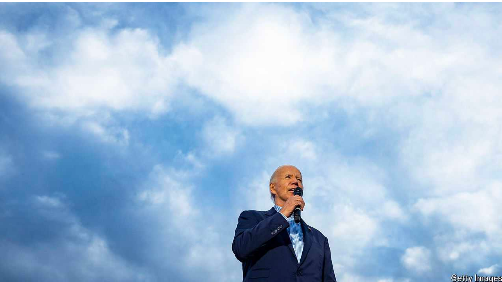
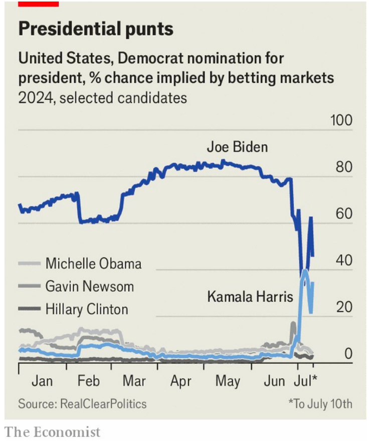

# Betting markets are useful when politics is chaotic

Betting: 投注；赌博；赌钱；打赌；博彩业；

Why, then, are they largely outlawed in America?

当政治混乱时，博彩市场是有用的
那么，为什么它们在美国大部分是非法的呢？

原文:

In the early 20th century, for brief periods, the most frenetic American

trading pits were not the raucous markets in which stocks were traded, nor

the venues where bonds were exchanged. The real action was in the market

for betting on the next president. “Crowds formed in the financial

district...and brokers would call out bid and ask odds as if trading

securities,” write Paul Rhode and Koleman Strumpf, two economists.

Markets were deep, liquid and smart: in 15 presidential elections from 1884

to 1940, the favourite won 11 times and three races were essentially tied (in

odds and result). Only once did markets miss the mark.

在20世纪初的一段短暂时间里，美国最狂热的交易场所不是喧闹的股票交易市场，也不是债券交易场所。真正的行动是在押注下一任总统的市场上。“人群聚集在金融区...而经纪人会喊出出价，询问赔率，就像在交易证券一样，”两位经济学家保罗·罗德(Paul Rhode)和科勒曼·斯特鲁普夫(Koleman Strumpf)写道。市场深度大、流动性强且聪明:在1884年至1940年的15次总统选举中，最受欢迎的一方赢了11次，有3场比赛基本上不分胜负。市场只错过了一次。

学习：

trading pits：交易大厅；交易场所

>“Trading pits” 是指交易所中的交易大厅或交易区域，在这些地方，交易员通过公开叫价和喊价进行交易。这些交易厅通常非常热闹，充满了买卖双方的喧嚣和激烈的竞价。

frenetic：美 [frəˈnɛdɪk] 狂热的

raucous：美 [ˈrɔkəs] 嘶哑的；沙嘎的；粗嘎的

bid：出价；报价；喊价；叫价；投标；

odds：投注赔率；

原文：

Lively markets in political betting would be a gift today, since they have

taken on a profound importance in the days since Joe Biden’s disastrous

debate against Donald Trump. The question of whether Mr Biden should

drop out is urgent; the answer influenced by his chances of beating Mr

Trump. Polls, even fast ones, are slower than markets. And markets moved

sharply against Mr Biden’s chances of continuing in the White House and

being the Democrat nominee, before recovering a little in response to the

president’s obstinacy (see chart).

活跃的政治博彩市场在今天将是一份礼物，因为自乔拜登(Joe Biden)与唐纳德特朗普(Donald Trump)展开灾难性辩论以来，这些市场已变得极其重要。拜登先生是否应该退出的问题迫在眉睫；答案受到他击败特朗普的几率的影响。民意调查，即使是快速的，也比市场慢。市场大幅下跌，不利于拜登继续入主白宫并成为民主党候选人，但由于总统的固执，市场略有反弹(见图表)。

学习：

obstinacy：美 [ˈɑbstənəsi] 顽固；固执；（病痛等的）难治；（病痛等）难治

原文：

Unfortunately, robust political betting markets all but vanished in America

around the time of the second world war, owing to a crackdown on gambling

and the rise of political polling. Today they are mostly illegal, since it is

thought unseemly to sully democracy with speculation, with an exception

for not-for-profit betting exchanges built by academics to generate data.

Thus the only betting markets that remain are highly restricted, operate

abroad or exist outside traditional gambling and financial markets. Can any

be trusted?

不幸的是，二战前后，由于对赌博的打击和政治民意调查的兴起，活跃的政治博彩市场在美国几乎消失了。如今，它们大多是非法的，因为用投机玷污民主被认为是不合适的，只有由学者建立的用于生成数据的非营利性博彩交易所除外。因此，仅存的博彩市场受到高度限制，在国外运营，或者存在于传统的博彩和金融市场之外。有可信的吗？

学习：
political polling：民调

crackdown：打击

unseemly：不适宜地；不合适地；不雅地；不合时宜地；

sully：美 [ˈsəli] 弄脏；玷污

speculation：投机；投机买卖

原文：

Consider academic exchanges first. The main restriction on these is that they

must cap the value of any bet—at $500 on the Iowa Elections Market and

$850 on PredictIt—as well as the number of people betting on any question.

As a result, crazy bets cannot be punished by a big trader who spots an

opportunity (and perhaps not by anyone, if limits have been reached).

先考虑学术交流。对他们的主要限制是他们必须限制任何赌注的价值——在爱荷华选举市场为500美元，在PredictIt为850美元——以及对任何问题下注的人数。因此，发现机会的大交易者不会惩罚疯狂的押注(如果达到了限度，可能任何人都不会惩罚)。

原文：

Venues such as Betfair, a British betting exchange, are populated by

foreigners who may be less well informed. Nate Silver, an elections

forecaster, has derided taking such markets seriously as checking in with the

“Scottish teens”. There is a crypto exchange, run on Ethereum, where

election betting takes place, but only those with crypto-wallets can get

involved

像英国博彩交易所Betfair这样的场所都是外国人，他们可能不太了解情况。选举预测者内特·西尔弗(Nate Silver)嘲笑说，认真对待这样的市场是在和“苏格兰青少年”打招呼。有一个在以太坊上运行的加密交易所，在那里进行选举下注，但是只有那些有加密钱包的人才能参与

学习：

derided：美 [dɪˈraɪdid] 嘲笑；嘲弄；愚弄；（deride的过去式）

原文：

All these suffer from what David Rothschild, a researcher at Microsoft, calls

“the “favoured long-shot issue”. Even now betting markets give Michelle

Obama a 5% chance of being the next Democrat nominee. Perhaps her

chance is not zero, but it is close to it. These bets cannot be punished by big

trades in America. Elsewhere thin markets tend to lead to high fees, which

eat into winnings, meaning it is rarely worth taking the other side.

所有这些都受到微软研究员David Rothschild所说的“被看好的长期问题”的困扰。即使是现在，博彩市场也认为米歇尔·奥巴马有5%的机会成为下一任民主党候选人。也许她的机会不是零，但已经接近了。这些赌注不会受到美国大宗交易的惩罚。在其他地方，疲软的市场往往会导致高额费用，从而侵蚀奖金，这意味着很少值得站在另一边。

原文：

When evaluating Mr Biden, such problems are less relevant. Markets might

not price Ms Obama appropriately, but they do a better job for the president.

There are lots of bets, for serious money, on his chances. His odds shift with

events. It has been useful to know, in real time, how his chances fare. It

might be even more useful if betting were open to all. Let crowds form in

the financial district once more. ■

在评价拜登的时候，这些问题就不那么重要了。市场可能没有给奥巴马女士合适的定价，但是他们为总统做了更好的工作。在他的机会上有很多赌注，而且是大笔的钱。他的胜算随着事件而变化。实时了解他的机会有多大很有用。如果赌博对所有人开放，可能会更有用。让人群再次聚集在金融区。■

学习：
fare：进展；进行；表现；

## 后记

2024年7月18日于山东日照。

