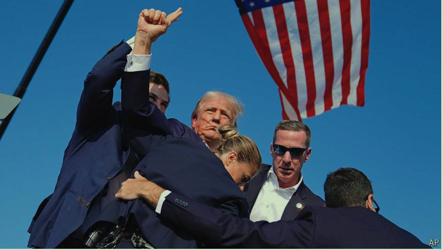

# The world this week: Politics

原文：

The FBI began an investigation into why a 20-year-old man tried to assassinate

**Donald Trump**. Questions were raised about how Thomas Matthew Crooks

was able to get so close to Mr Trump at a campaign rally in rural

Pennsylvania. His volley of shots from a nearby rooftop came close to

killing the Republican, grazing his ear. One man was killed and two

seriously injured. Secret Service snipers shot Crooks dead. The motive for

the assassination attempt was not immediately clear. Crooks was a gun

enthusiast and described as a quiet loner, but with no mental-health issues.

Mr Trump left the stage exhorting his supporters to “Fight! Fight! Fight!”

美国联邦调查局开始调查一名20岁男子试图暗杀唐纳德·特朗普的原因。有人质疑托马斯·马修·克鲁克斯(Thomas Matthew Crooks)是如何在宾夕法尼亚州农村的一场竞选集会上与特朗普如此接近的。他从附近屋顶射出的子弹差点杀死这位共和党人，擦伤了他的耳朵。一人死亡，两人重伤。特勤局狙击手击毙了克鲁克斯。暗杀企图的动机还不清楚。克鲁克斯是一个枪支爱好者，被描述为一个安静的孤独者，但没有心理健康问题。特朗普离开舞台，鼓励他的支持者“战斗！战斗！打！”

学习：
rally：美 [ˈræli] 群众集会；群众大会；汽车拉力赛；政治集会；

campaign rally：竞选集会

volley：美 [ˈvɑːli] 连续射击；齐投；群射；

grazing：轻擦；掠过；（graze的现在分词）

sniper：美 [ˈsnaɪpər]  狙击兵；狙击手

Secret Service：谍报部门；特工处；特勤局

motive：动机；目的；原因；动因；

loner：不合群的人；独自行动的人；喜欢独处的人；独来独往的人

exhorting：美 [ɛgˈzɔrtɪŋ] 劝诫；忠告；劝告；（exhort的现在分词）

## “A working-class boy”

原文：

Two days after the shooting Mr Trump, his ear bandaged, attended the

Republican convention in Milwaukee and chose **J.D. Vance** as his running-mate. 

Mr Vance, a senator from Ohio for just 18 months, is best known for

his “Hillbilly Elegy”, a memoir of growing up poor surrounded by drug

addicted relations. If Mr Trump wins in November Mr Vance, as vice

president, will have the deciding vote if the Senate is tied. He is notably a

firm opponent of aid to Ukraine.

枪击事件发生两天后，耳朵缠着绷带的特朗普参加了在密尔沃基举行的共和党大会，并选择J.D .万斯作为他的竞选伙伴。万斯先生是俄亥俄州的参议员，任期仅18个月，他最著名的作品是《乡下人的悲歌》,这是一本讲述他在贫困中成长，周围都是吸毒成瘾的亲戚的回忆录。如果特朗普在11月获胜，那么在参议院票数相等的情况下，万斯作为副总统将拥有决定性的一票。值得注意的是，他坚决反对援助乌克兰。

学习：

Hillbilly：美 [ˈhɪlˌbɪli] 乡下人；山区居民；乡村音乐爱好者；（贬义）乡巴佬

elegy：美 [ˈelədʒi] 挽歌；悲歌；哀歌

memoir：美 [ˈmemwɑːr] 回忆录；自传；传记 **注意发音**

原文：

Ron DeSantis and Nikki Haley, who opposed Mr Trump in the primaries,

fully endorsed him for president. And for the first time a president of the

Teamsters union addressed a **Republican convention**, giving a speech that

criticised big business (the Teamsters have not yet endorsed a candidate).

Republicans are reaching out to unions with their populist anti-globalist

messaging.

在初选中反对川普的罗恩·德桑蒂斯和妮基·黑利全力支持川普竞选总统。卡车司机工会主席第一次在共和党大会上发表演讲，批评大企业(卡车司机工会还没有支持候选人)。共和党人正在向工会传达民粹主义的反全球主义信息。

学习：

endorse：赞同；支持

teamster：美 [ˈtimstər]  卡车司机；

原文：

The judge overseeing legal proceedings against Mr Trump over his misuse

of **classified documents** dismissed the case, finding that the appointment of

the special counsel who laid the charges was unconstitutional. The ruling

could upend the Justice Department’s ability to appoint special prosecutors

to investigate specific acts of misconduct.

负责监督针对特朗普滥用机密文件的法律诉讼的法官驳回了此案，认为任命提出指控的特别律师违宪。这一裁决可能会颠覆司法部任命特别检察官调查具体不当行为的能力。

学习：

legal proceedings：法律诉讼；法律程序；诉讼程序      

classified：（信息或文件）机密的；保密的

classified documents：机密文件

dismiss the case：驳回此案

counsel： 美 [ˈkaʊnsl] 法律顾问；辩护律师；

laid the charges：提出指控

unconstitutional：违反宪法的；不合宪法的；违宪的；

upend：使颠倒；倒放；倒立；

Justice Department：司法部

prosecutor：公诉人；起诉人；检察官；

原文：

Adam Schiff, a prominent Democratic congressman, called on **Joe Biden** to

withdraw from the presidential race. Democratic apparatchiks want to make

Mr Biden’s nomination official before the party’s convention, even though

two-thirds of Democrats want him to stand aside. Mr Biden, meanwhile,

caught covid again and is self-isolating.    

著名的民主党国会议员亚当·希夫呼吁乔·拜登退出总统竞选。尽管三分之二的民主党人希望拜登退出，但民主党官员希望在党内大会之前正式宣布拜登的提名。与此同时，拜登先生再次感染了冠状病毒肺炎，并自我隔离。

学习：

apparatchik：英 [ˌapəˈratʃɪk]  官员

stand aside：退出

nomination：提名

prominent：著名的，优秀的；杰出的

原文：

A jury in New York found **Bob Menendez**, a senator from New Jersey,

guilty of accepting bribes in return for supporting military aid to Egypt,

among other things. Mr Menendez, a Democrat who is running as an

independent in November’s election, said he would appeal against the

verdict.

纽约州的一个陪审团发现来自新泽西的参议员鲍勃·梅嫩德斯犯有接受贿赂以换取对埃及的军事援助等罪行。梅嫩德斯是一名民主党人，将作为独立候选人参加11月的选举，他表示将对判决提起上诉。

学习：

bribes：美 [b'raɪbz] 贿赂；（bribe的复数）

accept bribes：接受贿赂

verdict：美 [ˈvɜːrdɪkt] 裁决；判决； **注意发音**

原文：

**Israel** bombed a compound targeting Muhammad Deif, the commander of

Hamas’s military forces in **Gaza** and mastermind behind the attack on Israel

on October 7th. Israel said the strike killed Raafa Salamah, a Hamas

commander, but it was not clear whether Mr Deif was also killed. According

to the Hamas-controlled health authority, around 90 people died in the

attack.

以色列轰炸了一个以穆罕默德·德伊夫为目标的建筑，穆罕默德·德伊夫是哈马斯在加沙的军事指挥官，也是10月7日袭击以色列事件的幕后策划者。以色列称袭击杀死了哈马斯指挥官Raafa Salamah，但是不清楚Deif先生是否也被杀死。据哈马斯控制的卫生当局称，大约90人在袭击中死亡。

学习：

compound：封闭区域；院落；综合设施；建筑物

mastermind：策划者；主谋；策略家；创意者；幕后操纵者；

原文：

Louisa Hanoune, an opposition leader in **Algeria**, dropped out of the

presidential race citing “unfair conditions” in an election scheduled for

September. She had been running against Abdelmadjid Tebboune, the

incumbent, who is favoured to win.

阿尔及利亚反对党领袖路易莎·哈努恩(Louisa Hanoune)宣布退出总统竞选，理由是定于9月举行的选举存在“不公平条件”。她一直在与现任总统阿卜杜勒·马吉德·特本竞选，后者更有可能获胜。

学习：
favoured：受偏爱的；受优待的；受宠爱的；受青睐的；被看好的；

原文：

**Rwanda’s** president, Paul Kagame, won 99% of the vote in an election after

several of his opponents were barred from the race. The 66-year-old has held

power since the end of the Rwandan genocide in 1994.

卢旺达总统保罗·卡加梅在一次选举中赢得了99%的选票，此前他的几名对手被禁止参选。这位66岁的老人自1994年卢旺达大屠杀结束以来一直掌权。

学习：

hold power：掌权

genocide：美 [ˈdʒenəsaɪd] 种族灭绝；大屠杀

原文：

Gabriel Attal formally resigned as prime minister of **France**, as did his

entire cabinet, following gains by the hard left and right in the recent

parliamentary election. Mr Attal and his ministers are staying on in a

caretaker role until a new government is formed. With parliament hung, the

parties are bickering over who should get his job.

加布里埃尔·阿塔尔正式辞去法国总理职务，他的整个内阁也是如此，此前左翼和右翼在最近的议会选举中获胜。阿塔尔和他的部长们将继续担任管理角色，直到新政府成立。由于议会悬而未决，两党正在为谁应该得到他的职位而争吵。

学习：

resign：辞职

prime minister：总理

caretaker：（尤指学校等建筑物的）管理员；管理人；

bickering：争吵；斗嘴；（bicker的现在分词形式）

原文：

**Britain’s** new Labour government laid out 40 bills for its first parliamentary

session. The ambitious agenda includes streamlining the planning process

for housebuilding, boosting renters’ rights, creating a state-owned green

energy company, re-nationalising the railways and new workers’ safeguards.

Labour also announced an early-release scheme for prisoners to ease prison

overcrowding.

英国新工党政府为首次议会会议提出了40项议案。这个雄心勃勃的议程包括简化住房建设的规划过程，提高租房者的权利，创建一家国有绿色能源公司，重新国有化铁路和新工人的保障措施。工党还宣布了一项囚犯提前释放计划，以缓解监狱过度拥挤的状况。

学习：

laid out：安排；规划；陈列；（lay out的过去式和过去分词）

laid out 40 bills：提出40项议案

streamline：简化

safeguards：保护措施；保卫；安全设施；（safeguard的复数）

## **No welcome in the valleys**

原文：

Labour’s Vaughan Gething quit as first minister of **Wales** four months into

the job. His leadership came under strain over a campaign donation from a

company run by someone convicted for environmental offences, and other

issues. Mr Gething had refused to resign after losing a vote of confidence.

The final straw came when several ministers in the Welsh cabinet resigned.

工党的沃恩·格辛在担任威尔士首席大臣四个月后辞职。他的领导能力因一家公司的竞选捐款而受到压力，这家公司由一个因环境犯罪和其他问题被定罪的人经营。失去信任投票后，格辛先生拒绝辞职。当威尔士内阁的几名部长辞职时，最后一根稻草就来了。

学习：

strain：应力；张力；拉力；压力；负担；

offences：美 [ə'fensɪz] 犯罪；违法行为；（offence的复数）

Welsh: 威尔士的；威尔士人的；

原文:

It emerged that a **North Korean** diplomat defected to South Korea last

November, an embarrassment for Kim Jong Un, North Korea’s dictator. The

high-ranking official was based in Cuba.

去年11月，一名朝鲜外交官叛逃至韩国，这让朝鲜独裁者金正恩十分尴尬。这位高级官员常驻古巴。

学习：

defected：美 [dɪ'fektid] 背叛；叛变；（defect的过去式）

high-ranking：显要的；职位高的；高级的

原文：

Six people were killed in **Bangladesh** amid protests against quotas for

government jobs. Around a third of the jobs are reserved for the families of

Bangladeshi veterans who fought for independence, which critics say is

discriminatory. Schools and universities across the country were closed until

further notice.

在反对政府工作配额的抗议活动中，孟加拉国有六人丧生。大约三分之一的工作留给了为独立而战的孟加拉退伍军人的家庭，批评者称这是歧视性的。全国的学校和大学都关闭了，直到另行通知。

学习：

Bangladesh：美 [ˌbɑːŋɡləˈdeʃ] 孟加拉国；

quotas：美 [ˈkwoʊtəz] 配额；定额；限额；（quota的复数）

discriminatory: 美 [dɪˈskrɪmɪnətɔːri] 歧视性的；区别对待的；不公平的；不公正的；

原文：

The **Pakistani** government said it wanted to ban the political party of Imran

Khan, the country’s former prime minister, who was imprisoned a year ago.

The attempt to outlaw Pakistan Tehreek-e-Insaf comes after the Supreme

Court ruled that it was eligible for 23 extra reserved seats in Parliament. Mr

Khan’s aide said the ban was “a sign of panic”. Separately 28 people were

killed by militants in two attacks on an army base and a health centre.

巴基斯坦政府表示，希望取缔一年前入狱的该国前总理伊姆兰·汗的政党。试图取缔巴基斯坦正义运动党是在最高法院裁定其有资格获得议会中额外的23个保留席位之后。汗先生的助手说禁令是“恐慌的标志”。另外，武装分子在对一个军事基地和一个医疗中心的两次袭击中杀死了28人。

学习：

Pakistani：美 [ˌpækɪˈstæni] 巴基斯坦的

aide： 美 [eɪd] 助理；（尤指从政者的）助手

militant：武装分子

原文：

The Central Committee of the **Chinese Communist Party** held a long

delayed four-day meeting in Beijing. A communiqué said the meeting

decided to “place reform in a more prominent position.” It accepted the

resignation from the Central Committee of Qin Gang, a former foreign

minister who disappeared from public view a year ago.

学习：

communique：美 [kəˌmjunəˈkeɪ] 公报

原文：

The Chinese and Russian navies held joint manoeuvres off **China’s**

**southern coast**. The drills, including air- defence and anti-submarine

exercises, followed a joint patrol by the two navies in the north Pacific.

中国和俄罗斯海军在中国南部海岸举行了联合演习。包括防空和反潜演习在内的演习是在两国海军在北太平洋进行联合巡逻后进行的。

学习：

manoeuvre：英 [məˈnuːvə]  军事演习；战术演练 **注意发音**

drills：操练；（drill的复数）

patrol：美 [pəˈtroʊl] 巡逻；巡查；侦察

原文：

In **Venezuela** 77 opposition activists have been arrested since the start of

official campaigning for the presidential election on July 28th according to

Foro Penal, an NGO. Polls show that the opposition candidate, Edmundo

González, would easily defeat Nicolás Maduro, the authoritarian incumbent,

in a fair vote. The detainees include the security chief of María Corina

Machado, the opposition’s leader.

据非政府组织Foro Penal称，自7月28日总统选举正式竞选活动开始以来，委内瑞拉已有77名反对派活动人士被捕。民调显示，反对党候选人埃德蒙多·冈萨雷斯将在公平投票中轻松击败现任独裁总统尼古拉斯·马杜罗。被拘留者包括反对派领导人玛丽亚·科瑞娜·马查多的安全主管。

学习：

Venezuela：美 [ˌvenɪˈzweɪlə] 委内瑞拉（南美洲北部国家）

detainee： 被拘留者；被扣押者

原文：

A court in **Ecuador** sentenced two of the organisers of the murder last year

of Fernando Villavicencio, a presidential candidate, to long jail terms. One

was a leader of Los Lobos, a criminal gang. But Mr Villavicencio’s family

believes others, including politicians, may have been involved.

厄瓜多尔一家法院判处去年总统候选人费尔南多·维拉维森西奥谋杀案的两名组织者长期监禁。一个是 Los Lobos犯罪团伙的头目。但是Villavicencio先生的家人认为包括政客在内的其他人可能参与了此事。

学习：

Ecuador：美 [ˈɛkwəˌdɔr] 厄瓜多尔

criminal gang：犯罪集团          

原文：

Argentina won the Copa America with a 1-0 victory against Colombia. The

match was held in Miami and delayed for 82 minutes because of chaotic

disorder in admitting **football** fans to the stadium. America will be a joint

host of the World Cup in 2026. In Berlin Spain won the European

championship, beating England 2-1.

阿根廷以1比0战胜哥伦比亚赢得了美洲杯。这场比赛在迈阿密举行，由于球迷入场混乱，比赛推迟了82分钟。美洲将联合主办2026年世界杯。在柏林，西班牙以2比1击败英格兰，赢得了欧洲冠军。

学习：

Copa America: 美洲杯

## 后记

2024年7月20日18点05分于上海。