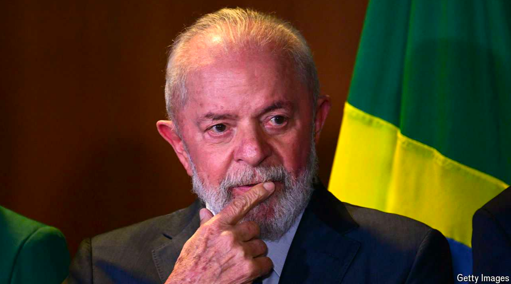

# To halt Brazil’s decline, Lula needs to cut runaway public spending

Investors have started to worry

要阻止巴西的衰退，卢拉需要削减失控的公共支出。

Runaway: 失控的；出走的；逃跑的；迅速的；难以控制的；一发不可收拾的

原文：

When in 2022 Luiz Inácio Lula da Silva narrowly defeated Jair Bolsonaro in

Brazil’s presidential election, democrats everywhere were relieved. Mr

Bolsonaro, a hard-right populist, had spread intolerance and guns, and

encouraged the despoliation of the Amazon rainforest. His threat to

democracy was summed up by his failed attempt to persuade the armed

forces to overturn his election defeat. Whatever his faults, Lula is a

democrat. And he has moved quickly to curb deforestation, which is in both

Brazil’s and the world’s interest.

当2022年路易斯·伊纳西奥·卢拉·达席尔瓦在巴西总统选举中险胜雅伊尔·博索纳罗时，各地的民主党人都松了一口气。博尔索纳罗先生，一个极右的民粹主义者，传播了不宽容和枪支，并鼓励掠夺亚马逊雨林。他对民主的威胁被归结为他未能说服军队推翻他的选举失败。不管他有什么缺点，卢拉是一个民主主义者。他迅速采取行动遏制森林砍伐，这既符合巴西的利益，也符合世界的利益。

学习：

narrowly defeat：险胜

despoliation：美 [dɪˌspolɪ'eʃ(ə)n] 抢劫; 掠夺

rainforest：热带雨林

deforestation：森林开伐；采伐森林；滥伐森林

原文：

But in other respects Lula’s third stint as president has disappointed. In the

first, from 2003 to 2007, he stabilised the economy with orthodox policies

and pushed through economic reforms and social programmes that boosted

growth, cut poverty and secured him re-election. Aided by a commodity

boom, his second term saw a public-spending splurge. Some of the money

went on corruptly padded contracts. The boom ended, but the splurge

continued under his chosen successor, Dilma Rousseff, who added wasteful

and ineffective industrial policies. That eventually tipped Brazil into its

deepest recession since 1930, while activist judges sent scores of politicians,

including Lula himself, to jail for corruption.

但是在其他方面，卢拉的第三次总统任期令人失望。在第一阶段，从2003年到2007年，他用正统的政策稳定了经济，推行了经济改革和社会计划，促进了增长，减少了贫困，并确保了他的连任。在商品繁荣的帮助下，他的第二个任期见证了公共支出的挥霍。一些钱花在了不正当的合同上。繁荣结束了，但在他选择的继任者迪尔玛·罗塞夫的领导下，挥霍仍在继续，罗塞夫增加了浪费和无效的工业政策。这最终使巴西陷入了自1930年以来最严重的衰退，而激进的法官因腐败将包括卢拉本人在内的数十名政客送进了监狱。

学习：
stint：从事某项工作的时间；定量的工作

orthodox：美 [ˈɔːrθədɑːks] 正宗的；标准的；规范的

push through economic reforms：推行经济改革

cut poverty：削减贫困

splurge：挥霍

corruptly：腐败地；堕落地；可被收买的

padded：有装填垫料的；有填充物的

corruptly padded：很腐败的

scores of：许多

tip：导致

>在这段话中，"tip" 的意思是 “使倾斜” 或 “导致某事突然发生变化”。在这个语境中，它表示某种负面变化的触发点或原因。
>
>例子：
>1. **Literal usage**: "The strong wind tipped the boat over."（大风使船倾覆了。）
>2. **Figurative usage**: "The scandal tipped the company into bankruptcy."（丑闻导致公司破产。）
>
>在这段话中，"tip" 意思是这些浪费和无效的工业政策最终导致巴西陷入了自1930年以来最严重的经济衰退。因此，这里的 "tip" 表示“导致”或“引发”负面结果。

原文：

Times are now tougher, but his third term is shaping up to be more like the

spendthrift second than the first. As Talleyrand reputedly said of the

Bourbons, Lula appears to have learnt nothing and forgotten nothing. His

graft conviction was overturned, but prison seems to have made him

mistrustful. Although he owed his victory to the support of liberal centrists,

he has found little space for them in his government.

现在时局更加艰难，但他的第三个任期比第一个更像是挥霍无度的第二个任期。据说塔列朗这样评价波旁家族，卢拉似乎什么也没学到，什么也没忘记。他的贪污罪被推翻了，但是监狱似乎让他变得不值得信任。尽管他的胜利归功于自由中间派的支持，但他在政府中几乎没有为他们找到空间。

学习：

spendthrift：挥霍者；浪费者

reputedly：据说；一般认为；根据风评

graft：贪污；腐败行为

mistrustful：不可信的，不值得信任的

原文：

The Brazil he inherited had lost its way. Annual economic growth in the ten

years to 2022 averaged just 0.5%, though it has picked up a little since the

pandemic. The problem is that Lula is spending as if the country were far

richer than it is. Outlays so far this year have risen by a whopping 13%

above inflation compared with the same period last year, and the overall

fiscal deficit is 9% of  GDP. Spending by government, at all levels, is heading

for almost 50% of GDP and public debt for 85%. Faced with an expansionary

fiscal policy, to curb inflation the central bank has resorted to the monetary

policy of a boa constrictor. This combination is familiar in Brazil, where

consistently expensive credit holds back growth.

他继承的巴西已经迷失了方向。截至2022年的十年间，年均经济增长率仅为0.5%，尽管自疫情以来略有回升。问题是，卢拉花钱的时候好像这个国家比实际上富裕得多。与去年同期相比，今年到目前为止的支出比通货膨胀率高出13%,总体财政赤字占GDP的9%。各级政府的支出接近GDP的50%,公共债务接近85%。面对扩张性的财政政策，为了抑制通货膨胀，中央银行采取了大蟒蛇的货币政策。这种组合在巴西很常见，持续昂贵的信贷抑制了增长。

学习：
outlays：花费；费用；（outlay的复数）

whopping：巨大的；很大的；庞大的

curb inflation：抑制通胀

boa：美 [ˈboʊə] 羽毛围巾；

constrictor：美 [kənˈstrɪktər] 大蟒；蟒蛇；

resort：诉诸；常去；求助；（resort的过去式）

boa constrictor: 紧缩的（货币政策）

>在这段话中，"boa constrictor" 是一种比喻，指代一种紧缩的货币政策。Boa constrictor 是蟒蛇的一种，通常通过缠绕和紧缩来制服和杀死猎物。在这里，这个比喻用来形容巴西中央银行为了抑制通货膨胀而采用的严格货币政策，就像蟒蛇一样紧缩和压制经济活动。
>
>具体来说，面对扩张性的财政政策，中央银行采取了严格的货币政策，以控制通货膨胀。这种政策组合在巴西很常见，因为持续高昂的信贷成本会抑制经济增长。因此，"boa constrictor" 形象地描述了货币政策对经济的紧缩效应。

原文：

This is not all Lula’s fault. Brazil’s voracious Congress grabbed more

budgetary power under Mr Bolsonaro, who also offered pre-election

giveaways which have been hard to scrap. Lula’s allies have less weight in

Congress than in the past, obliging him to buy the support of others. Much

of the spending involves freebies for special interests. But Lula could stop

some of it, by sticking strictly to the fiscal framework his government drew

up to replace a rigid spending cap which broke down under Mr Bolsonaro.

Instead he has sniped at the central bank, confusing the symptom of high

interest rates with their underlying cause: fiscal incontinence.

这并不全是卢拉的错。巴西贪婪的国会在博尔索纳罗（前总统）任期内夺取了更多的预算权力，他还在选前提供了一些难以取消的福利。卢拉的盟友在国会中的影响力不如以往，迫使他必须通过买通其他人的支持来执政。大部分支出都涉及为特殊利益提供的免费福利。但卢拉本可以通过严格遵守他的政府制定的财政框架来停止其中的一部分，该框架取代了在博尔索纳罗任期内失效的严格支出上限。然而，他却对央行冷嘲热讽，混淆了高利率的症状和其根本原因：财政放纵。

学习：
voracious：美 [vəˈreɪʃəs] 贪婪的；贪吃的；饕餮的；贪食的；

scrap：废弃；抛弃；取消；丢弃

giveaway：赠品；赠与物；

freebies：免费的东西；赠品；（freebie的复数）

>"Giveaways" 指的是政府为了赢得选票而在选举前提供的各种福利或礼物。在这个上下文中，指博尔索纳罗为了争取选票而提供的福利，之后很难取消。
>
>"Freebies" 是指免费的东西或福利，在这里指的是政府为特定利益群体提供的免费福利或好处。

snipe at：抨击

incontinence：失禁；无节制；不能自制

## **Cut budgets, not trees**

原文：

Investors have noticed. Brazil’s currency, the real, lost 17% of its value

against the dollar over the 12 months to mid-June, the worst performance of

any major currency. That seems to have jogged Lula. This month he gave

more wholehearted support to Fernando Haddad, his finance minister, whose

strenuous efforts to restrain spending have faced political resistance.

投资者已经注意到了。在截至6月中旬的12个月中，巴西货币雷亚尔对美元贬值17%，是主要货币中表现最差的。这似乎提醒了卢拉。本月，他给予了财政部长费尔南多·哈达德更全心全意的支持，哈达德限制支出的努力曾面临着政治阻力。

学习：
strenuous：美 [ˈstrenjuəs] 艰苦的；努力的；辛勤的；

jog：提醒

>
>在这里，"jog" 的意思是提醒或唤醒，使卢拉意识到问题的严重性。这个词在此处用来描述卢拉在看到巴西货币贬值后，开始更加全力支持财政部长费尔南多·阿达德的努力。
>
>例如：
>- The sudden drop in stock prices jogged the investors into realizing the potential risks in the market.
>（股价的突然下跌提醒了投资者，让他们意识到市场中的潜在风险。）
>
>这个例子中的“jog”也是用来表示某个事件使人们意识到某个重要问题或情况。

原文：

Lula will turn 80 at the next election. He should look to the future, promote

younger successors and battle for the state reform that Brazil needs, to make

fiscal space for genuinely progressive policies. Instead, he seems bent on

repeating the past formula of taxing and spending his way to yet another

term. There is little immediate risk of a currency crisis. Rather, the problem

is that Lula is following a path of managed decline. ■

下次选举时，卢拉将年满80岁。他应该放眼未来，提拔更年轻的继任者，为巴西需要的国家改革而奋斗，为真正进步的政策创造财政空间。相反，他似乎一心想重复过去的征税和支出的公式，直到下一个任期。几乎没有货币危机的直接风险。相反，问题在于卢拉正在走一条有管理的衰落之路。■

学习：

bent on：决心做；一心想要；执意；专心于；

>“Managed decline”（有管理的衰退）指的是在面对不可避免的衰退或下降时，通过有计划和有控制的方式来管理这种衰退过程，尽量减小其负面影响，而不是试图逆转这种趋势。在文中，这意味着卢拉通过其政策选择，可能会使巴西逐渐走向衰退，但这种衰退是通过有意识的管理和控制来进行的。

## 后记

2024年7月23日于上海。

