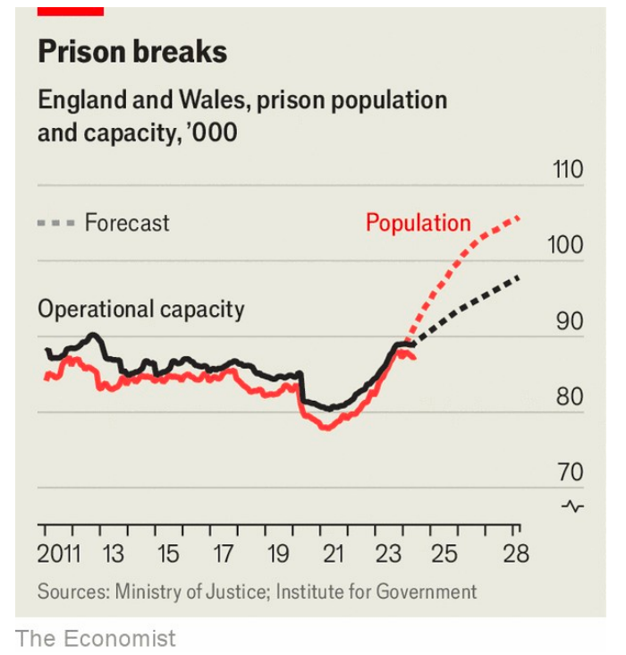

# How Labour should reform Britain’s overstuffed prisons

With no room for new prisoners, something has to change

原文：

BRITISH PRISONS are bursting. The new Labour government has been

told that space is so scarce that prisons could start turning away new inmates

within weeks; to free up cells, some offenders will be released after serving

40% of their sentence, rather than 50% as normal. Some of the blame for

this crunch lies with the previous government: the Tories ducked taking

more emergency measures to alleviate overcrowding. But the trouble in

Britain’s prisons dates back decades, bears the fingerprints of both main

parties and reflects the fraught politics of law and order.

英国监狱人满为患。新的工党政府被告知，空间是如此的稀缺，以至于监狱可能会在几周内开始拒绝接收新的囚犯；为了腾出牢房，一些罪犯将在服刑40%后被释放，而不是正常情况下的50%。这次危机的部分责任在于前任政府:保守党回避采取更多的紧急措施来缓解过度拥挤。但是英国监狱的问题可以追溯到几十年前，带有两个主要政党的印记，反映了令人担忧的法律和秩序政治。

学习：

bursting：爆炸；爆发；爆满；（burst的现在分词）

>这里的 "burst" 是指“爆满，溢出”，表示英国监狱已经满员，无法再容纳更多的囚犯。这个词用来形容监狱的极度拥挤和超负荷状态。
>
>例子：The concert venue was bursting with fans, leaving no room for anyone else.
>（音乐会场地已经挤满了粉丝，完全没有空位了。）
>
>在上述句子中，“British prisons are bursting” 意思是“英国监狱已经满员，超出了容量，无法再接纳新的囚犯”。

turn away：拒绝接纳；拒绝进入

>的“turn away”意思是“拒绝接纳，拒绝进入”。在这个上下文中，指的是监狱因为空间不足而拒绝接收新的囚犯。
>
>例子：The restaurant was so busy that they had to turn away customers without reservations.
>（这家餐厅非常忙碌，不得不拒绝没有预订的顾客。）
>
>在上述句子中，“space is so scarce that prisons could start turning away new inmates within weeks” 的意思是“空间如此紧张，以至于监狱可能在几周内开始拒绝接收新的囚犯”。

inmate：美 [ˈɪnˌmeɪt] 囚犯；（监狱或精神病院等处）同住者；住院者；

offender：罪犯；冒犯者；

crunch：危机；经济紧缩；资源短缺；短缺；

ducked：躲避；潜入；回避；（duck的过去式和过去分词）

fingerprint：指纹；指印；（fingerprint的复数）

fraught：充满紧张的；充满风险的；

原文：

Since the 1990s both the Conservatives and Labour have vied to take ever

tougher stances on crime. The range of crimes that result in prison time has

widened; sentences have lengthened. Britain is not as obsessed with

incarceration as America. But its prison population is easily the largest in

western Europe; it locks up roughly twice as many people per head as the

Netherlands and Germany. If “prison works”, in the influential phrase of

Michael Howard, a former home secretary, Britain should be basking in the

benefits. It is true that crime has fallen since the 1990s but that has happened

in nearly all rich countries. Governments are loth to spend scarce money on

making prisons less wretched. Britain’s reoffending rate is among the

highest in the rich world.

自20世纪90年代以来，保守党和工党都竞相对犯罪采取更加强硬的立场。导致监禁的犯罪范围扩大了；刑期变长了。英国不像美国那样痴迷于监禁。但是它的监狱人口无疑是西欧最多的；它关押的人均人数大约是荷兰和德国的两倍。如果用前内政大臣迈克尔·霍华德颇具影响力的话来说，“监狱有用”，英国应该享受其中的好处。的确，自上世纪90年代以来，犯罪率有所下降，但这种情况几乎发生在所有富裕国家。政府不愿意把稀缺的钱花在改善监狱条件上。英国的重新犯罪率是富裕国家中最高的。

学习：

vied：美 [vaɪd] 竞争；（vie的过去式和过去分词）**注意发音**

prison time：服刑时间；关押时间；监禁时间

incarceration：美 [ɪnˌkɑsə'reɪʃn] 监禁；下狱；

home secretary：内政大臣

bask in：沉浸在

>这里的“bask in”意思是“沉浸在，享受”，通常用来形容某人或某事物享受某种正面的情感或好处。
>
>例子：After winning the championship, the team basked in the glory of their victory.
>（赢得冠军后，球队沉浸在胜利的荣耀中。）
>
>在上述句子中，“Britain should be basking in the benefits” 的意思是“英国应该在享受这些好处”。

loth：不愿意的；不乐意的；

wretched：恶劣的；质量低劣的；极差的；

reoffending：重新犯罪

原文：

The new government has signalled a willingness to think differently. On his

second day as prime minister Sir Keir Starmer said that Britain has “too

many” prisoners. He has put James Timpson, the boss of a key-cutting

business and a longtime champion of rehabilitation, in charge of prisons.

The problem for reform-minded politicians is that there are very few votes in

being soft on crime. It will be hard to win public support for a change of

course, particularly if someone who might otherwise have been jailed does

something atrocious. But Labour has a huge mandate and lots of political

cover.

新政府已经表示愿意以不同的方式思考。在他担任首相的第二天，凯尔·斯塔莫爵士说英国有“太多”的囚犯。他让一家配钥匙的公司的老板，也是改造的长期拥护者詹姆斯·廷普森负责监狱。改革派政客面临的问题是，对犯罪手软的投票很少。改变路线很难赢得公众的支持，尤其是如果一个本来可能会被关进监狱的人做出了令人发指的事情。但是工党有巨大的授权和大量的政治掩护。

学习：

signalled：表示；标志；

signal a willingness：标示出xxx的意愿

rehabilitation：美 [ˌrihəˌbɪlɪˈteʃən] 复原；修复

reform-minded：改革派；具有改革思想的；

atrocious：美 [əˈtroʊʃəs] 极坏的；残忍的；凶恶的；残暴的；

Key-cutting: 配钥匙的

>“Key-cutting business” 是指一家专门制作和复制钥匙的公司。在这种业务中，顾客可以让店员根据他们提供的原始钥匙复制一把新的钥匙。James Timpson 是 Timpson 公司的老板，这家公司不仅从事钥匙制作，还涉及其他修理和维护服务，如鞋修理、手机修理等。

mandate：授权；

>“But Labour has a huge mandate and lots of political cover” 这句话意思是说工党在当前政治环境中具有很大的授权和很多政治掩护。
>
>- “Huge mandate” 指的是工党在选举中获得了大多数选民的支持，拥有显著的政治授权和权力来推行其政策。
>- “Lots of political cover” 意思是工党有很多政治支持和保护，意味着即使他们推行了一些不受欢迎的政策，他们也不会受到太多政治压力或反对。
>
>整体意思是工党在推行改革时具备了很强的政治基础和支持，使得他们可以在一定程度上抵御可能的反对声音。

原文：

It should use them to do three things. First, it should end the use of short

sentences of under 12 months for minor, non-violent offences like

shoplifting. Many studies show they just turn troublemakers into career

criminals. The public is more supportive of the idea of dealing with these

people outside prison. Reduced churn among prisoners would enable

governors to focus on those with ingrained problems.

它应该用它们做三件事。首先，它应该停止对像入店行窃这样的轻微非暴力犯罪使用12个月以下的短期徒刑。许多研究表明，他们只是把麻烦制造者变成职业罪犯。公众更支持在监狱外处理这些人的想法。减少囚犯之间的变动将使管理者能够关注那些有根深蒂固问题的人。

学习：

shoplifting：在商店行窃；零售店偷窃；

career criminals：职业罪犯

ingrained：根深蒂固的；日久难改的；

churn: 频繁流动

>
>
>“Churn” 在这里指的是频繁更替或流动，特别是在监狱环境中频繁进出的人。这种情况会导致管理和矫正工作的难度增加，因为监狱的资源和注意力会被不断进出的短期犯人消耗掉，难以专注于长期改造更有需要的犯人。
>
>举个例子：
>
>在一家公司的客户服务部门，“churn” 可以指客户流失率，即客户不断离开和新客户不断加入的过程。高客户流失率会使公司很难建立和维持长期的客户关系，从而影响业务稳定性和增长。
>
>在监狱中，频繁的“churn” 使得监狱管理者需要不断处理新进来的短期犯人，而这些犯人往往因为短暂的刑期不会得到有效的改造或康复机会，进而可能再次犯罪。这种高流动性使得监狱难以专注于那些需要长期改造的犯人，从而影响整个监狱系统的有效性。

原文：

Second, the government should undertake wider sentencing reform. In the

past decade the average sentence has increased by 25%. That has a ratchet

effect on the prison population; longer stretches help to explain the current

squeeze on space. Those who are a threat to the public should be locked up.

But countries like the Netherlands have successfully reduced their prison

population by letting less dangerous offenders, such as those on drug or

burglary charges, serve more of their sentence in the community

其次，政府应该进行更广泛的量刑改革。在过去的十年里，平均刑期增加了25%。这对监狱人口产生了棘轮效应；更长的延伸有助于解释目前空间的紧缩。那些对公众构成威胁的人应该被关起来。但是像荷兰这样的国家已经成功地减少了监狱人口，让危险性较小的罪犯，比如那些被指控贩毒或入室盗窃的罪犯，在社区服更多的刑期

学习：

ratchet：美 [ˈrætʃət] 棘轮；棘齿

burglary：入室盗窃罪；非法闯入；

ratchet effect：棘轮效应

>
>“Ratchet effect” 在这里指的是一种单向变化的过程，一旦发生改变，就很难或无法回到原来的状态。在这种情况下，平均刑期增加导致监狱人口持续增长，而这种增长一旦发生，就很难逆转。这种效应使得监狱系统变得更加紧张，因为更长的刑期意味着更多的犯人长期占据监狱空间，导致监狱拥挤。

原文：

Third, the government needs to tackle problems elsewhere in the system to

reassure the public that they will be kept safe. Criminals are deterred less by

longer sentences than by the threat of being caught. Yet the charge rate for

all crimes has fallen from 17% to 6% in the past decade. The probation

service is understaffed and overcentralised: it needs an overhaul if more

convicts are out of jail. None of this is easy, politically or administratively.

But the 30-year consensus on prisons has failed. Labour should seize the

opportunity to rethink it. ■

第三，政府需要解决系统中其他地方的问题，以确保公众的安全。犯罪分子相对于更长的刑期，更害怕的是被抓住的威胁。然而，在过去十年里，所有犯罪的起诉率从17%下降到6%。缓刑服务人员不足且过于集中管理：如果更多的罪犯被放出监狱，缓刑服务需要进行全面改革。这在政治上和管理上都不容易。但30年来关于监狱的共识已经失败。工党应该抓住机会重新思考这一问题。

学习：
probation：[法律]缓期执行；缓刑；

charge rate：起诉率

## 后记

2024年7月24日晚于上海。

