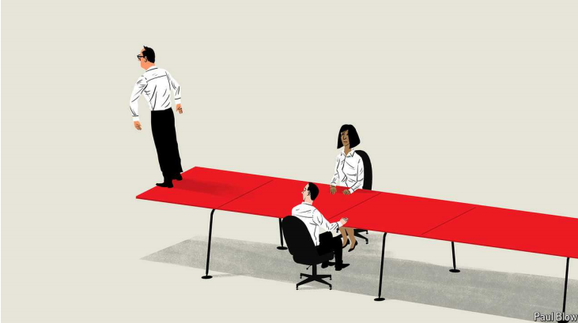

# How a CEO knows when to quit

Bosses have a shelf life and plenty of incentives to misjudge what it is

shelf life： 保存期限；保存期；有效期；（食品等的）货架期；

原文：

Deciding to CAlL it quits is a relatively simple judgment early on in a

career. If you find the prospect of going to work on Monday morning more

depressing than a Lars von Trier film, it is time to leave. If you have nothing

left to learn in your current organisation, you should probably grab more

stimulating opportunities elsewhere. But knowing when to quit is less easy

when you are in a role that already confers lots of status, novelty and

purpose. And moving on is particularly difficult when it might be the last big

job you have.

在职业生涯的早期，决定辞职是一个相对简单的判断。如果你觉得周一早上去上班的前景比看拉斯·冯·提尔电影还要令人沮丧，那么是时候离开了。如果你在目前的公司已经没有什么可学的了，你可能应该去别的地方找些更刺激的机会。但是，当你担任的角色已经赋予了你很多地位、新奇感和目标时，知道何时放弃就不那么容易了。当这可能是你的最后一份大工作时，继续前进尤其困难。

学习：

call it quits：决定停止某事

>这里的 "call" 是 "call it quits" 的一部分，这个短语的意思是决定停止或结束某事，通常是指辞职或结束某个项目。
>
>例子：
>
>- After years of struggling to make their business profitable, they decided to call it quits and close the company.
>- She knew it was time to call it quits when she found no joy in her work anymore.

原文：

What is true of American presidents is also true of chief executives. Bob

Iger has made not leaving Disney into an art form. The surest way to know

you will not succeed Jamie Dimon at JPMorgan Chase is to be anointed his

successor. Both bosses are stars, and their firms have reasons to hang on to

them. The same cannot be said of Dave Calhoun, Boeing’s CEO, who will lead

the company until the end of the year despite the enormous reputational

damage it has sustained on his watch. (Mr Calhoun was supposed to have

departed years ago; instead the firm raised the mandatory retirement age to

allow him to stay.)

美国总统如此，首席执行官也是如此。鲍勃·伊格尔把“不离开迪士尼”变成了一种艺术形式。要知道你不会接替杰米戴蒙在摩根大通的职位，最可靠的方法就是被指定为他的继任者。两位老板都是明星，他们的公司有理由留住他们。波音公司的首席执行官戴夫·卡尔霍恩就不一样了，他将领导公司直到年底，尽管在他的任期内公司的声誉遭受了巨大的损害。(卡尔霍恩先生几年前就应该离开了；相反，该公司提高了强制退休年龄，以允许他留下来。)

学习：

art form：艺术形式；艺术体裁；

surest： 美 [ˈʃʊrɪst] 最确信的；一定的；（sure的最高级） 

anoint：美 [əˈnɔɪnt] 指定；选定

hang on to：紧紧抓住；紧握不放；紧跟不放

原文：

The incentives for CEOs and other leaders to stick around are material:

assistants, chauffeurs, private jets and all. They are also psychological.

People who reach the top of organisations do not often lack ego; the idea

that someone else can do the job well may be hard to stomach. Michael

Watkins, a professor at IMD Business School in Switzerland, calls this “the

aura of indispensability”. The prospect of retirement can be particularly

gruesome—this week, a farewell trip to Davos; next week, a strategic review

of the spice rack.

首席执行官和其他领导人留下来的动机是物质的:助理、司机、私人飞机等等。他们也是心理上的。到达组织高层的人通常不会缺乏自我；别人能做好这项工作的想法可能很难让人接受。瑞士IMD商学院教授迈克尔·沃特金斯称之为“不可或缺的光环”。退休的前景可能特别可怕——本周，去达沃斯的告别之旅；下周，香料架的战略回顾。

学习：

chauffeur：美 [ʃoʊ'fɜr] 司机；

stomach：欣赏；忍受；容忍；

aura：气质；氛围；气氛；

indispensability：美 [ɪndɪspensə'bɪlətɪ] 不可缺少；必要；责无旁贷

gruesome：美 [ˈɡrusəm] 恐怖的；可怕的；令人厌恶的；

farewell： 美 [ˌferˈwel] 告别；辞别

spice rack：香料架

>这句话中的“a farewell trip to Davos; next week, a strategic review of the spice rack”通过对比两种活动，强调了从高强度、高地位的职业生活到平凡、琐碎的退休生活的巨大落差。
>
>具体解释：
>- **a farewell trip to Davos**：告别达沃斯之旅。达沃斯指的是世界经济论坛年会，通常是全球商界和政界领袖聚集的地方，象征着高层次的职业活动和网络。
>- **a strategic review of the spice rack**：对香料架的战略审查。这里用了一种幽默的夸张手法，表示退休后的生活可能会变得非常琐碎和平凡，比如整理家里的香料架。
>
>**spice rack**是厨房里用来存放各种香料的小架子，在这里象征着日常生活中的小事。
>
>整句话的意思是：这周是去达沃斯的告别之旅，下周就是对香料架的战略审查。它反映了领导者从繁忙的职业生涯到无所事事的退休生活的巨大转变，强调了他们可能会感到无聊和失落。

原文：

There is some research that can help bosses think about how long to stay in a

role. A study by Francois Brochet of Boston University and his co-authors

looked at the relationship between CEO tenure and firm value to see if they

could identify an optimal period in charge. They found that firm value

started to decline, on average, after a CEO had been in the job for 14 years.

That is not particularly helpful. There are too many differences between

executives, firms and industries for one number to be a useful guide. Many

chief executives get booted out an awful lot quicker than that; some bosses

will warrant more time in the job, not less.

有一些研究可以帮助老板们思考在一个职位上呆多久。波士顿大学的Francois Brochet和他的合著者进行了一项研究，研究CEO任期和公司价值之间的关系，看他们是否能确定一个最佳的掌管时期。他们发现，平均而言，在首席执行官任职14年后，公司价值开始下降。这不是特别有帮助。高管、公司和行业之间存在太多差异，一个数字不可能成为有用的指南。许多首席执行官被赶下台的速度比这快得多；一些老板会保证更多的工作时间，而不是更少。

学习：

tenure：美 [ˈtenjər] 任期；任职期间；（尤指大学教师的）终身职位

get booted out：被赶下台；被踢出去

an awful lot：很多；非常多          

warrant：正式确认；证明…正当；使有必要; 值得

>这里的“warrant”意思是“值得”或“应得”。它表示某事物有足够的理由或正当性。
>
>在这句话中的意思是“有些老板值得在工作岗位上待更长时间，而不是更短”。也就是说，有些CEO的表现非常出色，因此他们应该继续留在职位上，而不是因为一般的统计数据而过早离开。
>
>举个例子：
>- **The evidence was strong enough to warrant a new investigation.**
>  - 证据足够有力，值得进行新的调查。
>
>在这个例子中，“warrant”表示证据充足，足以正当化进行新的调查。

原文：

More usefully, however, the researchers did confirm a hump shape in firm

performance. Things improve over time as CEOs master the complexities of

their role but fall away later as they become more fixed in their ways and

accrue more power. Similar humps have been observed from college

basketball to Hollywood.

然而，更有用的是，研究人员确实证实了公司业绩的驼峰形状。随着时间的推移，情况会有所改善，因为首席执行官们掌握了自己角色的复杂性，但随着他们变得更加固定，权力也越来越大，情况就会有所急转直下。从大学篮球到好莱坞，都可以观察到类似的驼峰。

学习：

hump：（尤指）驼峰；（某些动物的）峰；

accrue：累积；积累

accrue more power：积累更多的权力

原文：

Changes in circumstances can shorten the duration of the hump. Separate

research, by Bradley Hendricks of the University of North Carolina at

Chapel Hill and Travis Howell, then at the University of California, Irvine,

suggests that firms led by founder-CEOs are associated with a valuation

premium when they first list on public markets but that this premium

disappears within three years as the demands of the top job evolve.

环境的变化可以缩短驼峰的持续时间。北卡罗来纳大学教堂山分校大学的Bradley Hendricks和加州大学欧文分校的Travis Howell进行的另一项研究表明，由创始人兼首席执行官领导的公司在首次公开上市时会有估值溢价，但随着高层职位需求的变化，这种溢价会在三年内消失。

学习：

premium：溢价

valuation premium：估值溢价

原文：

If bosses are prone to misjudge when to quit, what can be done? Blunt

instruments do exist, from mandatory retirement ages to explicit term limits.

But strict rules have drawbacks, too. CEOs may be approaching their peak, not

past it, at the time they are required to throw in the towel. Bosses

approaching the end of their terms risk being seen as lame ducks, says Mr

Watkins. And the knowledge that the end is nigh can change a 

CEO’s own behaviour in potentially unhelpful ways.

如果老板容易误判什么时候该辞职，有什么办法？硬性规定确实存在，从强制退休年龄到明确的任期限制。但是严格的规则也有缺点。当首席执行官们被要求卸任时，他们可能正在接近巅峰，而不是超越巅峰。沃特金斯表示，任期即将结束的老板们可能会被视为跛脚鸭。知道末日即将来临可能会以潜在的无益方式改变首席执行官自己的行为。

学习：

blunt：钝的，不锋利的；直率的，生硬的，

blunt instrument：硬性规定

throw in the towel：认输；承认失败；放弃；投降；

nigh：美 [naɪ] 接近的；临近的；几乎的

原文：

Research by Sam Yul Cho of Oregon State University and Kim Sang Kyun

of Sungkyunkwan University in South Korea suggests that firms run by

bosses with short “career horizons” (ie, less time to go until they retire)

generate fewer big innovations. Another paper, by Dirk Jenter of the London

School of Economics and Katharina Lewellen of the Tuck School at

Dartmouth, found that the likelihood a firm would be taken over jumped

when a CEO was at retirement age. The bosses of target firms often lose their

jobs; that is less of a concern when a career is winding down.

俄勒冈州立大学的Sam Yul Cho和韩国成均馆大学的Kim Sang Kyun的研究表明，由“职业视野”短的老板经营的公司(也就是说，离退休的时间更短)产生的大创新更少。伦敦经济学院的Dirk Jenter和达特茅斯大学塔克商学院的Katharina Lewellen发表的另一篇论文发现，当首席执行官到了退休年龄时，公司被收购的可能性会激增。目标公司的老板经常丢掉工作；当职业生涯接近尾声时，这就不是什么大问题了。

学习：

be at retirement age：到了退休年龄

原文：

Rigid rules are not the best defence against people overstaying their

welcome. More important are institutional constraints on CEO power—most

obviously, a board that has a mind of its own—and bosses with the self

awareness to recognise that everyone has a natural shelf life. One of the first

questions to ask a would-be senior hire is how long they think they should

last.■

严格的规定并不是防止人们停留过久的最好方法。更重要的是对CEO权力的制度约束——最明显的是，董事会要有自己的主见——以及老板们要有自知之明，认识到每个人都有天生的保质期。问准高管的第一个问题是，他们认为自己应该干多久。■

学习：

overstay：停留过久

## 后记

2024年7月25日13点35分于上海。

