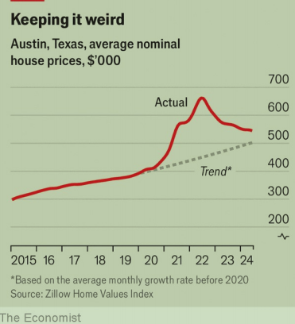

# YIMBY cities show how to build homes and contain rents

contain：控制；抑制；

contain rents: 控制租金

But to take full advantage of deregulation, Austin and Auckland need other changes

原文：

Houses in Bouldin Creek, a neighbourhood in Austin, Texas, are cavernous,

but occupy only a fraction of their plots. Rules known as the “McMansion

ordinance”, intended to preserve the area’s character, ensure there is space

between them. Architects must squeeze the design of a new home into an

imaginary tent rising five metres from the plot’s edge, then angling in at 45

degrees. The rules seek to prevent sprawling developments from replacing

small houses. Instead, the cost of complying with them has ensured that only

large, expensive homes are viable.

德克萨斯州奥斯汀市的Bouldin Creek社区的房屋是洞穴状的，但只占据了一小部分土地。被称为“McMansion条例”的规定旨在保护该地区的特色，确保它们之间有空间。建筑师必须把新家的设计塞进一个假想的帐篷里，这个帐篷从地块边缘升起5米，然后倾斜45度。这些规定旨在防止杂乱无章的开发取代小型住宅。相反，遵守这些规定的成本确保了只有大而昂贵的房子才是可行的。

学习：

cavernous：美 [ˈkævərnəs] 似大洞穴的；空旷的

>cavernous
>
>**意思**：形容某物内部非常大和空旷，如同洞穴一般。
>
>**例句**：The old warehouse was cavernous, with high ceilings and vast open spaces.
>
>- 这座旧仓库如洞穴般空旷，拥有高高的天花板和宽广的开阔空间。

ordinance：美 [ˈɔːrdɪnəns] 条例；法令；规章；

sprawling：蔓延的

viable：美 [ˈvaɪəbl] 可行的；可实施的；

plots：土地，地块

>**Plots**:
>
>- **意思**：指土地或地块，在此上下文中指的是用于建造房屋的土地。
>
>- 例句
>
>  ：The developer purchased several plots of land to build new homes on.
>
>  - 开发商购买了几块土地，用于建造新房。

原文：

Things are now starting to change. Alongside Auckland in New Zealand,

Austin has become a test case for housing deregulation. For YIMBYs, activists

who say “yes in my backyard” to development, reforms in the cities are

shining examples to be followed elsewhere. There are signs such

campaigners are winning the debate in the anglosphere. Britain’s new

Labour government has made “getting Britain building again” a central aim;

a push for affordable housing is core to the appeal of Canada’s opposition

Conservative party. As case studies for the effectiveness of YIMBY reforms, both

Austin and Auckland show signs of success. Yet they also show that changes

are slow to take effect and may, on their own, have a modest impact.

事情现在开始发生变化。与新西兰的奥克兰一样，奥斯汀已经成为放松住房管制的一个试验案例。对于那些对发展说“在我家后院”的积极分子来说，城市的改革是其他地方效仿的光辉榜样。有迹象表明，这些活动家正在赢得英语圈的辩论。英国新工党政府已经将“让英国重新建设”作为一个核心目标；推动经济适用房是加拿大反对党保守党的核心诉求。作为YIMBY改革有效性的案例研究，奥斯丁和奥克兰都显示出成功的迹象。然而，它们也表明，变化是缓慢生效的，而且就其本身而言，可能影响不大。

学习：

anglosphere：美 [ˈæŋɡloʊsfɪr] 讲英语的国家和地区；英语文化圈

appeal：诉求

YIMBY：支持新增加住房

>YIMBY 解释
>
>**YIMBY** 是 "Yes In My Backyard" 的缩写。这个术语指的是一群支持在其社区或城市增加住房和开发项目的活动家和倡导者。
>
>YIMBY 的理念和目标
>
>- **支持住房开发**：YIMBY 运动主张增加住房供应，以应对住房短缺和房价飙升的问题。他们认为，通过建设更多的住房，可以使住房更加负担得起，并缓解租金压力。
>  
>- **反对过度限制性法规**：YIMBY 们认为，过度的土地使用和建筑法规阻碍了新的住房开发，导致住房供应不足。他们倡导减少这些限制，以便能够更快、更经济地建造住房。
>
>YIMBY 的影响
>
>- **示例城市**：奥斯汀（美国）和奥克兰（新西兰）是进行住房管制改革的典型案例，这些城市的改革为 YIMBY 运动提供了成功的范例。尽管改革的效果逐渐显现，但这些变化通常需要时间才能完全生效，而且单独的改革可能仅有适度的影响。
>
>- **政治支持**：在英语国家（如英国和加拿大），支持 YIMBY 理念的运动正在赢得辩论。英国的新工党政府将“让英国重新开始建设”作为一项核心目标，而加拿大反对党保守党的主要吸引力之一是推动可负担住房的建设。
>
>总结
>
>YIMBY 运动旨在通过支持住房开发和改革限制性法规，解决住房短缺和提高住房可负担性的问题。他们的努力在一些城市和国家开始获得成功和政治支持。

原文：

Austin’s reforms are more recent than Auckland’s. Although the city’s

housing rules were tweaked in 2015, YIMBYism took hold only in December,

when the council passed the Home Options for Middle-Income

Empowerment Initiative. In parts of the city, this allows up to three units in a

lot designated for a detached house, as well as more floor space within plots

and less space between homes. Another change in May cut minimum lot

sizes. Councillors are hoping to create a “missing middle” of affordable

housing for young families.

奥斯汀的改革比奥克兰更近。尽管该市的住房规则在2015年有所调整，但直到去年12月，当市议会通过中等收入者赋权家园计划时，YIMBYism才得以确立。在该市的部分地区，这允许在一个地块上最多有三个单元被指定为独立式住宅，以及地块内更多的地板空间和住宅之间更少的空间。5月份的另一个变化是降低最小批量。议员们希望为年轻家庭创造一个“缺失的中产阶级”负担得起的住房。

学习：
tweak：英 [twiːk]  调整；微调（机器、系统等）
empowerment： 美 [ɪmˈpaʊərmənt] 授权；许可

lot size：**Lot size** 指的是一块土地的面积或大小。它是房地产中的一个常用术语，用来描述单个房屋或建筑物所占用的地块面积。

## **Feeling flat**

原文：

An index by Apartment List, a rental portal, finds that over the past year

rents in the city have fallen by 7%—among the sharpest drops in America.

House prices are down by 4% over the same period, according to Zillow, a

listings site. YIMBYs have jumped on this as proof of the reforms’ success. That

is a little hopeful. Austin’s housing market boomed during the covid-19

pandemic as techies looked for places cheaper than California to work from

home. Between 2020 and 2022 prices rose by 60%. Tech firings and higher

interest rates have since dampened the market, yet prices are still 8% higher

than if they had followed the pre-pandemic trend.

租赁门户网站公寓列表的一项指数发现，在过去的一年里，该市的租金下降了7%，是美国下降幅度最大的城市之一。根据房源网站Zillow的数据，同期房价下降了4%。YIMBYs抓住这一点作为改革成功的证明。这是一点希望。在新冠肺炎疫情期间，由于技术人员寻找比加州更便宜的地方在家工作，奥斯丁的住房市场繁荣起来。2020年至2022年间，价格上涨了60%。自那以后，科技创新和高利率抑制了市场，但价格仍然比遵循疫情之前的趋势高出8%。

学习：

portal：门户网站

rental portal：租赁门户网站

techies： 美 ['teitʃiz] 技师；（techie的复数）

原文：

Auckland’s changes have had longer to bed in. Eight councils that make up

the Kiwi city merged in 2010. They had to create a citywide plan for zoning,

which led to a more permissive approach. In 2013 “special housing areas”,

in which building was encouraged, were introduced. In 2016 three-quarters

of the city was “upzoned”, meaning blocks of flats could replace houses.

The aim was to create a well-connected, environmentally friendly “compact

city”.

奥克兰的变化需要更长时间才能适应。组成新西兰城市的八个委员会在2010年合并。他们必须创建一个全市范围的分区计划，这导致了一个更宽容的方法。2013年，推出了鼓励建设的"特殊住房区"。2016年，该市四分之三的区域被“分区”，这意味着公寓楼可以取代房屋。目的是创造一个联系紧密、环境友好的“紧凑城市”。

学习：

permissive：美 [pərˈmɪsɪv] 宽容的；纵容的；放任的

bed in: 逐渐稳定下来

>**"Bed in"** 是一个短语，意思是某事物逐渐稳定下来或被接受，尤其是指新的政策、系统或规则在实施后逐步发挥作用并被人们适应。
>
>上下文中的 "Bed in"
>
>在上下文中，**"Auckland’s changes have had longer to bed in"** 的意思是奥克兰的改革已经有更长的时间来逐步稳定并发挥作用。这意味着这些改革政策在实施后，有足够的时间来观察其效果和被社会接受的过程。
>
>示例
>
>- **新系统实施后的情况**：After the new software system was implemented, it took several months for it to bed in, during which time employees adjusted to the new processes.
>  - 新的软件系统实施后，花了几个月的时间才逐渐稳定下来，在此期间，员工们适应了新的流程。
>  
>- **政策改革后的情况**：The educational reforms have had a year to bed in, and early results show improved student performance.
>  - 教育改革已经有一年的时间逐渐稳定，早期结果显示学生成绩有所提高。
>
>具体应用
>
>奥克兰的城市规划和住房政策改革已经有较长时间来逐渐稳定和被接受。例如：
>
>- **市区合并后的新规划**：2010年八个委员会合并后，他们需要时间来创建一个城市范围的规划，使新的区域划分方法逐步发挥作用。
>- **“特殊住房区域”**：2013年引入的“特殊住房区域”需要时间来鼓励建设活动并逐步被开发商和公众接受。
>- **“上调分区”**：2016年的“上调分区”政策，需要时间让居民适应新的建筑密度和城市布局，从而逐渐实现创建一个连接良好、环保的“紧凑型城市”的目标。

原文：

Since these changes, rents in Auckland have not fallen, but they have grown

more slowly than both incomes in the city and rents in the rest of New

Zealand. Properties built in the city now tend to be smaller than those

elsewhere, making like-for-like comparisons difficult. But Ryan Greenaway-

McGrevy of the University of Auckland has found that rents, adjusted for

property quality and size, are 28% lower than they would be had they

continued to track a “synthetic Auckland”, based on a mixture of smaller

Kiwi cities that resembled Auckland before the reforms.

自这些变化以来，奥克兰的租金并没有下降，但比该市的收入和新西兰其他地区的租金增长都要慢。如今，在奥克兰建造的房产往往比其他地方的要小，因此很难进行同类比较。但是奥克兰大学的Ryan Greenaway-McGrevy发现，根据房产质量和面积进行调整后，房租比他们继续跟踪“合成奥克兰”的情况下低28%,合成奥克兰是由一些与改革前的奥克兰相似的新西兰小城市组成的。

学习：

like-for-like：对等的

Kiwi： 美 [ˈkiːwiː] 新西兰人

原文：

House prices have risen just as fast as in the rest of New Zealand. Mr

Greenaway-McGrevy attributes this to the fact that upzoning has increased

land values: pre-existing smaller homes now sell for more since they are

bundled with the option to build larger units. Once the market adjusts, prices

may begin to rise more slowly or even fall. It is also hard to spot an impact

on economic growth. That may be because the reforms exclude a band of

colonial-era housing in pretty inner-city suburbs surrounding the central

business district. Economists tend to see agglomeration benefits, which arise

from people living and working in the same space, as crucial. If new housing

is farther from productive workplaces, the gains will be smaller

房价上涨的速度和新西兰其他地方一样快。Greenaway-McGrevy先生将此归因于分区提高了土地价值:现有的小房子现在卖得更高，因为它们捆绑了建造大房子的选择。一旦市场调整，价格可能会开始缓慢上涨，甚至下跌。也很难看出这对经济增长的影响。这可能是因为改革排除了位于中央商业区周围美丽的市内郊区的一些殖民时代的房屋。经济学家倾向于认为聚集效益至关重要，这种效益来自于在同一空间生活和工作的人们。如果新住宅离生产性工作场所更远，收益会更小

学习：

inner-city：市中心区；旧城区；

agglomeration：美 [əˌglɑməˈreɪʃn] 结块；凝聚

>怎么理解pre-existing smaller homes now sell for more since they are bundled with the option to build larger units.这句话：
>
>由于“上调分区”政策，允许在同一块土地上建造更多或更大的住房单元。因此，那些已经存在的小房屋，因为附带了这种未来建造更大单元的潜力，所以变得更有价值，价格也因此上涨。

原文：

Austin’s reforms, which are limited to the city rather than bordering

counties, may in time have more impact. Areas just outside the city have

long had permissive zoning, notes Jake Wegmann of the University of Texas

at Austin, providing a pressure valve for its booming housing market.

Building has already spiked in the wider metro area, even if not in the city

proper where developers have to contend with the McMansion ordinance

and similar rules. This has led to congestion as the residents of the

unincorporated counties commute to jobs downtown. Allowing more density

in the city itself may reverse this pattern.

奥斯汀的改革仅限于市内，而不是周边的县，随着时间的推移，可能会产生更大的影响。德克萨斯大学奥斯汀分校的杰克·威格曼指出，城市外围的区域长期以来一直实行宽松的分区政策，这为其繁荣的房地产市场提供了一个压力阀。建筑已经在更广阔的大都市地区激增，即使不是在城市中心，那里的开发商不得不与McMansion法令和类似的规则作斗争。这导致了拥挤，因为未合并县的居民通勤到市中心上班。允许城市本身更高的密度可能会扭转这种模式。

学习：
valve：美 [vælv] 阀门

pressure valve: 压力阀，缓解压力的机制

>
>
> 解释 "Pressure Valve"
>
>**句子的意思**：
>“压力阀”在这里指的是一种减缓或释放住房市场压力的机制或手段。
>
>详细解析：
>
>- **Pressure Valve**：本意是“压力阀”，在这里被用作比喻。
>- **Providing a pressure valve for its booming housing market**：为其迅速增长的住房市场提供一种缓解压力的手段。
>
>具体理解：
>
>在奥斯汀市边界以外的地区，由于分区规定较为宽松，这些地区可以建造更多的住房，从而缓解了奥斯汀市区内住房市场的高需求和压力。这些边界地区类似于一种“压力阀”，通过提供更多的住房来减轻奥斯汀市区内的住房压力。
>
>示例
>
>- **城市边界的压力释放**：一个城市的周边地区由于允许更多的建筑开发，减轻了市中心的住房压力，就像一个压力阀释放了部分需求压力。
>  - 例句：The suburbs acted as a pressure valve for the city’s overheated housing market, providing more housing options for residents.
>  - 翻译：郊区作为城市过热住房市场的压力阀，为居民提供了更多的住房选择。
>
>实际例子
>
>- **经济学中的压力缓解**：在经济学中，有些政策或措施被视为“压力阀”，因为它们可以缓解市场中的某些压力点。例如，政府推出的补贴政策可以被视为一种“压力阀”，因为它们可以帮助减轻低收入家庭的经济压力。
>  - 例句：The government’s financial aid program acted as a pressure valve for struggling families during the recession.
>  - 翻译：政府的经济援助计划在经济衰退期间作为困难家庭的压力阀。
>
>通过这样的比喻，“压力阀”在这里形象地描述了周边地区如何通过提供更多的住房来缓解奥斯汀市区内的住房市场压力。

原文：

New transport facilities could further increase the benefits of building.

Auckland has opened a dedicated route for buses and plans another one. A

new link between the city’s commuter rail lines will be completed in

November next year. Congestion charging, currently under consideration,

would help make better use of existing infrastructure. In 2020 voters in

Austin approved a ballot initiative to fund their own light rail system

through property taxes. The state attorney-general has, however, sued the

city, alleging the project has no legal standing to sell debt. If they want to get

the biggest benefit from their reforms, cities that say “yes in my backyard”

cannot take no for an answer from others. ■

新的交通设施可以进一步增加建筑的效益。奥克兰已经开通了一条公交专用线路，并计划再建一条。该市通勤铁路线之间的新连接将于明年11月完工。目前正在考虑的拥堵费将有助于更好地利用现有的基础设施。2020年，奥斯汀的选民批准了一项投票倡议，通过财产税为他们自己的轻轨系统提供资金。然而，州检察长已经起诉了该市，声称该项目没有出售债务的法律地位。如果他们想从他们的改革中获得最大的利益，那些在我的后院说“是”的城市不能接受别人说“不”。■

学习：

dedicated：专用的；专门的

dedicated route for buses：公交专用线路

light rail system：轻轨

## 后记

2024年7月27日10点13分于上海。

