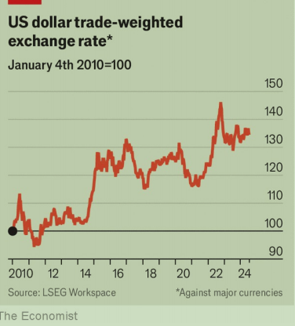

# MAGA Republicans are wrong to seek a cheaper dollar

It is hard to cast America as a victim of the global financial system

很难将美国描绘成全球金融体系的受害者

原文：

Whether THE dollar should be strong or weak is a vexing question for

America’s economic nationalists. In his first term as president, Donald

Trump often said that he wanted a weaker currency to make American-made

goods cheaper overseas. But his tariffs and deficit-financed tax cuts

contributed to a surge in the greenback’s value—and he also said that

“ultimately” he wanted a strong currency. Today, with the dollar higher still,

Mr Trump again says he wants a devaluation. And his choice of J.D. Vance

as his running-mate has added another weak-dollar proponent to his inner

circle.

对于美国的经济民族主义者来说，美元应该坚挺还是疲软是一个令人烦恼的问题。唐纳德·特朗普(Donald Trump)在第一个总统任期内经常说，他希望货币贬值，让美国制造的商品在海外更便宜。但他的关税和赤字融资减税导致了美元价值的飙升——他还说“最终”他想要一个强势货币。如今，随着美元进一步走高，特朗普再次表示，他希望美元贬值。他选择J.D .万斯作为他的竞选伙伴，为他的核心圈子增加了一个弱势美元的支持者。

学习：

vexing：美 [ˈvɛksɪŋ] 使人烦恼的，令人焦虑的

vexing quesiton：令人烦恼的问题

greenback：美钞（尤指19世纪的美国纸币）

inner circle：核心集团          

proponent：美 [prəˈpoʊnənt] 倡导者；支持者；拥护者

原文：

Mr Vance has highlighted the downsides of America producing the world’s

dominant currency. The greenback makes up 59% of the world’s central

bank reserves and is used to pay for half of its goods trade. The depth of

America’s capital markets, its commitment to the rule of law and the low

risk of a sovereign default make it a magnet for savings. American assets

make up over a quarter of the stock of global portfolio investment, up from

less than a fifth in the mid-2000s.

万斯强调了美国生产世界主导货币的不利之处。美元占世界央行储备的59%,并用于支付一半的商品贸易。美国资本市场的深度、对法治的承诺以及主权违约的低风险使其成为吸引储蓄的磁石。美国资产占全球证券投资存量的四分之一以上，而在2005年前后还不到五分之一。

原文：

Though the effect is hard to quantify, the dollar’s appeal makes it more

expensive. That, some argue, makes it harder for American manufacturers to

compete globally. Mr Vance characterises dominant-currency status as a tax

on American producers and a subsidy to its consumers, who benefit from

cheap imported goods. He is no fan of this redistribution, decrying

Americans’ “mass consumption of mostly useless imports”.

尽管这种影响很难量化，但美元的吸引力使得它更加昂贵。一些人认为，这使得美国制造商更难在全球竞争。万斯将主导货币地位描述为对美国生产者的征税和对消费者的补贴，消费者从廉价进口商品中受益。他不支持这种再分配，谴责美国人“大量消费大部分无用的进口商品”。

学习：

appeal：吸引力；魅力

the dollar's appeal：美元的吸引力

decrying：谴责；诽谤；责难；（decry的现在分词形式）

原文：

It is true that a strong dollar hurts some exporters, who therefore lose from

the greenback’s dominance. Yet on net, America gains from issuing the

world’s dominant currency. Manufacturers benefit from cheaper imported

parts and materials. The global appetite for Treasuries reduces the interest

bill associated with America’s vast public debt. It takes a reduction of only

about a third of a percentage point in interest rates to save $100bn (0.4% of

GDP) annually. In any case, it is wrong to dismiss the benefits of low consumer

prices, which boost workers’ real incomes. A common rule of thumb

suggests that closing the current-account deficit by weakening the dollar

would require roughly a 30% depreciation, which would boost inflation by

1-2 percentage points.

的确，强势美元伤害了一些出口商，他们因此失去了美元的主导地位。然而净值来看，美国从发行世界主导货币中获益。制造商受益于更便宜的进口零件和材料。全球对美国国债的兴趣降低了与美国巨额公共债务相关的利息账单。每年只需降低约三分之一个百分点的利率就能节省1000亿美元(相当于GDP的0.4%)。无论如何，忽视低消费价格的好处是错误的，低消费价格提高了工人的实际收入。一个常见的经验法则表明，通过削弱美元来消除经常项目赤字需要大约30%的贬值，这将推高通胀1—2个百分点。

原文：

Trying to control the currency is likely to backfire painfully. Robert

Lighthizer, the US Trade Representative during Mr Trump’s first term, has

floated a “market access charge” on foreigners holding American assets. As

a de facto control on inbound capital, this would raise interest rates for the

government and the private sector alike, deterring investment. Printing and

selling dollars might set off a currency war, and America would lose

credibility when criticising currency manipulation elsewhere. In the 1980s

the dollar was devalued by the “Plaza Accord”, an agreement with

America’s trading partners. But foreign governments manage their exchange

rates less today than they did, capital flows are much larger, and the most

important counterparty would be China, not American allies, making

striking such a deal far trickier. Japan’s recent botched attempts to strengthen

the yen show the dangers of trying to distort market pricing

试图控制货币可能会适得其反。特朗普首个任期内的美国贸易代表罗伯特·莱特希泽(Robert Lighthizer)提出对持有美国资产的外国人征收“市场准入费”。作为对流入资本的实际控制，这将提高政府和私人部门的利率，从而抑制投资。印刷和出售美元可能会引发一场货币战争，而美国在批评其他地方的货币操纵时将会失去信誉。20世纪80年代，美元因与美国贸易伙伴达成的“广场协议”而贬值。但如今外国政府对汇率的管理比过去少了，资本流动大了很多，最重要的对手将是中国，而不是美国的盟友，这使得达成这样的协议更加困难。日本最近拙劣的强化日元的尝试显示了试图扭曲市场定价的危险

学习：

backfire： 适得其反；产生反作用；产生事与愿违的不良后果；

de facto：美 [ˌdeɪ ˈfæktoʊ] 实际的；事实上的；

inbound capital：流入资本

set off a currency war：引发一场货币战争

lose credibility：失去信誉

accord：美 [əˈkɔːrd] 协议

botched：把…搞糟；（botch的过去式）

distort market pricing：扭曲市场定价

原文：

It is almost laughable to cast America as a victim of the global financial

system. America accounts for 52% of the G7’s GDP at purchasing-power parity,

up from 43% in 1990. Jobs are abundant and average incomes have grown at

a pace most of the rich world can only dream of. In recent years, wage

inequality has fallen. All this has been achieved without manipulating the

dollar. Why start now? ■

将美国描绘成全球金融体系的受害者几乎是可笑的。按购买力平价计算，美国占G7 GDP的52%,高于1990年的43%。就业机会充足，平均收入以大多数富裕国家可望而不可及的速度增长。近年来，工资不平等有所下降。所有这些都是在没有操纵美元的情况下实现的。为什么现在开始？■

学习：

laughable：美 [ˈlæfəbl] 可笑的；荒谬的；引人发笑的

parity： 美 [ˈpærəti] 平等；同等；相等；平价；

purchasing-power parity：购买力平价

## 后记

2024年7月28日14点36分于上海。

