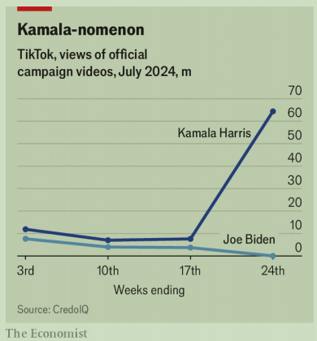

# Is Kamala Harris “brat”?

America’s TikTok election just became more interesting

原文：

“YOU THINK you just fell out of a coconut tree?”, begins a viral clip of

Kamala Harris. It resurfaced in the days after Joe Biden’s disastrous debate

performance, but this video has a twist. The song “Von dutch”, by a British

pop star, Charli XCX, begins to rev in the background. Ms Harris’s signature

belly laugh rises up. A lime-green filter with the word “brat”—the cover art

and name of XCX’s new album—flashes across the screen.

“你以为你刚从椰子树上掉下来？”，开始了卡玛拉·哈里斯的病毒剪辑。在乔·拜登灾难性的辩论表现后的几天里，它重新浮出水面，但这个视频有一个转折。背景音乐中开始播放英国流行歌星查莉XCX的歌曲“冯·达奇”。哈里斯女士标志性的捧腹大笑出现了。一个带有单词“brat”的石灰绿色滤镜XCX新专辑的封面和名字——闪过屏幕。

学习：

coconut：美 [ˈkoʊkənʌt] 椰子

resurfaced：美 [ˌriː'sɜːrfɪst] 重新露面；（resurface的过去式和过去分词）

pop star：明星；歌星；流行歌星；流行音乐明星；

rev：加速（引擎）；提高（转速）；增加（速度）

>“Rev”通常用于描述发动机的轰鸣声，表示发动机快速加速或开始运转。在这个背景下，指的是音乐开始播放并迅速变得强烈，有点像发动机开始加速的感觉。

belly laugh：哈哈大笑；纵情大笑         

lime：美 [laɪm] 石灰；生石灰；酸橙；浅黄绿色 

lime-green：一个浅黄绿色的；一个石灰绿的          

原文：

“You exist in the context of all in which you live and what came before

you,” says Ms Harris. The beat drops. Enter supercuts of Ms Harris.

哈里斯女士说:“你存在于你所生活的一切和你之前发生的一切的背景之中。”。节拍下降。输入哈里斯女士的超级剪辑。

原文：

The video, uploaded to X by Ryan Long, a college student in Delaware, has

4m views—not counting millions from reshares and copycat remixes that

have since spawned across social media. On the day Mr Biden dropped out

of the race XCX gave Ms Harris her endorsement on X: “kamala IS brat”. The

post, which has over 50m views, is high praise. XCX’s songs and the colour

lime-green have decorated the summer of the world’s coolest it-girls for

weeks. The singer has defined the essence of “brat” in recent interviews:

“You’re just like that girl who is a little messy and likes to party.” All a brat

needs is “just like a pack of cigs and like a BIC lighter”.

该视频由特拉华州的一名大学生Ryan Long上传到X，有400万次观看——这还不包括社交媒体上涌现的数百万次转载和模仿混音。拜登退出竞选的那天，XCX在X上支持哈里斯:“卡玛拉是个brat”。这个帖子有超过5000万的浏览量，受到了高度赞扬。几周来，XCX的歌曲和柠檬绿装饰了世界上最酷的it女孩的夏天。这位歌手在最近的采访中定义了“brat”的本质:“你就像那个有点邋遢、喜欢派对的女孩一样。”一个brat所需要的只是“就像一包香烟和一个BIC打火机”。

学习：

copycat：美 [ˈkɑːpikæt] 仿效者；跟风者；

reixes：美 [ˈri:ˈmiksiz] 调整版录制音乐；重新合成版；（remix的复数）

spawned：美 [s'pɔnd] 大量生产；（spawn的过去分词）

brat：小孩；淘气鬼；顽童；

is high praise：高度赞扬；好评          

lighter：美 [ˈlaɪtər] 打火机；

原文：

None of that screams White House. Still, Ms Harris’s team is leaning in. It

reshared XCX’s post and “kamala” versions of the “brat” branding on her

campaign’s social media, puzzling pundits. Yet this moment did not just fall

out of a coconut tree. The ironic, organic collision of cultures is why it

works. “Brat” album spoofs were across social media long before they

rained over Kamala HQ. Ms Harris’s predisposition to becoming a meme is a

trait that Mr Long thinks captures something “very similar to Donald

Trump”. It is also an opportunity Mr Biden’s team of meme manufacturers

could only dream of (remember “Dark Brandon”? Maybe not)

这些都不是白宫的尖叫。尽管如此，哈里斯女士的团队还是倾向于。它在她的竞选社交媒体上重新分享了XCX的帖子和“kamala”版本的“brat”品牌，令专家们感到困惑。然而这一刻不仅仅是从椰子树上掉下来的。具有讽刺意味的、有机的文化碰撞是它成功的原因。“Brat”专辑的恶搞早在Kamala HQ上线之前就传遍了社交媒体。哈里斯成为表情包的倾向，是朗认为抓住了“与唐纳德·特朗普非常相似”的一个特征。这也是拜登先生的表情包制造商团队梦寐以求的机会(还记得《黑暗布兰登》吗？可能不会)

学习：

puzzling：美 [ˈpʌzlɪŋ] 使迷惑；使为难；（puzzle的现在分词）

pundits：美 [ˈpʌndɪts] 专家；评论员；（pundit的复数）

spoofs：美 [spuːfs] 戏弄；（spoof的复数）

predisposition： 美 [ˌpriːdɪspəˈzɪʃn] 倾向；禀性；偏好

meme:表情包

scream: 显示（特征）

>
>
>这里的“scream”用来强调某事物明显展示或强烈表达某种特征。在这段话中，“None of that screams White House”意指卡马拉·哈里斯（Kamala Harris）的这类社交媒体活动和文化碰撞并没有明显展示或强烈表达她作为总统候选人的传统形象或严肃性。这些活动看起来不像是典型的白宫或总统竞选活动。
>
>解释和举例：
>
>- **解释**：在这里，“scream”隐喻地表达了某事物非常明显地展示某种特征。意思是这些活动并没有明显传达出符合总统竞选的严肃和权威形象。
>- **举例**：如果一个人在正式场合穿着休闲装，别人可能会说，“That outfit doesn't scream professionalism”，意思是这套衣服并不显得非常专业。
>
>总结来说，这句话的意思是，虽然卡马拉·哈里斯的团队在社交媒体上积极推送这些内容，并且这些内容也受到了一些人的困惑和评论，但这些活动并没有明显展现出符合总统竞选的严肃形象。

原文：

Over on TikTok, the excitement is palpable. A video of Ms Harris,

soundtracked to “Femininomenon”, a song by Chappell Roan, a pop star, has

6.6m views. One commenter hopes to “meme her into [the] presidency”.

Another calls for a “Kamala-nomenon”. A similar edit shared to Ms Harris’s

campaign TikTok has over 35m views. Whether she can turn vibes into votes

is one thing. Another is certain: the TikTok election just became more

interesting. ■

在抖音，兴奋是显而易见的。一段哈里斯女士的视频，配乐为流行歌星沙佩尔·罗恩的歌曲“Femininomenon ”,点击量为660万。一位评论者希望“用表情包让她成为总统”。另一个呼吁“卡玛拉-诺姆农”。哈里斯女士的竞选团队分享的一个类似的编辑抖音有超过3500万的浏览量。她能否将共鸣转化为选票是一回事。另一件事是肯定的:抖音选举变得更加有趣了。■

学习：

palpable：美 [ˈpælpəb(ə)l] 明显的；易察觉的；显而易见的；

soundtracked：配乐

vibe：氛围；气氛；情绪

## 后记

2024年7月29日16点37分于上海。

