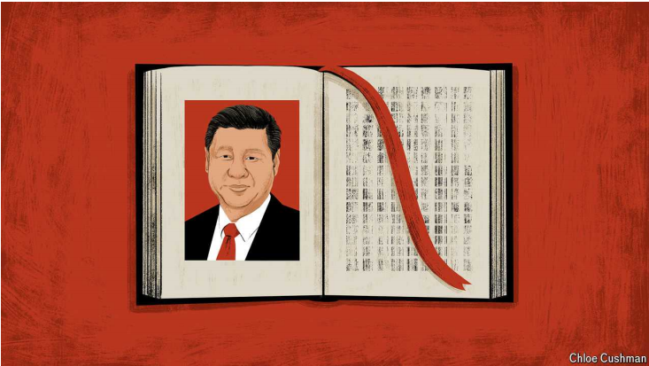

# The nationalism of ideas

Xi Jinping wants Chinese systems of knowledge, free of Western values

原文：

In beijing a quarter-century ago, Chaguan witnessed a rare event: a criminal

court finding a defendant not guilty. Back then, over 90% of Chinese

criminal trials ended in convictions. This time the accused—an alleged

armed robber—walked free. A lack of hard evidence and his refusal to

answer police questions proved decisive. So did his defence lawyer’s plea

that it is better to acquit a guilty man than to risk the “horror” of jailing an

innocent.

25年前，在北京，茶关见证了一件罕见的事情:刑事法庭判被告无罪。当时，超过90%的中国刑事审判以定罪告终。这一次，被告——一个所谓的武装抢劫犯——逃脱了。缺乏确凿的证据和他拒绝回答警方的问题被证明是决定性的。他的辩护律师辩解说，与其冒着监禁无辜者的“恐怖”风险，不如宣告一个有罪的人无罪。

学习：

defendant：美 [dɪˈfendənt] 被告；被告人；

trial： 美 [ˈtraɪəl] 审判；

conviction：定罪；

alleged：所谓的；声称的；被指控的

hard evidence：确凿的证据

plea: 美 [pliː] 辩解；辩护；

acquit: 美 [əˈkwɪt] 宣判无罪；释放；

原文：

Alas, that hearing in October 1998 set no precedents. A mock trial, it was

staged by the British government, which flew in a wig-wearing judge and

lawyers and built a replica Crown Court in a Beijing hotel. The host was

Cherie Booth, a barrister whose husband, Tony Blair, was on a prime-

ministerial visit to China. Chinese legal scholars served as jurors. Your

columnist, then a cub reporter on a first posting to Beijing, surveyed Chinese

spectators and heard diverse views. “In our country, the criminal answers

questions,” growled a police-academy instructor. “It is his duty.”

唉，1998年10月的那次听证会没有开创先例。这是一场由英国政府上演的模拟审判，英国政府请来戴假发的法官和律师，在北京的一家酒店建造了一个皇家法庭的复制品。主持人是切丽·布斯·布莱尔，一位律师，他的丈夫托尼·布莱尔正在中国进行首相级访问。中国法律学者担任陪审员。你的专栏作家当时是一名初来乍到北京的初出茅庐的记者，他调查了中国观众，听到了不同的观点。“在我们国家，罪犯回答问题，”一名警校教员咆哮道。“这是他的职责。”

学习：
hearing：听证会

precedents： 美 [p'resɪdənts] 先例；（precedent的复数）

wig-wearing：戴假发

replica：美 [ˈreplɪkə] 复制品；仿制品；

barrister：美 [ˈbɛrəstər] 出庭律师；大律师；辩护律师

ministerial：美 [ˌmɪnəˈstɪriəl] 政府部门的；内阁成员的；大臣的

jurors：美 [d'ʒʊərəz] 陪审员；审查委员；（juror的复数）

columnist：专栏作者；专栏作家

cub：新手；生手；初学者；初出茅庐的人

cub reporter：年轻记者；初出茅庐的记者          

spectators：观众；（spectator的复数）

growled：美 [ɡraʊld] 咆哮；（growl的过去式和过去分词）

police-academy：警察学院      

原文：

In those heady days China’s one-party state, though hardly liberal,

welcomed debate with the world. To build a Chinese version of capitalism

and attract foreign investors, Communist Party leaders of the 1980s and

1990s pledged to create an economy “ruled by law”. Chinese academics

translated Western textbooks on everything from constitutional law to

corporate bankruptcies, the regulation of monopolies and monetary policy.

Universities and government research institutes filled with visiting Western

scholars and experts. Young Chinese students and officials flocked to study

in America, Britain and beyond.

在那些令人兴奋的日子里，中国的一党制国家，尽管谈不上自由，却欢迎与世界辩论。为了建设中国版的资本主义并吸引外国投资者，上世纪80年代和90年代的共产党领导人承诺打造“法治”经济。中国学者翻译了西方教科书，内容涉及从宪法到企业破产、垄断监管和货币政策的方方面面。到处都是来访的西方学者和专家。年轻的中国学生和官员蜂拥到美国、英国和其他国家学习。

学习：

heady：令人兴奋的

academics：美 [ˌækəˈdemɪks] 大学教师；学者；（academic的复数）

原文：

Today, the intellectual currents are flowing the other way. Xi Jinping,

China’s supreme leader, has called on scholars to create an “independent

Chinese system of knowledge”, combining China’s traditional values with

Marxist teachings and present-day party dogma. Mr Xi’s call to arms goes

beyond long-standing official campaigns to push back whenever foreigners

question the wisdom or benevolence of Chinese policies and actions. Rather,

scholars are urged to avoid the supposed trap of engaging with Westerners

who presume to judge China on the basis of foreign norms. From now on, it

is declared, a self-confident China should defend itself with home-grown

theories and measures of success. Scholars of economics, history, the law

and political science—many of them Western-trained—are rising to the

challenge

今天，思想的潮流正在向相反的方向流动。中国最高领导人Xi呼吁学者们创建一个“独立的中国知识体系”，将中国的传统价值观与马克思主义教义和当代党的教条结合起来。每当外国人质疑中国政策和行动的智慧或善意时，Xi的战斗号召超越了长期以来的官方反击运动。相反，学者们被敦促避免陷入所谓的陷阱，即与那些根据外国标准判断中国的西方人打交道。它宣称，从现在开始，一个自信的中国应该用本土的成功理论和衡量标准来保护自己。经济、历史、法律和政治科学的学者们——其中许多人受过西方教育——正在迎接挑战

学习：

intellectual currents：思想潮流

supreme leader：最高领导人

teachings：学说；教义；教导；（teaching的复数）          

present-day：当代的；现代的；

dogma：教条；信条；教义；

benevolence：美 [bəˈnevələns] 善行；仁慈；善意

political science：政治学          

原文：

On the face of it, arguments about how to study and understand China’s

economy sound technical. Yao Yang, a development economist at Peking

University, charges that “most economic research in China is useless”

because academics choose topics that appeal to foreign economic journals,

but are a poor fit with conditions on the ground in China. Whether the

subject is local-government debt, industrial policy, innovation or

demography, Professor Yao—who earned his PhD at the University of

Wisconsin-Madison—says that researchers who apply “standard” (ie,

Western) macroeconomic models to China “can’t understand China”. He

offers examples. Many foreigners assert that the ageing and shrinking of

China’s workforce will doom its economy. In fact, he says, Chinese experts

believe that this will be offset by labour saved by automation and AI.

从表面上看，关于如何研究和理解中国经济的争论听起来很专业。北京大学发展经济学家姚洋指责“中国的大多数经济研究都是无用的”，因为学者们选择的主题吸引了外国经济期刊，但却不适合中国的实际情况。无论主题是地方政府债务、产业政策、创新还是人口统计，在威斯康星大学麦迪逊分校获得博士学位的姚教授表示，将“标准”(即西方)宏观经济模型应用于中国的研究人员“无法理解中国”。他举了一些例子。许多外国人断言，中国劳动力的老龄化和萎缩将会毁灭其经济。他表示，事实上，中国专家认为，这将被自动化和人工智能节省的劳动力所抵消。

原文：

Yet this is more than a dispute about models. It is also a fight about values.

By way of example, Professor Yao cites studies that attribute successful

careers in Chinese business or officialdom to the power of personal

connections. “That’s not the whole picture,” says the professor. He insists

that Chinese officialdom is also, even mostly, a meritocracy. He accuses

scholars who play down official merit of wanting to prove that China’s

“system is corrupt”. He is no anti-Western firebrand. But he does believe

that too many Western scholars are waiting, in vain, for China’s economy to

collapse because of its political system. In contrast, he says that developing

countries know they have much to learn from China’s “rich experience” of

state guidance in the economy.

然而，这不仅仅是关于模型的争论。这也是一场关于价值观的斗争。举例来说，姚教授引用了一些研究，这些研究将中国商界或政界的成功归因于人际关系的力量。“这不是全部情况，”教授说。他坚持认为，中国的官场也是，甚至大部分是精英政治。他指责那些淡化官员功绩的学者想要证明中国的“体制是腐败的”。他不是反西方的煽动者。但他确实认为，太多的西方学者在徒劳地等待中国经济因其政治制度而崩溃。相比之下，他表示，发展中国家知道，他们可以从中国政府指导经济的“丰富经验”中学到很多东西。

学习：

by way of：通过...的方式

officialdom：美 [əˈfɪʃldəm] 官场；官僚作风；

meritocracy：美 [ˌmerɪˈtɑːkrəsi] 精英治理；精英管理制度；精英统治；

accuses：控告；指责；（accuse的第三人称单数）

play down：贬低；淡化

firebrand：狂热分子；激进分子

rich experience：丰富的经验

原文：

In the realm of justice, the days are long gone when Chinese prosecutors

sought out Western counterparts to discuss foreign notions of due process, or

scholars debated how national constitutions might be used to check or

balance state power. In 2018 Mr Xi declared flatly that China must never

adopt “constitutionalism”, judicial independence or other dangerous Western

ideas.

在司法领域，中国检察官找西方同行讨论外国的正当程序概念，或者学者讨论如何利用国家宪法来制衡国家权力的日子早已一去不复返。2018年，Xi直截了当地宣称，中国绝不能采纳“宪政”、司法独立或其他危险的西方理念。

学习：

due process：合法（诉讼）程序          

check or balance state power：制衡国家权力

flatly：坚决地；斩钉截铁地

constitutionalism：立宪政体；拥护立宪政体          

>"Constitutionalism" 是指宪政主义，即一种政治体制和法律制度，强调政府权力应受到宪法的限制和约束，以保护公民的基本权利和自由。宪政主义通常包括以下几个核心原则：
>
>1. **宪法至上**：宪法是国家的最高法律，任何政府行为都必须符合宪法的规定。
>2. **分权制衡**：政府权力分为立法、行政和司法三部分，并通过相互制衡的机制防止权力集中和滥用。
>3. **法治**：所有公民和政府机构都必须遵守法律，法律面前人人平等。
>4. **保护公民权利**：宪法保障公民的基本权利和自由，如言论自由、宗教自由和人身自由。

原文：

In the 1990s and early 2000s some in China “worshipped” the rule of law in

the West, says Tian Feilong, a law professor at the Minzu University of

China and an influential advocate of imposing stern, “patriotic” systems of

government and law on Hong Kong. But in time, he avers, Chinese scholars

came to realise that Western conceptions of the rule of law could not

“effectively explain” why Communist Party rule is legitimate. Nor could

Western liberal theories explain why the party needs to guide the market as

China’s economy grows. Because Western theories did not bless China’s

practice, Chinese theories were needed. Today, growing pressure from

America only reinforces the need for a legal system that reflects China’s

“civilisation, history and political traditions”.

中央民族大学法学教授田表示，在20世纪90年代和21世纪初，中国一些人“崇拜”西方的法治，他也是主张在香港实施严厉的“爱国”政府和法律制度的颇具影响力的人士。但他断言，随着时间的推移，中国学者逐渐意识到，西方的法治观念无法“有效地解释”为什么共产党的统治是合法的。西方自由主义理论也无法解释为什么随着中国经济的增长，党需要引导市场。因为西方理论没有保佑中国的实践，所以需要中国的理论。如今，来自美国越来越大的压力只会增强对反映中国“文明、历史和政治传统”的法律体系的需求。

学习：

worshipped： 美 [ˈwɜːrʃɪpt] 崇拜；爱慕；（worship的过去式和过去分词）

stern：严格的；苛刻的；

aver：美 [əˈvər]  断言；坚称；声明；<律>（在陈述诉讼理由时）证明…属实；证实

## **No need now to listen to Western critics**

原文：

Asked if today’s China still sets store by any legal principles that the West

calls universal, Professor Tian replies yes, with a large caveat. In his telling,

China puts peaceful development and the collective interest, public order,

social harmony and national security above individual rights. Now China

stands ready to share that wisdom. Professor Tian proudly asserts that

governments from across the global south are sending delegations to study

China’s “dignified and efficient” governance under a “strong ruling party”.

He hopes the West learns to respect Chinese ways, one day

当被问及今天的中国是否仍然重视西方称之为普世的法律原则时，田教授回答说是的，但有一个很大的限制。在他看来，中国将和平发展、集体利益、公共秩序、社会和谐和国家安全置于个人权利之上。现在，中国准备分享这种智慧。田教授自豪地断言，全球南方各国政府都派出代表团，研究中国在“强有力的执政党”领导下的“有尊严和高效”的治理。他希望有一天西方学会尊重中国的方式

学习：

caveat：美 [ˈkæviˌæt] 注意事项；限制性条款；

set store by：重视

>"Set store by" 是一个英语短语，意思是重视或看重某事。当某人 "sets store by" 某事时，意味着他们认为这件事很重要或有价值。
>
>在这段话中，"Asked if today’s China still sets store by any legal principles that the West calls universal" 的意思是 "当被问及今天的中国是否仍然重视西方所谓的普遍法律原则"。这表明在讨论中，有人询问中国是否依然看重西方国家认为普遍适用的法律原则。

Meanwhile, China’s criminal conviction rate has hit 99.95%. Foreigners

with opinions about that are welcome to keep quiet. ■

学习：

>"Criminal conviction rate" 指的是刑事案件中的定罪率，即被指控的嫌疑人最终被判有罪的比例。在这段话中，"China’s criminal conviction rate has hit 99.95%" 意思是中国的刑事案件定罪率达到了99.95%。换句话说，几乎所有被指控的嫌疑人都会被判有罪。这句“Foreigners with opinions about that are welcome to keep quiet.” 意味着对于这一高定罪率，外国人最好不要发表意见。

## 后记

2024年7月31日19点34分于上海。

